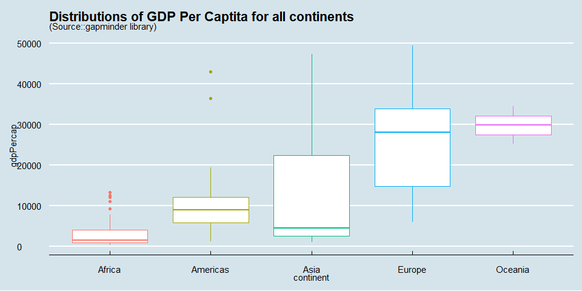

Analysis of Variance
================
Mwangi George
2022-10-27

-   <a href="#analysis-of-variance-with-the-gapminder-dataset"
    id="toc-analysis-of-variance-with-the-gapminder-dataset">Analysis of
    variance with the <code>gapminder</code> dataset</a>
    -   <a href="#example-question" id="toc-example-question">Example
        Question</a>
-   <a href="#exploratory-analysis"
    id="toc-exploratory-analysis">Exploratory Analysis</a>
-   <a href="#limitation-of-anova" id="toc-limitation-of-anova">Limitation
    of <code>anova()</code></a>
-   <a href="#adjustment" id="toc-adjustment">Adjustment</a>
    -   <a href="#contact-me" id="toc-contact-me">Contact Me</a>

# Analysis of variance with the `gapminder` dataset

If we wanted to test if there exist a significant difference in the GDP
per Capita between two continents in the gapminder dataset, we would
utilize a t-test. However, if we wanted to test if there exist a
significant difference in the GDP per Capita in more than two continent,
Anova is our go-to test. In a nutshell, Anova is used when comparing
group means between more than two groups.

## Example Question

Is the difference between the GDP per Capita of all continents in the
year 2007 significant at 5% level of significance?

*Before answering this question, we have to wrangle the data into a
usable format*

``` r
# data Wrangling
gap_2007 <- gapminder %>% 
  # filter for rows that fit the question
  filter(year == 2007) %>% 
  # select variables of interest
  select(continent, gdpPercap)

# print the first 6 rows
head(gap_2007)
```

    ## # A tibble: 6 × 2
    ##   continent gdpPercap
    ##   <fct>         <dbl>
    ## 1 Asia           975.
    ## 2 Europe        5937.
    ## 3 Africa        6223.
    ## 4 Africa        4797.
    ## 5 Americas     12779.
    ## 6 Oceania      34435.

# Exploratory Analysis

Before conducting the test it is important to do some exploratory
analysis, that is, calculate the summary statistic for each group and
visualize the distribution of the numeric variable for each group using
boxplots.

``` r
gap_2007 %>% 
  # groups the results by continent
  group_by(continent) %>% 
  # calculate summaries for the above groups
  summarise(mean_gdpPercap = mean(gdpPercap))
```

    ## # A tibble: 5 × 2
    ##   continent mean_gdpPercap
    ##   <fct>              <dbl>
    ## 1 Africa             3089.
    ## 2 Americas          11003.
    ## 3 Asia              12473.
    ## 4 Europe            25054.
    ## 5 Oceania           29810.

By just looking at the above figures, we can see a big difference in the
mean GDP per Capita of the three continents in the year 2007. However,
we can’t stop at that point; we have to test if the difference is
statistically significant since it could be caused by chance or sampling
variability. Lets visualize the distributions

``` r
gap_2007 %>% 
  # base plot layer
  ggplot(aes(continent, gdpPercap, color = continent))+
  # geometric representation layer
  geom_boxplot()+
  # theme layer
  theme_economist()+
  theme(legend.position = "none")+
  # labeling
  labs(title = "Distributions of GDP Per Captita for all continents",
       subtitle = "(Source::gapminder library)")
```

<!-- -->

The box plots made it look like the distribution of gdpPercap was
different for each of the 5 continents. However, it didn’t tell us
whether the mean gdpPercap was different in each continent group. To
determine that, we can use an ANOVA test.

The null and alternative hypotheses can be written as follows:

-   *H1: U1 = U2 = U3 = U4 = U5*
-   *H2: U1 != U2 != U3 != U4 != U5*

We call the function `lm()` to fit a linear regression using gdpPercap
as Y variable and `continent` as predictor variable

``` r
# fit linear regression
gap_2007_model <- lm(gdpPercap ~ continent, data = gap_2007)
```

Next, we call the `anova()` on the model to perform an analysis of
variance

``` r
# remove scientific notation
options(scipen = 999)

# perform Anova
anova(gap_2007_model)
```

    ## Analysis of Variance Table
    ## 
    ## Response: gdpPercap
    ##            Df      Sum Sq    Mean Sq F value               Pr(>F)    
    ## continent   4  9893766283 2473441571  25.242 0.000000000000001127 ***
    ## Residuals 137 13424530071   97989271                                 
    ## ---
    ## Signif. codes:  0 '***' 0.001 '**' 0.01 '*' 0.05 '.' 0.1 ' ' 1

The p_value (0.000000000000001127) is obviously less than our alpha
value (0.05). We reject the null hypothesis (H1) in favor of the
alternative hypothesis that there exist a significance difference in the
GDP per Capita of the 5 continents in 2007.

# Limitation of `anova()`

The problem with the above method is that it does not show us the
p_values within pairs. We should be able to know if there exists a
statistically significance difference in any of the continent pairs.

Therefore, we use the pairwise t.test to test each pair at 5 percent
level of significance. The results show a matrix of 10 p_values from
each possible pair.

``` r
# remove scientific notation
options(scipen = 999)

# pairwise t test
# the 1st argument is the numeric variable whose mean we are interested in
# the 2nd argument is the categorical variable defining the groups
pairwise.t.test(gap_2007$gdpPercap, 
                gap_2007$continent,
                p.adjust.method = "none")
```

    ## 
    ##  Pairwise comparisons using t tests with pooled SD 
    ## 
    ## data:  gap_2007$gdpPercap and gap_2007$continent 
    ## 
    ##          Africa               Americas   Asia       Europe 
    ## Americas 0.00130              -          -          -      
    ## Asia     0.00003785           0.57635    -          -      
    ## Europe   < 0.0000000000000002 0.00000059 0.00000146 -      
    ## Oceania  0.00026              0.01077    0.01751    0.51174
    ## 
    ## P value adjustment method: none

From the output above, we get two P_values that are greater than our
alpha value(0.05). We are are confident that, at 5% level of
significance, the differences in the mean gdpPercap between Americas and
Asia, as well as that of Europe and Oceania are not statistically
significant.

# Adjustment

In the above test, we set `p.adjust.method` to `none`. Generally, as the
number of groups/categories increases, the number of pairs and hence the
number of hypothesis tests increase quadratically. The more tests we
run, the higher the probability that atleast one of them will give a
false positive result (Type I error). This means that we are more likely
to reject the null hypothesis while it is actually true in one of the
tests.

The solution to these problem is to apply an adjustment to increase the
P_values, thereby reducing the probability of getting a false positive.
R provides several adjustment methods as shown by the code below.

``` r
p.adjust.methods
```

    ## [1] "holm"       "hochberg"   "hommel"     "bonferroni" "BH"        
    ## [6] "BY"         "fdr"        "none"

Let’s see the output of our pairwise t test when we set
`p.adjust.method` to `holm`.

``` r
# remove scientific notation
options(scipen = 999)

# pairwise t test setting adjustment to holm
pairwise.t.test(gap_2007$gdpPercap, 
                gap_2007$continent,
                p.adjust.method = "holm")
```

    ## 
    ##  Pairwise comparisons using t tests with pooled SD 
    ## 
    ## data:  gap_2007$gdpPercap and gap_2007$continent 
    ## 
    ##          Africa              Americas            Asia                Europe 
    ## Americas 0.00648             -                   -                   -      
    ## Asia     0.00026             1.00000             -                   -      
    ## Europe   0.00000000000000033 0.00000528979043448 0.00001165000932836 -      
    ## Oceania  0.00158             0.04308             0.05252             1.00000
    ## 
    ## P value adjustment method: holm

The output reveals an increase in the p_values that are greater than
0.05 from 2 to 3. Between pairs Americas and Asia, Asia and Oceania, and
Europe and Oceania, we fail to reject the null hypothesis and conclude
that the difference in the mean GDP per Capita is not statistically
significant between these pairs. It could be caused by chance.

### Contact Me

[LinkedIn](https://www.linkedin.com/in/georgemwangikenya)
[Twitter](https://twitter.com/mwangi__george)
