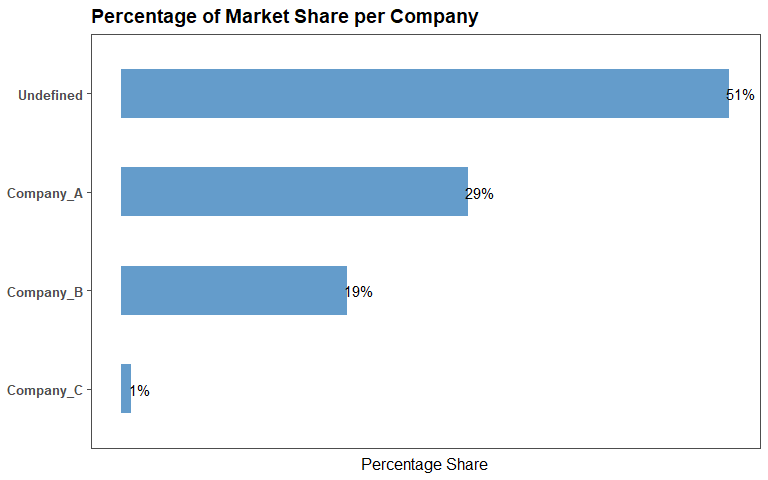
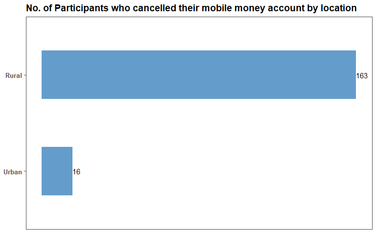
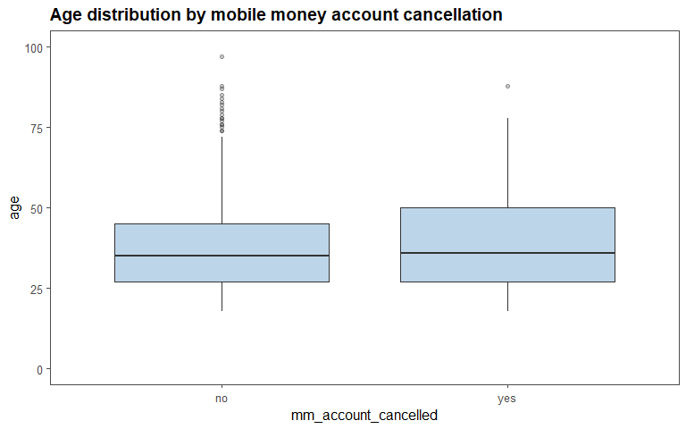

Data Analytics Case Study Assessment
================
23 November, 2022

-   <a href="#formatting-the-dataframe"
    id="toc-formatting-the-dataframe">Formatting the dataframe</a>
-   <a href="#creating-dummy-variables"
    id="toc-creating-dummy-variables">Creating dummy variables</a>
    -   <a href="#financial-exclusion" id="toc-financial-exclusion">Financial
        exclusion</a>
    -   <a href="#digital-financial-inclusion"
        id="toc-digital-financial-inclusion">Digital financial inclusion</a>
-   <a
    href="#how-the-mobile-money-market-is-divided-between-the-three-companies"
    id="toc-how-the-mobile-money-market-is-divided-between-the-three-companies">How
    the Mobile Money market is divided between the three companies</a>
-   <a href="#hypothesis-testing" id="toc-hypothesis-testing">Hypothesis
    testing</a>
    -   <a href="#findings" id="toc-findings">Findings</a>
-   <a href="#mobile-money-account-cancellation"
    id="toc-mobile-money-account-cancellation">Mobile Money Account
    Cancellation</a>
    -   <a
        href="#relationship-between-mobile-money-account-cancellation-and-location"
        id="toc-relationship-between-mobile-money-account-cancellation-and-location">Relationship
        between Mobile Money account cancellation and location.</a>
    -   <a
        href="#relationship-between-mobile-money-account-cancellation-and-gender"
        id="toc-relationship-between-mobile-money-account-cancellation-and-gender">Relationship
        between Mobile Money account cancellation and gender.</a>
    -   <a
        href="#relationship-between-mobile-money-account-cancellation-and-age"
        id="toc-relationship-between-mobile-money-account-cancellation-and-age">Relationship
        between Mobile Money account cancellation and Age.</a>
    -   <a
        href="#relationship-between-mobile-money-account-cancellation-and-mobile-money-trust"
        id="toc-relationship-between-mobile-money-account-cancellation-and-mobile-money-trust">Relationship
        between Mobile Money account cancellation and mobile money trust.</a>

``` r
# remove the scientific notation
options(
  scipen = 999
  )

# load essential packages
pacman::p_load(
  tidyverse, 
  janitor, 
  lubridate, 
  infer, 
  ggthemes
  )

# load data set
laterite <- read_csv(
  file = "datasets/mobile_money_data.csv",
  show_col_types = F
  ) %>% 
  # remove any duplication
  distinct() %>% 
# change start_time and end_time into the datetime format
  mutate(
    start_time = parse_date_time(
      start_time, 
      orders = "bdY_IMS"
      ),
    end_time = parse_date_time(
      end_time, 
      orders = "bdY_IMS"
      )
    )
```

## Formatting the dataframe

The data is in the long format with respect to account type. Let’s pivot
the data to ensure that each account type is a variable. The code in the
chunk below ensures that there is one observation per participant.

``` r
laterite %>% 
  # select columns to manipulate
  select(
    hhid, account_num, account_type
    ) %>% 
  # transform account type to wider format
  pivot_wider(
    # variable names to be derived from account numbers
    names_from = account_num, 
    # Values derived from account types
    values_from = account_type,
    # give variable names prefixes and assign the results to accounts
    names_prefix = "account_"
    # assign to accounts
    ) -> accounts

# preview accounts
head(accounts)
```

| hhid | account_1     | account_2    | account_3     | account_4 | account_5 |
|-----:|:--------------|:-------------|:--------------|:----------|:----------|
| 1001 | Mobile Money  | Bank Account | VSLA Account  | NA        | NA        |
| 1002 | SACCO Account | VSLA Account | NA            | NA        | NA        |
| 1003 | Mobile Money  | Bank Account | NA            | NA        | NA        |
| 1004 | Mobile Money  | Bank Account | SACCO Account | NA        | NA        |
| 1005 | Mobile Money  | VSLA Account | NA            | NA        | NA        |
| 1006 | VSLA Account  | NA           | NA            | NA        | NA        |

Having pivoted the accounts, we have achieved a format where each
household has one observation. We can connect the accounts table to the
whole dataset, but we need to deselect the pivoted columns first and
then remove duplicates.

``` r
# format to get one observation per participant
laterite %>% 
  # deselect start_time, end_time, and pivoted columns 
  select(
    -c(start_time, end_time, account_num, account_type)
    ) %>% 
  # remove the duplication
  distinct() %>% 
  # inner join the accounts table using hhid column
  inner_join(
    accounts, 
    by = "hhid"
    ) %>% 
  # select the variables in the initial order and assign to laterite_formatted
  select(
    hhid, 
    account_1, 
    account_2, 
    account_3, 
    account_4, 
    account_5, 
    everything()
    # assign output to laterite formatted
    ) -> laterite_formatted

# preview laterite_formatted
head(laterite_formatted)
```

| hhid | account_1     | account_2    | account_3     | account_4 | account_5 |    weight | district   | urban | gender | age | hh_members | highest_grade_completed | mm_account_cancelled | prefer_cash | mm_trust | mm_account_telco    | mm_account_telco_main | v234 | agent_trust | v236 | v237 | v238 | v240 | v241 | v242 | v243 | v244 | v245 | v246 |
|-----:|:--------------|:-------------|:--------------|:----------|:----------|----------:|:-----------|:------|:-------|----:|-----------:|:------------------------|:---------------------|:------------|:---------|:--------------------|:----------------------|:-----|:------------|:-----|:-----|:-----|:-----|:-----|:-----|:-----|:-----|:-----|:-----|
| 1001 | Mobile Money  | Bank Account | VSLA Account  | NA        | NA        |  145.9444 | District_A | Urban | male   |  32 |          1 | primary 6               | no                   | yes         | no       | Company_A Company_B | Company_A             | yes  | no          | NA   | yes  | yes  | no   | yes  | no   | yes  | NA   | yes  | no   |
| 1002 | SACCO Account | VSLA Account | NA            | NA        | NA        |  122.9067 | District_B | Rural | male   |  32 |          4 | primary 3               | yes                  | yes         | no       | NA                  | NA                    | NA   | no          | NA   | yes  | yes  | yes  | no   | no   | no   | NA   | no   | no   |
| 1003 | Mobile Money  | Bank Account | NA            | NA        | NA        |  760.4619 | District_A | Urban | male   |  30 |          8 | secondary 6             | no                   | yes         | no       | Company_A           | NA                    | yes  | no          | NA   | no   | yes  | yes  | yes  | no   | yes  | yes  | yes  | no   |
| 1004 | Mobile Money  | Bank Account | SACCO Account | NA        | NA        |  433.9640 | District_A | Rural | male   |  68 |          4 | primary 6               | no                   | yes         | no       | Company_A           | NA                    | no   | no          | NA   | no   | no   | no   | no   | no   | yes  | NA   | no   | no   |
| 1005 | Mobile Money  | VSLA Account | NA            | NA        | NA        |  303.0439 | District_C | Rural | female |  28 |          2 | primary 6               | no                   | yes         | no       | Company_B           | NA                    | yes  | no          | no   | yes  | yes  | yes  | yes  | no   | yes  | NA   | no   | no   |
| 1006 | VSLA Account  | NA           | NA            | NA        | NA        | 1053.4429 | District_B | Rural | female |  36 |          7 | primary 3               | no                   | yes         | NA       | NA                  | NA                    | NA   | NA          | NA   | NA   | NA   | NA   | NA   | NA   | NA   | NA   | NA   | NA   |

We now have one observation per participant. However, I had to leave the
start_time and end_time aside to make the manipulation simpler. Next on
question 2

## Creating dummy variables

### Financial exclusion

The first dummy variable we need to create is `financially_excluded`. A
participant in the survey is financially excluded if they have not
registered with mobile money operators, in this case, if they do not
have any of account 1, 2, 3, 4, or 5. In `account_1` column there are no
missing values, but there are participants with `None` as shown by the
output of the code output below.

``` r
laterite_formatted %>% 
  # print unique account types
  distinct(account_1)
```

| account_1     |
|:--------------|
| Mobile Money  |
| SACCO Account |
| VSLA Account  |
| None          |
| Bank Account  |

Our dummy variable creation will therefore depend on this participants
with `None` in account_1.

``` r
laterite_formatted %>% 
  # create dummy, if account_1 is None, 1, 0 otherwise
  mutate(
    financially_excluded = if_else(
      account_1 == "None", 1, 0
      )
    ) %>% 
  # select the columns in the right order
  select(
    1:6, 
    financially_excluded, 
    everything()
    # overwrite laterite_formatted
    ) -> laterite_formatted

# preview laterite_formatted
head(laterite_formatted)
```

| hhid | account_1     | account_2    | account_3     | account_4 | account_5 | financially_excluded |    weight | district   | urban | gender | age | hh_members | highest_grade_completed | mm_account_cancelled | prefer_cash | mm_trust | mm_account_telco    | mm_account_telco_main | v234 | agent_trust | v236 | v237 | v238 | v240 | v241 | v242 | v243 | v244 | v245 | v246 |
|-----:|:--------------|:-------------|:--------------|:----------|:----------|---------------------:|----------:|:-----------|:------|:-------|----:|-----------:|:------------------------|:---------------------|:------------|:---------|:--------------------|:----------------------|:-----|:------------|:-----|:-----|:-----|:-----|:-----|:-----|:-----|:-----|:-----|:-----|
| 1001 | Mobile Money  | Bank Account | VSLA Account  | NA        | NA        |                    0 |  145.9444 | District_A | Urban | male   |  32 |          1 | primary 6               | no                   | yes         | no       | Company_A Company_B | Company_A             | yes  | no          | NA   | yes  | yes  | no   | yes  | no   | yes  | NA   | yes  | no   |
| 1002 | SACCO Account | VSLA Account | NA            | NA        | NA        |                    0 |  122.9067 | District_B | Rural | male   |  32 |          4 | primary 3               | yes                  | yes         | no       | NA                  | NA                    | NA   | no          | NA   | yes  | yes  | yes  | no   | no   | no   | NA   | no   | no   |
| 1003 | Mobile Money  | Bank Account | NA            | NA        | NA        |                    0 |  760.4619 | District_A | Urban | male   |  30 |          8 | secondary 6             | no                   | yes         | no       | Company_A           | NA                    | yes  | no          | NA   | no   | yes  | yes  | yes  | no   | yes  | yes  | yes  | no   |
| 1004 | Mobile Money  | Bank Account | SACCO Account | NA        | NA        |                    0 |  433.9640 | District_A | Rural | male   |  68 |          4 | primary 6               | no                   | yes         | no       | Company_A           | NA                    | no   | no          | NA   | no   | no   | no   | no   | no   | yes  | NA   | no   | no   |
| 1005 | Mobile Money  | VSLA Account | NA            | NA        | NA        |                    0 |  303.0439 | District_C | Rural | female |  28 |          2 | primary 6               | no                   | yes         | no       | Company_B           | NA                    | yes  | no          | no   | yes  | yes  | yes  | yes  | no   | yes  | NA   | no   | no   |
| 1006 | VSLA Account  | NA           | NA            | NA        | NA        |                    0 | 1053.4429 | District_B | Rural | female |  36 |          7 | primary 3               | no                   | yes         | NA       | NA                  | NA                    | NA   | NA          | NA   | NA   | NA   | NA   | NA   | NA   | NA   | NA   | NA   | NA   |

#### Overall rate of financial exclusion

In this section, we will calculate the overall rate of financial
exclusion for the combined population of the three districts. The table
below summarizes the number of customers and by whether they financially
excluded or not.

``` r
laterite_formatted %>% 
  # count the number of financially_excluded participants 
  count(
    financially_excluded
    ) %>% 
  # calculate the overall exclusion rate by district
  mutate(
    exclusion_rate = n / sum(n) * 100
    ) 
```

| financially_excluded |    n | exclusion_rate |
|---------------------:|-----:|---------------:|
|                    0 | 1073 |       89.04564 |
|                    1 |  132 |       10.95436 |

From the above output, the overall financial exclusion rate for the
combined population of the three districts is about 11.95 percent.

### Digital financial inclusion

A participant in the survey is digitally financially included if they
have at least one registered account a mobile money operator or an
online bank account. We will perform several analyses to identify which
variables are necessary to create this dummy variable. This includes
checking distinct values in each of account 1, 2, 3, 4, or 5.

``` r
laterite_formatted %>% 
  distinct(account_1)
```

| account_1     |
|:--------------|
| Mobile Money  |
| SACCO Account |
| VSLA Account  |
| None          |
| Bank Account  |

`account_1` is necessary since it contains participants registered with
a mobile money operator.

``` r
laterite_formatted %>% 
  distinct(account_2)
```

| account_2     |
|:--------------|
| Bank Account  |
| VSLA Account  |
| NA            |
| SACCO Account |

`account_2` is unnecessary since it does not contain participants
registered with either a mobile money operator or an online bank
account.

``` r
laterite_formatted %>% 
  distinct(account_3)
```

| account_3           |
|:--------------------|
| VSLA Account        |
| NA                  |
| SACCO Account       |
| Online Bank Account |

`account_3` is necessary since it contains participants registered with
an online bank account

``` r
laterite_formatted %>% 
  distinct(account_4)
```

| account_4     |
|:--------------|
| NA            |
| VSLA Account  |
| SACCO Account |

`account_4` is unnecessary.

| account_5    |
|:-------------|
| NA           |
| VSLA Account |

`account_5` is also unnecessary.

Our dummy variable creation for digital financial inclusion will
therefore depend on variables `account_1` and `account_3`

``` r
laterite_formatted %>% 
  # create a dummy variable, 1 if account_1 is "Mobile Money" or
  # account_3 is "Online Bank Account", else 0.
  mutate(
    digitally_financially_included = case_when(
      laterite_formatted$account_1 == "Mobile Money" ~ 1,
      laterite_formatted$account_3 == "Online Bank Account" ~1,
      TRUE ~ 0
      )
    ) %>% 
  # select variables in the right order
  select(
    1:7, 
    digitally_financially_included, 
    everything()
    # overwrite laterite
    ) -> laterite_formatted

# preview output
head(laterite_formatted)
```

| hhid | account_1     | account_2    | account_3     | account_4 | account_5 | financially_excluded | digitally_financially_included |    weight | district   | urban | gender | age | hh_members | highest_grade_completed | mm_account_cancelled | prefer_cash | mm_trust | mm_account_telco    | mm_account_telco_main | v234 | agent_trust | v236 | v237 | v238 | v240 | v241 | v242 | v243 | v244 | v245 | v246 |
|-----:|:--------------|:-------------|:--------------|:----------|:----------|---------------------:|-------------------------------:|----------:|:-----------|:------|:-------|----:|-----------:|:------------------------|:---------------------|:------------|:---------|:--------------------|:----------------------|:-----|:------------|:-----|:-----|:-----|:-----|:-----|:-----|:-----|:-----|:-----|:-----|
| 1001 | Mobile Money  | Bank Account | VSLA Account  | NA        | NA        |                    0 |                              1 |  145.9444 | District_A | Urban | male   |  32 |          1 | primary 6               | no                   | yes         | no       | Company_A Company_B | Company_A             | yes  | no          | NA   | yes  | yes  | no   | yes  | no   | yes  | NA   | yes  | no   |
| 1002 | SACCO Account | VSLA Account | NA            | NA        | NA        |                    0 |                              0 |  122.9067 | District_B | Rural | male   |  32 |          4 | primary 3               | yes                  | yes         | no       | NA                  | NA                    | NA   | no          | NA   | yes  | yes  | yes  | no   | no   | no   | NA   | no   | no   |
| 1003 | Mobile Money  | Bank Account | NA            | NA        | NA        |                    0 |                              1 |  760.4619 | District_A | Urban | male   |  30 |          8 | secondary 6             | no                   | yes         | no       | Company_A           | NA                    | yes  | no          | NA   | no   | yes  | yes  | yes  | no   | yes  | yes  | yes  | no   |
| 1004 | Mobile Money  | Bank Account | SACCO Account | NA        | NA        |                    0 |                              1 |  433.9640 | District_A | Rural | male   |  68 |          4 | primary 6               | no                   | yes         | no       | Company_A           | NA                    | no   | no          | NA   | no   | no   | no   | no   | no   | yes  | NA   | no   | no   |
| 1005 | Mobile Money  | VSLA Account | NA            | NA        | NA        |                    0 |                              1 |  303.0439 | District_C | Rural | female |  28 |          2 | primary 6               | no                   | yes         | no       | Company_B           | NA                    | yes  | no          | no   | yes  | yes  | yes  | yes  | no   | yes  | NA   | no   | no   |
| 1006 | VSLA Account  | NA           | NA            | NA        | NA        |                    0 |                              0 | 1053.4429 | District_B | Rural | female |  36 |          7 | primary 3               | no                   | yes         | NA       | NA                  | NA                    | NA   | NA          | NA   | NA   | NA   | NA   | NA   | NA   | NA   | NA   | NA   | NA   |

#### Overall rate of digital financial inclusion

In this section, we will calculate the overall rate of digital financial
inclusion for the combined population of the three districts. The table
below shows the share of customers grouped by whether they are digitally
financially included or not

``` r
laterite_formatted %>%
  # count 1's and 0's in digitally_financially_included variable
  count(digitally_financially_included) %>% 
  # calculate digital financial inclusion rate
  mutate(
    digitally_financial_inclusion_rate = n / sum(n) * 100
    )
```

| digitally_financially_included |   n | digitally_financial_inclusion_rate |
|-------------------------------:|----:|-----------------------------------:|
|                              0 | 378 |                           31.36929 |
|                              1 | 827 |                           68.63071 |

From the above code output, the overall digital financial inclusion rate
for the combined population of the three district is about 68.63
percent.

## How the Mobile Money market is divided between the three companies

We will do our analysis based on the main mobile money provider
(mm_account_telco_main variable). The table below shows the number of
mobile money customers grouped by their main mobile money account
provider.

``` r
laterite_formatted %>% 
  filter(
    account_1 == "Mobile Money"
    ) %>% 
  count(
    account_1, 
    mm_account_telco_main
    ) %>% 
  mutate(
    percent = n / sum(n) * 100
    ) %>% 
  rename(
    "no. of customers" = n
    )
```

| account_1    | mm_account_telco_main | no. of customers |    percent |
|:-------------|:----------------------|-----------------:|-----------:|
| Mobile Money | Company_A             |              241 | 29.1414752 |
| Mobile Money | Company_B             |              157 | 18.9842805 |
| Mobile Money | Company_C             |                7 |  0.8464329 |
| Mobile Money | NA                    |              422 | 51.0278114 |

Company A has the largest mobile money market share, about 29.14 percent
followed by company B with 18.98 percent and then company C with 0.84
percent. However most of the population do not have a main mobile money
provider. The graph below is illustrates this share

``` r
laterite_formatted %>% 
  filter(
    account_1 == "Mobile Money"
    ) %>% 
  count(
    account_1, 
    mm_account_telco_main
    ) %>% 
  mutate(
    percent = n / sum(n) * 100,
    # re code Na's
    mm_account_telco_main = replace_na(
      data = mm_account_telco_main, 
      replace = "Undefined_provider"
      )
    ) %>% 
  ggplot(
    aes(
      x = mm_account_telco_main, 
      y = percent
      )
    )+
  geom_col(
    width = 0.5, 
    fill = "blue",
    alpha = .7,
    )+
  geom_text(
    aes(
      label = round(percent),
      vjust = -.3
      )
  )+
  labs(
    title = "Percentage of Market Share per Company",
    x = "Main Mobile Money Account Provider"
    )+
  # modifying theme
  theme_few()+
  theme(
    legend.position = "none",
    axis.text.x = element_text(
      face = "bold"
      ),
    axis.text.y = element_blank(),
    axis.title.y = element_blank(),
    axis.ticks.y = element_blank(),
    axis.ticks.x = element_blank()
    )
```

<!-- -->

## Hypothesis testing

In this section, our aim is to answer the question of whether there is a
difference in the share of customers who have experienced failed mobile
money transactions in rural and urban villages. Let’s first investigate
the number of customers who have experienced failed mobile money
transactions in rural and urban villages.

``` r
laterite_formatted %>%
  # count by v240 and urban 
  count(
    v240, 
    urban
    ) %>% 
  # filter where v340 is yes
  filter(
    v240 == "yes"
    )
```

| v240 | urban |   n |
|:-----|:------|----:|
| yes  | Rural | 155 |
| yes  | Urban |  85 |

The results reveal quite a big difference (there are 155 participants in
rural areas and 85 in urban areas). However, we need to test if this
difference is statistically significant. Let’s assume a 5 percent level
of significance. We can phrase the null and alternative hypotheses as
follows.

-   *H0: The proportion of customers who have experienced failed mobile
    money transactions is the same in rural villages as in urban
    villages.*

-   *H1: The proportion of customers who have experienced failed mobile
    money transactions is the different in rural villages as in urban
    villages.*

To perform the above, we use the `prop_test` function from the infer
package. We could use the `prop.test` function from base R, but its
interface is somewhat peculiar.

``` r
# conduct proportion test
laterite_formatted %>% 
  prop_test(
  v240 ~ urban,               # proportions vs categories
  order = c("Rural", "Urban"),# which p_hat to subtract from
  success = "yes",            # which response value to count proportions of
  alternative = "two-sided",  # type of alternative hypothesis
  correct = F                 # should Yates' continuity correction be applied?
) %>% pull(p_value)
```

    ## [1] 0.000003983971

### Findings

Our p value is less than our alpha value. We reject the null hypothesis
in favor of alternative hypothesis that there is a difference in the
proportion of customers who have experienced failed mobile money
transactions between rural and urban villages. This analysis, however,
was limited by the fact that a considerable number of the participants
in the survey did not answer whether they have experienced failed mobile
transactions.

## Mobile Money Account Cancellation

In this section, we will investigate the variables in the dataset that
are good predictors that someone will cancel their mobile money account.
Let’s start by analyzing the more obvious factors such as gender,
location, agent trust, age, and mobile money trust

### Relationship between Mobile Money account cancellation and location.

The table below shows the number of customers who have cancelled their
mobile money account in rural and urban villages.

``` r
laterite_formatted %>% 
  # filter where mm_account_cancelled is yes
  filter(
    mm_account_cancelled == "yes"
    ) %>% 
  # count mm_account_cancelled by urban
  count(
    mm_account_cancelled, 
    urban
    ) 
```

| mm_account_cancelled | urban |   n |
|:---------------------|:------|----:|
| yes                  | Rural | 163 |
| yes                  | Urban |  16 |

The above results shows that, out of 179 participants who cancelled
their mobile money account, 163 are from rural villages and 16 from
urban villages. Lets utilize a graphical procedure to under these
results.

``` r
laterite_formatted %>% 
  # filter where mm_account_cancelled is yes
  filter(
    mm_account_cancelled == "yes"
    ) %>% 
  # count mm_account_cancelled by urban
  count(
    mm_account_cancelled, 
    urban
    ) %>% 
  ggplot(
    aes(
      x = urban, 
      y = n
      )
    )+
  geom_col(
    fill = "blue", 
    alpha = 0.7, 
    width = 0.5
    )+
  theme_few()+
  labs(
    title = "No. of Participants who cancelled their mobile money account by location",
    y = "No of participants"
    )+
   theme(
     axis.title.x = element_blank()
     )
```

<!-- -->

From the above graph, the location of a customer (whether urban or
rural) seems to be a strong factor affecting mobile money account
cancellation. Those from rural areas are more likely to cancel their
mobile money account. However, we need to conduct a statistical test to
investigate if the increase observed in rural areas is statistically
significant or was due to chance. We will assume a 5 percent level of
significance. Our null and alternative hypothesis will be as follows:

-   *H0: The proportion of customers who have cancelled their mobile
    money account is the same in rural village as in urban villages.*

-   *H1: The proportion of customers who have cancelled their mobile
    money account is greater in rural villages than in urban villages.*

The following is the p value obtained from the above analysis.

``` r
laterite_formatted %>% 
  prop_test(
    mm_account_cancelled ~ urban,
    order = c("Rural", "Urban"),
    success = "yes",
    alternative = "greater"
  ) %>% pull(p_value)
```

    ## [1] 0.000003880981

Since the p value is less than our 0.05 threshold, we reject the null
hypothesis and conclude that the proportion of customers who have
cancelled their mobile money account is greater in rural villages than
in urban villages.

### Relationship between Mobile Money account cancellation and gender.

The table below shows the number of participants who cancelled their
mobile money account by gender.

``` r
laterite_formatted %>% 
  filter(
    mm_account_cancelled == "yes"
    ) %>% 
  count(
    mm_account_cancelled, 
    gender
    )
```

| mm_account_cancelled | gender |   n |
|:---------------------|:-------|----:|
| yes                  | female | 131 |
| yes                  | male   |  48 |

Out of 179 participants who cancelled their mobile money account, 131
are female and 48 are male. The graph below demonstrates this
difference.

``` r
laterite_formatted %>% 
  filter(
    mm_account_cancelled == "yes"
    ) %>% 
  count(
    mm_account_cancelled, 
    gender
    ) %>% 
  ggplot(
    aes(
      x = gender, 
      y = n
      )
    )+
  geom_col(
    fill = "blue", 
    alpha = 0.7, 
    width = 0.5
    )+
  ylim(
    c(0,150)
    )+
  theme_few()+
  labs(
    title = "No. of Participants who cancelled their mobile money account by Gender",
    y = "No of participants"
    )+
   theme(
     axis.title.x = element_blank()
     )
```

<!-- -->

There seems to be a direct relationship between gender and whether
someone will cancel their mobile money account. Females are more likely
to cancel compared to males. Let’s conduct a proportion test to
determine if there exists a statistically significant difference in the
share of customers who have cancelled their mobile money account across
gender. We can formulate our hypotheses as follows

-   *H0: The proportion of customers who have cancelled their mobile
    money account is the same across gender.*
-   *H1: The proportion of customers who have cancelled their mobile
    money account is greater for females than for males.*

The following is the p value obtained from the above test.

``` r
laterite_formatted %>% 
  prop_test(
    mm_account_cancelled ~ gender,
    order = c("female", "male"),
    success = "yes",
    alternative = "greater"
  ) %>% pull(p_value)
```

    ## [1] 0.000003927832

This p value is obviously much lower than our threshold. We therefore
reject the null hypothesis in favor of alternative hypothesis that the
proportion of customers who have cancelled their mobile money account is
greater for females than for males.

### Relationship between Mobile Money account cancellation and Age.

To understand the above relationship, let’s look at the mean age for
customers who cancelled their mobile money accounts and those who didn’t
cancel.

``` r
laterite_formatted %>% 
  group_by(
    mm_account_cancelled
    ) %>% 
  summarise(
    mean_age = mean(age)
    )
```

| mm_account_cancelled | mean_age |
|:---------------------|---------:|
| no                   | 37.57992 |
| yes                  | 39.20112 |

Those who cancelled their mobile money account have a higher mean age
than those who didn’t by 1.6212 years. The graph below shows the age
distribution for customers who cancelled their mobile money accounts as
well as those who didn’t cancel.

``` r
laterite_formatted %>% 
  ggplot(
    aes(
      x = age, 
      y = mm_account_cancelled
      )
    )+
  geom_boxplot(
    fill = "blue", 
    alpha = 0.7
    )+
  xlim(
    c(0,100)
    )+
  coord_flip()+
  theme_few()+
  labs(
    title = "Age distribution by mobile money account cancellation"
    )
```

<!-- -->

Since the difference in age between the two groups is not quite clear,
let’s use a t test to prove if the 1.6212 years difference is
statistically significant or is due to chance. Our null and alternative
hypotheses will be as follows:

-   *The true difference in the mean age between those who cancelled
    their mobile money account and those who didn’t is equal to zero.*

-   *The true difference in the mean age between those who cancelled
    their mobile money account and those who didn’t is not equal to
    zero.*

The following is the output of the analysis.

``` r
t.test(
  age ~ mm_account_cancelled, 
  data = laterite_formatted
  )
```

    ## 
    ##  Welch Two Sample t-test
    ## 
    ## data:  age by mm_account_cancelled
    ## t = -1.3693, df = 235.19, p-value = 0.1722
    ## alternative hypothesis: true difference in means between group no and group yes is not equal to 0
    ## 95 percent confidence interval:
    ##  -3.9536340  0.7112434
    ## sample estimates:
    ##  mean in group no mean in group yes 
    ##          37.57992          39.20112

The above p value is greater than our alpha value; we fail to reject the
null hypothesis and conclude that there is no significance difference in
the age of customers who cancel their mobile money account and those who
don’t. Age is therefore not a good predictor that someone will cancel
their mobile money account.

### Relationship between Mobile Money account cancellation and mobile money trust.

To understand this relationship, let’s look at the share of customers
who have cancelled their mobile money account grouped by whether they
trust mobile money or not.

``` r
laterite_formatted %>% 
  count(
    mm_account_cancelled, 
    mm_trust
    ) %>% 
  filter(
    mm_account_cancelled == "yes"
    )
```

| mm_account_cancelled | mm_trust |   n |
|:---------------------|:---------|----:|
| yes                  | no       | 151 |
| yes                  | yes      |  14 |
| yes                  | NA       |  14 |

151 of the customers who cancelled their mobile money account do not
trust mobile money. Only 14 customers out of 179 customers trust mobile.
The other 14 did not provide an answer whether they trust mobile money
or not. The graph below illustrates this.

``` r
laterite_formatted %>% 
  count(
    mm_account_cancelled, 
    mm_trust
    ) %>% 
  filter(
    mm_account_cancelled == "yes"
    ) %>% 
  filter(
    mm_trust != "NA"
  ) %>% 
  ggplot(
    aes(
      x = mm_trust, 
      y = n
      )
    )+
  geom_col(
    fill = "blue",
    alpha = 0.7,
    width = 0.5
    )+
  theme_few()+
  labs(
    y = "No. of customers",
    x = "Mobile Money Trust",
    title = "Mobile Money Account Cancellation by Mobile Money Trust"
    )
```

<!-- -->

Mobile money trust seems to be a good predictor that someone will cancel
their mobile money account. If someone doesn’t trust mobile money, they
are more likely to cancer their account. Let’s now apply a statistical
test to determine if there is a statistically significant difference in
the share of customers who cancelled their mobile money account for
those who trust mobile money and those who do not (5% level of
significance). We can phrase the null and alternative hypothesis as
follows.

-   *H0: The proportion of customers who cancelled their mobile money
    account is the same for those who trust mobile money and those that
    do not.*

-   *H1: The proportion of customers who cancelled their mobile money
    account is greater for those who trust mobile money than for those
    that do not.*

Below is the p value obtained from the analysis.

``` r
laterite_formatted %>% 
  prop_test(
    mm_account_cancelled ~ mm_trust,
    order = c("yes", "no"),
    success = "yes",
    alternative = "greater",
    correct = F
  ) %>% pull(p_value)
```

    ## [1] 0.2268889

The p value is greater than our alpha value. We therefore fail to reject
the null hypothesis and conclude that the proportion of customers who
cancelled their mobile money account is the same for those who trust
mobile money as for those who do not. The increase observed earlier in
the exploratory analysis is therefore due to chance.
