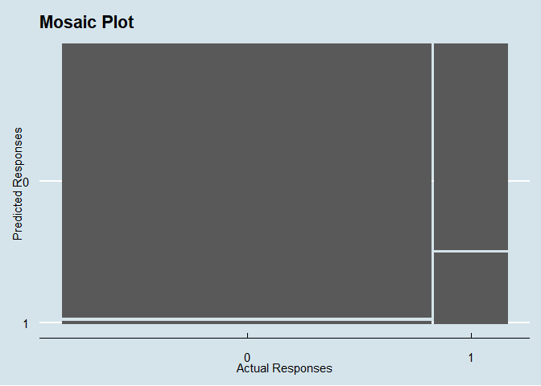

Logistic Regression In R
================
20 Nov, 2022

-   <a href="#introduction" id="toc-introduction">Introduction</a>
-   <a href="#visualizing-the-logistic-model"
    id="toc-visualizing-the-logistic-model">Visualizing the logistic
    model</a>
-   <a href="#making-predictions" id="toc-making-predictions">Making
    Predictions</a>
-   <a href="#the-most-likely-outcome" id="toc-the-most-likely-outcome">The
    Most Likely Outcome</a>
-   <a href="#quantifying-logistic-model"
    id="toc-quantifying-logistic-model">Quantifying Logistic Model</a>
    -   <a href="#confusion-matrix" id="toc-confusion-matrix">Confusion
        Matrix</a>
    -   <a href="#visualizing-the-confusion-matrix-mosaic-plot"
        id="toc-visualizing-the-confusion-matrix-mosaic-plot">Visualizing the
        Confusion Matrix: Mosaic Plot</a>
-   <a href="#performance-metrics" id="toc-performance-metrics">Performance
    Metrics</a>
    -   <a href="#model-accuracy" id="toc-model-accuracy">Model Accuracy</a>
    -   <a href="#sensitivity" id="toc-sensitivity">Sensitivity</a>
    -   <a href="#specificity" id="toc-specificity">Specificity</a>

# Introduction

Logistic regression is another type of generalized linear model used
when the response variable is logical. Logistic models results in
predictions that follow a logistic curve, which is S-shaped. In this
article, we are going to go through the steps for building a simple
logistic regression model in R using a Human resource dataset downloaded
[here](https://www.kaggle.com/datasets/kmldas/hr-employee-data-descriptive-analytics?datasetId=1308671&sortBy=dateRun&tab=collaboration).
We are going to build a model to predict whether or not an employee
would leave the company based on their satisfaction level. Below is
preview of the first 6 rows of the data

``` r
# select variables of interest
hr_data <- hr_data %>% 
  select(
    left, satisfaction_level
    )

# print a few rows
head(hr_data)
```

    ##    left satisfaction_level
    ## 1:    1               0.38
    ## 2:    1               0.80
    ## 3:    1               0.11
    ## 4:    1               0.72
    ## 5:    1               0.37
    ## 6:    1               0.41

To fit a logistic regression model in R, we call the `glm()` function
passing the formula, that data and setting the `family` argument to
`binomial`. The response variable goes on the left hand side of the
formula and the explanatory variable on the right. Lets assign the model
results to `my_model`.

``` r
# run the model
my_model <- glm(
  formula = left ~ satisfaction_level,
  data = hr_data,
  family = binomial
)

# print model coefficients
coefficients(my_model)
```

    ##        (Intercept) satisfaction_level 
    ##          0.5524361         -3.8819933

As in linear models, we get two coefficients, one for the intercept and
the other for the explanatory variable. Remember that a coefficient in a
logit model tells us the change in the log of the odds ratio per unit
change in the explanatory variable. Basically, the coefficient for
satisfaction level means that, on average, every unit increase in an
employee’s satisfaction level decreases the logit of leaving the company
by 3.8819933.

# Visualizing the logistic model

As with linear regression, ggplot2 will draw model predictions for a
logistic regression model without us having to worry about the modeling
code. We can visualize the model as follows:

``` r
# visualize the model
model_plot <- hr_data %>% 
  ggplot(
    aes(
      x = satisfaction_level, 
      y = left
      )
  )+
  geom_point()+
  geom_smooth(
    method = "glm",
    se = FALSE,
    method.args = list(
      family = binomial
    )
  )+
  theme_few()+
  labs(
    title = "Employee Prediction Model",
    subtitle = "Logistic Regression"
  )

# print model_plot
model_plot
```

    ## `geom_smooth()` using formula 'y ~ x'

<!-- -->
The `method.args` argument contains a list of other arguments passed to
`glm`. The blue line represent probabilities, which should not go beyond
1 or below 0. From the graph, we can learn learn that, as an employee’s
satisfaction level increases, their probability of leaving the company
decreases.

# Making Predictions

Suppose we know the satisfaction levels of three employees in the
company. We can utilize the model to know whether they would leave the
company or not. To make predictions, we can create a dataframe or tibble
containing explanatory variable values.

``` r
# create explanatory data for use in prediction
explanatory_data <- tibble(
  satisfaction_level = c(0.12, 0.56, 0.98)
  )

# print explanatory data
explanatory_data
```

    ## # A tibble: 3 × 1
    ##   satisfaction_level
    ##                <dbl>
    ## 1               0.12
    ## 2               0.56
    ## 3               0.98

We simply add a column of the response using `mutate()`. As well as
passing the model object and explanatory data to `predict()`, we need to
set the `type` argument to `response` in order to get the probabilities
of leaving instead of log of odds ratio.

``` r
# make predictions and assign to predicted_data
predicted_data <- explanatory_data %>% 
  mutate(
    left = predict(
      my_model, 
      explanatory_data,
      type = "response"
    )
  )

# print predicted_data
predicted_data
```

    ## # A tibble: 3 × 2
    ##   satisfaction_level   left
    ##                <dbl>  <dbl>
    ## 1               0.12 0.522 
    ## 2               0.56 0.165 
    ## 3               0.98 0.0373

We can see that there is a 52.16% chance of leaving the company for an
employee with a satisfaction level of 0.12 and so on. We can add this
predictions to the model plot as follows:

``` r
# add predictions to plot
model_plot +
  geom_point(
    data = predicted_data,
    color = "red",
    size = 3
  )
```

    ## `geom_smooth()` using formula 'y ~ x'

<!-- -->
As expected, the predicted data points follow the trend line.

# The Most Likely Outcome

When presenting results to a non-technical audience, the concept of
probabilities can be a little confusing. It’s therefore best to use the
most likely outcome of the predicted outcomes i.e whether an employee
will leave or not instead of giving probabilities. We can simply achieve
this by rounding the probabilities to the nearest whole number as
follows:

``` r
# add most likely outcome column
predicted_data <- predicted_data %>% 
  mutate(
    most_likely_outcome = round(left)
  )
```

An employee with satisfaction level of 0.12 will most likely leave while
that with satisfaction level of 0.56 will most likely not leave. We can
visualize the most likely outcome as follows:

``` r
model_plot +
  # overwrite the y aesthetic
  geom_point(
    aes(
      y = most_likely_outcome
      ),
    data = predicted_data,
    color = "red",
    size = 4
  )
```

    ## `geom_smooth()` using formula 'y ~ x'

<!-- -->

# Quantifying Logistic Model

### Confusion Matrix

The counts of each outcomes in a logistic model is called a confusion
matrix. In this case, there are four possible outcomes. We would be
correct if we predicted that an employee would not leave and they
actually didn’t or we predicted that an employee would leave and they
actually left. We would make a false positive error if we predicted that
an employee would leave while they actually didn’t leave. On the other
hand, we would make a false negative error if we predicted that an
employee would not leave while they actually left. The table below
summarizes the four outcomes.

| Actual Vs Predicted | Actual False   | Actual True    |
|---------------------|----------------|----------------|
| Predicted False     | Correct        | False Negative |
| Predicted True      | False Positive | Correct        |

To create a confusion matrix, we need the model object, the actual
responses, and the predicted responses

``` r
# define actual responses 
actual_responses <- hr_data$left

# calculate predicted responses
predicted_responses <- round(
  fitted(my_model)
)

# tabulate the outcomes
outcomes <- table(
  predicted_responses, 
  actual_responses
)

# print outcomes
outcomes
```

    ##                    actual_responses
    ## predicted_responses    0    1
    ##                   0 9877 1480
    ##                   1  123  511

Our model correctly predicted that 9877 employees would not leave and
511 employee would leave the organization. However, there were 123 false
positives and 1480 false negatives.

### Visualizing the Confusion Matrix: Mosaic Plot

The `yardstick` package lets us easily plot the confusion matrix and
calculate the performance metrics of the model. We convert the outcomes
table a yardstick confusion matrix object using `conf_mat()`.

``` r
confusion <- conf_mat(outcomes)
```

Then, just as with linear model objects, we can simply call `autoplot()`
to draw the mosaic plot of the confusion matrix as follows.

``` r
autoplot(confusion) +
  theme_economist()+
  labs(
    title = "Mosaic Plot",
    x = "Actual Responses",
    y = "Predicted Responses"
  )
```

<!-- -->

To interpret the mosaic plot, we start by looking at the column widths.
The width of each column is proportional to the fraction of each
category of actual values. We can see that a bigger part of the actual
responses were that the employee would not leave. Then, the column
heights displays the fractions of the predicted observations with each
value.

# Performance Metrics

Calling `summary()` on the confusion matrix returns several performance
metrics of the model as shown below

``` r
# print model performance metrics
summary(
  confusion, 
  event_level = "second"
  )
```

    ## # A tibble: 13 × 3
    ##    .metric              .estimator .estimate
    ##    <chr>                <chr>          <dbl>
    ##  1 accuracy             binary        0.866 
    ##  2 kap                  binary        0.336 
    ##  3 sens                 binary        0.257 
    ##  4 spec                 binary        0.988 
    ##  5 ppv                  binary        0.806 
    ##  6 npv                  binary        0.870 
    ##  7 mcc                  binary        0.406 
    ##  8 j_index              binary        0.244 
    ##  9 bal_accuracy         binary        0.622 
    ## 10 detection_prevalence binary        0.0529
    ## 11 precision            binary        0.806 
    ## 12 recall               binary        0.257 
    ## 13 f_meas               binary        0.389

Since we used 0 and 1 for the response values instead of a factor, the
second column contain the positive response, so we set `event_level` to
`second`. Lets briefly discuss three most useful performance metrics of
the model.

### Model Accuracy

Accuracy is the proportion of correct predictions i.e the number of true
negatives plus the number of true positives. To get accuracy metric from
the summary call, we proceed as follows

``` r
summary(confusion) %>% 
  slice(1) %>% 
  pull(.estimate)
```

    ## [1] 0.8663164

Our model was 86.63% accurate. Quite Good! Higher accuracy is better.

### Sensitivity

This is the proportion of true positives i.e the proportion of
observations where the actual responses were true where the model also
predicted that they were true. We can get sensitivity as follows

``` r
summary(confusion) %>% 
  slice(3) %>% 
  pull(.estimate)
```

    ## [1] 0.9877

Again, higher sensitivity is better.

### Specificity

This is the proportion of true negatives i.e the proportion of
observations where the actual responses were false where model also
predicted that they were false.

``` r
summary(confusion) %>% 
  slice(4) %>% 
  pull(.estimate)
```

    ## [1] 0.2566549

Again, higher specificity is better, though, there is a tradeoff where
improving specificity will decrease sensitivity or increasing
sensitivity will decrease specificity.
