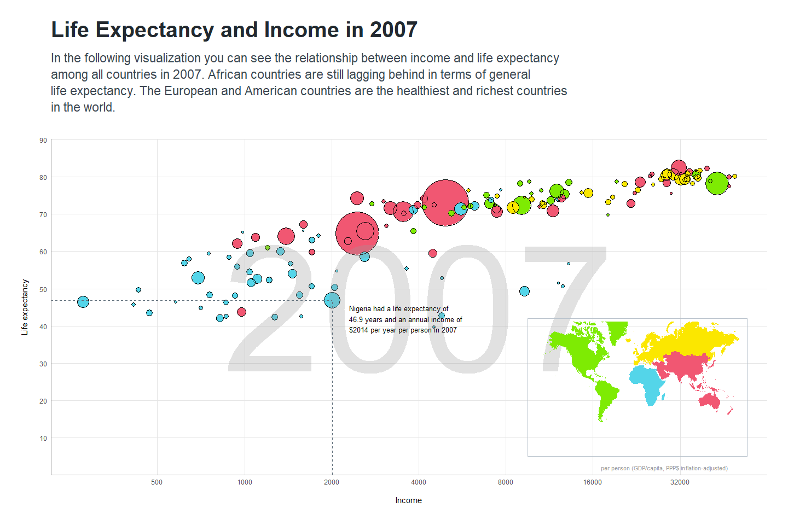

Visualizing the gapminder dateset
================
Mwangi George
2023-01-05

``` r
#install.packages("countrycode")

# packages
pacman::p_load(
  tidyverse,
  gapminder,
  ggthemes,
  countrycode,
  maps,
  mapproj
)

glimpse(gapminder)
```

    ## Rows: 1,704
    ## Columns: 6
    ## $ country   <fct> "Afghanistan", "Afghanistan", "Afghanistan", "Afghanistan", …
    ## $ continent <fct> Asia, Asia, Asia, Asia, Asia, Asia, Asia, Asia, Asia, Asia, …
    ## $ year      <int> 1952, 1957, 1962, 1967, 1972, 1977, 1982, 1987, 1992, 1997, …
    ## $ lifeExp   <dbl> 28.801, 30.332, 31.997, 34.020, 36.088, 38.438, 39.854, 40.8…
    ## $ pop       <int> 8425333, 9240934, 10267083, 11537966, 13079460, 14880372, 12…
    ## $ gdpPercap <dbl> 779.4453, 820.8530, 853.1007, 836.1971, 739.9811, 786.1134, …

``` r
gapminder_cleaned <- gapminder %>%
  filter(year == "2007") %>%
  mutate(
    pop2 = pop + 1,
    continent = case_when(
      continent == "Oceania" ~ "Asia",
      TRUE ~ as.character(continent)
    ) %>% as.factor() %>%
      fct_relevel("Asia", "Americas", "Europe", "Africa")
  )


gapminder_plot <- ggplot(
  data = gapminder_cleaned, aes(x = gdpPercap, y = lifeExp)
) +
  geom_point(aes(size = pop, color = continent)) +
  geom_point(aes(size = pop2), color = "black", shape = 21) +
  scale_x_log10(breaks = c(
    500, 1000, 2000, 4000,
    8000, 16000, 32000, 64000
  )) +
  scale_y_continuous(breaks = seq(0, 90, by = 10)) +
  scale_color_manual(values = c(
    "#F15772", "#7EEB03",
    "#FBE700", "#54D5E9"
  )) +
  scale_size_continuous(range = c(1, 30)) +
  guides(size = "none", color = "none") +
  labs(
    x = "Income",
    y = "Life expectancy"
  ) +
  theme_minimal() +
  annotate("text",
    x = 4000, y = 45, hjust = 0.5,
    size = 85, color = "#999999",
    label = "2007", alpha = .3,
    family = "Helvetica Neue"
  ) +
  # Add previous plot here
  annotate("segment",
    x = 0, xend = 2014, y = 46.9, yend = 46.9,
    color = "#606F7B", linetype = 2, size = .2
  ) +
  annotate("segment",
    x = 2014, xend = 2014, y = 0, yend = 46.9,
    color = "#606F7B", linetype = 2, size = .2
  ) +
  annotate("text",
    x = 28200, y = 2,
    label = "per person (GDP/capita, PPP$ inflation-adjusted)",
    size = 2.8, color = "#999999"
  ) +
  annotate("text",
    x = 2304, y = 42, hjust = 0,
    size = 3.5,
    label = paste0(
      "Nigeria had a life expectancy of\n",
      "46.9 years and an annual income of",
      "\n$2014 per year per person in 2007"
    )
  ) +
  theme(
    plot.margin = unit(rep(1, 4), "cm"),
    panel.grid.minor = element_blank(),
    panel.grid.major = element_line(
      size = 0.2,
      color = "#e5e5e5"
    ),
    axis.title.y = element_text(
      margin = margin(r = 15),
      size = 11
    ),
    axis.title.x = element_text(
      margin = margin(t = 15),
      size = 11
    ),
    axis.line = element_line(
      color = "#999999",
      size = 0.2
    )
  ) +
  coord_cartesian(ylim = c(4.1, 86))


world <- map_data("world") %>%
  filter(region != "Antarctica") %>%
  mutate(
    continent = countrycode(
      sourcevar = region,
      origin = "country.name",
      destination = "continent"
    ),
    continent = case_when(
      continent == "Oceania" ~ "Asia",
      TRUE ~ as.character(continent)
    ) %>% as.factor() %>%
      fct_relevel("Asia", "Americas", "Europe", "Africa")
  ) %>%
  drop_na(continent)

glimpse(world, width = 50)
```

    ## Rows: 93,989
    ## Columns: 7
    ## $ long      <dbl> -69.89912, -69.89571, -69.9421…
    ## $ lat       <dbl> 12.45200, 12.42300, 12.43853, …
    ## $ group     <dbl> 1, 1, 1, 1, 1, 1, 1, 1, 1, 1, …
    ## $ order     <int> 1, 2, 3, 4, 5, 6, 7, 8, 9, 10,…
    ## $ region    <chr> "Aruba", "Aruba", "Aruba", "Ar…
    ## $ subregion <chr> NA, NA, NA, NA, NA, NA, NA, NA…
    ## $ continent <fct> Americas, Americas, Americas, …

``` r
continent_map <- ggplot(data = world) +
  geom_map(
    map = world,
    aes(long, lat,
      group = group, map_id = region,
      fill = continent
    )
  ) +
  theme_map() +
  coord_map(
    xlim = c(-180, 180),
    ylim = c(-200, 200)
  ) +
  scale_fill_manual(values = c(
    "#F15772", "#7EEB03",
    "#FBE700", "#54D5E9"
  )) +
  guides(fill = FALSE) +
  theme(
    plot.background = element_rect(color = "#B8C2CC", fill = NA)
  )

gapminder_plot +
  annotation_custom(
    grob = ggplotGrob(continent_map),
    xmin = log10(800),
    xmax = log10(650000),
    ymin = 5,
    ymax = 42
  ) +
  labs(
    title = "Life Expectancy and Income in 2007",
    subtitle = paste0(
      "In the following visualization you can see the ",
      "relationship between income and life expectancy\n",
      "among all countries in 2007. African countries are ",
      "still lagging behind in terms of general\nlife expectancy. ",
      "The European and American countries are the healthiest ",
      "and richest countries\nin the world."
    )
  ) +
  theme(
    plot.margin = unit(rep(1, 4), "cm"),
    plot.title = element_text(
      color = "#22292F", hjust = 0,
      margin = margin(b = 15),
      size = 30,
      face = "bold",
      family = "Titillium Web"
    ),
    plot.subtitle = element_text(
      color = "#3D4852", hjust = 0,
      margin = margin(b = 35),
      size = 17,
      lineheight = 1.1,
      family = "Titillium Web"
    )
  )
```

<!-- -->
