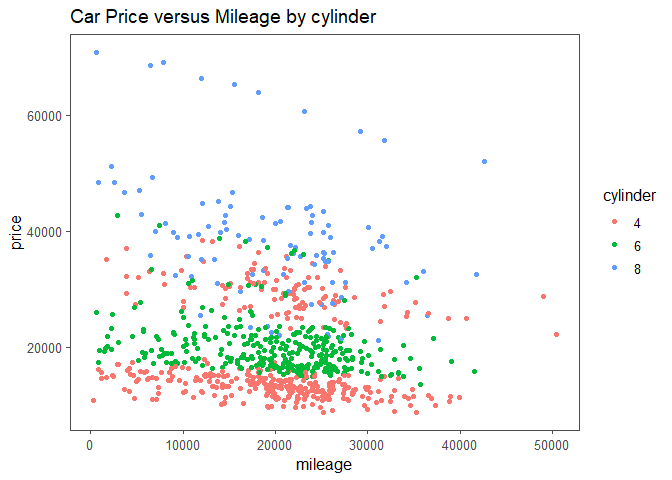
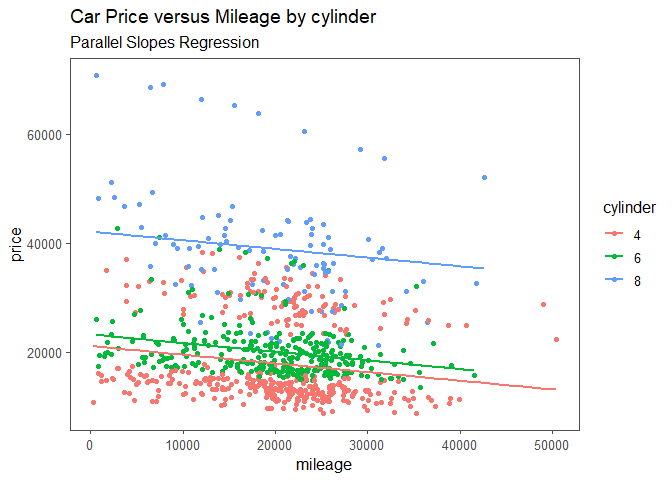
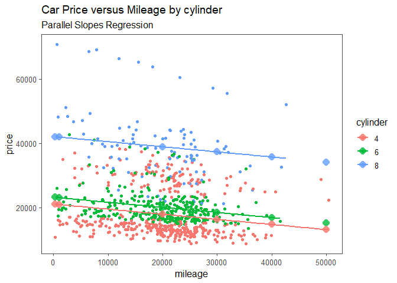

Introduction to Multiple Linear Regression
================
22 Nov, 2022

-   <a href="#introduction" id="toc-introduction">Introduction</a>
-   <a href="#modeling" id="toc-modeling">Modeling</a>
    -   <a href="#results-interpretation"
        id="toc-results-interpretation">Results Interpretation</a>
-   <a href="#visualizing-the-model-parallel-slopes-regression"
    id="toc-visualizing-the-model-parallel-slopes-regression">Visualizing
    the Model: Parallel Slopes Regression</a>
-   <a href="#predicting-parallel-slopes"
    id="toc-predicting-parallel-slopes">Predicting Parallel Slopes</a>
-   <a href="#visualizing-predictions"
    id="toc-visualizing-predictions">Visualizing Predictions</a>
-   <a href="#manually-calculating-predictions"
    id="toc-manually-calculating-predictions">Manually Calculating
    Predictions</a>
-   <a href="#choosing-an-intercept-with-if_else"
    id="toc-choosing-an-intercept-with-if_else">Choosing an intercept with
    if_else</a>
-   <a href="#assessing-model-performance"
    id="toc-assessing-model-performance">Assessing Model Performance</a>
    -   <a href="#coefficient-of-determination-r-squared"
        id="toc-coefficient-of-determination-r-squared">Coefficient of
        Determination (R Squared)</a>
    -   <a href="#adjusted-coefficient-of-determination"
        id="toc-adjusted-coefficient-of-determination">Adjusted Coefficient of
        Determination</a>

# Introduction

Multiple Regression is a regression model with more than one explanatory
variable. In most cases, including more explanatory variables can give
more insight and better predictions. In this article, we will explore
how to build multiple linear regression model in R using the
`car_prices` dataset from the `modeldata` package. This dataset contains
data on Kelly Blue Book resale data for 804 GM cars (2005 model year).
Specifically, we will predict the price of a car using its Mileage (the
number of miles covered using one gallon of fuel) and the number of
cylinders in the engine. Let’s start by loading the necessary libraries
for this session as well as understand the data.

``` r
# necessary packages
pacman::p_load(
  tidyverse,
  janitor,
  ggthemes,
  naniar,
  moderndive,
  broom
)

# read dataset
car_prices <- modeldata::car_prices %>% 
  # clean variable names
  clean_names() %>% 
  # select interested variables
  select(
    price, 
    mileage,
    cylinder
  ) %>% 
  # change cylinder to factor data type
  mutate(
    cylinder = as.factor(cylinder)
  )

# print a few rows 
head(car_prices)
```

|    price | mileage | cylinder |
|---------:|--------:|:---------|
| 22661.05 |   20105 | 6        |
| 21725.01 |   13457 | 6        |
| 29142.71 |   31655 | 4        |
| 30731.94 |   22479 | 4        |
| 33358.77 |   17590 | 4        |
| 30315.17 |   23635 | 4        |

Before building a model, it is always a good idea to visualize the data.
In this case, we visualize the relationship between the price and
mileage using scatter plot and color the points by number of cylinders
as follows.

``` r
car_prices %>% 
  ggplot(
    aes(
      x = mileage,
      y = price, 
      color = cylinder
    )
  )+
  geom_point()+
  theme_few()+
  labs(
    title = "Car Price versus Mileage by cylinder"
  )
```

<!-- --> There seems to
be a weak negative relationship between price and mileage. This
relationship is practical since as a car covers more miles, its current
value decreases. Additionally, we learn that cars with 4 cylinders have
the least value. As the number of cylinders increase to 6 and 8, the
value of the car increases.

# Modeling

To run multiple linear regression in R, we call `lm()` passing the
formula and the data. To include both a numeric and a categorical
variable in the model, we combine them in the right hand side of the
formula separated with a plus. Additionally, when we have a categorical
explanatory variable like in this case, the coefficients produced by
`lm()` are a little easier to understand if we use “plus zero” to tell R
not to include an intercept term in the model.

``` r
# run the model
car_prices_model <- lm(
  formula = price ~ mileage + cylinder + 0,
  data = car_prices
)

# print model results
car_prices_model
```

    ## 
    ## Call:
    ## lm(formula = price ~ mileage + cylinder + 0, data = car_prices)
    ## 
    ## Coefficients:
    ##    mileage   cylinder4   cylinder6   cylinder8  
    ##    -0.1592  21064.4616  23196.5594  42085.0842

### Results Interpretation

The coefficient for mileage means that for any additional mileage a car
covers, its price or value reduces by 0.1592 dollars holding other
factors constant. Holding mileage constant, cars with 4 cylinders are
worth 21064.5 dollars on average, those with 6 cylinders are worth
23196.6 dollars on average, and those with 8 cylinders are worth 42085.1
dollars on average.

# Visualizing the Model: Parallel Slopes Regression

ggplot2 does not have an easy way to plot the model results, but one is
provided by the `moderndive` package. We use the
`geom_parallel_slopes()` to fit a linear trend line for each cylinder
category as follows.

``` r
car_prices %>% 
  ggplot(
    aes(
      x = mileage,
      y = price,
      color = cylinder
    )
  )+
  geom_point()+
  # fit linear trend line for each category
  geom_parallel_slopes(
    se = F
  )+
  theme_few()+
  labs(
    title = "Car Price versus Mileage by cylinder",
    subtitle = "Parallel Slopes Regression"
  )
```

<!-- --> The prediction
for each cylinder category is a slope, and all the slopes are parallel.

# Predicting Parallel Slopes

Predicting responses is perhaps the most useful feature of regression
models. The prediction workflow starts with choosing values for the
explanatory variables. I find it better to store these explanatory
values in a dataframe or tibble. Say we want to predict the prices of
cars with mileage 290, 1000, 20000, 30000, 40000, and 50000. Lets assume
all combinations of each of these cars and the available cylinder
categories. The `expand_grid()` function from the `tidyr` package can
help us create these combinations

``` r
# create explanatory variable values
explanatory_data <- expand_grid(
  mileage = c(290, 1000, 20000, 30000, 40000, 50000),
  cylinder = unique(car_prices$cylinder)
)

# print explanatory data
explanatory_data
```

| mileage | cylinder |
|--------:|:---------|
|     290 | 6        |
|     290 | 4        |
|     290 | 8        |
|    1000 | 6        |
|    1000 | 4        |
|    1000 | 8        |
|   20000 | 6        |
|   20000 | 4        |
|   20000 | 8        |
|   30000 | 6        |
|   30000 | 4        |
|   30000 | 8        |
|   40000 | 6        |
|   40000 | 4        |
|   40000 | 8        |
|   50000 | 6        |
|   50000 | 4        |
|   50000 | 8        |

Next, we add a column of price predictions to the `explanatory_data`. To
calculate the predictions for each car, we call `predict()`, passing the
model object and the `explanatory_data` as follows

``` r
explanatory_data %>% 
  mutate(
    price = predict(
      car_prices_model, explanatory_data
    ) 
  )-> prediction_data

# print prediction_data
prediction_data
```

| mileage | cylinder |    price |
|--------:|:---------|---------:|
|     290 | 6        | 23150.38 |
|     290 | 4        | 21018.28 |
|     290 | 8        | 42038.91 |
|    1000 | 6        | 23037.33 |
|    1000 | 4        | 20905.23 |
|    1000 | 8        | 41925.85 |
|   20000 | 6        | 20011.90 |
|   20000 | 4        | 17879.80 |
|   20000 | 8        | 38900.42 |
|   30000 | 6        | 18419.57 |
|   30000 | 4        | 16287.47 |
|   30000 | 8        | 37308.09 |
|   40000 | 6        | 16827.23 |
|   40000 | 4        | 14695.14 |
|   40000 | 8        | 35715.76 |
|   50000 | 6        | 15234.90 |
|   50000 | 4        | 13102.81 |
|   50000 | 8        | 34123.43 |

# Visualizing Predictions

Just as in the case of a single explanatory variable, we can visualize
the predictions from the model by adding another `geom_point` layer and
set the `data` argument to `prediction_data` We can also add size and
shape arguments to make the predictions stand out.

``` r
car_prices %>% 
  ggplot(
    aes(
      x = mileage,
      y = price,
      color = cylinder
    )
  )+
  geom_point()+
  # fit linear trend line for each category
  geom_parallel_slopes(
    se = F
  )+
  # add predictions to plot
  geom_point(
    data = prediction_data,
    size = 4,
    shape = 16,
    alpha = .8
  )+
  theme_few()+
  labs(
    title = "Car Price versus Mileage by cylinder",
    subtitle = "Parallel Slopes Regression"
  )
```

<!-- -->

As expected, the predictions lie along the lines calculated by ggplot.

# Manually Calculating Predictions

If we only had one numeric explanatory variable, the equation to
estimate the price of cars would be:

*Price = Intercept + Slope x Mileage*

For a parallel slopes model, there is a slight complication since each
category of the categorical variable has a different intercept. We can
get the intercepts of each category as follows

``` r
# get model coefficients
coeffs <- coefficients(car_prices_model)

#print coeffs
coeffs
```

    ##       mileage     cylinder4     cylinder6     cylinder8 
    ##    -0.1592331 21064.4615583 23196.5594345 42085.0841751

``` r
# pull slope
slope <- coeffs[1]

# pull cylinder4 intercept
cylinder4_intercept <- coeffs[2]

# pull cylinder6 intercept
cylinder6_intercept <- coeffs[3]

# pull cylinder8 intercept
cylinder8_intercept <- coeffs[4]
```

# Choosing an intercept with if_else

For each of the category in the explanatory data created earlier, we
need an intercept. After choosing the intercept for each row, we then a
column containing price predictions calculated as the new intercept plus
the slope multiplied by mileage.

``` r
# choose intercept
explanatory_data %>% 
  mutate(
    intercept = if_else(cylinder == "4", 
                        cylinder4_intercept, 
                        if_else(cylinder == "6", 
                                cylinder6_intercept,
                                cylinder8_intercept
                                )
                        ),
    price = intercept + (slope * mileage)
    )
```

| mileage | cylinder | intercept |    price |
|--------:|:---------|----------:|---------:|
|     290 | 6        |  23196.56 | 23150.38 |
|     290 | 4        |  21064.46 | 21018.28 |
|     290 | 8        |  42085.08 | 42038.91 |
|    1000 | 6        |  23196.56 | 23037.33 |
|    1000 | 4        |  21064.46 | 20905.23 |
|    1000 | 8        |  42085.08 | 41925.85 |
|   20000 | 6        |  23196.56 | 20011.90 |
|   20000 | 4        |  21064.46 | 17879.80 |
|   20000 | 8        |  42085.08 | 38900.42 |
|   30000 | 6        |  23196.56 | 18419.57 |
|   30000 | 4        |  21064.46 | 16287.47 |
|   30000 | 8        |  42085.08 | 37308.09 |
|   40000 | 6        |  23196.56 | 16827.23 |
|   40000 | 4        |  21064.46 | 14695.14 |
|   40000 | 8        |  42085.08 | 35715.76 |
|   50000 | 6        |  23196.56 | 15234.90 |
|   50000 | 4        |  21064.46 | 13102.81 |
|   50000 | 8        |  42085.08 | 34123.43 |

I find the if_else statements clunky, especially if we have several
categories in the categorical explanatory variable. Dplyr has a function
called `case_when` that simplifies the if_else statements. Each argument
to `case_when` is a formula, just as we do when specifying a model. On
the left hand side, we pass the logical condition while on the right
hand side, we pass the value to give the rows where the condition is
met.

``` r
explanatory_data %>% 
  mutate(
    intercept = case_when(
      cylinder == "4" ~ cylinder4_intercept,
      cylinder == "6" ~ cylinder6_intercept,
      cylinder == "8" ~ cylinder8_intercept
    ),
    price = intercept + (slope * mileage)
  )
```

| mileage | cylinder | intercept |    price |
|--------:|:---------|----------:|---------:|
|     290 | 6        |  23196.56 | 23150.38 |
|     290 | 4        |  21064.46 | 21018.28 |
|     290 | 8        |  42085.08 | 42038.91 |
|    1000 | 6        |  23196.56 | 23037.33 |
|    1000 | 4        |  21064.46 | 20905.23 |
|    1000 | 8        |  42085.08 | 41925.85 |
|   20000 | 6        |  23196.56 | 20011.90 |
|   20000 | 4        |  21064.46 | 17879.80 |
|   20000 | 8        |  42085.08 | 38900.42 |
|   30000 | 6        |  23196.56 | 18419.57 |
|   30000 | 4        |  21064.46 | 16287.47 |
|   30000 | 8        |  42085.08 | 37308.09 |
|   40000 | 6        |  23196.56 | 16827.23 |
|   40000 | 4        |  21064.46 | 14695.14 |
|   40000 | 8        |  42085.08 | 35715.76 |
|   50000 | 6        |  23196.56 | 15234.90 |
|   50000 | 4        |  21064.46 | 13102.81 |
|   50000 | 8        |  42085.08 | 34123.43 |

# Assessing Model Performance

The big benefit of using more than one explanatory variable in a model
is that we can sometimes get a better fit than when using a single
explanatory variable. In this section, we are going to discuss three
important model performance metrics.

### Coefficient of Determination (R Squared)

R Square is a measure of how good the regression’s prediction line fits
the observed values. A higher $R^{2}$ value is better. To get the
coefficient of determination, we can call broom’s `glance()` function
passing the model object; this returns model level metrics as a
dataframe.

``` r
car_prices_model %>% 
  glance() %>% 
  select(r.squared)
```

| r.squared |
|----------:|
| 0.9083335 |

The coefficient of determination of the model is 0.9083 where 0 is the
worst fit and 1 is the perfect fit. Specifically, car mileage and the
number of cylinders in the engine explain about 90.83% of the variations
in price of cars, holding other factors constant.

### Adjusted Coefficient of Determination

Adding more explanatory variables often increases the coefficient of
determination for a model. This introduces a problem. Too many
explanatory variables in the model can lead to a phenomenon called
**Over fitting**. Over fitting makes the model optimized to provide the
best fit for a particular dataset, but no longer reflects the general
population. In this case, the model would be overfit if it performed
well on current car_prices dataset but badly on a different car_prices
dataset.
