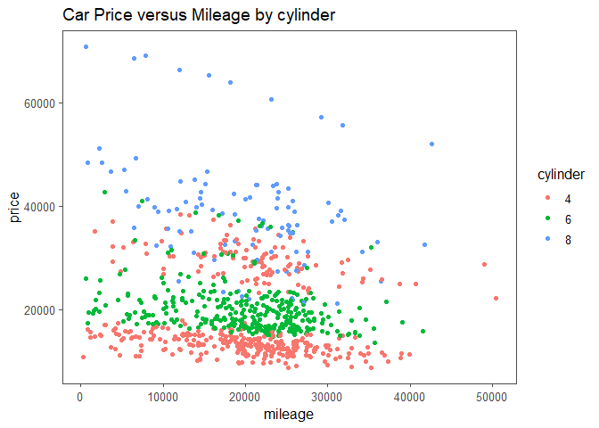
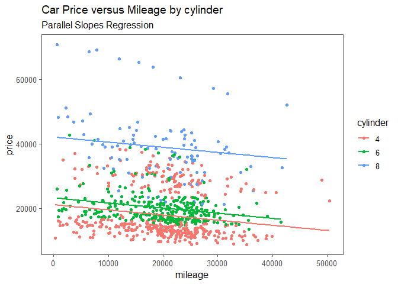
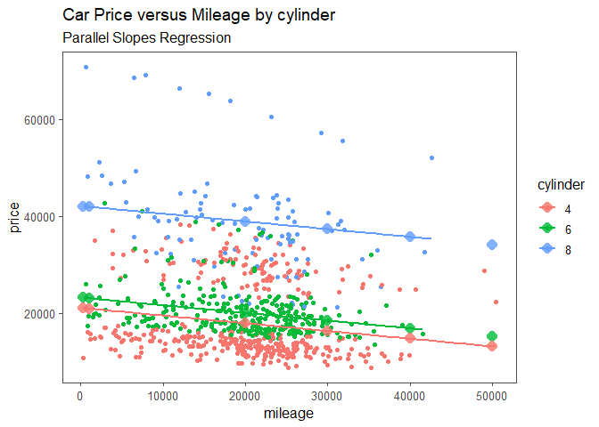
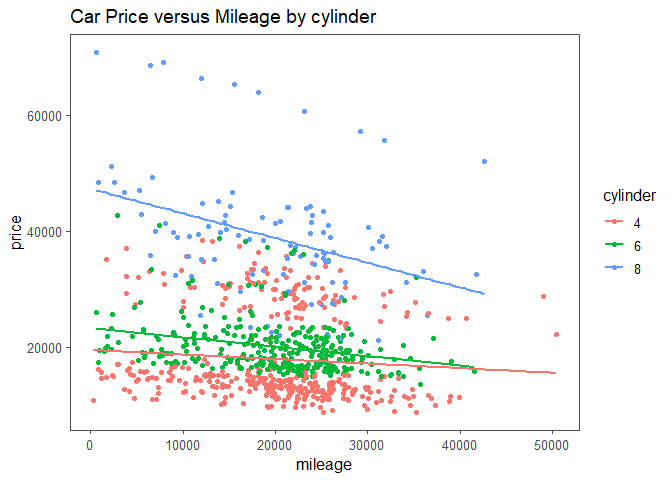
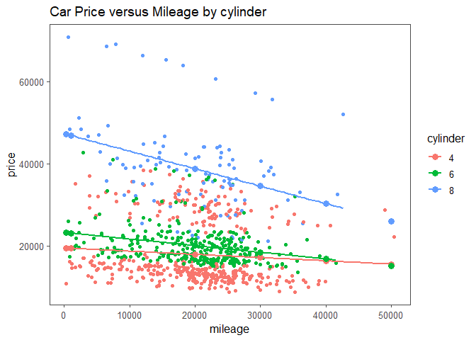
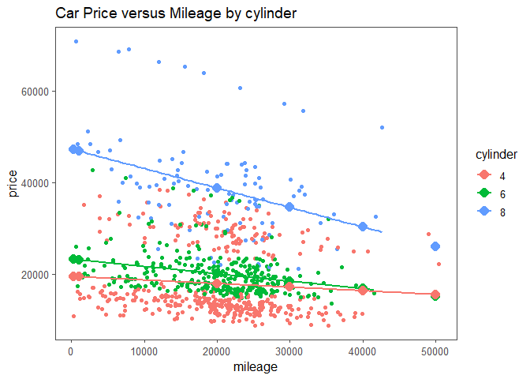
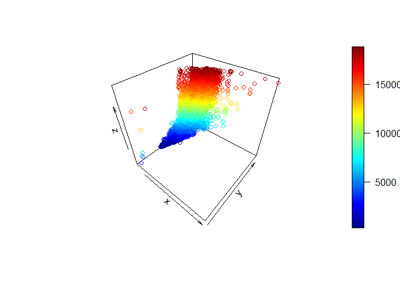

Introduction to Multiple Linear Regression
================
26 Nov, 2022

-   <a href="#introduction" id="toc-introduction">Introduction</a>
    -   <a href="#visualizing-relationship-between-variables"
        id="toc-visualizing-relationship-between-variables">Visualizing
        Relationship between Variables</a>
    -   <a href="#modeling" id="toc-modeling">Modeling</a>
    -   <a href="#results-interpretation"
        id="toc-results-interpretation">Results Interpretation</a>
    -   <a href="#visualizing-the-model-parallel-slopes-regression"
        id="toc-visualizing-the-model-parallel-slopes-regression">Visualizing
        the Model: Parallel Slopes Regression</a>
    -   <a href="#predicting-parallel-slopes"
        id="toc-predicting-parallel-slopes">Predicting Parallel Slopes</a>
    -   <a href="#visualizing-predictions"
        id="toc-visualizing-predictions">Visualizing Predictions</a>
    -   <a href="#manually-calculating-predictions"
        id="toc-manually-calculating-predictions">Manually Calculating
        Predictions</a>
    -   <a href="#choosing-an-intercept-with-if_else"
        id="toc-choosing-an-intercept-with-if_else">Choosing an intercept with
        if_else</a>
    -   <a href="#assessing-model-performance"
        id="toc-assessing-model-performance">Assessing Model Performance</a>
        -   <a href="#coefficient-of-determination-r-squared"
            id="toc-coefficient-of-determination-r-squared">Coefficient of
            Determination (R Squared)</a>
        -   <a href="#adjusted-coefficient-of-determination"
            id="toc-adjusted-coefficient-of-determination">Adjusted Coefficient of
            Determination</a>
        -   <a href="#residual-standard-error-rse"
            id="toc-residual-standard-error-rse">Residual Standard Error (RSE)</a>
-   <a href="#models-for-each-category"
    id="toc-models-for-each-category">Models for each Category</a>
    -   <a href="#making-predictions-with-each-model"
        id="toc-making-predictions-with-each-model">Making predictions with each
        model</a>
    -   <a href="#performance-metrics" id="toc-performance-metrics">Performance
        Metrics</a>
        -   <a href="#coefficient-of-determination-r-square"
            id="toc-coefficient-of-determination-r-square">Coefficient of
            determination (R Square)</a>
        -   <a href="#residual-standard-error"
            id="toc-residual-standard-error">Residual Standard Error</a>
-   <a href="#one-model-with-an-interaction"
    id="toc-one-model-with-an-interaction">One Model with an Interaction</a>
    -   <a href="#specifying-interactions"
        id="toc-specifying-interactions">Specifying Interactions</a>
    -   <a href="#making-predictions-with-interactions"
        id="toc-making-predictions-with-interactions">Making Predictions with
        Interactions</a>
-   <a href="#modeling-two-numeric-explanatory-variables"
    id="toc-modeling-two-numeric-explanatory-variables">Modeling Two Numeric
    Explanatory Variables</a>

# Introduction

Multiple Regression is a regression model with more than one explanatory
variable. In most cases, including more explanatory variables can give
more insight and better predictions. In this article, we will explore
how to build multiple linear regression model in R using the
`car_prices` dataset from the `modeldata` package. This dataset contains
data on Kelly Blue Book resale data for 804 GM cars (2005 model year).
Specifically, we will predict the price of a car using its Mileage (the
number of miles covered using one gallon of fuel) and the number of
cylinders in the engine. Let’s start by loading the necessary libraries
for this session as well as understand the data.

``` r
# remove scientific notation
options(scipen = 999)

# necessary packages
pacman::p_load(
  tidyverse,
  janitor,
  ggthemes,
  naniar,
  moderndive,
  broom,
  plot3D
)

# read dataset
car_prices <- modeldata::car_prices %>% 
  # clean variable names
  clean_names() %>% 
  # select interested variables
  select(
    price, 
    mileage,
    cylinder
  ) %>% 
  # change cylinder to factor data type
  mutate(
    cylinder = as.factor(cylinder)
  )

# print a few rows 
head(car_prices)
```

|    price | mileage | cylinder |
|---------:|--------:|:---------|
| 22661.05 |   20105 | 6        |
| 21725.01 |   13457 | 6        |
| 29142.71 |   31655 | 4        |
| 30731.94 |   22479 | 4        |
| 33358.77 |   17590 | 4        |
| 30315.17 |   23635 | 4        |

## Visualizing Relationship between Variables

Before building a model, it is always a good idea to visualize the data.
In this case, we visualize the relationship between the price and
mileage using scatter plot and color the points by number of cylinders
as follows.

``` r
car_prices %>% 
  ggplot(
    aes(
      x = mileage,
      y = price, 
      color = cylinder
    )
  )+
  geom_point()+
  theme_few()+
  labs(
    title = "Car Price versus Mileage by cylinder"
  )
```

<!-- -->
There seems to be a weak negative relationship between price and
mileage. This relationship is practical since as a car covers more
miles, its current value decreases. Additionally, we learn that cars
with 4 cylinders have the least value. As the number of cylinders
increase to 6 and 8, the value of the car increases.

## Modeling

To run multiple linear regression in R, we call `lm()` passing the
formula and the data. To include both a numeric and a categorical
variable in the model, we combine them in the right hand side of the
formula separated with a plus. Additionally, when we have a categorical
explanatory variable like in this case, the coefficients produced by
`lm()` are a little easier to understand if we use “plus zero” to tell R
not to include an intercept term in the model.

``` r
# run the model
car_prices_model <- lm(
  formula = price ~ mileage + cylinder + 0,
  data = car_prices
)

# print model results
car_prices_model
```

    ## 
    ## Call:
    ## lm(formula = price ~ mileage + cylinder + 0, data = car_prices)
    ## 
    ## Coefficients:
    ##    mileage   cylinder4   cylinder6   cylinder8  
    ##    -0.1592  21064.4616  23196.5594  42085.0842

## Results Interpretation

The coefficient for mileage means that for any additional mileage a car
covers, its price or value reduces by 0.1592 dollars holding other
factors constant. Holding mileage constant, cars with 4 cylinders are
worth 21064.5 dollars on average, those with 6 cylinders are worth
23196.6 dollars on average, and those with 8 cylinders are worth 42085.1
dollars on average.

## Visualizing the Model: Parallel Slopes Regression

ggplot2 does not have an easy way to plot the model results, but one is
provided by the `moderndive` package. We use the
`geom_parallel_slopes()` to fit a linear trend line for each cylinder
category as follows.

``` r
car_prices %>% 
  ggplot(
    aes(
      x = mileage,
      y = price,
      color = cylinder
    )
  )+
  geom_point()+
  # fit linear trend line for each category
  geom_parallel_slopes(
    se = F
  )+
  theme_few()+
  labs(
    title = "Car Price versus Mileage by cylinder",
    subtitle = "Parallel Slopes Regression"
  )
```

<!-- -->
The prediction for each cylinder category is a slope, and all the slopes
are parallel.

## Predicting Parallel Slopes

Predicting responses is perhaps the most useful feature of regression
models. The prediction workflow starts with choosing values for the
explanatory variables. I find it better to store these explanatory
values in a dataframe or tibble. Say we want to predict the prices of
cars with mileage 290, 1000, 20000, 30000, 40000, and 50000. Lets assume
all combinations of each of these cars and the available cylinder
categories. The `expand_grid()` function from the `tidyr` package can
help us create these combinations

``` r
# create explanatory variable values
explanatory_data <- expand_grid(
  mileage = c(290, 1000, 20000, 30000, 40000, 50000),
  cylinder = unique(car_prices$cylinder)
)

# print explanatory data
explanatory_data
```

| mileage | cylinder |
|--------:|:---------|
|     290 | 6        |
|     290 | 4        |
|     290 | 8        |
|    1000 | 6        |
|    1000 | 4        |
|    1000 | 8        |
|   20000 | 6        |
|   20000 | 4        |
|   20000 | 8        |
|   30000 | 6        |
|   30000 | 4        |
|   30000 | 8        |
|   40000 | 6        |
|   40000 | 4        |
|   40000 | 8        |
|   50000 | 6        |
|   50000 | 4        |
|   50000 | 8        |

Next, we add a column of price predictions to the `explanatory_data`. To
calculate the predictions for each car, we call `predict()`, passing the
model object and the `explanatory_data` as follows

``` r
explanatory_data %>% 
  mutate(
    price = predict(
      car_prices_model, explanatory_data
    ) 
  )-> prediction_data

# print prediction_data
prediction_data
```

| mileage | cylinder |    price |
|--------:|:---------|---------:|
|     290 | 6        | 23150.38 |
|     290 | 4        | 21018.28 |
|     290 | 8        | 42038.91 |
|    1000 | 6        | 23037.33 |
|    1000 | 4        | 20905.23 |
|    1000 | 8        | 41925.85 |
|   20000 | 6        | 20011.90 |
|   20000 | 4        | 17879.80 |
|   20000 | 8        | 38900.42 |
|   30000 | 6        | 18419.57 |
|   30000 | 4        | 16287.47 |
|   30000 | 8        | 37308.09 |
|   40000 | 6        | 16827.23 |
|   40000 | 4        | 14695.14 |
|   40000 | 8        | 35715.76 |
|   50000 | 6        | 15234.90 |
|   50000 | 4        | 13102.81 |
|   50000 | 8        | 34123.43 |

## Visualizing Predictions

Just as in the case of a single explanatory variable, we can visualize
the predictions from the model by adding another `geom_point` layer and
set the `data` argument to `prediction_data` We can also add size and
shape arguments to make the predictions stand out.

``` r
car_prices %>% 
  ggplot(
    aes(
      x = mileage,
      y = price,
      color = cylinder
    )
  )+
  geom_point()+
  # fit linear trend line for each category
  geom_parallel_slopes(
    se = F
  )+
  # add predictions to plot
  geom_point(
    data = prediction_data,
    size = 4,
    shape = 16,
    alpha = .8
  )+
  theme_few()+
  labs(
    title = "Car Price versus Mileage by cylinder",
    subtitle = "Parallel Slopes Regression"
  )
```

<!-- -->

As expected, the predictions lie along the lines calculated by ggplot.

## Manually Calculating Predictions

If we only had one numeric explanatory variable, the equation to
estimate the price of cars would be:

*Price = Intercept + Slope x Mileage*

For a parallel slopes model, there is a slight complication since each
category of the categorical variable has a different intercept. We can
get the intercepts of each category as follows

``` r
# get model coefficients
coeffs <- coefficients(car_prices_model)

#print coeffs
coeffs
```

    ##       mileage     cylinder4     cylinder6     cylinder8 
    ##    -0.1592331 21064.4615583 23196.5594345 42085.0841751

``` r
# pull slope
slope <- coeffs[1]

# pull cylinder4 intercept
cylinder4_intercept <- coeffs[2]

# pull cylinder6 intercept
cylinder6_intercept <- coeffs[3]

# pull cylinder8 intercept
cylinder8_intercept <- coeffs[4]
```

## Choosing an intercept with if_else

For each of the category in the explanatory data created earlier, we
need an intercept. After choosing the intercept for each row, we then a
column containing price predictions calculated as the new intercept plus
the slope multiplied by mileage.

``` r
# choose intercept
explanatory_data %>% 
  mutate(
    intercept = if_else(cylinder == "4", 
                        cylinder4_intercept, 
                        if_else(cylinder == "6", 
                                cylinder6_intercept,
                                cylinder8_intercept
                                )
                        ),
    price = intercept + (slope * mileage)
    )
```

| mileage | cylinder | intercept |    price |
|--------:|:---------|----------:|---------:|
|     290 | 6        |  23196.56 | 23150.38 |
|     290 | 4        |  21064.46 | 21018.28 |
|     290 | 8        |  42085.08 | 42038.91 |
|    1000 | 6        |  23196.56 | 23037.33 |
|    1000 | 4        |  21064.46 | 20905.23 |
|    1000 | 8        |  42085.08 | 41925.85 |
|   20000 | 6        |  23196.56 | 20011.90 |
|   20000 | 4        |  21064.46 | 17879.80 |
|   20000 | 8        |  42085.08 | 38900.42 |
|   30000 | 6        |  23196.56 | 18419.57 |
|   30000 | 4        |  21064.46 | 16287.47 |
|   30000 | 8        |  42085.08 | 37308.09 |
|   40000 | 6        |  23196.56 | 16827.23 |
|   40000 | 4        |  21064.46 | 14695.14 |
|   40000 | 8        |  42085.08 | 35715.76 |
|   50000 | 6        |  23196.56 | 15234.90 |
|   50000 | 4        |  21064.46 | 13102.81 |
|   50000 | 8        |  42085.08 | 34123.43 |

I find the if_else statements clunky, especially if we have several
categories in the categorical explanatory variable. Dplyr has a function
called `case_when` that simplifies the if_else statements. Each argument
to `case_when` is a formula, just as we do when specifying a model. On
the left hand side, we pass the logical condition while on the right
hand side, we pass the value to give the rows where the condition is
met.

``` r
explanatory_data %>% 
  mutate(
    intercept = case_when(
      cylinder == "4" ~ cylinder4_intercept,
      cylinder == "6" ~ cylinder6_intercept,
      cylinder == "8" ~ cylinder8_intercept
    ),
    price = intercept + (slope * mileage)
  )
```

| mileage | cylinder | intercept |    price |
|--------:|:---------|----------:|---------:|
|     290 | 6        |  23196.56 | 23150.38 |
|     290 | 4        |  21064.46 | 21018.28 |
|     290 | 8        |  42085.08 | 42038.91 |
|    1000 | 6        |  23196.56 | 23037.33 |
|    1000 | 4        |  21064.46 | 20905.23 |
|    1000 | 8        |  42085.08 | 41925.85 |
|   20000 | 6        |  23196.56 | 20011.90 |
|   20000 | 4        |  21064.46 | 17879.80 |
|   20000 | 8        |  42085.08 | 38900.42 |
|   30000 | 6        |  23196.56 | 18419.57 |
|   30000 | 4        |  21064.46 | 16287.47 |
|   30000 | 8        |  42085.08 | 37308.09 |
|   40000 | 6        |  23196.56 | 16827.23 |
|   40000 | 4        |  21064.46 | 14695.14 |
|   40000 | 8        |  42085.08 | 35715.76 |
|   50000 | 6        |  23196.56 | 15234.90 |
|   50000 | 4        |  21064.46 | 13102.81 |
|   50000 | 8        |  42085.08 | 34123.43 |

## Assessing Model Performance

The big benefit of using more than one explanatory variable in a model
is that we can sometimes get a better fit than when using a single
explanatory variable. In this section, we are going to discuss three
important model performance metrics.

### Coefficient of Determination (R Squared)

R Square is a measure of how good the regression’s prediction line fits
the observed values. A higher R Square value is better. To get the
coefficient of determination, we can call broom’s `glance()` function
passing the model object; this returns model level metrics as a
dataframe.

``` r
car_prices_model %>% 
  glance() %>% 
  select(r.squared)
```

| r.squared |
|----------:|
| 0.9083335 |

The coefficient of determination of the model is 0.9083 where 0 is the
worst fit and 1 is the perfect fit. Specifically, car mileage and the
number of cylinders in the engine explain about 90.83% of the variations
in price of cars, holding other factors constant.

### Adjusted Coefficient of Determination

Adding more explanatory variables often increases the coefficient of
determination for a model. This introduces a phenomenon called ***Over
fitting***. Over fitting makes the model optimized to provide the best
fit for a particular dataset, but no longer reflects the general
population. In this case, the model would be overfit if it performed
well on the current car_prices dataset but badly on a different
car_prices dataset. This is why we use a variant metric called Adjusted
coefficient of determination.

Adjusted R Square includes a small penalty term for each additional
explanatory variable to compensate for overfitting. The penalty is big
enough to worry about if the the plain R Square is small, or if the
number of explanatory variables is a sizable fraction of the the number
of observations. In a nut shell, Adjusted R Square is a better metric
than the plain R Square.

To get Adjusted R Square of the model, the syntax is the same as when
getting plain R Square value only that we pull `adj.r.squared`.

``` r
car_prices_model %>% 
  glance() %>% 
  select(adj.r.squared)
```

| adj.r.squared |
|--------------:|
|     0.9078752 |

To see the effect of penalization, we can look at the two metrics side
by side.

``` r
car_prices_model %>% 
  glance() %>% 
  select(r.squared, adj.r.squared)
```

| r.squared | adj.r.squared |
|----------:|--------------:|
| 0.9083335 |     0.9078752 |

The effect here is very little, but if we add more explanatory values to
the model, the `adj.r.squared` value would decrease.

### Residual Standard Error (RSE)

RSE is the typical difference between the a prediction and an observed
value. I like to think of it as the “typical error of the model”. It has
the same units as the response variable. A lower RSE value is better. We
can get the RSE of our model as follows

``` r
car_prices_model %>% 
  glance() %>% 
  select(
    residual_std_error = sigma
    )
```

| residual_std_error |
|-------------------:|
|           7138.345 |

The output means that the difference between the predicted values and
the observed values is 7138.345 dollars.

# Models for each Category

The parallel slopes model fits some parts of the data better than
others. It’s therefore worth taking a look at what happens when we run a
linear model on different parts of the dataset separately to see if each
model agrees or disagrees with the others. Recall that the parallel
slopes model enforced a common slope for each category. That is not
always the best option. One way to give each category a different slope
is to run a separate model for each of the categories. There are several
smart ways to split a dataset into parts and computing on each part. In
base-R we can use `split()` and `lapply()`. In the tidyverse we can use
`nest_by()` and `mutate()`. However, in this article, we will filter for
each category one at a time and assign the result to individual
variables. Personally, I’m preferring this approach for two reasons.
First, I don’t want fancy code to get in the way of reasoning about
models. Additionally, running regression models is such a fundamental
task and we need to be able to write the code without thinking, and that
takes practice.

``` r
# split the car cylinder categories

# cars with 4 cylinders
cylinder4_data <- car_prices %>% 
  filter(
    cylinder == "4"
  )


# cars with 6 cylinders
cylinder6_data <- car_prices %>% 
  filter(
    cylinder == "6"
  )


# cars with 8 cylinders
cylinder8_data <- car_prices %>% 
  filter(
    cylinder == "8"
  )
```

After splitting the data, we then run linear models on each part as
follows

``` r
# model for cars with 4 cylinders
cylinder4_model <- lm(
  price ~ mileage, data = cylinder4_data
)

# model for cars with 6 cylinders
cylinder6_model <-lm(
  price ~ mileage, data = cylinder6_data
)

# model for cars with 8 cylinders
cylinder8_model <-lm(
  price ~ mileage, data = cylinder8_data
)
```

Notice that each model gives a different intercept and a different
slope.

## Making predictions with each model

The prediction workflow is the same as in other scenarios

-   First, we create a dataframe of explanatory variables. Here we will
    use the same mileage values used in the parallel slopes model.

``` r
# explanatory variable values for use in prediction
explanatory_data <- explanatory_data %>% 
  select(mileage)
```

The good news is that, since each model has the same explanatory
variable, we only have to write the above code once.

-   Second, we predict using the same workflow as before: adding a
    column named after the response variable to the explanatory data
    containing the predictions. It isn’t necessary to calculate the
    predictions, but the plotting code easier, we have included the
    category in each prediction dataset.

``` r
# making predictions with cylinder4_model
prediction_data_cy4 <- explanatory_data %>% 
  mutate(
    price = predict(
      cylinder4_model, explanatory_data
    ),
    cylinder = "4"
  )

# making predictions with cylinder6_model
prediction_data_cy6 <- explanatory_data %>% 
  mutate(
    price = predict(
      cylinder6_model, explanatory_data
    ),
    cylinder = "6"
  )


# making predictions with cylinder8_model
prediction_data_cy8 <- explanatory_data %>% 
  mutate(
    price = predict(
      cylinder8_model, explanatory_data
    ),
    cylinder = "8"
  )
```

-   Third, we visualize the predictions. Here, we use the standard
    ggplot for showing linear regression predictions.

``` r
car_prices %>% 
  ggplot(
    aes(
      x = mileage,
      y = price,
      color = cylinder
    )
  )+
  geom_point()+
  geom_smooth(
    method = "lm", 
    se = F
    )+
  theme_few()+
  labs(
    title = "Car Price versus Mileage by cylinder"
  )
```

    ## `geom_smooth()` using formula 'y ~ x'

<!-- -->

Unlike the parallel slopes case, each model has its own slope,
accomplished by setting the color aesthetics. To sanity check our
predictions, we can add them to the plot to see if they align with what
ggplot2 calculated.

``` r
car_prices %>% 
  ggplot(
    aes(
      x = mileage,
      y = price,
      color = cylinder
    )
  )+
  geom_point()+
  geom_smooth(
    method = "lm", 
    se = F
    )+
  geom_point(
    data = prediction_data_cy4, 
    size = 3, shape = 16
    )+
  geom_point(
    data = prediction_data_cy6,
    size = 3, shape = 16
  )+
  geom_point(
    data = prediction_data_cy8,
    size = 3, shape = 16
  )+
  theme_few()+
  labs(
    title = "Car Price versus Mileage by cylinder"
  )
```

    ## `geom_smooth()` using formula 'y ~ x'

<!-- -->

## Performance Metrics

### Coefficient of determination (R Square)

The most important question here is, are this individual models
important? To answer this question, we compare the R square for the
whole dataset with that of individual models as follows

``` r
# R square for the whole dataset
car_prices_model %>% 
  glance() %>% 
  select(r.squared_all_cyl_cars = r.squared)
```

| r.squared_all_cyl_cars |
|-----------------------:|
|              0.9083335 |

``` r
# R square for the cars with 4 cylinders
cylinder4_model %>% 
  glance() %>% 
  select(r.squared_4_cyl_cars = r.squared)
```

| r.squared_4\_cyl_cars |
|----------------------:|
|             0.0068135 |

``` r
# R square for the cars with 6 cylinders
cylinder6_model %>% 
  glance() %>% 
  select(r.squared_6_cyl_cars = r.squared)
```

| r.squared_6\_cyl_cars |
|----------------------:|
|             0.0762988 |

``` r
# R square for the cars with 8 cylinders
cylinder8_model %>% 
  glance() %>% 
  select(r.squared_8_cyl_cars = r.squared)
```

| r.squared_8\_cyl_cars |
|----------------------:|
|             0.1256578 |

In this case, each individual model performs poorly compared the whole
dataset.

### Residual Standard Error

Lets compare the residual standard errors of the whole dataset compared
to that of individual models

``` r
# RSE for the whole dataset
car_prices_model %>% 
  glance() %>% 
  select(rse_all_cyl_cars = sigma)
```

| rse_all_cyl_cars |
|-----------------:|
|         7138.345 |

``` r
# RSE for the cars with 4 cylinders
cylinder4_model %>% 
  glance() %>% 
  select(rse_4_cyl_cars = sigma)
```

| rse_4\_cyl_cars |
|----------------:|
|        7814.208 |

``` r
# RSE for the cars with 6 cylinders
cylinder6_model %>% 
  glance() %>% 
  select(rse_6_cyl_cars = sigma)
```

| rse_6\_cyl_cars |
|----------------:|
|        4458.259 |

``` r
# RSE for the cars with 8 cylinders
cylinder8_model %>% 
  glance() %>% 
  select(rse_8_cyl_cars = sigma)
```

| rse_8\_cyl_cars |
|----------------:|
|        10086.47 |

The is an improvement for the model for cars with 4 cylinders as shown
by the significant decrease in its residual standard error. However, the
other models did not improve and cannot be relied upon. This mixed
performance result occurs sometimes: the whole dataset benefits from
increased power of more rows of data, whereas the individual models
benefit from not having to satisfy differing components of data.

# One Model with an Interaction

If you are following, you might have noticed that messing about with
different models for different bits of a dataset is a pain. In the case
of car_prices dataset, we had to manage 3 sets of code for each cylinder
category. Imagine there were more categories. This would be very
confusing, even for an expert.

A better solution is to specify a single model that contains intercepts
and slopes for each category. In R, this is achieved through specifying
interactions between explanatory variables. Generally, if the effect of
one of the explanatory variable on the response variable has different
values depending on the values of the values of another explanatory
variable, then those two explanatory variables **interact**.

## Specifying Interactions

To include an interaction in the linear model, we simply swap the `+`
sign for a `*` sign. We also specify plus zero to tell R to not use the
global intercept.

``` r
# linear model with an implicit interaction
car_prices_inter_model <- lm(
  price ~ mileage * cylinder + 0, 
  data = car_prices
)

# print model
car_prices_inter_model
```

    ## 
    ## Call:
    ## lm(formula = price ~ mileage * cylinder + 0, data = car_prices)
    ## 
    ## Coefficients:
    ##           mileage          cylinder4          cylinder6          cylinder8  
    ##          -0.07839        19438.85234        23251.08082        47304.39792  
    ## mileage:cylinder6  mileage:cylinder8  
    ##          -0.08363           -0.34747

We get an intercept coefficient for each category shown on the top row
and a slope coefficient for each category shown on the bottom row. The
above specification is implicit because we did not write down what
interactions were needed in the model and R figured out that itself.
Usually, this implicit syntax is best but occasionally, we may wish to
explicitly document which interactions are included in the model. The
explicit syntax for a model with an interaction is to add each
explanatory variable separated by a `+` then add a third term with both
explanatory variables separated by a `:`. The model specified below is
the same as the one above, but is more detailed.

``` r
# linear model with an explicit interaction
lm(
  price ~ mileage + cylinder + mileage:cylinder + 0, 
  data = car_prices
)
```

    ## 
    ## Call:
    ## lm(formula = price ~ mileage + cylinder + mileage:cylinder + 
    ##     0, data = car_prices)
    ## 
    ## Coefficients:
    ##           mileage          cylinder4          cylinder6          cylinder8  
    ##          -0.07839        19438.85234        23251.08082        47304.39792  
    ## mileage:cylinder6  mileage:cylinder8  
    ##          -0.08363           -0.34747

**Note**

The model with an interaction is effectively the same as fitting
separate models for each category, only we get the convenience of not
having to manage 3 sets of code.

## Making Predictions with Interactions

The prediction workflow is the same as before.

-   First, we create a dataframe of explanatory variables. Here we will
    use the same mileage values used in the parallel slopes model. The
    only thing to remember here is to use `expand_grid()` to get all
    combinations of mileage and cylinder.

``` r
# create explanatory variable values
explanatory_data <- expand_grid(
  mileage = c(290, 1000, 20000, 30000, 40000, 50000),
  cylinder = unique(car_prices$cylinder)
)

# print explanatory data
explanatory_data
```

| mileage | cylinder |
|--------:|:---------|
|     290 | 6        |
|     290 | 4        |
|     290 | 8        |
|    1000 | 6        |
|    1000 | 4        |
|    1000 | 8        |
|   20000 | 6        |
|   20000 | 4        |
|   20000 | 8        |
|   30000 | 6        |
|   30000 | 4        |
|   30000 | 8        |
|   40000 | 6        |
|   40000 | 4        |
|   40000 | 8        |
|   50000 | 6        |
|   50000 | 4        |
|   50000 | 8        |

-   Second, we predict using the same workflow as before: adding a
    column named after the response variable to the explanatory data
    (this column contains the predictions). R will automatically take
    care of the interaction so we don’t have to change anything.

``` r
prediction_data <- explanatory_data %>% 
  mutate(
    price = predict(
      car_prices_inter_model, explanatory_data
    )
  )
```

-   Third, we visualize the predictions. Here, we use the standard
    ggplot for showing linear regression predictions.

``` r
car_prices %>% 
  ggplot(
    aes(
      x = mileage,
      y = price,
      color = cylinder
    )
  )+
  geom_point()+
  geom_smooth(
    method = "lm",
    se = F
  )+
  geom_point(
    data = prediction_data,
    size = 4, shape = 16
  )+
  theme_few()+
  labs(
    title = "Car Price versus Mileage by cylinder"
  )
```

    ## `geom_smooth()` using formula 'y ~ x'

<!-- -->
As expected, the predictions lie along the linear trend line calculated
by ggplot2.

# Modeling Two Numeric Explanatory Variables

In the previous examples, the models had one numeric and one categorical
explanatory variable. In this section we will check what changes if we
have two numeric explanatory variables instead.

Two numeric explanatory variables and one numeric response variable
gives three variables to plot. In a case like this, we have two choices;
either we draw a 3D scatter plot, or a 2D scatter plot using color for
the response variable. The car_prices dataset doesn’t have another
numeric explanatory variable, so we will switch to the diamonds dataset
that comes with the ggplot2 package. This is a dataset containing the
prices and other attributes of almost 54,000 diamonds. The following is
a view of the first six rows of the dataset.

``` r
# call the dataset from library
data("diamonds")

# view first rows
head(diamonds)
```

| carat | cut       | color | clarity | depth | table | price |    x |    y |    z |
|------:|:----------|:------|:--------|------:|------:|------:|-----:|-----:|-----:|
|  0.23 | Ideal     | E     | SI2     |  61.5 |    55 |   326 | 3.95 | 3.98 | 2.43 |
|  0.21 | Premium   | E     | SI1     |  59.8 |    61 |   326 | 3.89 | 3.84 | 2.31 |
|  0.23 | Good      | E     | VS1     |  56.9 |    65 |   327 | 4.05 | 4.07 | 2.31 |
|  0.29 | Premium   | I     | VS2     |  62.4 |    58 |   334 | 4.20 | 4.23 | 2.63 |
|  0.31 | Good      | J     | SI2     |  63.3 |    58 |   335 | 4.34 | 4.35 | 2.75 |
|  0.24 | Very Good | J     | VVS2    |  62.8 |    57 |   336 | 3.94 | 3.96 | 2.48 |

Say we want to visualize the relationship between prices versus
carat(weight of the diamond (0.2–5.01))and x(length in mm (0–10.74)). To
make a 3D plot, we call `scatter3D()` function from the `plot3D` package
as follows:

``` r
# plot price versus carat and x
scatter3D(
  diamonds$carat, diamonds$x, diamonds$price
  )
```

<!-- -->
There
