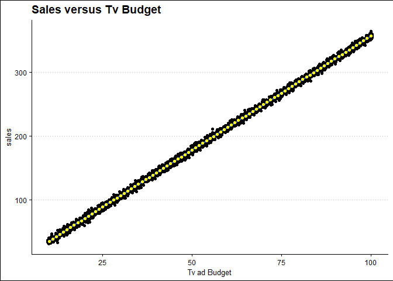

Regression In R
================
18 Nov, 2022

-   <a href="#introduction-to-linear-regression"
    id="toc-introduction-to-linear-regression">Introduction to Linear
    Regression</a>
    -   <a href="#making-predictions" id="toc-making-predictions">Making
        Predictions</a>
-   <a href="#visualizing-predictions"
    id="toc-visualizing-predictions">Visualizing predictions</a>
    -   <a href="#extrapolating" id="toc-extrapolating">Extrapolating</a>

# Introduction to Linear Regression

The most basic and widely used predictive analysis is linear regression.
Estimates from regression are used to describe the data and clarify the
relationship. Businesses can use linear regressions to analyze trends
and provide estimates or projections. For instance, if a firm’s sales
have been rising gradually each month for the previous several years,
the firm may anticipate sales in the months ahead by doing a linear
analysis on the sales data with monthly sales. In this paper we are
going to use marketing data of a certain company to explore linear
regression. The data the contains advertising budget (in US dollars) for
channels Tv, Radio, and Social_media, the type of influencer method, and
the sales associated with each channel and influence type.

``` r
# load libraries
pacman::p_load(tidyverse, janitor, naniar, ggthemes, broom)

# read data
my_data <- read_csv("datasets/marketing.csv",
  show_col_types = F
) %>%
  clean_names()

# print first 6 observations
head(my_data)
```

    ## # A tibble: 6 × 5
    ##      tv radio social_media influencer sales
    ##   <dbl> <dbl>        <dbl> <chr>      <dbl>
    ## 1    16  6.57         2.91 Mega        54.7
    ## 2    13  9.24         2.41 Mega        46.7
    ## 3    41 15.9          2.91 Mega       150. 
    ## 4    83 30.0          6.92 Mega       298. 
    ## 5    15  8.44         1.41 Micro       56.6
    ## 6    29  9.61         1.03 Mega       106.

``` r
# remove duplicates
my_data %>% 
  distinct() -> my_data
```

Let’s determine if there are missing values in the data that might alter
our analysis

``` r
# are there NA's in the data
any_na(my_data)
```

    ## [1] TRUE

``` r
# What percent of the data is missing
pct_miss(my_data)
```

    ## [1] 0.1137358

Only 0.114 percent of the data is missing. We can remove the rows with
missing data. Note that this is not the standard way to deal with
missing values but for sake of keeping our focus on regression, let’s
drop NA’s.

``` r
my_data %>% 
  drop_na() -> my_data 
```

Let’s start by running a simple linear regression model using sales as
the dependent variable and Tv budget as the explanatory variable. Before
that, it is always a good idea to visualize the data and check whether
the two variables have a linear relationship.

``` r
my_data %>%
  ggplot(aes(tv, sales)) +
  # add a scatter plot
  geom_jitter() +
  # fit a linear trendline
  geom_smooth(
    method = "lm",
    se = F
  ) +
  # add a theme
  theme_clean() +
  # add correct labels
  labs(
    title = "Sales versus Tv Budget",
    x = "Tv ad Budget"
  )
```

    ## `geom_smooth()` using formula 'y ~ x'

<!-- -->

The graph illustrates a very strong linear relationship between sales
and tv budget. This means that increase in Tv advertisement budget is
associated with increase in sales. Let’s calculate the correlation
coefficient between sales and tv budget to examine how strong the
relationship is.

``` r
my_data %>% 
  summarise(
    correlation = cor(tv, sales)
  ) %>% 
  pull(correlation)
```

    ## [1] 0.9994974

The output means that there is a very strong positve correlation between
sales and tv ad budget. While ggplot can display a linear regression
trend line using geom_smooth(), it doesn’t give us access to the
intercept and slope as variables, or allow us to work with the model
results as variables. That means that we will need to run a linear
regression

``` r
# predict sales using Tv budget
tv_model <- lm(sales ~ tv, data = my_data)

# print tv_model
tv_model
```

    ## 
    ## Call:
    ## lm(formula = sales ~ tv, data = my_data)
    ## 
    ## Coefficients:
    ## (Intercept)           tv  
    ##     -0.1325       3.5615

Our interest is in the coefficient results. The intercept value
(-0.1325) indicates that, on average, the firm loses money in sales even
if it does not spend any money on television advertising. Given that we
cannot make negative sales, this number is illogical. Contrarily, the
slope indicates that a 1 dollar increase in the budget for television
advertisements results in a 3.6 dollar rise in sales.

Let’s now make a sales prediction utilizing the explanatory variable
influencer. N otice that the influencer variable is categorical. To
signal that all coefficients should be provided relative to zero, we
instead add “+ 0” to the explanatory variable.

``` r
influencer_model <- lm(sales ~ influencer + 0, data = my_data)

# print influencer model
influencer_model
```

    ## 
    ## Call:
    ## lm(formula = sales ~ influencer + 0, data = my_data)
    ## 
    ## Coefficients:
    ## influencerMacro   influencerMega  influencerMicro   influencerNano  
    ##           196.1            190.4            191.6            191.7

The first coefficient, influencerMacro, indicates that the firm will
generate an average revenue of \$196.12 per transaction if it engages a
Macro influencer to promote its goods. Other influencer modes are
interpreted in the same way. The coefficient estimates for a linear
regression with a single categorical explanatory variable are identical
to the grouped means of each category, it is vital to note. This
indicates that we will obtain the same outcomes as the coefficient
estimates above if we group the data by influencer and compute the means
for each group.

``` r
my_data %>% 
  group_by(influencer) %>% 
  summarise(average_sales = mean(sales))
```

    ## # A tibble: 4 × 2
    ##   influencer average_sales
    ##   <chr>              <dbl>
    ## 1 Macro               196.
    ## 2 Mega                190.
    ## 3 Micro               192.
    ## 4 Nano                192.

## Making Predictions

Perhaps one of the most important aspects of statistical models like
linear regression is that we can use to make predictions. The principle
behind prediction is to know the value of the response variable if we
set the explanatory variable to some value. We call the `predict()`
function and pass the model object and the data we want to predict. Say
we set the values of tv budget from 10 to 20.

``` r
# set explanatory variable values
explanatory_data <- tibble(tv = 10:100)
# predict the sales using the above explanatory data.
predict(tv_model, explanatory_data)
```

    ##         1         2         3         4         5         6         7         8 
    ##  35.48265  39.04416  42.60568  46.16719  49.72870  53.29022  56.85173  60.41325 
    ##         9        10        11        12        13        14        15        16 
    ##  63.97476  67.53628  71.09779  74.65930  78.22082  81.78233  85.34385  88.90536 
    ##        17        18        19        20        21        22        23        24 
    ##  92.46687  96.02839  99.58990 103.15142 106.71293 110.27444 113.83596 117.39747 
    ##        25        26        27        28        29        30        31        32 
    ## 120.95899 124.52050 128.08201 131.64353 135.20504 138.76656 142.32807 145.88959 
    ##        33        34        35        36        37        38        39        40 
    ## 149.45110 153.01261 156.57413 160.13564 163.69716 167.25867 170.82018 174.38170 
    ##        41        42        43        44        45        46        47        48 
    ## 177.94321 181.50473 185.06624 188.62775 192.18927 195.75078 199.31230 202.87381 
    ##        49        50        51        52        53        54        55        56 
    ## 206.43532 209.99684 213.55835 217.11987 220.68138 224.24290 227.80441 231.36592 
    ##        57        58        59        60        61        62        63        64 
    ## 234.92744 238.48895 242.05047 245.61198 249.17349 252.73501 256.29652 259.85804 
    ##        65        66        67        68        69        70        71        72 
    ## 263.41955 266.98106 270.54258 274.10409 277.66561 281.22712 284.78864 288.35015 
    ##        73        74        75        76        77        78        79        80 
    ## 291.91166 295.47318 299.03469 302.59621 306.15772 309.71923 313.28075 316.84226 
    ##        81        82        83        84        85        86        87        88 
    ## 320.40378 323.96529 327.52680 331.08832 334.64983 338.21135 341.77286 345.33437 
    ##        89        90        91 
    ## 348.89589 352.45740 356.01892

The predict function returns a vector. However to make it easy to
visualize the results, let’s use a dataframe to store the predictions

``` r
prediction_data <- explanatory_data %>% 
  mutate(sales = predict(tv_model, explanatory_data))

head(prediction_data)
```

    ## # A tibble: 6 × 2
    ##      tv sales
    ##   <int> <dbl>
    ## 1    10  35.5
    ## 2    11  39.0
    ## 3    12  42.6
    ## 4    13  46.2
    ## 5    14  49.7
    ## 6    15  53.3

We can answer questions like how much sales in dollars the company would
expect to make if TV budget was 12 dollars even the original dataset did
not include a case with that tv budget.

# Visualizing predictions

We use the same scatter plot and a linear trendline as before.

``` r
my_data %>%
  ggplot(aes(tv, sales)) +
  geom_jitter() +
  geom_smooth(
    method = "lm",
    se = F
  ) +
  # add a geom_point layer for predictions
  geom_point(data = prediction_data, color = "yellow") +
  theme_clean() +
  labs(
    title = "Sales versus Tv Budget",
    x = "Tv ad Budget"
  )
```

    ## `geom_smooth()` using formula 'y ~ x'

<!-- -->

Notice the predictions lie exactly on the trendline.

### Extrapolating

Extrapolating means making predictions outside the range of observed
data. It is sometimes appropriate to extrapolate but it can lead to
misleading or ridiculous results. It is therefore important to
understand the context of the data in order to determine whether it is
sensible to extrapolate. For example, to see how much sales we would
expect to make if we set two tv budget values, one extremely high and
the other extremely low, we can proceed as follows

``` r
# define explanatory variable values
low_tv_budget <- tibble(tv = 2)

# make predictions and store results in a data frame
low_tv_budget <- low_tv_budget %>% 
  mutate(
    sales = predict(
    tv_model, low_tv_budget
    )
  )

# print low_tv_budget
low_tv_budget
```

    ## # A tibble: 1 × 2
    ##      tv sales
    ##   <dbl> <dbl>
    ## 1     2  6.99

``` r
# visualize the predictions
my_data %>%
  ggplot(aes(tv, sales)) +
  geom_jitter() +
  geom_smooth(
    method = "lm",
    se = F
  ) +
  # add a geom_point layer for predictions
  geom_point(data = low_tv_budget, color = "red")+
  theme_clean()+
  labs(
    title = "Sales versus Tv Budget",
    x = "Tv ad Budget"
  )
```

    ## `geom_smooth()` using formula 'y ~ x'

<!-- -->

The model predicts that if we spend only two dollars in tv
advertisement, we would make sales worth 6.99 dollars.
