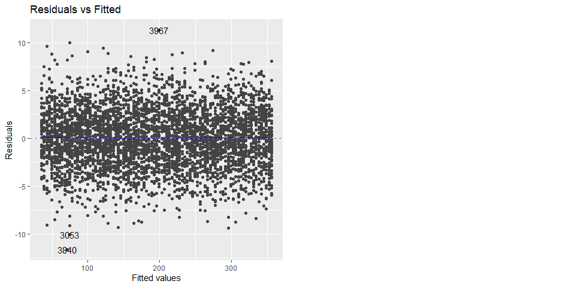

Regression In R
================
22 Nov, 2022

-   <a href="#introduction-to-linear-regression"
    id="toc-introduction-to-linear-regression">Introduction to Linear
    Regression</a>
-   <a href="#visualizing-one-cagorical-explanatory-variable-model"
    id="toc-visualizing-one-cagorical-explanatory-variable-model">Visualizing
    one cagorical explanatory variable model</a>
    -   <a href="#making-predictions" id="toc-making-predictions">Making
        Predictions</a>
-   <a href="#visualizing-predictions"
    id="toc-visualizing-predictions">Visualizing predictions</a>
    -   <a href="#extrapolating" id="toc-extrapolating">Extrapolating</a>
-   <a href="#working-with-model-objects"
    id="toc-working-with-model-objects">Working with Model Objects</a>
-   <a href="#quantifying-model-fit"
    id="toc-quantifying-model-fit">Quantifying Model fit</a>
-   <a href="#visualizing-model-fit"
    id="toc-visualizing-model-fit">Visualizing model fit</a>
-   <a href="#outliers" id="toc-outliers">Outliers</a>
-   <a href="#leverage" id="toc-leverage">Leverage</a>
-   <a href="#influence" id="toc-influence">Influence</a>

# Introduction to Linear Regression

The most basic and widely used predictive analysis is linear regression.
Estimates from regression are used to describe the data and clarify the
relationship. Businesses can use linear regressions to analyze trends
and provide estimates or projections. For instance, if a firm’s sales
have been rising gradually each month for the previous several years,
the firm may anticipate sales in the months ahead by doing a linear
analysis on the sales data with monthly sales. In this paper we are
going to use marketing data of a certain company to explore linear
regression. The data the contains advertising budget (in US dollars) for
channels Tv, Radio, and Social_media, the type of influencer method, and
the sales associated with each channel and influence type.

``` r
# load libraries
pacman::p_load(
  tidyverse, 
  janitor, 
  naniar, 
  ggthemes, 
  broom, 
  ggfortify
  )

# read data
my_data <- read_csv("datasets/marketing.csv",
  show_col_types = F
  ) %>%
  clean_names()

# print first 6 observations
head(my_data)
```

|  tv |     radio | social_media | influencer |     sales |
|----:|----------:|-------------:|:-----------|----------:|
|  16 |  6.566231 |     2.907983 | Mega       |  54.73276 |
|  13 |  9.237765 |     2.409567 | Mega       |  46.67790 |
|  41 | 15.886446 |     2.913410 | Mega       | 150.17783 |
|  83 | 30.020028 |     6.922304 | Mega       | 298.24634 |
|  15 |  8.437408 |     1.405998 | Micro      |  56.59418 |
|  29 |  9.614382 |     1.027163 | Mega       | 105.88915 |

``` r
# remove duplicates
my_data %>% 
  distinct() -> my_data
```

Let’s determine if there are missing values in the data that might alter
our analysis

``` r
# are there NA's in the data
any_na(my_data)
```

    ## [1] TRUE

``` r
# What percent of the data is missing
pct_miss(my_data)
```

    ## [1] 0.1137358

Only 0.114 percent of the data is missing. We can remove the rows with
missing data. Note that this is not the standard way to deal with
missing values but for sake of keeping our focus on regression, let’s
drop NA’s.

``` r
my_data %>% 
  drop_na() -> my_data 
```

Let’s start by running a simple linear regression model using sales as
the dependent variable and Tv budget as the explanatory variable. Before
that, it is always a good idea to visualize the data and check whether
the two variables have a linear relationship.

``` r
my_data %>%
  ggplot(
    aes(tv, sales)
    ) +
  # add a scatter plot
  geom_jitter() +
  # fit a linear trendline
  geom_smooth(
    method = "lm",
    se = F
  ) +
  # add a theme
  theme_clean() +
  # add correct labels
  labs(
    title = "Sales versus Tv Budget",
    x = "Tv ad Budget"
  )
```

    ## `geom_smooth()` using formula 'y ~ x'

<!-- -->

The graph illustrates a very strong linear relationship between sales
and tv budget. This means that increase in Tv advertisement budget is
associated with increase in sales. Let’s calculate the correlation
coefficient between sales and tv budget to examine how strong the
relationship is.

``` r
my_data %>% 
  summarise(
    correlation = cor(tv, sales)
  ) %>% 
  pull(correlation)
```

    ## [1] 0.9994974

The output means that there is a very strong positive correlation
between sales and tv ad budget. While ggplot can display a linear
regression trend line using geom_smooth(), it doesn’t give us access to
the intercept and slope as variables, or allow us to work with the model
results as variables. That means that we will need to run a linear
regression.

``` r
# predict sales using Tv budget
tv_model <- lm(
  sales ~ tv, 
  data = my_data
  )

# print tv_model
tv_model
```

    ## 
    ## Call:
    ## lm(formula = sales ~ tv, data = my_data)
    ## 
    ## Coefficients:
    ## (Intercept)           tv  
    ##     -0.1325       3.5615

*Note that a linear regression model is one of the generalized linear
models that can be performed with the code below.*

``` r
glm(
  formula = sales ~ tv, 
  data = my_data, 
  family = gaussian
)
```

    ## 
    ## Call:  glm(formula = sales ~ tv, family = gaussian, data = my_data)
    ## 
    ## Coefficients:
    ## (Intercept)           tv  
    ##     -0.1325       3.5615  
    ## 
    ## Degrees of Freedom: 4545 Total (i.e. Null);  4544 Residual
    ## Null Deviance:       39330000 
    ## Residual Deviance: 39520     AIC: 22740

Our interest is in the coefficient results. The intercept value
(-0.1325) indicates that, on average, the firm loses money in sales even
if it does not spend any money on television advertising. Given that we
cannot make negative sales, this number is illogical. Contrarily, the
slope indicates that a 1 dollar increase in the budget for television
advertisements results in a 3.6 dollar rise in sales.

Let’s now make a sales prediction utilizing the explanatory variable
influencer. Notice that the influencer variable is categorical. To
signal that all coefficients should be provided relative to zero, we
instead add “+ 0” to the explanatory variable.

``` r
influencer_model <- lm(
  sales ~ influencer + 0, 
  data = my_data
  )

# print influencer model
influencer_model
```

    ## 
    ## Call:
    ## lm(formula = sales ~ influencer + 0, data = my_data)
    ## 
    ## Coefficients:
    ## influencerMacro   influencerMega  influencerMicro   influencerNano  
    ##           196.1            190.4            191.6            191.7

The first coefficient, influencerMacro, indicates that the firm will
generate an average revenue of \$196.12 per transaction if it engages a
Macro influencer to promote its goods. Other influencer modes are
interpreted in the same way. The coefficient estimates for a linear
regression with a single categorical explanatory variable are identical
to the grouped means of each category, it is vital to note. This
indicates that we will obtain the same outcomes as the coefficient
estimates above if we group the data by influencer and compute the means
for each group.

``` r
my_data %>% 
  group_by(influencer) %>% 
  summarise(
    average_sales = mean(sales)
    )
```

| influencer | average_sales |
|:-----------|--------------:|
| Macro      |      196.0662 |
| Mega       |      190.4129 |
| Micro      |      191.5784 |
| Nano       |      191.7088 |

# Visualizing one cagorical explanatory variable model

``` r
my_data %>% 
  ggplot(
    aes(
      x = influencer,
      y = sales,
      fill = influencer,
    )
  )+
  geom_boxplot(alpha = .5)+
  stat_summary(
    fun = mean,
    shape = 15
  )+
  theme_few()+
  theme(
    legend.position = "none"
  )+
  labs(
    title = "Distributions of Sales in US dollars per Influencer category",
  )
```

<!-- -->

## Making Predictions

Perhaps one of the most important aspects of statistical models like
linear regression is that we can use to make predictions. The principle
behind prediction is to know the value of the response variable if we
set the explanatory variable to some value. We call the `predict()`
function and pass the model object and the data we want to predict. Say
we set the values of tv budget from 10 to 20.

``` r
# set explanatory variable values
explanatory_data <- tibble(tv = 10:100)
# predict the sales using the above explanatory data.
predict(tv_model, explanatory_data)
```

    ##         1         2         3         4         5         6         7         8 
    ##  35.48265  39.04416  42.60568  46.16719  49.72870  53.29022  56.85173  60.41325 
    ##         9        10        11        12        13        14        15        16 
    ##  63.97476  67.53628  71.09779  74.65930  78.22082  81.78233  85.34385  88.90536 
    ##        17        18        19        20        21        22        23        24 
    ##  92.46687  96.02839  99.58990 103.15142 106.71293 110.27444 113.83596 117.39747 
    ##        25        26        27        28        29        30        31        32 
    ## 120.95899 124.52050 128.08201 131.64353 135.20504 138.76656 142.32807 145.88959 
    ##        33        34        35        36        37        38        39        40 
    ## 149.45110 153.01261 156.57413 160.13564 163.69716 167.25867 170.82018 174.38170 
    ##        41        42        43        44        45        46        47        48 
    ## 177.94321 181.50473 185.06624 188.62775 192.18927 195.75078 199.31230 202.87381 
    ##        49        50        51        52        53        54        55        56 
    ## 206.43532 209.99684 213.55835 217.11987 220.68138 224.24290 227.80441 231.36592 
    ##        57        58        59        60        61        62        63        64 
    ## 234.92744 238.48895 242.05047 245.61198 249.17349 252.73501 256.29652 259.85804 
    ##        65        66        67        68        69        70        71        72 
    ## 263.41955 266.98106 270.54258 274.10409 277.66561 281.22712 284.78864 288.35015 
    ##        73        74        75        76        77        78        79        80 
    ## 291.91166 295.47318 299.03469 302.59621 306.15772 309.71923 313.28075 316.84226 
    ##        81        82        83        84        85        86        87        88 
    ## 320.40378 323.96529 327.52680 331.08832 334.64983 338.21135 341.77286 345.33437 
    ##        89        90        91 
    ## 348.89589 352.45740 356.01892

The predict function returns a vector. However to make it easy to
visualize the results, let’s use a dataframe to store the predictions

``` r
prediction_data <- explanatory_data %>% 
  mutate(
    sales = predict(tv_model, explanatory_data)
    )

head(prediction_data)
```

|  tv |    sales |
|----:|---------:|
|  10 | 35.48265 |
|  11 | 39.04416 |
|  12 | 42.60568 |
|  13 | 46.16719 |
|  14 | 49.72870 |
|  15 | 53.29022 |

We can answer questions like how much sales in dollars the company would
expect to make if TV budget was 12 dollars even the original dataset did
not include a case with that tv budget.

# Visualizing predictions

We use the same scatter plot and a linear trend line as before.

``` r
my_data %>%
  ggplot(
    aes(tv, sales)
    ) +
  geom_jitter() +
  geom_smooth(
    method = "lm",
    se = F
  ) +
  # add a geom_point layer for predictions
  geom_point(
    data = prediction_data, 
    color = "yellow"
    ) +
  theme_clean() +
  labs(
    title = "Sales versus Tv Budget",
    x = "Tv ad Budget"
  )
```

    ## `geom_smooth()` using formula 'y ~ x'

<!-- -->

Notice the predictions lie exactly on the trendline.

### Extrapolating

Extrapolating means making predictions outside the range of observed
data. It is sometimes appropriate to extrapolate but it can lead to
misleading or ridiculous results. It is therefore important to
understand the context of the data in order to determine whether it is
sensible to extrapolate. For example, to see how much sales we would
expect to make if we set two tv budget values, one extremely high and
the other extremely low, we can proceed as follows

``` r
# define explanatory variable values
low_tv_budget <- tibble(tv = 2)

# make predictions and store results in a data frame
low_tv_budget <- low_tv_budget %>% 
  mutate(
    sales = predict(
    tv_model, low_tv_budget
    )
  )

# print low_tv_budget
low_tv_budget
```

|  tv |    sales |
|----:|---------:|
|   2 | 6.990536 |

``` r
# visualize the predictions
my_data %>%
  ggplot(
    aes(tv, sales)
    ) +
  geom_jitter() +
  geom_smooth(
    method = "lm",
    se = F
  ) +
  # add a geom_point layer for predictions
  geom_point(
    data = low_tv_budget, 
    color = "red"
    )+
  theme_clean()+
  labs(
    title = "Sales versus Tv Budget",
    x = "Tv ad Budget"
  )
```

    ## `geom_smooth()` using formula 'y ~ x'

<!-- -->

The model predicts that if we spend only two dollars in tv
advertisement, we would make sales worth 6.99 dollars.

# Working with Model Objects

The model object contains a lot of information such as coefficients,
residuals, fitted values, and other statistics. We can obtain these
objects for further analysis using the following methods

``` r
# get coefficients
coefficients(tv_model)
```

    ## (Intercept)          tv 
    ##  -0.1324925   3.5615141

``` r
# get a few residuals
head(residuals(tv_model))
```

    ##          1          2          3          4          5          6 
    ## -2.1189758  0.5107063  4.2882435  2.7731625  3.3039619  2.7377314

``` r
# get a few fitted values
head(fitted(tv_model))
```

    ##         1         2         3         4         5         6 
    ##  56.85173  46.16719 145.88959 295.47318  53.29022 103.15142

``` r
# print model summary
summary(tv_model)
```

    ## 
    ## Call:
    ## lm(formula = sales ~ tv, data = my_data)
    ## 
    ## Residuals:
    ##      Min       1Q   Median       3Q      Max 
    ## -11.6062  -2.0062  -0.0125   2.0249  11.2566 
    ## 
    ## Coefficients:
    ##              Estimate Std. Error  t value Pr(>|t|)    
    ## (Intercept) -0.132493   0.100605   -1.317    0.188    
    ## tv           3.561514   0.001676 2125.272   <2e-16 ***
    ## ---
    ## Signif. codes:  0 '***' 0.001 '**' 0.01 '*' 0.05 '.' 0.1 ' ' 1
    ## 
    ## Residual standard error: 2.949 on 4544 degrees of freedom
    ## Multiple R-squared:  0.999,  Adjusted R-squared:  0.999 
    ## F-statistic: 4.517e+06 on 1 and 4544 DF,  p-value: < 2.2e-16

While the `summary()` function contains a lot of information, it is
designed to be read, not to be manipulated with code. The broom package
comes in handy with functions that return data frames. This facilitates
manipulation of the model results with dplyr, ggplot2, and other
tidyverse packages. To get coefficients level details of the model, we
call `tidy()` on the model

``` r
tidy(tv_model)
```

| term        |   estimate | std.error |   statistic |   p.value |
|:------------|-----------:|----------:|------------:|----------:|
| (Intercept) | -0.1324925 | 0.1006050 |   -1.316958 | 0.1879193 |
| tv          |  3.5615141 | 0.0016758 | 2125.271602 | 0.0000000 |

To get observational level details, we call `augment()`. Here we will
use head to print a few observations

``` r
head(augment(tv_model))
```

|     sales |  tv |   .fitted |     .resid |      .hat |   .sigma |   .cooksd | .std.resid |
|----------:|----:|----------:|-----------:|----------:|---------:|----------:|-----------:|
|  54.73276 |  16 |  56.85173 | -2.1189758 | 0.0006877 | 2.949396 | 0.0001778 | -0.7187295 |
|  46.67790 |  13 |  46.16719 |  0.5107063 | 0.0007644 | 2.949553 | 0.0000115 |  0.1732317 |
| 150.17783 |  41 | 145.88959 |  4.2882435 | 0.0002751 | 2.948877 | 0.0002909 |  1.4542172 |
| 298.24634 |  83 | 295.47318 |  2.7731625 | 0.0004903 | 2.949276 | 0.0002170 |  0.9405284 |
|  56.59418 |  15 |  53.29022 |  3.3039619 | 0.0007126 | 2.949155 | 0.0004478 |  1.1206756 |
| 105.88915 |  29 | 103.15142 |  2.7377314 | 0.0004228 | 2.949283 | 0.0001823 |  0.9284804 |

To get model level details or performance metrics, we call `glance()`

``` r
glance(tv_model)
```

| r.squared | adj.r.squared |    sigma | statistic | p.value |  df |    logLik |      AIC |      BIC | deviance | df.residual | nobs |
|----------:|--------------:|---------:|----------:|--------:|----:|----------:|---------:|---------:|---------:|------------:|-----:|
|  0.998995 |     0.9989948 | 2.949238 |   4516779 |       0 |   1 | -11366.21 | 22738.41 | 22757.68 | 39523.75 |        4544 | 4546 |

# Quantifying Model fit

It is usually important to know whether or not predictions from our
model are a nonsense. There are various we can quantify model fit

#### Coefficient of determination (R2)

R2 value describes the proportion of the variation in the response
variable that is predictable from the explanatory variable. We can get
the R2 value using `glance()` and dplyr’s `pull()` functions as follows

``` r
tv_model %>% 
  glance() %>% 
  pull(r.squared)
```

    ## [1] 0.998995

This means that, on average, 99.89% of the variations in sales are
explained by tv ad budget, holding other factors constant. We can get
the R2 value by simply squaring the correlation coefficient between
sales and tv ad budget as follows:

``` r
my_data %>% 
  summarise(
    r.square = cor(sales, tv)^2
  ) %>% 
  pull(r.square)
```

    ## [1] 0.998995

#### Residual Standard Error (RSE)

RSE is the typical difference between the a prediction and an observed
value. I like to think of it as the “typical error of the model”. It has
the same units as the response variable. We can get the RSE of our model
as follows

``` r
tv_model %>% 
  glance() %>% 
  pull(sigma)
```

    ## [1] 2.949239

We can also manually calculate it as follows

``` r
my_data %>% 
  # create a new variable for each residual
  mutate(
    # square the residuals
    residuals_sq = residuals(tv_model)^2
  ) %>% 
  summarise(
    # get the sum of the squared residuals 
    sum_of_residuals_sq = sum(residuals_sq),
    # calculate the degrees of freedom as 
    # the # of observations minus the # of coefficients
    df = n()-2,
    # calculate rse as the sqrt of the ratio
    rse = sqrt(sum_of_residuals_sq/df)
  ) %>% 
  pull(rse)
```

    ## [1] 2.949239

This means that the difference between the predicted sales value and the
observed sales value is typically 2.94 dollars.

#### Root Mean Square Error (RMSE)

RMSE performs the same task as the RSE, i.e quantifying how inaccurate
our model is. It’s calculated the same way as the RSE, only that we do
not subtract the number of coefficients in the second last step:

``` r
my_data %>% 
  # create a new variable for each residual
  mutate(
    # square the residuals
    residuals_sq = residuals(tv_model)^2
  ) %>% 
  summarise(
    # get the sum of the squared residuals 
    sum_of_residuals_sq = sum(residuals_sq),
    # calculate the degrees of freedom as 
    # the # of observations minus the # of coefficients
    n_observations = n(),
    # calculate rse as the sqrt of the ratio
    rmse = sqrt(sum_of_residuals_sq/n_observations)
  ) %>% 
  pull(rmse)
```

    ## [1] 2.94859

RSME is a poor metric when comparing models. Even though, we should know
it exists but always use RSE.

# Visualizing model fit

There are several diagnostic plots that can be used to quantify the
performance of a model. Some of these plots include residuals vs. fitted
values plot, Q-Q plot, and Scale location plot. The principle behind
this plots is that if a linear regression model is a good fit, the
residuals are approximately normally distributed with mean zero. Lets
briefly discuss each of these plots

#### Residuals versus Fitted Values

To draw this plot we call `autoplot()`, passing the model object and
setting the `which` argument to 1.

``` r
# residuals vs fitted values plot
autoplot(
  tv_model, 
  which = 1
  )
```

<!-- --> The blue
line is called the LOESS trend line, which is a smooth curve following
the data. If the residuals meet the assumption that they are normally
distributed with mean zero, then then trend line should closely follow
the y equals zero line on the plot, which is the case in our plot. This
indicates that our model is a good fit.

#### Q-Q plot

The code for drawing this plot is the same as that of residual vs fitted
values plot, except that we set the `which` argument to 2.

``` r
# plot Q-Q plot
autoplot(
  tv_model, 
  which = 2
  )
```

<!-- -->

Again, the Q-Q plot shows whether or not the residuals follow a normal
distribution. On the x-axis, the points are the quantiles from the
normal distribution. On the y-axis, we get the standardized residuals,
which are the residuals divided by their standard deviation. If the
points follow the straight line closely, they are normally distributed,
if not, they aren’t. In our case, we can say they are normally
distributed indicating good fit.

#### Scale-location Plot

Again the code is the same, except we set the `which` argument to 3

``` r
# plot scale location
autoplot(tv_model, which = 3)
```

<!-- -->

The scale-location plot displays the square root of the standardized
residuals vs fitted values. It shows whether the size of of the
residuals gets bigger or smaller. Basically the size of the standardized
residuals should be consistent, which is the case in our plot. We can
draw the three plots together as follows

``` r
autoplot(
  tv_model,
  which = 1:3,
  ncol = 1,
  nrow = 3
  )+
  # add a theme
  theme_clean()
```

<!-- -->

# Outliers

An outlier is an unusual data point in the dataset. Mathematically, a
data is an outlier if it is less than `Q1 - 1.5*IQR` or greater than
`Q3 + 1.5*IQR`, where Q1 is the first quartile, Q3 is the third
quartile, and IQR is the interquartile range. The best way to determine
if there are outliers is by using box plots. To check for outliers in a
variable, it is best to use box plots.

``` r
# determine if there are outliers in the sales variable
my_data %>% 
  ggplot(
    aes(x = " ", y = sales)
    )+
  geom_boxplot()+
  theme_clean()+
  labs(
    title = "Distribution of Sales"
  )
```

<!-- -->

In this case there are no any outliers. Let’s do the same thing for tv
budget

``` r
# determine if there are outliers in the tv budget variable
my_data %>% 
  ggplot(
    aes(x = " ", y = tv)
    )+
  geom_boxplot()+
  theme_clean()+
  labs(
    title = "Distribution of Tv budget"
  )
```

<!-- -->

Again, there are no unusual data points in the tv variable.

# Leverage

Leverage is a measure of how extreme the explanatory variable values
are. Basically, a high leverage means that the explanatory variable has
values that are different from other points in the dataset. To calculate
leverage, we use the `hatvalues()` function, passing the model object.
This function returns a numeric vector with as many values as there are
observations.

``` r
# print a few leverage values
head(
  hatvalues(tv_model)
)
```

    ##            1            2            3            4            5            6 
    ## 0.0006877353 0.0007643762 0.0002750671 0.0004903260 0.0007126365 0.0004227810

Alternatively, we can use the `augment()` function from broom. The
leverage values are stored in the `.hat` column.

``` r
tv_model %>% 
  augment() %>% 
  select(
    sales, tv, leverage = .hat
  ) %>% 
  arrange(
    desc(leverage)
  ) %>% 
  head()
```

|    sales |  tv |  leverage |
|---------:|----:|----------:|
| 353.8046 | 100 | 0.0009013 |
| 354.7974 | 100 | 0.0009013 |
| 354.1040 | 100 | 0.0009013 |
| 357.1246 | 100 | 0.0009013 |
| 358.3505 | 100 | 0.0009013 |
| 355.0516 | 100 | 0.0009013 |

# Influence

Influence measures how much the model would change if we left the
observations out of the model calculations one at a time. The influence
of each observations is based on the size of the residuals and the
leverage. The most common measure of influence is called *Cook’s
Distance*. Bigger values denote more influence for the observation. To
calculate Cook’s distance, we call the `cooks.distance()` function
passing the model object. However, let’s stick to the broom’s
`augment()` function. The values for influence are stored in the
`.cooksd` column.

``` r
tv_model %>% 
  augment() %>% 
  select(
    sales, tv, cooks_dist = .cooksd
  ) %>% 
  arrange(
    desc(cooks_dist)
  ) %>% 
  head()
```

|     sales |  tv | cooks_dist |
|----------:|----:|-----------:|
|  59.49158 |  20 |  0.0046096 |
|  52.19893 |  12 |  0.0041924 |
|  33.50981 |  12 |  0.0037689 |
| 364.07975 | 100 |  0.0033725 |
|  64.57081 |  21 |  0.0033558 |
|  58.53157 |  14 |  0.0032931 |

We learn that the most influential observation was the one with sales
worth 59.49158 dollars and a tv budget of 20 dollars.

`autoplot()` lets us draw diagnostic plots of leverage and influence, by
setting the `which` argument to 4, 5, or 6. I find this plots less
helpful for diagnosis than the previous ones we looked at. Nevertheless,
they help us identify the most influential observations quickly.

``` r
# visualize leverage and influence
autoplot(
  tv_model, 
  which = 4:6
  )
```

<!-- -->
