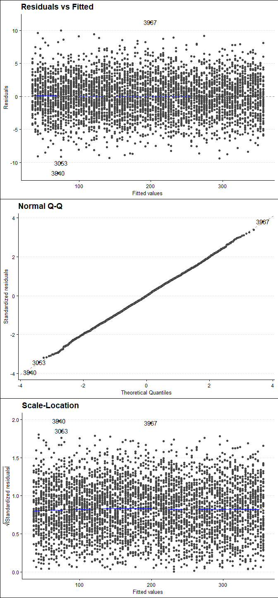

Regression In R
================
22 Nov, 2022

-   <a href="#introduction-to-linear-regression"
    id="toc-introduction-to-linear-regression">Introduction to Linear
    Regression</a>
-   <a href="#visualizing-one-cagorical-explanatory-variable-model"
    id="toc-visualizing-one-cagorical-explanatory-variable-model">Visualizing
    one cagorical explanatory variable model</a>
    -   <a href="#making-predictions" id="toc-making-predictions">Making
        Predictions</a>
-   <a href="#visualizing-predictions"
    id="toc-visualizing-predictions">Visualizing predictions</a>
    -   <a href="#extrapolating" id="toc-extrapolating">Extrapolating</a>
-   <a href="#working-with-model-objects"
    id="toc-working-with-model-objects">Working with Model Objects</a>
-   <a href="#quantifying-model-fit"
    id="toc-quantifying-model-fit">Quantifying Model fit</a>
-   <a href="#visualizing-model-fit"
    id="toc-visualizing-model-fit">Visualizing model fit</a>
-   <a href="#outliers" id="toc-outliers">Outliers</a>
-   <a href="#leverage" id="toc-leverage">Leverage</a>
-   <a href="#influence" id="toc-influence">Influence</a>

# Introduction to Linear Regression

The most basic and widely used predictive analysis is linear regression.
Estimates from regression are used to describe the data and clarify the
relationship. Businesses can use linear regressions to analyze trends
and provide estimates or projections. For instance, if a firm’s sales
have been rising gradually each month for the previous several years,
the firm may anticipate sales in the months ahead by doing a linear
analysis on the sales data with monthly sales. In this paper we are
going to use marketing data of a certain company to explore linear
regression. The data the contains advertising budget (in US dollars) for
channels Tv, Radio, and Social_media, the type of influencer method, and
the sales associated with each channel and influence type.

``` r
# load libraries
pacman::p_load(
  tidyverse, 
  janitor, 
  naniar, 
  ggthemes, 
  broom, 
  ggfortify
  )

# read data
my_data <- read_csv("datasets/marketing.csv",
  show_col_types = F
  ) %>%
  clean_names()

# print first 6 observations
head(my_data)
```

|  tv |     radio | social_media | influencer |     sales |
|----:|----------:|-------------:|:-----------|----------:|
|  16 |  6.566231 |     2.907983 | Mega       |  54.73276 |
|  13 |  9.237765 |     2.409567 | Mega       |  46.67790 |
|  41 | 15.886446 |     2.913410 | Mega       | 150.17783 |
|  83 | 30.020028 |     6.922304 | Mega       | 298.24634 |
|  15 |  8.437408 |     1.405998 | Micro      |  56.59418 |
|  29 |  9.614382 |     1.027163 | Mega       | 105.88915 |

``` r
# remove duplicates
my_data %>% 
  distinct() -> my_data
```

Let’s determine if there are missing values in the data that might alter
our analysis

``` r
# are there NA's in the data
any_na(my_data)
```

    ## [1] TRUE

``` r
# What percent of the data is missing
pct_miss(my_data)
```

    ## [1] 0.1137358

Only 0.114 percent of the data is missing. We can remove the rows with
missing data. Note that this is not the standard way to deal with
missing values but for sake of keeping our focus on regression, let’s
drop NA’s.

``` r
my_data %>% 
  drop_na() -> my_data 
```

Let’s start by running a simple linear regression model using sales as
the dependent variable and Tv budget as the explanatory variable. Before
that, it is always a good idea to visualize the data and check whether
the two variables have a linear relationship.

``` r
my_data %>%
  ggplot(
    aes(tv, sales)
    ) +
  # add a scatter plot
  geom_jitter() +
  # fit a linear trendline
  geom_smooth(
    method = "lm",
    se = F
  ) +
  # add a theme
  theme_clean() +
  # add correct labels
  labs(
    title = "Sales versus Tv Budget",
    x = "Tv ad Budget"
  )
```

    ## `geom_smooth()` using formula 'y ~ x'

<!-- -->

The graph illustrates a very strong linear relationship between sales
and tv budget. This means that increase in Tv advertisement budget is
associated with increase in sales. Let’s calculate the correlation
coefficient between sales and tv budget to examine how strong the
relationship is.

``` r
my_data %>% 
  summarise(
    correlation = cor(tv, sales)
  ) %>% 
  pull(correlation)
```

    ## [1] 0.9994974

The output means that there is a very strong positive correlation
between sales and tv ad budget. While ggplot can display a linear
regression trend line using geom_smooth(), it doesn’t give us access to
the intercept and slope as variables, or allow us to work with the model
results as variables. That means that we will need to run a linear
regression.

``` r
# predict sales using Tv budget
tv_model <- lm(
  sales ~ tv, 
  data = my_data
  )

# print tv_model
tv_model
```

    ## 
    ## Call:
    ## lm(formula = sales ~ tv, data = my_data)
    ## 
    ## Coefficients:
    ## (Intercept)           tv  
    ##     -0.1325       3.5615

*Note that a linear regression model is one of the generalized linear
models that can be performed with the code below.*

``` r
glm(
  formula = sales ~ tv, 
  data = my_data, 
  family = gaussian
)
```

    ## 
    ## Call:  glm(formula = sales ~ tv, family = gaussian, data = my_data)
    ## 
    ## Coefficients:
    ## (Intercept)           tv  
    ##     -0.1325       3.5615  
    ## 
    ## Degrees of Freedom: 4545 Total (i.e. Null);  4544 Residual
    ## Null Deviance:       39330000 
    ## Residual Deviance: 39520     AIC: 22740

Our interest is in the coefficient results. The intercept value
(-0.1325) indicates that, on average, the firm loses money in sales even
if it does not spend any money on television advertising. Given that we
cannot make negative sales, this number is illogical. Contrarily, the
slope indicates that a 1 dollar increase in the budget for television
advertisements results in a 3.6 dollar rise in sales.

Let’s now make a sales prediction utilizing the explanatory variable
influencer. Notice that the influencer variable is categorical. To
signal that all coefficients should be provided relative to zero, we
instead add “+ 0” to the explanatory variable.

``` r
influencer_model <- lm(
  sales ~ influencer + 0, 
  data = my_data
  )

# print influencer model
influencer_model
```

    ## 
    ## Call:
    ## lm(formula = sales ~ influencer + 0, data = my_data)
    ## 
    ## Coefficients:
    ## influencerMacro   influencerMega  influencerMicro   influencerNano  
    ##           196.1            190.4            191.6            191.7

The first coefficient, influencerMacro, indicates that the firm will
generate an average revenue of \$196.12 per transaction if it engages a
Macro influencer to promote its goods. Other influencer modes are
interpreted in the same way. The coefficient estimates for a linear
regression with a single categorical explanatory variable are identical
to the grouped means of each category, it is vital to note. This
indicates that we will obtain the same outcomes as the coefficient
estimates above if we group the data by influencer and compute the means
for each group.

``` r
my_data %>% 
  group_by(influencer) %>% 
  summarise(
    average_sales = mean(sales)
    )
```

| influencer | average_sales |
|:-----------|--------------:|
| Macro      |      196.0662 |
| Mega       |      190.4129 |
| Micro      |      191.5784 |
| Nano       |      191.7088 |

# Visualizing one cagorical explanatory variable model

``` r
my_data %>% 
  ggplot(
    aes(
      x = influencer,
      y = sales,
      fill = influencer,
    )
  )+
  geom_boxplot(alpha = .5)+
  stat_summary(
    fun = mean,
    shape = 15
  )+
  theme_few()+
  theme(
    legend.position = "none"
  )+
  labs(
    title = "Distributions of Sales in US dollars per Influencer category",
  )
```

<!-- -->

## Making Predictions

Perhaps one of the most important aspects of statistical models like
linear regression is that we can use to make predictions. The principle
behind prediction is to know the value of the response variable if we
set the explanatory variable to some value. We call the `predict()`
function and pass the model object and the data we want to predict. Say
we set the values of tv budget from 10 to 20.

``` r
# set explanatory variable values
explanatory_data <- tibble(tv = 10:100)
# predict the sales using the above explanatory data.
predict(tv_model, explanatory_data)
```

    ##         1         2         3         4         5         6         7         8 
    ##  35.48265  39.04416  42.60568  46.16719  49.72870  53.29022  56.85173  60.41325 
    ##         9        10        11        12        13        14        15        16 
    ##  63.97476  67.53628  71.09779  74.65930  78.22082  81.78233  85.34385  88.90536 
    ##        17        18        19        20        21        22        23        24 
    ##  92.46687  96.02839  99.58990 103.15142 106.71293 110.27444 113.83596 117.39747 
    ##        25        26        27        28        29        30        31        32 
    ## 120.95899 124.52050 128.08201 131.64353 135.20504 138.76656 142.32807 145.88959 
    ##        33        34        35        36        37        38        39        40 
    ## 149.45110 153.01261 156.57413 160.13564 163.69716 167.25867 170.82018 174.38170 
    ##        41        42        43        44        45        46        47        48 
    ## 177.94321 181.50473 185.06624 188.62775 192.18927 195.75078 199.31230 202.87381 
    ##        49        50        51        52        53        54        55        56 
    ## 206.43532 209.99684 213.55835 217.11987 220.68138 224.24290 227.80441 231.36592 
    ##        57        58        59        60        61        62        63        64 
    ## 234.92744 238.48895 242.05047 245.61198 249.17349 252.73501 256.29652 259.85804 
    ##        65        66        67        68        69        70        71        72 
    ## 263.41955 266.98106 270.54258 274.10409 277.66561 281.22712 284.78864 288.35015 
    ##        73        74        75        76        77        78        79        80 
    ## 291.91166 295.47318 299.03469 302.59621 306.15772 309.71923 313.28075 316.84226 
    ##        81        82        83        84        85        86        87        88 
    ## 320.40378 323.96529 327.52680 331.08832 334.64983 338.21135 341.77286 345.33437 
    ##        89        90        91 
    ## 348.89589 352.45740 356.01892

The predict function returns a vector. However to make it easy to
visualize the results, let’s use a dataframe to store the predictions

``` r
prediction_data <- explanatory_data %>% 
  mutate(
    sales = predict(tv_model, explanatory_data)
    )

head(prediction_data)
```

|  tv |    sales |
|----:|---------:|
|  10 | 35.48265 |
|  11 | 39.04416 |
|  12 | 42.60568 |
|  13 | 46.16719 |
|  14 | 49.72870 |
|  15 | 53.29022 |

We can answer questions like how much sales in dollars the company would
expect to make if TV budget was 12 dollars even the original dataset did
not include a case with that tv budget.

# Visualizing predictions

We use the same scatter plot and a linear trend line as before.

``` r
my_data %>%
  ggplot(
    aes(tv, sales)
    ) +
  geom_jitter() +
  geom_smooth(
    method = "lm",
    se = F
  ) +
  # add a geom_point layer for predictions
  geom_point(
    data = prediction_data, 
    color = "yellow"
    ) +
  theme_clean() +
  labs(
    title = "Sales versus Tv Budget",
    x = "Tv ad Budget"
  )
```

    ## `geom_smooth()` using formula 'y ~ x'

<!-- -->

Notice the predictions lie exactly on the trendline.

### Extrapolating

Extrapolating means making predictions outside the range of observed
data. It is sometimes appropriate to extrapolate but it can lead to
misleading or ridiculous results. It is therefore important to
understand the context of the data in order to determine whether it is
sensible to extrapolate. For example, to see how much sales we would
expect to make if we set two tv budget values, one extremely high and
the other extremely low, we can proceed as follows

``` r
# define explanatory variable values
low_tv_budget <- tibble(tv = 2)

# make predictions and store results in a data frame
low_tv_budget <- low_tv_budget %>% 
  mutate(
    sales = predict(
    tv_model, low_tv_budget
    )
  )

# print low_tv_budget
low_tv_budget
```

|  tv |    sales |
|----:|---------:|
|   2 | 6.990536 |

``` r
# visualize the predictions
my_data %>%
  ggplot(
    aes(tv, sales)
    ) +
  geom_jitter() +
  geom_smooth(
    method = "lm",
    se = F
  ) +
  # add a geom_point layer for predictions
  geom_point(
    data = low_tv_budget, 
    color = "red"
    )+
  theme_clean()+
  labs(
    title = "Sales versus Tv Budget",
    x = "Tv ad Budget"
  )
```

    ## `geom_smooth()` using formula 'y ~ x'

<!-- -->

The model predicts that if we spend only two dollars in tv
advertisement, we would make sales worth 6.99 dollars.

# Working with Model Objects

The model object contains a lot of information such as coefficients,
residuals, fitted values, and other statistics. We can obtain these
objects for further analysis using the following methods

``` r
# get coefficients
coefficients(tv_model)
```

    ## (Intercept)          tv 
    ##  -0.1324925   3.5615141

``` r
# get a few residuals
head(residuals(tv_model))
```

    ##          1          2          3          4          5          6 
    ## -2.1189758  0.5107063  4.2882435  2.7731625  3.3039619  2.7377314

``` r
# get a few fitted values
head(fitted(tv_model))
```

    ##         1         2         3         4         5         6 
    ##  56.85173  46.16719 145.88959 295.47318  53.29022 103.15142

``` r
# print model summary
summary(tv_model)
```

    ## 
    ## Call:
    ## lm(formula = sales ~ tv, data = my_data)
    ## 
    ## Residuals:
    ##      Min       1Q   Median       3Q      Max 
    ## -11.6062  -2.0062  -0.0125   2.0249  11.2566 
    ## 
    ## Coefficients:
    ##              Estimate Std. Error  t value Pr(>|t|)    
    ## (Intercept) -0.132493   0.100605   -1.317    0.188    
    ## tv           3.561514   0.001676 2125.272   <2e-16 ***
    ## ---
    ## Signif. codes:  0 '***' 0.001 '**' 0.01 '*' 0.05 '.' 0.1 ' ' 1
    ## 
    ## Residual standard error: 2.949 on 4544 degrees of freedom
    ## Multiple R-squared:  0.999,  Adjusted R-squared:  0.999 
    ## F-statistic: 4.517e+06 on 1 and 4544 DF,  p-value: < 2.2e-16

While the `summary()` function contains a lot of information, it is
designed to be read, not to be manipulated with code. The broom package
comes in handy with functions that return data frames. This facilitates
manipulation of the model results with dplyr, ggplot2, and other
tidyverse packages. To get coefficients level details of the model, we
call `tidy()` on the model

``` r
tidy(tv_model)
```

| term        |   estimate | std.error |   statistic |   p.value |
|:------------|-----------:|----------:|------------:|----------:|
| (Intercept) | -0.1324925 | 0.1006050 |   -1.316958 | 0.1879193 |
| tv          |  3.5615141 | 0.0016758 | 2125.271602 | 0.0000000 |

To get observational level details, we call `augment()`. Here we will
use head to print a few observations

``` r
head(augment(tv_model))
```

|     sales |  tv |   .fitted |     .resid |      .hat |   .sigma |   .cooksd | .std.resid |
|----------:|----:|----------:|-----------:|----------:|---------:|----------:|-----------:|
|  54.73276 |  16 |  56.85173 | -2.1189758 | 0.0006877 | 2.949396 | 0.0001778 | -0.7187295 |
|  46.67790 |  13 |  46.16719 |  0.5107063 | 0.0007644 | 2.949553 | 0.0000115 |  0.1732317 |
| 150.17783 |  41 | 145.88959 |  4.2882435 | 0.0002751 | 2.948877 | 0.0002909 |  1.4542172 |
| 298.24634 |  83 | 295.47318 |  2.7731625 | 0.0004903 | 2.949276 | 0.0002170 |  0.9405284 |
|  56.59418 |  15 |  53.29022 |  3.3039619 | 0.0007126 | 2.949155 | 0.0004478 |  1.1206756 |
| 105.88915 |  29 | 103.15142 |  2.7377314 | 0.0004228 | 2.949283 | 0.0001823 |  0.9284804 |

To get model level details or performance metrics, we call `glance()`

``` r
glance(tv_model)
```

| r.squared | adj.r.squared |    sigma | statistic | p.value |  df |    logLik |      AIC |      BIC | deviance | df.residual | nobs |
|----------:|--------------:|---------:|----------:|--------:|----:|----------:|---------:|---------:|---------:|------------:|-----:|
|  0.998995 |     0.9989948 | 2.949238 |   4516779 |       0 |   1 | -11366.21 | 22738.41 | 22757.68 | 39523.75 |        4544 | 4546 |

# Quantifying Model fit

It is usually important to know whether or not predictions from our
model are a nonsense. There are various we can quantify model fit

#### Coefficient of determination (R2)

R2 value describes the proportion of the variation in the response
variable that is predictable from the explanatory variable. We can get
the R2 value using `glance()` and dplyr’s `pull()` functions as follows

``` r
tv_model %>% 
  glance() %>% 
  pull(r.squared)
```

    ## [1] 0.998995

This means that, on average, 99.89% of the variations in sales are
explained by tv ad budget, holding other factors constant. We can get
the R2 value by simply squaring the correlation coefficient between
sales and tv ad budget as follows:

``` r
my_data %>% 
  summarise(
    r.square = cor(sales, tv)^2
  ) %>% 
  pull(r.square)
```

    ## [1] 0.998995

#### Residual Standard Error (RSE)

RSE is the typical difference between the a prediction and an observed
value. I like to think of it as the “typical error of the model”. It has
the same units as the response variable. We can get the RSE of our model
as follows

``` r
tv_model %>% 
  glance() %>% 
  pull(sigma)
```

    ## [1] 2.949239

We can also manually calculate it as follows

``` r
my_data %>% 
  # create a new variable for each residual
  mutate(
    # square the residuals
    residuals_sq = residuals(tv_model)^2
  ) %>% 
  summarise(
    # get the sum of the squared residuals 
    sum_of_residuals_sq = sum(residuals_sq),
    # calculate the degrees of freedom as 
    # the # of observations minus the # of coefficients
    df = n()-2,
    # calculate rse as the sqrt of the ratio
    rse = sqrt(sum_of_residuals_sq/df)
  ) %>% 
  pull(rse)
```

    ## [1] 2.949239

This means that the difference between the predicted sales value and the
observed sales value is typically 2.94 dollars.

#### Root Mean Square Error (RMSE)

RMSE performs the same task as the RSE, i.e quantifying how inaccurate
our model is. It’s calculated the same way as the RSE, only that we do
not subtract the number of coefficients in the second last step:

``` r
my_data %>% 
  # create a new variable for each residual
  mutate(
    # square the residuals
    residuals_sq = residuals(tv_model)^2
  ) %>% 
  summarise(
    # get the sum of the squared residuals 
    sum_of_residuals_sq = sum(residuals_sq),
    # calculate the degrees of freedom as 
    # the # of observations minus the # of coefficients
    n_observations = n(),
    # calculate rse as the sqrt of the ratio
    rmse = sqrt(sum_of_residuals_sq/n_observations)
  ) %>% 
  pull(rmse)
```

    ## [1] 2.94859

RSME is a poor metric when comparing models. Even though, we should know
it exists but always use RSE.

# Visualizing model fit

There are several diagnostic plots that can be used to quantify the
performance of a model. Some of these plots include residuals vs. fitted
values plot, Q-Q plot, and Scale location plot. The principle behind
this plots is that if a linear regression model is a good fit, the
residuals are approximately normally distributed with mean zero. Lets
briefly discuss each of these plots

#### Residuals versus Fitted Values

To draw this plot we call `autoplot()`, passing the model object and
setting the `which` argument to 1.

``` r
# residuals vs fitted values plot
autoplot(
  tv_model, 
  which = 1
  )
```

<!-- --> The blue
line is called the LOESS trend line, which is a smooth curve following
the data. If the residuals meet the assumption that they are normally
distributed with mean zero, then then trend line should closely follow
the y equals zero line on the plot, which is the case in our plot. This
indicates that our model is a good fit.

#### Q-Q plot

The code for drawing this plot is the same as that of residual vs fitted
values plot, except that we set the `which` argument to 2.

``` r
# plot Q-Q plot
autoplot(
  tv_model, 
  which = 2
  )
```

<!-- -->

Again, the Q-Q plot shows whether or not the residuals follow a normal
distribution. On the x-axis, the points are the quantiles from the
normal distribution. On the y-axis, we get the standardized residuals,
which are the residuals divided by their standard deviation. If the
points follow the straight line closely, they are normally distributed,
if not, they aren’t. In our case, we can say they are normally
distributed indicating good fit.

#### Scale-location Plot

Again the code is the same, except we set the `which` argument to 3

``` r
# plot scale location
autoplot(tv_model, which = 3)
```

<!-- -->

The scale-location plot displays the square root of the standardized
residuals vs fitted values. It shows whether the size of of the
residuals gets bigger or smaller. Basically the size of the standardized
residuals should be consistent, which is the case in our plot. We can
draw the three plots together as follows

``` r
autoplot(
  tv_model,
  which = 1:3,
  ncol = 1,
  nrow = 3
  )+
  # add a theme
  theme_clean()
```

<!-- -->

# Outliers

An outlier is an unusual data point in the dataset. Mathematically, a
data is an outlier if it is less than `Q1 - 1.5*IQR` or greater than
`Q3 + 1.5*IQR`, where Q1 is the first quartile, Q3 is the third
quartile, and IQR is the interquartile range. The best way to determine
if there are outliers is by using box plots. To check for outliers in a
variable, it is best to use box plots.

``` r
# determine if there are outliers in the sales variable
my_data %>% 
  ggplot(
    aes(x = " ", y = sales)
    )+
  geom_boxplot()+
  theme_clean()+
  labs(
    title = "Distribution of Sales"
  )
```

<!-- -->

In this case there are no any outliers. Let’s do the same thing for tv
budget

``` r
# determine if there are outliers in the tv budget variable
my_data %>% 
  ggplot(
    aes(x = " ", y = tv)
    )+
  geom_boxplot()+
  theme_clean()+
  labs(
    title = "Distribution of Tv budget"
  )
```

<!-- -->

Again, there are no unusual data points in the tv variable.

# Leverage

Leverage is a measure of how extreme the explanatory variable values
are. Basically, a high leverage means that the explanatory variable has
values that are different from other points in the dataset. To calculate
leverage, we use the `hatvalues()` function, passing the model object.
This function returns a numeric vector with as many values as there are
observations.

``` r
# print a few leverage values
head(
  hatvalues(tv_model)
)
```

    ##            1            2            3            4            5            6 
    ## 0.0006877353 0.0007643762 0.0002750671 0.0004903260 0.0007126365 0.0004227810

Alternatively, we can use the `augment()` function from broom. The
leverage values are stored in the `.hat` column.

``` r
tv_model %>% 
  augment() %>% 
  select(
    sales, tv, leverage = .hat
  ) %>% 
  arrange(
    desc(leverage)
  )
```

|     sales |  tv |  leverage |
|----------:|----:|----------:|
| 353.80464 | 100 | 0.0009013 |
| 354.79737 | 100 | 0.0009013 |
| 354.10397 | 100 | 0.0009013 |
| 357.12457 | 100 | 0.0009013 |
| 358.35054 | 100 | 0.0009013 |
| 355.05163 | 100 | 0.0009013 |
| 354.57240 | 100 | 0.0009013 |
| 355.52445 | 100 | 0.0009013 |
| 350.84374 | 100 | 0.0009013 |
| 355.89348 | 100 | 0.0009013 |
| 355.94998 | 100 | 0.0009013 |
| 351.07596 | 100 | 0.0009013 |
| 351.86561 | 100 | 0.0009013 |
| 353.61795 | 100 | 0.0009013 |
| 358.89756 | 100 | 0.0009013 |
| 353.25133 | 100 | 0.0009013 |
| 355.32972 | 100 | 0.0009013 |
| 353.12871 | 100 | 0.0009013 |
| 355.41133 | 100 | 0.0009013 |
| 352.03165 | 100 | 0.0009013 |
| 352.65770 | 100 | 0.0009013 |
| 354.86955 | 100 | 0.0009013 |
| 364.07975 | 100 | 0.0009013 |
| 354.68045 | 100 | 0.0009013 |
| 350.08708 | 100 | 0.0009013 |
| 356.28273 | 100 | 0.0009013 |
| 350.25144 | 100 | 0.0009013 |
| 359.03884 | 100 | 0.0009013 |
| 356.53325 | 100 | 0.0009013 |
| 358.42074 | 100 | 0.0009013 |
| 360.40005 | 100 | 0.0009013 |
| 352.30440 | 100 | 0.0009013 |
| 357.58713 | 100 | 0.0009013 |
| 355.10939 | 100 | 0.0009013 |
| 353.62205 | 100 | 0.0009013 |
| 362.04212 | 100 | 0.0009013 |
| 357.09249 | 100 | 0.0009013 |
| 355.89510 | 100 | 0.0009013 |
| 353.83819 | 100 | 0.0009013 |
| 356.26842 | 100 | 0.0009013 |
| 356.74678 | 100 | 0.0009013 |
| 354.44956 | 100 | 0.0009013 |
| 360.10968 | 100 | 0.0009013 |
| 352.01335 | 100 | 0.0009013 |
| 355.64370 | 100 | 0.0009013 |
| 355.36887 | 100 | 0.0009013 |
| 354.62346 | 100 | 0.0009013 |
| 353.61863 | 100 | 0.0009013 |
| 357.78820 | 100 | 0.0009013 |
| 353.74592 | 100 | 0.0009013 |
| 356.44129 | 100 | 0.0009013 |
| 356.25624 | 100 | 0.0009013 |
| 356.51770 | 100 | 0.0009013 |
| 354.76477 | 100 | 0.0009013 |
| 356.33621 | 100 | 0.0009013 |
| 353.74701 | 100 | 0.0009013 |
| 349.86158 |  99 | 0.0008719 |
| 351.35989 |  99 | 0.0008719 |
| 349.42397 |  99 | 0.0008719 |
| 356.58214 |  99 | 0.0008719 |
| 349.04834 |  99 | 0.0008719 |
| 347.88214 |  99 | 0.0008719 |
| 355.52531 |  99 | 0.0008719 |
| 351.80733 |  99 | 0.0008719 |
| 355.14808 |  99 | 0.0008719 |
| 355.91473 |  99 | 0.0008719 |
| 354.73667 |  99 | 0.0008719 |
| 352.68866 |  99 | 0.0008719 |
| 348.83759 |  99 | 0.0008719 |
| 352.89996 |  99 | 0.0008719 |
| 352.31791 |  99 | 0.0008719 |
| 349.49617 |  99 | 0.0008719 |
| 353.44589 |  99 | 0.0008719 |
| 349.06323 |  99 | 0.0008719 |
| 357.10509 |  99 | 0.0008719 |
| 347.75468 |  99 | 0.0008719 |
| 352.15887 |  99 | 0.0008719 |
| 352.93011 |  99 | 0.0008719 |
| 351.23081 |  99 | 0.0008719 |
| 357.51777 |  99 | 0.0008719 |
| 352.44503 |  99 | 0.0008719 |
| 357.11147 |  99 | 0.0008719 |
| 353.00322 |  99 | 0.0008719 |
| 351.38966 |  99 | 0.0008719 |
| 353.46916 |  99 | 0.0008719 |
| 351.42115 |  99 | 0.0008719 |
| 347.67234 |  99 | 0.0008719 |
| 347.15909 |  99 | 0.0008719 |
| 351.52952 |  99 | 0.0008719 |
| 354.29252 |  99 | 0.0008719 |
| 354.96642 |  99 | 0.0008719 |
| 351.04262 |  99 | 0.0008719 |
| 353.09730 |  99 | 0.0008719 |
| 353.54865 |  99 | 0.0008719 |
| 355.92612 |  99 | 0.0008719 |
| 347.55241 |  99 | 0.0008719 |
| 349.63526 |  99 | 0.0008719 |
| 352.82138 |  99 | 0.0008719 |
| 348.27425 |  99 | 0.0008719 |
| 351.07366 |  99 | 0.0008719 |
| 349.37633 |  99 | 0.0008719 |
| 357.39299 |  99 | 0.0008719 |
| 347.69360 |  99 | 0.0008719 |
| 357.13362 |  99 | 0.0008719 |
| 348.64171 |  99 | 0.0008719 |
| 351.66849 |  99 | 0.0008719 |
| 350.32748 |  99 | 0.0008719 |
| 349.15603 |  99 | 0.0008719 |
| 355.80712 |  99 | 0.0008719 |
|  32.56683 |  10 | 0.0008468 |
|  39.62568 |  10 | 0.0008468 |
|  35.54800 |  10 | 0.0008468 |
|  32.23703 |  10 | 0.0008468 |
|  37.33877 |  10 | 0.0008468 |
|  39.15997 |  10 | 0.0008468 |
|  36.57491 |  10 | 0.0008468 |
|  38.76776 |  10 | 0.0008468 |
|  31.40226 |  10 | 0.0008468 |
|  38.05164 |  10 | 0.0008468 |
|  36.86056 |  10 | 0.0008468 |
|  33.59145 |  10 | 0.0008468 |
|  34.04636 |  10 | 0.0008468 |
|  34.10189 |  10 | 0.0008468 |
|  37.09921 |  10 | 0.0008468 |
|  34.56679 |  10 | 0.0008468 |
|  33.77579 |  10 | 0.0008468 |
|  36.80731 |  10 | 0.0008468 |
|  33.92908 |  10 | 0.0008468 |
|  36.35532 |  10 | 0.0008468 |
|  31.19941 |  10 | 0.0008468 |
|  34.15884 |  10 | 0.0008468 |
|  34.20517 |  10 | 0.0008468 |
|  36.81114 |  10 | 0.0008468 |
|  33.74192 |  10 | 0.0008468 |
|  36.91918 |  10 | 0.0008468 |
|  36.88230 |  10 | 0.0008468 |
|  33.45989 |  10 | 0.0008468 |
|  37.31933 |  10 | 0.0008468 |
|  34.11396 |  10 | 0.0008468 |
|  37.15634 |  10 | 0.0008468 |
|  36.12643 |  10 | 0.0008468 |
|  37.08405 |  10 | 0.0008468 |
|  34.78709 |  10 | 0.0008468 |
|  37.06927 |  10 | 0.0008468 |
|  33.71961 |  10 | 0.0008468 |
|  40.69590 |  10 | 0.0008468 |
|  36.56273 |  10 | 0.0008468 |
|  38.67562 |  10 | 0.0008468 |
|  37.94248 |  10 | 0.0008468 |
|  41.21002 |  10 | 0.0008468 |
|  35.87378 |  10 | 0.0008468 |
|  34.77155 |  10 | 0.0008468 |
|  40.51910 |  10 | 0.0008468 |
|  32.82551 |  10 | 0.0008468 |
| 351.77307 |  98 | 0.0008433 |
| 349.74530 |  98 | 0.0008433 |
| 351.42667 |  98 | 0.0008433 |
| 343.70471 |  98 | 0.0008433 |
| 342.65223 |  98 | 0.0008433 |
| 343.94009 |  98 | 0.0008433 |
| 347.57474 |  98 | 0.0008433 |
| 345.55593 |  98 | 0.0008433 |
| 342.57585 |  98 | 0.0008433 |
| 349.20899 |  98 | 0.0008433 |
| 350.56806 |  98 | 0.0008433 |
| 341.53051 |  98 | 0.0008433 |
| 346.20705 |  98 | 0.0008433 |
| 350.72753 |  98 | 0.0008433 |
| 347.83055 |  98 | 0.0008433 |
| 352.38033 |  98 | 0.0008433 |
| 347.24493 |  98 | 0.0008433 |
| 351.05358 |  98 | 0.0008433 |
| 348.53044 |  98 | 0.0008433 |
| 350.20264 |  98 | 0.0008433 |
| 345.59407 |  98 | 0.0008433 |
| 349.08514 |  98 | 0.0008433 |
| 347.16340 |  98 | 0.0008433 |
| 348.70734 |  98 | 0.0008433 |
| 350.39793 |  98 | 0.0008433 |
| 349.54061 |  98 | 0.0008433 |
| 353.13400 |  98 | 0.0008433 |
| 350.20199 |  98 | 0.0008433 |
| 345.22164 |  98 | 0.0008433 |
| 351.11420 |  98 | 0.0008433 |
| 353.43556 |  98 | 0.0008433 |
| 351.86279 |  98 | 0.0008433 |
| 346.18584 |  98 | 0.0008433 |
| 347.50737 |  98 | 0.0008433 |
| 351.41791 |  98 | 0.0008433 |
| 350.39191 |  98 | 0.0008433 |
| 352.31868 |  98 | 0.0008433 |
| 346.94904 |  98 | 0.0008433 |
| 349.64108 |  98 | 0.0008433 |
| 345.96290 |  98 | 0.0008433 |
| 351.38362 |  98 | 0.0008433 |
| 348.49702 |  98 | 0.0008433 |
| 350.25940 |  98 | 0.0008433 |
| 350.16833 |  98 | 0.0008433 |
| 349.06383 |  98 | 0.0008433 |
| 347.98786 |  98 | 0.0008433 |
|  45.55251 |  11 | 0.0008187 |
|  41.35123 |  11 | 0.0008187 |
|  46.52970 |  11 | 0.0008187 |
|  42.71996 |  11 | 0.0008187 |
|  42.19611 |  11 | 0.0008187 |
|  41.02131 |  11 | 0.0008187 |
|  33.98000 |  11 | 0.0008187 |
|  36.97182 |  11 | 0.0008187 |
|  37.70653 |  11 | 0.0008187 |
|  41.39652 |  11 | 0.0008187 |
|  34.93300 |  11 | 0.0008187 |
|  40.67745 |  11 | 0.0008187 |
|  42.18315 |  11 | 0.0008187 |
|  40.14105 |  11 | 0.0008187 |
|  38.69556 |  11 | 0.0008187 |
|  41.63750 |  11 | 0.0008187 |
|  36.30550 |  11 | 0.0008187 |
|  38.21640 |  11 | 0.0008187 |
|  39.99209 |  11 | 0.0008187 |
|  41.40970 |  11 | 0.0008187 |
|  37.02967 |  11 | 0.0008187 |
|  38.78418 |  11 | 0.0008187 |
|  37.74595 |  11 | 0.0008187 |
|  33.69269 |  11 | 0.0008187 |
|  41.48490 |  11 | 0.0008187 |
|  39.78233 |  11 | 0.0008187 |
|  40.91116 |  11 | 0.0008187 |
|  37.11199 |  11 | 0.0008187 |
|  40.16006 |  11 | 0.0008187 |
|  38.63420 |  11 | 0.0008187 |
|  37.48139 |  11 | 0.0008187 |
|  39.05671 |  11 | 0.0008187 |
|  35.05080 |  11 | 0.0008187 |
|  34.05956 |  11 | 0.0008187 |
|  38.86597 |  11 | 0.0008187 |
|  36.96905 |  11 | 0.0008187 |
|  36.97050 |  11 | 0.0008187 |
|  40.81688 |  11 | 0.0008187 |
|  35.63797 |  11 | 0.0008187 |
|  39.21298 |  11 | 0.0008187 |
|  35.10151 |  11 | 0.0008187 |
|  37.59293 |  11 | 0.0008187 |
|  37.99292 |  11 | 0.0008187 |
|  39.78812 |  11 | 0.0008187 |
|  37.72268 |  11 | 0.0008187 |
| 345.31316 |  97 | 0.0008152 |
| 347.15476 |  97 | 0.0008152 |
| 345.60024 |  97 | 0.0008152 |
| 348.39274 |  97 | 0.0008152 |
| 349.27867 |  97 | 0.0008152 |
| 349.62903 |  97 | 0.0008152 |
| 340.84158 |  97 | 0.0008152 |
| 342.73153 |  97 | 0.0008152 |
| 347.67848 |  97 | 0.0008152 |
| 344.68717 |  97 | 0.0008152 |
| 348.21557 |  97 | 0.0008152 |
| 347.76602 |  97 | 0.0008152 |
| 348.10965 |  97 | 0.0008152 |
| 347.76594 |  97 | 0.0008152 |
| 347.58913 |  97 | 0.0008152 |
| 347.14601 |  97 | 0.0008152 |
| 345.40024 |  97 | 0.0008152 |
| 347.96254 |  97 | 0.0008152 |
| 345.84700 |  97 | 0.0008152 |
| 342.25414 |  97 | 0.0008152 |
| 345.50683 |  97 | 0.0008152 |
| 351.79047 |  97 | 0.0008152 |
| 350.09088 |  97 | 0.0008152 |
| 347.87762 |  97 | 0.0008152 |
| 350.11404 |  97 | 0.0008152 |
| 348.54647 |  97 | 0.0008152 |
| 348.67839 |  97 | 0.0008152 |
| 342.79897 |  97 | 0.0008152 |
| 342.42613 |  97 | 0.0008152 |
| 342.08995 |  97 | 0.0008152 |
| 341.12488 |  97 | 0.0008152 |
| 344.71519 |  97 | 0.0008152 |
| 347.32331 |  97 | 0.0008152 |
| 342.13186 |  97 | 0.0008152 |
| 345.94671 |  97 | 0.0008152 |
| 348.45296 |  97 | 0.0008152 |
| 344.02959 |  97 | 0.0008152 |
| 343.48166 |  97 | 0.0008152 |
| 349.39437 |  97 | 0.0008152 |
| 343.67337 |  97 | 0.0008152 |
| 343.76953 |  97 | 0.0008152 |
| 344.22889 |  97 | 0.0008152 |
| 347.31042 |  97 | 0.0008152 |
| 346.35276 |  97 | 0.0008152 |
| 344.22541 |  97 | 0.0008152 |
| 338.26148 |  97 | 0.0008152 |
|  40.79220 |  12 | 0.0007912 |
|  43.06509 |  12 | 0.0007912 |
|  37.24327 |  12 | 0.0007912 |
|  42.65152 |  12 | 0.0007912 |
|  46.84860 |  12 | 0.0007912 |
|  41.86992 |  12 | 0.0007912 |
|  33.50981 |  12 | 0.0007912 |
|  46.28756 |  12 | 0.0007912 |
|  43.64178 |  12 | 0.0007912 |
|  43.05887 |  12 | 0.0007912 |
|  44.33881 |  12 | 0.0007912 |
|  43.42826 |  12 | 0.0007912 |
|  45.07483 |  12 | 0.0007912 |
|  43.57912 |  12 | 0.0007912 |
|  42.77125 |  12 | 0.0007912 |
|  41.70068 |  12 | 0.0007912 |
|  42.18848 |  12 | 0.0007912 |
|  43.62627 |  12 | 0.0007912 |
|  41.56342 |  12 | 0.0007912 |
|  41.63050 |  12 | 0.0007912 |
|  45.25269 |  12 | 0.0007912 |
|  39.99255 |  12 | 0.0007912 |
|  46.54241 |  12 | 0.0007912 |
|  47.47793 |  12 | 0.0007912 |
|  36.83151 |  12 | 0.0007912 |
|  43.69949 |  12 | 0.0007912 |
|  42.68958 |  12 | 0.0007912 |
|  44.26361 |  12 | 0.0007912 |
|  41.37386 |  12 | 0.0007912 |
|  37.42374 |  12 | 0.0007912 |
|  44.41390 |  12 | 0.0007912 |
|  45.27366 |  12 | 0.0007912 |
|  52.19893 |  12 | 0.0007912 |
|  40.56229 |  12 | 0.0007912 |
|  42.43622 |  12 | 0.0007912 |
|  40.58861 |  12 | 0.0007912 |
|  45.36848 |  12 | 0.0007912 |
|  40.69036 |  12 | 0.0007912 |
|  40.15360 |  12 | 0.0007912 |
|  46.74453 |  12 | 0.0007912 |
|  44.99814 |  12 | 0.0007912 |
|  38.13926 |  12 | 0.0007912 |
|  44.02357 |  12 | 0.0007912 |
|  41.90671 |  12 | 0.0007912 |
|  41.71037 |  12 | 0.0007912 |
| 343.08775 |  96 | 0.0007878 |
| 340.79798 |  96 | 0.0007878 |
| 343.71616 |  96 | 0.0007878 |
| 343.04605 |  96 | 0.0007878 |
| 344.54422 |  96 | 0.0007878 |
| 338.01554 |  96 | 0.0007878 |
| 343.32048 |  96 | 0.0007878 |
| 344.93420 |  96 | 0.0007878 |
| 336.43656 |  96 | 0.0007878 |
| 337.94305 |  96 | 0.0007878 |
| 344.25047 |  96 | 0.0007878 |
| 341.91242 |  96 | 0.0007878 |
| 345.05435 |  96 | 0.0007878 |
| 343.11442 |  96 | 0.0007878 |
| 348.43774 |  96 | 0.0007878 |
| 339.21039 |  96 | 0.0007878 |
| 345.78068 |  96 | 0.0007878 |
| 339.68796 |  96 | 0.0007878 |
| 343.00654 |  96 | 0.0007878 |
| 343.30267 |  96 | 0.0007878 |
| 340.14964 |  96 | 0.0007878 |
| 338.79063 |  96 | 0.0007878 |
| 348.77512 |  96 | 0.0007878 |
| 346.71859 |  96 | 0.0007878 |
| 339.21353 |  96 | 0.0007878 |
| 345.19595 |  96 | 0.0007878 |
| 341.76700 |  96 | 0.0007878 |
| 345.24870 |  96 | 0.0007878 |
| 337.26442 |  96 | 0.0007878 |
| 338.29395 |  96 | 0.0007878 |
| 344.09007 |  96 | 0.0007878 |
| 347.62174 |  96 | 0.0007878 |
| 346.94001 |  96 | 0.0007878 |
| 342.49839 |  96 | 0.0007878 |
| 345.89390 |  96 | 0.0007878 |
| 335.96669 |  96 | 0.0007878 |
| 342.95263 |  96 | 0.0007878 |
| 338.79700 |  96 | 0.0007878 |
| 344.86301 |  96 | 0.0007878 |
| 342.19839 |  96 | 0.0007878 |
| 344.66498 |  96 | 0.0007878 |
| 345.11530 |  96 | 0.0007878 |
| 342.69765 |  96 | 0.0007878 |
| 337.20206 |  96 | 0.0007878 |
| 343.91085 |  96 | 0.0007878 |
| 342.95820 |  96 | 0.0007878 |
| 347.48506 |  96 | 0.0007878 |
| 340.19978 |  96 | 0.0007878 |
| 340.85957 |  96 | 0.0007878 |
| 344.65652 |  96 | 0.0007878 |
| 342.03945 |  96 | 0.0007878 |
|  46.67790 |  13 | 0.0007644 |
|  48.28058 |  13 | 0.0007644 |
|  48.30375 |  13 | 0.0007644 |
|  47.50814 |  13 | 0.0007644 |
|  44.06890 |  13 | 0.0007644 |
|  44.84905 |  13 | 0.0007644 |
|  48.23208 |  13 | 0.0007644 |
|  48.85725 |  13 | 0.0007644 |
|  49.43055 |  13 | 0.0007644 |
|  44.87053 |  13 | 0.0007644 |
|  44.17945 |  13 | 0.0007644 |
|  46.75766 |  13 | 0.0007644 |
|  49.09089 |  13 | 0.0007644 |
|  49.08014 |  13 | 0.0007644 |
|  44.47479 |  13 | 0.0007644 |
|  46.90198 |  13 | 0.0007644 |
|  45.23135 |  13 | 0.0007644 |
|  44.05097 |  13 | 0.0007644 |
|  45.40662 |  13 | 0.0007644 |
|  46.00775 |  13 | 0.0007644 |
|  44.24212 |  13 | 0.0007644 |
|  44.56331 |  13 | 0.0007644 |
|  49.11766 |  13 | 0.0007644 |
|  48.98112 |  13 | 0.0007644 |
|  50.53356 |  13 | 0.0007644 |
|  49.36912 |  13 | 0.0007644 |
|  44.49794 |  13 | 0.0007644 |
|  44.85165 |  13 | 0.0007644 |
|  46.84120 |  13 | 0.0007644 |
|  49.21734 |  13 | 0.0007644 |
|  49.15397 |  13 | 0.0007644 |
|  46.24686 |  13 | 0.0007644 |
|  47.46272 |  13 | 0.0007644 |
|  49.45664 |  13 | 0.0007644 |
|  45.41848 |  13 | 0.0007644 |
|  45.03233 |  13 | 0.0007644 |
|  46.04862 |  13 | 0.0007644 |
|  49.28503 |  13 | 0.0007644 |
|  46.57402 |  13 | 0.0007644 |
|  45.75723 |  13 | 0.0007644 |
|  47.60129 |  13 | 0.0007644 |
|  46.17343 |  13 | 0.0007644 |
|  44.79022 |  13 | 0.0007644 |
|  48.15440 |  13 | 0.0007644 |
|  52.30015 |  13 | 0.0007644 |
|  49.90514 |  13 | 0.0007644 |
|  49.10779 |  13 | 0.0007644 |
|  46.63333 |  13 | 0.0007644 |
|  51.33691 |  13 | 0.0007644 |
|  49.49801 |  13 | 0.0007644 |
|  40.56581 |  13 | 0.0007644 |
|  48.15868 |  13 | 0.0007644 |
|  52.44377 |  13 | 0.0007644 |
|  45.80863 |  13 | 0.0007644 |
|  50.59804 |  13 | 0.0007644 |
|  53.36800 |  13 | 0.0007644 |
|  46.12760 |  13 | 0.0007644 |
|  48.53912 |  13 | 0.0007644 |
| 336.76063 |  95 | 0.0007610 |
| 341.42814 |  95 | 0.0007610 |
| 335.30143 |  95 | 0.0007610 |
| 333.36825 |  95 | 0.0007610 |
| 339.11528 |  95 | 0.0007610 |
| 338.72657 |  95 | 0.0007610 |
| 339.87173 |  95 | 0.0007610 |
| 335.55691 |  95 | 0.0007610 |
| 341.43764 |  95 | 0.0007610 |
| 342.19685 |  95 | 0.0007610 |
| 339.37607 |  95 | 0.0007610 |
| 339.90210 |  95 | 0.0007610 |
| 343.08979 |  95 | 0.0007610 |
| 345.00303 |  95 | 0.0007610 |
| 333.92252 |  95 | 0.0007610 |
| 340.94982 |  95 | 0.0007610 |
| 338.14955 |  95 | 0.0007610 |
| 340.17877 |  95 | 0.0007610 |
| 342.77879 |  95 | 0.0007610 |
| 339.29345 |  95 | 0.0007610 |
| 337.79595 |  95 | 0.0007610 |
| 336.41664 |  95 | 0.0007610 |
| 334.56040 |  95 | 0.0007610 |
| 337.46517 |  95 | 0.0007610 |
| 335.74030 |  95 | 0.0007610 |
| 344.85190 |  95 | 0.0007610 |
| 336.36916 |  95 | 0.0007610 |
| 337.15502 |  95 | 0.0007610 |
| 342.83271 |  95 | 0.0007610 |
| 335.33674 |  95 | 0.0007610 |
| 340.62336 |  95 | 0.0007610 |
| 336.65714 |  95 | 0.0007610 |
| 344.92079 |  95 | 0.0007610 |
| 338.29734 |  95 | 0.0007610 |
| 337.01685 |  95 | 0.0007610 |
| 335.60432 |  95 | 0.0007610 |
| 342.37475 |  95 | 0.0007610 |
| 341.25218 |  95 | 0.0007610 |
| 331.59401 |  95 | 0.0007610 |
| 337.82346 |  95 | 0.0007610 |
| 340.62376 |  95 | 0.0007610 |
| 336.43185 |  95 | 0.0007610 |
|  50.98848 |  14 | 0.0007382 |
|  49.81567 |  14 | 0.0007382 |
|  51.44298 |  14 | 0.0007382 |
|  49.18779 |  14 | 0.0007382 |
|  53.97461 |  14 | 0.0007382 |
|  49.97650 |  14 | 0.0007382 |
|  54.05961 |  14 | 0.0007382 |
|  49.39807 |  14 | 0.0007382 |
|  49.04490 |  14 | 0.0007382 |
|  52.36098 |  14 | 0.0007382 |
|  58.53157 |  14 | 0.0007382 |
|  46.48788 |  14 | 0.0007382 |
|  50.64876 |  14 | 0.0007382 |
|  52.75286 |  14 | 0.0007382 |
|  46.11470 |  14 | 0.0007382 |
|  51.78563 |  14 | 0.0007382 |
|  43.29659 |  14 | 0.0007382 |
|  54.68937 |  14 | 0.0007382 |
|  49.62291 |  14 | 0.0007382 |
|  54.51656 |  14 | 0.0007382 |
|  47.57627 |  14 | 0.0007382 |
|  47.05770 |  14 | 0.0007382 |
|  48.94881 |  14 | 0.0007382 |
|  46.58682 |  14 | 0.0007382 |
|  48.94458 |  14 | 0.0007382 |
|  52.31975 |  14 | 0.0007382 |
|  50.32466 |  14 | 0.0007382 |
|  48.50318 |  14 | 0.0007382 |
|  47.39172 |  14 | 0.0007382 |
|  55.57428 |  14 | 0.0007382 |
|  50.49790 |  14 | 0.0007382 |
|  53.87149 |  14 | 0.0007382 |
|  47.20873 |  14 | 0.0007382 |
|  45.77379 |  14 | 0.0007382 |
|  51.36711 |  14 | 0.0007382 |
|  49.11322 |  14 | 0.0007382 |
|  49.66101 |  14 | 0.0007382 |
|  49.76579 |  14 | 0.0007382 |
|  49.64602 |  14 | 0.0007382 |
|  47.02611 |  14 | 0.0007382 |
|  47.78986 |  14 | 0.0007382 |
|  45.55691 |  14 | 0.0007382 |
|  47.04218 |  14 | 0.0007382 |
|  50.93200 |  14 | 0.0007382 |
|  46.91758 |  14 | 0.0007382 |
|  53.70202 |  14 | 0.0007382 |
| 336.59342 |  94 | 0.0007349 |
| 334.64592 |  94 | 0.0007349 |
| 336.37262 |  94 | 0.0007349 |
| 334.64379 |  94 | 0.0007349 |
| 331.48409 |  94 | 0.0007349 |
| 334.08924 |  94 | 0.0007349 |
| 334.32058 |  94 | 0.0007349 |
| 334.78671 |  94 | 0.0007349 |
| 332.92274 |  94 | 0.0007349 |
| 334.06093 |  94 | 0.0007349 |
| 336.15580 |  94 | 0.0007349 |
| 329.01493 |  94 | 0.0007349 |
| 336.88841 |  94 | 0.0007349 |
| 336.60230 |  94 | 0.0007349 |
| 330.64084 |  94 | 0.0007349 |
| 333.70074 |  94 | 0.0007349 |
| 331.44461 |  94 | 0.0007349 |
| 337.85007 |  94 | 0.0007349 |
| 339.19020 |  94 | 0.0007349 |
| 336.00490 |  94 | 0.0007349 |
| 336.90472 |  94 | 0.0007349 |
| 335.52795 |  94 | 0.0007349 |
| 341.09615 |  94 | 0.0007349 |
| 336.74654 |  94 | 0.0007349 |
| 339.58529 |  94 | 0.0007349 |
| 337.39798 |  94 | 0.0007349 |
| 333.83724 |  94 | 0.0007349 |
| 335.98066 |  94 | 0.0007349 |
| 331.47183 |  94 | 0.0007349 |
| 336.16809 |  94 | 0.0007349 |
| 336.52367 |  94 | 0.0007349 |
| 330.72160 |  94 | 0.0007349 |
| 333.56638 |  94 | 0.0007349 |
| 336.78491 |  94 | 0.0007349 |
| 336.64763 |  94 | 0.0007349 |
| 333.42283 |  94 | 0.0007349 |
| 336.12852 |  94 | 0.0007349 |
| 336.33362 |  94 | 0.0007349 |
| 332.63346 |  94 | 0.0007349 |
| 334.24613 |  94 | 0.0007349 |
| 334.79142 |  94 | 0.0007349 |
| 330.30906 |  94 | 0.0007349 |
| 333.04844 |  94 | 0.0007349 |
| 326.26941 |  94 | 0.0007349 |
| 332.59010 |  94 | 0.0007349 |
| 333.05504 |  94 | 0.0007349 |
|  56.59418 |  15 | 0.0007126 |
|  55.00971 |  15 | 0.0007126 |
|  51.15174 |  15 | 0.0007126 |
|  53.54401 |  15 | 0.0007126 |
|  52.03837 |  15 | 0.0007126 |
|  55.26128 |  15 | 0.0007126 |
|  54.92769 |  15 | 0.0007126 |
|  51.85463 |  15 | 0.0007126 |
|  54.25437 |  15 | 0.0007126 |
|  53.43080 |  15 | 0.0007126 |
|  53.99688 |  15 | 0.0007126 |
|  49.06285 |  15 | 0.0007126 |
|  54.25755 |  15 | 0.0007126 |
|  56.72557 |  15 | 0.0007126 |
|  50.35337 |  15 | 0.0007126 |
|  54.88492 |  15 | 0.0007126 |
|  50.73560 |  15 | 0.0007126 |
|  51.78610 |  15 | 0.0007126 |
|  48.86115 |  15 | 0.0007126 |
|  57.40532 |  15 | 0.0007126 |
|  54.81334 |  15 | 0.0007126 |
|  57.62722 |  15 | 0.0007126 |
|  52.82900 |  15 | 0.0007126 |
|  57.13209 |  15 | 0.0007126 |
|  58.27358 |  15 | 0.0007126 |
|  61.44385 |  15 | 0.0007126 |
|  55.15072 |  15 | 0.0007126 |
|  56.67416 |  15 | 0.0007126 |
|  54.63471 |  15 | 0.0007126 |
|  49.60035 |  15 | 0.0007126 |
|  54.33401 |  15 | 0.0007126 |
|  51.80371 |  15 | 0.0007126 |
|  56.04128 |  15 | 0.0007126 |
|  50.81087 |  15 | 0.0007126 |
|  48.34135 |  15 | 0.0007126 |
|  53.90032 |  15 | 0.0007126 |
|  52.29845 |  15 | 0.0007126 |
|  52.00797 |  15 | 0.0007126 |
|  49.67374 |  15 | 0.0007126 |
|  56.88698 |  15 | 0.0007126 |
|  53.72936 |  15 | 0.0007126 |
|  52.68310 |  15 | 0.0007126 |
|  52.14300 |  15 | 0.0007126 |
|  44.76172 |  15 | 0.0007126 |
|  51.37877 |  15 | 0.0007126 |
|  56.22271 |  15 | 0.0007126 |
|  55.44668 |  15 | 0.0007126 |
|  48.27654 |  15 | 0.0007126 |
|  56.34621 |  15 | 0.0007126 |
|  51.32044 |  15 | 0.0007126 |
|  48.19920 |  15 | 0.0007126 |
|  55.67421 |  15 | 0.0007126 |
|  54.92793 |  15 | 0.0007126 |
|  53.62777 |  15 | 0.0007126 |
|  54.32301 |  15 | 0.0007126 |
|  54.68286 |  15 | 0.0007126 |
|  54.19133 |  15 | 0.0007126 |
| 335.20907 |  93 | 0.0007095 |
| 333.57911 |  93 | 0.0007095 |
| 333.96643 |  93 | 0.0007095 |
| 333.07737 |  93 | 0.0007095 |
| 331.64786 |  93 | 0.0007095 |
| 328.32173 |  93 | 0.0007095 |
| 333.87429 |  93 | 0.0007095 |
| 331.02883 |  93 | 0.0007095 |
| 331.03611 |  93 | 0.0007095 |
| 334.54259 |  93 | 0.0007095 |
| 330.55230 |  93 | 0.0007095 |
| 327.77108 |  93 | 0.0007095 |
| 331.00623 |  93 | 0.0007095 |
| 334.87174 |  93 | 0.0007095 |
| 333.93242 |  93 | 0.0007095 |
| 330.76832 |  93 | 0.0007095 |
| 330.15238 |  93 | 0.0007095 |
| 328.67400 |  93 | 0.0007095 |
| 328.54507 |  93 | 0.0007095 |
| 325.65898 |  93 | 0.0007095 |
| 329.72248 |  93 | 0.0007095 |
| 327.37964 |  93 | 0.0007095 |
| 334.04139 |  93 | 0.0007095 |
| 326.26498 |  93 | 0.0007095 |
| 335.50601 |  93 | 0.0007095 |
| 329.14781 |  93 | 0.0007095 |
| 326.43445 |  93 | 0.0007095 |
| 331.01325 |  93 | 0.0007095 |
| 331.54151 |  93 | 0.0007095 |
| 328.61835 |  93 | 0.0007095 |
| 327.24045 |  93 | 0.0007095 |
| 336.21358 |  93 | 0.0007095 |
| 327.35263 |  93 | 0.0007095 |
| 329.16736 |  93 | 0.0007095 |
| 326.03588 |  93 | 0.0007095 |
| 330.74298 |  93 | 0.0007095 |
| 326.65300 |  93 | 0.0007095 |
| 333.31984 |  93 | 0.0007095 |
| 336.32646 |  93 | 0.0007095 |
| 330.07372 |  93 | 0.0007095 |
| 332.99332 |  93 | 0.0007095 |
| 327.46629 |  93 | 0.0007095 |
|  56.81534 |  16 | 0.0006877 |
|  55.33417 |  16 | 0.0006877 |
|  54.65467 |  16 | 0.0006877 |
|  55.74976 |  16 | 0.0006877 |
|  58.20952 |  16 | 0.0006877 |
|  54.74193 |  16 | 0.0006877 |
|  55.67769 |  16 | 0.0006877 |
|  57.62938 |  16 | 0.0006877 |
|  52.41512 |  16 | 0.0006877 |
|  57.40985 |  16 | 0.0006877 |
|  55.40369 |  16 | 0.0006877 |
|  58.13798 |  16 | 0.0006877 |
|  60.38358 |  16 | 0.0006877 |
|  56.07568 |  16 | 0.0006877 |
|  52.87885 |  16 | 0.0006877 |
|  56.43314 |  16 | 0.0006877 |
|  56.11037 |  16 | 0.0006877 |
|  56.18992 |  16 | 0.0006877 |
|  56.76894 |  16 | 0.0006877 |
|  56.32164 |  16 | 0.0006877 |
|  56.01690 |  16 | 0.0006877 |
|  56.59270 |  16 | 0.0006877 |
|  59.22386 |  16 | 0.0006877 |
|  52.99726 |  16 | 0.0006877 |
|  52.85138 |  16 | 0.0006877 |
|  53.80315 |  16 | 0.0006877 |
|  51.93439 |  16 | 0.0006877 |
|  60.31194 |  16 | 0.0006877 |
|  58.15906 |  16 | 0.0006877 |
|  57.62621 |  16 | 0.0006877 |
|  58.28262 |  16 | 0.0006877 |
|  59.30723 |  16 | 0.0006877 |
|  54.31874 |  16 | 0.0006877 |
|  54.87147 |  16 | 0.0006877 |
|  57.15089 |  16 | 0.0006877 |
|  61.06092 |  16 | 0.0006877 |
|  59.08481 |  16 | 0.0006877 |
|  53.21921 |  16 | 0.0006877 |
|  53.79022 |  16 | 0.0006877 |
|  64.56054 |  16 | 0.0006877 |
|  53.55800 |  16 | 0.0006877 |
|  51.48249 |  16 | 0.0006877 |
|  56.85810 |  16 | 0.0006877 |
|  59.33842 |  16 | 0.0006877 |
|  49.16943 |  16 | 0.0006877 |
|  56.46276 |  16 | 0.0006877 |
|  54.57856 |  16 | 0.0006877 |
|  54.26762 |  16 | 0.0006877 |
|  59.78506 |  16 | 0.0006877 |
|  53.21425 |  16 | 0.0006877 |
|  52.42380 |  16 | 0.0006877 |
|  54.73276 |  16 | 0.0006877 |
| 329.35054 |  92 | 0.0006846 |
| 325.51371 |  92 | 0.0006846 |
| 327.65364 |  92 | 0.0006846 |
| 334.25482 |  92 | 0.0006846 |
| 330.01476 |  92 | 0.0006846 |
| 333.01851 |  92 | 0.0006846 |
| 329.53113 |  92 | 0.0006846 |
| 325.25837 |  92 | 0.0006846 |
| 326.68221 |  92 | 0.0006846 |
| 328.44379 |  92 | 0.0006846 |
| 329.03120 |  92 | 0.0006846 |
| 326.22964 |  92 | 0.0006846 |
| 328.34918 |  92 | 0.0006846 |
| 332.13948 |  92 | 0.0006846 |
| 328.20916 |  92 | 0.0006846 |
| 329.55065 |  92 | 0.0006846 |
| 324.16138 |  92 | 0.0006846 |
| 325.05686 |  92 | 0.0006846 |
| 328.87507 |  92 | 0.0006846 |
| 330.15521 |  92 | 0.0006846 |
| 328.23938 |  92 | 0.0006846 |
| 330.64371 |  92 | 0.0006846 |
| 327.75506 |  92 | 0.0006846 |
| 326.94820 |  92 | 0.0006846 |
| 330.05329 |  92 | 0.0006846 |
| 328.32613 |  92 | 0.0006846 |
| 329.69534 |  92 | 0.0006846 |
| 328.50206 |  92 | 0.0006846 |
| 325.13887 |  92 | 0.0006846 |
| 330.39097 |  92 | 0.0006846 |
| 328.95588 |  92 | 0.0006846 |
| 331.02384 |  92 | 0.0006846 |
| 321.75047 |  92 | 0.0006846 |
| 331.93151 |  92 | 0.0006846 |
| 328.45195 |  92 | 0.0006846 |
| 328.84267 |  92 | 0.0006846 |
| 330.26432 |  92 | 0.0006846 |
| 331.75476 |  92 | 0.0006846 |
| 325.16101 |  92 | 0.0006846 |
| 327.81825 |  92 | 0.0006846 |
| 327.86954 |  92 | 0.0006846 |
| 323.40210 |  92 | 0.0006846 |
| 327.59250 |  92 | 0.0006846 |
| 326.39360 |  92 | 0.0006846 |
| 326.09643 |  92 | 0.0006846 |
| 331.35659 |  92 | 0.0006846 |
|  58.59009 |  17 | 0.0006635 |
|  63.25378 |  17 | 0.0006635 |
|  61.86531 |  17 | 0.0006635 |
|  58.92532 |  17 | 0.0006635 |
|  61.21911 |  17 | 0.0006635 |
|  56.48493 |  17 | 0.0006635 |
|  61.65362 |  17 | 0.0006635 |
|  61.87298 |  17 | 0.0006635 |
|  60.62367 |  17 | 0.0006635 |
|  53.74971 |  17 | 0.0006635 |
|  62.50050 |  17 | 0.0006635 |
|  58.79958 |  17 | 0.0006635 |
|  57.90089 |  17 | 0.0006635 |
|  59.49516 |  17 | 0.0006635 |
|  59.24360 |  17 | 0.0006635 |
|  63.48794 |  17 | 0.0006635 |
|  61.81394 |  17 | 0.0006635 |
|  60.76229 |  17 | 0.0006635 |
|  63.35831 |  17 | 0.0006635 |
|  57.35429 |  17 | 0.0006635 |
|  64.98106 |  17 | 0.0006635 |
|  64.24894 |  17 | 0.0006635 |
|  56.37027 |  17 | 0.0006635 |
|  60.50612 |  17 | 0.0006635 |
|  63.86148 |  17 | 0.0006635 |
|  61.35565 |  17 | 0.0006635 |
|  58.93772 |  17 | 0.0006635 |
|  60.70006 |  17 | 0.0006635 |
|  63.82033 |  17 | 0.0006635 |
|  59.80239 |  17 | 0.0006635 |
|  61.88191 |  17 | 0.0006635 |
|  55.79276 |  17 | 0.0006635 |
|  55.37313 |  17 | 0.0006635 |
|  63.18463 |  17 | 0.0006635 |
|  62.67090 |  17 | 0.0006635 |
|  57.85481 |  17 | 0.0006635 |
|  56.96745 |  17 | 0.0006635 |
|  60.64136 |  17 | 0.0006635 |
|  60.56970 |  17 | 0.0006635 |
|  58.09863 |  17 | 0.0006635 |
|  61.39875 |  17 | 0.0006635 |
|  61.89592 |  17 | 0.0006635 |
|  63.19952 |  17 | 0.0006635 |
|  58.43599 |  17 | 0.0006635 |
|  58.44532 |  17 | 0.0006635 |
| 326.38171 |  91 | 0.0006605 |
| 322.10050 |  91 | 0.0006605 |
| 322.66777 |  91 | 0.0006605 |
| 324.85250 |  91 | 0.0006605 |
| 324.78106 |  91 | 0.0006605 |
| 319.92994 |  91 | 0.0006605 |
| 326.07447 |  91 | 0.0006605 |
| 323.99252 |  91 | 0.0006605 |
| 329.75856 |  91 | 0.0006605 |
| 322.30144 |  91 | 0.0006605 |
| 319.90564 |  91 | 0.0006605 |
| 324.20260 |  91 | 0.0006605 |
| 327.38693 |  91 | 0.0006605 |
| 325.28198 |  91 | 0.0006605 |
| 321.26574 |  91 | 0.0006605 |
| 322.37395 |  91 | 0.0006605 |
| 324.04771 |  91 | 0.0006605 |
| 319.37901 |  91 | 0.0006605 |
| 331.86717 |  91 | 0.0006605 |
| 320.46734 |  91 | 0.0006605 |
| 328.48460 |  91 | 0.0006605 |
| 325.65582 |  91 | 0.0006605 |
| 324.16094 |  91 | 0.0006605 |
| 327.33059 |  91 | 0.0006605 |
| 320.68315 |  91 | 0.0006605 |
| 324.09696 |  91 | 0.0006605 |
| 326.02311 |  91 | 0.0006605 |
| 327.30496 |  91 | 0.0006605 |
| 324.87136 |  91 | 0.0006605 |
| 324.62733 |  91 | 0.0006605 |
| 318.14561 |  91 | 0.0006605 |
| 320.43977 |  91 | 0.0006605 |
| 327.00559 |  91 | 0.0006605 |
| 326.51199 |  91 | 0.0006605 |
|  59.28932 |  18 | 0.0006399 |
|  62.31766 |  18 | 0.0006399 |
|  61.70849 |  18 | 0.0006399 |
|  65.12530 |  18 | 0.0006399 |
|  66.54840 |  18 | 0.0006399 |
|  66.16931 |  18 | 0.0006399 |
|  61.84675 |  18 | 0.0006399 |
|  64.16785 |  18 | 0.0006399 |
|  66.72338 |  18 | 0.0006399 |
|  64.20709 |  18 | 0.0006399 |
|  60.98690 |  18 | 0.0006399 |
|  60.26616 |  18 | 0.0006399 |
|  62.49808 |  18 | 0.0006399 |
|  62.38869 |  18 | 0.0006399 |
|  61.92842 |  18 | 0.0006399 |
|  62.00527 |  18 | 0.0006399 |
|  59.79340 |  18 | 0.0006399 |
|  66.70887 |  18 | 0.0006399 |
|  64.91713 |  18 | 0.0006399 |
|  64.96740 |  18 | 0.0006399 |
|  66.34939 |  18 | 0.0006399 |
|  59.11681 |  18 | 0.0006399 |
|  64.05535 |  18 | 0.0006399 |
|  63.57170 |  18 | 0.0006399 |
|  68.53864 |  18 | 0.0006399 |
|  63.82023 |  18 | 0.0006399 |
|  65.65346 |  18 | 0.0006399 |
|  62.63570 |  18 | 0.0006399 |
|  69.64708 |  18 | 0.0006399 |
|  64.50258 |  18 | 0.0006399 |
|  65.42070 |  18 | 0.0006399 |
|  62.53464 |  18 | 0.0006399 |
|  64.70988 |  18 | 0.0006399 |
|  67.58062 |  18 | 0.0006399 |
|  62.32851 |  18 | 0.0006399 |
|  62.79673 |  18 | 0.0006399 |
|  62.80020 |  18 | 0.0006399 |
|  59.54823 |  18 | 0.0006399 |
|  65.06489 |  18 | 0.0006399 |
|  60.91378 |  18 | 0.0006399 |
|  68.20662 |  18 | 0.0006399 |
|  59.63995 |  18 | 0.0006399 |
|  63.09086 |  18 | 0.0006399 |
|  62.97089 |  18 | 0.0006399 |
|  64.97857 |  18 | 0.0006399 |
|  66.89881 |  18 | 0.0006399 |
|  67.39599 |  18 | 0.0006399 |
|  56.79461 |  18 | 0.0006399 |
|  64.19338 |  18 | 0.0006399 |
|  65.27424 |  18 | 0.0006399 |
| 323.03218 |  90 | 0.0006369 |
| 322.46976 |  90 | 0.0006369 |
| 320.71534 |  90 | 0.0006369 |
| 321.07011 |  90 | 0.0006369 |
| 319.43753 |  90 | 0.0006369 |
| 322.23342 |  90 | 0.0006369 |
| 319.63586 |  90 | 0.0006369 |
| 321.71982 |  90 | 0.0006369 |
| 316.81665 |  90 | 0.0006369 |
| 325.78299 |  90 | 0.0006369 |
| 322.83633 |  90 | 0.0006369 |
| 321.26661 |  90 | 0.0006369 |
| 317.57662 |  90 | 0.0006369 |
| 322.22100 |  90 | 0.0006369 |
| 323.13474 |  90 | 0.0006369 |
| 321.74788 |  90 | 0.0006369 |
| 316.02271 |  90 | 0.0006369 |
| 320.22396 |  90 | 0.0006369 |
| 322.56733 |  90 | 0.0006369 |
| 322.59104 |  90 | 0.0006369 |
| 325.06747 |  90 | 0.0006369 |
| 323.00281 |  90 | 0.0006369 |
| 320.88314 |  90 | 0.0006369 |
| 324.39317 |  90 | 0.0006369 |
| 321.41092 |  90 | 0.0006369 |
| 317.44662 |  90 | 0.0006369 |
| 317.38581 |  90 | 0.0006369 |
| 318.62748 |  90 | 0.0006369 |
| 322.00024 |  90 | 0.0006369 |
| 316.46112 |  90 | 0.0006369 |
| 322.66071 |  90 | 0.0006369 |
| 320.67841 |  90 | 0.0006369 |
| 314.81172 |  90 | 0.0006369 |
| 312.57067 |  90 | 0.0006369 |
| 323.08906 |  90 | 0.0006369 |
| 322.39303 |  90 | 0.0006369 |
| 322.46680 |  90 | 0.0006369 |
| 321.74446 |  90 | 0.0006369 |
| 319.48013 |  90 | 0.0006369 |
| 320.16478 |  90 | 0.0006369 |
| 323.85540 |  90 | 0.0006369 |
| 315.17920 |  90 | 0.0006369 |
| 321.52759 |  90 | 0.0006369 |
| 322.84785 |  90 | 0.0006369 |
| 318.54500 |  90 | 0.0006369 |
| 316.37124 |  90 | 0.0006369 |
| 321.13443 |  90 | 0.0006369 |
| 319.14625 |  90 | 0.0006369 |
| 322.60511 |  90 | 0.0006369 |
| 321.95734 |  90 | 0.0006369 |
| 318.95923 |  90 | 0.0006369 |
|  69.99071 |  19 | 0.0006169 |
|  62.07952 |  19 | 0.0006169 |
|  63.78917 |  19 | 0.0006169 |
|  69.36481 |  19 | 0.0006169 |
|  71.68778 |  19 | 0.0006169 |
|  69.34213 |  19 | 0.0006169 |
|  68.63176 |  19 | 0.0006169 |
|  62.19423 |  19 | 0.0006169 |
|  61.63307 |  19 | 0.0006169 |
|  66.92974 |  19 | 0.0006169 |
|  62.91034 |  19 | 0.0006169 |
|  66.21970 |  19 | 0.0006169 |
|  63.00613 |  19 | 0.0006169 |
|  66.42901 |  19 | 0.0006169 |
|  62.61418 |  19 | 0.0006169 |
|  66.38182 |  19 | 0.0006169 |
|  69.73252 |  19 | 0.0006169 |
|  71.39785 |  19 | 0.0006169 |
|  68.73279 |  19 | 0.0006169 |
|  69.14162 |  19 | 0.0006169 |
|  63.17607 |  19 | 0.0006169 |
|  69.72138 |  19 | 0.0006169 |
|  71.44251 |  19 | 0.0006169 |
|  68.24393 |  19 | 0.0006169 |
|  70.97471 |  19 | 0.0006169 |
|  67.48700 |  19 | 0.0006169 |
|  64.67601 |  19 | 0.0006169 |
|  65.25207 |  19 | 0.0006169 |
|  66.33427 |  19 | 0.0006169 |
|  67.28327 |  19 | 0.0006169 |
|  63.50599 |  19 | 0.0006169 |
|  67.43855 |  19 | 0.0006169 |
|  70.95160 |  19 | 0.0006169 |
|  66.31752 |  19 | 0.0006169 |
|  66.91310 |  19 | 0.0006169 |
|  64.57192 |  19 | 0.0006169 |
|  68.48862 |  19 | 0.0006169 |
|  66.57051 |  19 | 0.0006169 |
|  68.17932 |  19 | 0.0006169 |
|  70.07420 |  19 | 0.0006169 |
|  66.80200 |  19 | 0.0006169 |
|  65.32239 |  19 | 0.0006169 |
|  70.87945 |  19 | 0.0006169 |
|  67.66277 |  19 | 0.0006169 |
|  66.39380 |  19 | 0.0006169 |
| 320.58830 |  89 | 0.0006141 |
| 319.44717 |  89 | 0.0006141 |
| 316.58236 |  89 | 0.0006141 |
| 314.87418 |  89 | 0.0006141 |
| 319.50345 |  89 | 0.0006141 |
| 312.55005 |  89 | 0.0006141 |
| 318.71173 |  89 | 0.0006141 |
| 315.47905 |  89 | 0.0006141 |
| 314.55499 |  89 | 0.0006141 |
| 314.89062 |  89 | 0.0006141 |
| 322.52199 |  89 | 0.0006141 |
| 320.40514 |  89 | 0.0006141 |
| 313.91492 |  89 | 0.0006141 |
| 318.04521 |  89 | 0.0006141 |
| 315.23445 |  89 | 0.0006141 |
| 315.90032 |  89 | 0.0006141 |
| 321.32302 |  89 | 0.0006141 |
| 316.17694 |  89 | 0.0006141 |
| 311.43355 |  89 | 0.0006141 |
| 316.31486 |  89 | 0.0006141 |
| 317.00330 |  89 | 0.0006141 |
| 311.54588 |  89 | 0.0006141 |
| 313.83846 |  89 | 0.0006141 |
| 321.07868 |  89 | 0.0006141 |
| 314.88626 |  89 | 0.0006141 |
| 316.57348 |  89 | 0.0006141 |
| 316.05020 |  89 | 0.0006141 |
| 316.26976 |  89 | 0.0006141 |
| 322.32453 |  89 | 0.0006141 |
| 315.20589 |  89 | 0.0006141 |
| 322.97633 |  89 | 0.0006141 |
| 314.48395 |  89 | 0.0006141 |
| 316.18635 |  89 | 0.0006141 |
| 316.54003 |  89 | 0.0006141 |
| 318.78305 |  89 | 0.0006141 |
| 321.27739 |  89 | 0.0006141 |
| 316.70945 |  89 | 0.0006141 |
| 324.58928 |  89 | 0.0006141 |
| 317.71462 |  89 | 0.0006141 |
| 318.27085 |  89 | 0.0006141 |
| 316.63766 |  89 | 0.0006141 |
| 317.48787 |  89 | 0.0006141 |
| 321.35377 |  89 | 0.0006141 |
| 314.65163 |  89 | 0.0006141 |
| 321.55516 |  89 | 0.0006141 |
| 314.25191 |  89 | 0.0006141 |
| 313.05528 |  89 | 0.0006141 |
| 317.47104 |  89 | 0.0006141 |
| 318.30299 |  89 | 0.0006141 |
| 314.82445 |  89 | 0.0006141 |
| 317.31687 |  89 | 0.0006141 |
| 317.86649 |  89 | 0.0006141 |
| 310.47251 |  89 | 0.0006141 |
| 316.05898 |  89 | 0.0006141 |
|  70.47172 |  20 | 0.0005946 |
|  72.62590 |  20 | 0.0005946 |
|  66.76720 |  20 | 0.0005946 |
|  74.53186 |  20 | 0.0005946 |
|  68.63990 |  20 | 0.0005946 |
|  75.22127 |  20 | 0.0005946 |
|  76.28530 |  20 | 0.0005946 |
|  74.80942 |  20 | 0.0005946 |
|  72.20876 |  20 | 0.0005946 |
|  72.90678 |  20 | 0.0005946 |
|  72.17699 |  20 | 0.0005946 |
|  71.31865 |  20 | 0.0005946 |
|  69.69782 |  20 | 0.0005946 |
|  72.31156 |  20 | 0.0005946 |
|  66.20189 |  20 | 0.0005946 |
|  67.66681 |  20 | 0.0005946 |
|  74.82779 |  20 | 0.0005946 |
|  75.77689 |  20 | 0.0005946 |
|  72.99721 |  20 | 0.0005946 |
|  72.85903 |  20 | 0.0005946 |
|  71.90033 |  20 | 0.0005946 |
|  69.63577 |  20 | 0.0005946 |
|  69.84162 |  20 | 0.0005946 |
|  71.75423 |  20 | 0.0005946 |
|  68.42501 |  20 | 0.0005946 |
|  68.12364 |  20 | 0.0005946 |
|  75.93383 |  20 | 0.0005946 |
|  72.18107 |  20 | 0.0005946 |
|  66.38544 |  20 | 0.0005946 |
|  70.20770 |  20 | 0.0005946 |
|  77.52464 |  20 | 0.0005946 |
|  68.81072 |  20 | 0.0005946 |
|  72.34627 |  20 | 0.0005946 |
|  71.12471 |  20 | 0.0005946 |
|  70.03021 |  20 | 0.0005946 |
|  73.75120 |  20 | 0.0005946 |
|  72.61551 |  20 | 0.0005946 |
|  72.76394 |  20 | 0.0005946 |
|  71.37817 |  20 | 0.0005946 |
|  69.43101 |  20 | 0.0005946 |
|  74.78781 |  20 | 0.0005946 |
|  79.28171 |  20 | 0.0005946 |
|  71.07466 |  20 | 0.0005946 |
|  70.88148 |  20 | 0.0005946 |
|  68.65396 |  20 | 0.0005946 |
|  67.57490 |  20 | 0.0005946 |
|  59.49158 |  20 | 0.0005946 |
|  68.32843 |  20 | 0.0005946 |
|  69.83371 |  20 | 0.0005946 |
|  72.46791 |  20 | 0.0005946 |
|  65.54022 |  20 | 0.0005946 |
|  71.64470 |  20 | 0.0005946 |
|  71.48069 |  20 | 0.0005946 |
|  66.45368 |  20 | 0.0005946 |
|  70.50156 |  20 | 0.0005946 |
| 321.04669 |  88 | 0.0005918 |
| 312.14296 |  88 | 0.0005918 |
| 312.31077 |  88 | 0.0005918 |
| 314.18055 |  88 | 0.0005918 |
| 314.31137 |  88 | 0.0005918 |
| 312.23363 |  88 | 0.0005918 |
| 313.65734 |  88 | 0.0005918 |
| 311.60775 |  88 | 0.0005918 |
| 314.94547 |  88 | 0.0005918 |
| 318.14954 |  88 | 0.0005918 |
| 313.26046 |  88 | 0.0005918 |
| 311.68255 |  88 | 0.0005918 |
| 312.55954 |  88 | 0.0005918 |
| 313.00126 |  88 | 0.0005918 |
| 314.65713 |  88 | 0.0005918 |
| 312.27132 |  88 | 0.0005918 |
| 313.04827 |  88 | 0.0005918 |
| 311.11469 |  88 | 0.0005918 |
| 308.05985 |  88 | 0.0005918 |
| 314.82954 |  88 | 0.0005918 |
| 318.41759 |  88 | 0.0005918 |
| 312.10703 |  88 | 0.0005918 |
| 312.23364 |  88 | 0.0005918 |
| 309.29333 |  88 | 0.0005918 |
| 311.77377 |  88 | 0.0005918 |
| 320.17364 |  88 | 0.0005918 |
| 314.20503 |  88 | 0.0005918 |
| 311.66144 |  88 | 0.0005918 |
| 311.04610 |  88 | 0.0005918 |
| 310.07714 |  88 | 0.0005918 |
| 317.82702 |  88 | 0.0005918 |
| 313.12838 |  88 | 0.0005918 |
| 314.87150 |  88 | 0.0005918 |
| 308.30630 |  88 | 0.0005918 |
| 315.37687 |  88 | 0.0005918 |
| 307.98077 |  88 | 0.0005918 |
| 311.90815 |  88 | 0.0005918 |
| 313.59801 |  88 | 0.0005918 |
| 310.74350 |  88 | 0.0005918 |
| 314.31133 |  88 | 0.0005918 |
| 317.15943 |  88 | 0.0005918 |
| 313.12495 |  88 | 0.0005918 |
| 314.49242 |  88 | 0.0005918 |
| 315.09318 |  88 | 0.0005918 |
| 311.51145 |  88 | 0.0005918 |
| 310.48037 |  88 | 0.0005918 |
| 312.57979 |  88 | 0.0005918 |
| 314.60081 |  88 | 0.0005918 |
| 317.03743 |  88 | 0.0005918 |
| 311.08132 |  88 | 0.0005918 |
| 313.34145 |  88 | 0.0005918 |
| 311.91197 |  88 | 0.0005918 |
| 309.90390 |  88 | 0.0005918 |
|  76.99293 |  21 | 0.0005729 |
|  80.94073 |  21 | 0.0005729 |
|  77.54795 |  21 | 0.0005729 |
|  73.87342 |  21 | 0.0005729 |
|  70.90877 |  21 | 0.0005729 |
|  72.79319 |  21 | 0.0005729 |
|  81.00014 |  21 | 0.0005729 |
|  71.40097 |  21 | 0.0005729 |
|  72.73898 |  21 | 0.0005729 |
|  73.72120 |  21 | 0.0005729 |
|  69.01477 |  21 | 0.0005729 |
|  73.42838 |  21 | 0.0005729 |
|  71.91044 |  21 | 0.0005729 |
|  73.54133 |  21 | 0.0005729 |
|  70.43434 |  21 | 0.0005729 |
|  78.44892 |  21 | 0.0005729 |
|  70.77051 |  21 | 0.0005729 |
|  72.91645 |  21 | 0.0005729 |
|  75.36215 |  21 | 0.0005729 |
|  72.07542 |  21 | 0.0005729 |
|  74.21649 |  21 | 0.0005729 |
|  84.62406 |  21 | 0.0005729 |
|  76.59922 |  21 | 0.0005729 |
|  73.39580 |  21 | 0.0005729 |
|  73.83087 |  21 | 0.0005729 |
|  75.12891 |  21 | 0.0005729 |
|  73.19279 |  21 | 0.0005729 |
|  74.89974 |  21 | 0.0005729 |
|  77.69255 |  21 | 0.0005729 |
|  75.88345 |  21 | 0.0005729 |
|  77.38948 |  21 | 0.0005729 |
|  72.11552 |  21 | 0.0005729 |
|  72.21645 |  21 | 0.0005729 |
|  70.07728 |  21 | 0.0005729 |
|  65.53425 |  21 | 0.0005729 |
|  70.99641 |  21 | 0.0005729 |
|  72.67846 |  21 | 0.0005729 |
|  75.10298 |  21 | 0.0005729 |
|  75.67242 |  21 | 0.0005729 |
|  66.49664 |  21 | 0.0005729 |
|  73.88884 |  21 | 0.0005729 |
|  73.52873 |  21 | 0.0005729 |
|  73.51436 |  21 | 0.0005729 |
|  73.14738 |  21 | 0.0005729 |
|  74.51677 |  21 | 0.0005729 |
|  77.19592 |  21 | 0.0005729 |
|  75.92780 |  21 | 0.0005729 |
|  75.34114 |  21 | 0.0005729 |
|  73.55234 |  21 | 0.0005729 |
|  75.26600 |  21 | 0.0005729 |
|  64.57081 |  21 | 0.0005729 |
|  77.61396 |  21 | 0.0005729 |
|  75.82196 |  21 | 0.0005729 |
|  77.28657 |  21 | 0.0005729 |
|  73.67573 |  21 | 0.0005729 |
|  78.82350 |  21 | 0.0005729 |
|  75.25844 |  21 | 0.0005729 |
|  75.12416 |  21 | 0.0005729 |
|  75.89441 |  21 | 0.0005729 |
|  69.80773 |  21 | 0.0005729 |
|  74.25912 |  21 | 0.0005729 |
|  70.55456 |  21 | 0.0005729 |
|  71.92647 |  21 | 0.0005729 |
|  77.38880 |  21 | 0.0005729 |
| 309.36167 |  87 | 0.0005702 |
| 314.08678 |  87 | 0.0005702 |
| 308.23343 |  87 | 0.0005702 |
| 306.94998 |  87 | 0.0005702 |
| 307.93583 |  87 | 0.0005702 |
| 307.34405 |  87 | 0.0005702 |
| 305.63622 |  87 | 0.0005702 |
| 310.00647 |  87 | 0.0005702 |
| 306.98847 |  87 | 0.0005702 |
| 306.44553 |  87 | 0.0005702 |
| 307.39010 |  87 | 0.0005702 |
| 309.11598 |  87 | 0.0005702 |
| 309.66092 |  87 | 0.0005702 |
| 303.69898 |  87 | 0.0005702 |
| 309.53675 |  87 | 0.0005702 |
| 311.74367 |  87 | 0.0005702 |
| 310.22247 |  87 | 0.0005702 |
| 303.04099 |  87 | 0.0005702 |
| 307.98934 |  87 | 0.0005702 |
| 308.82625 |  87 | 0.0005702 |
| 307.49993 |  87 | 0.0005702 |
| 310.98832 |  87 | 0.0005702 |
| 310.81532 |  87 | 0.0005702 |
| 310.80090 |  87 | 0.0005702 |
| 307.41633 |  87 | 0.0005702 |
| 303.87826 |  87 | 0.0005702 |
| 315.31865 |  87 | 0.0005702 |
| 314.12279 |  87 | 0.0005702 |
| 305.71358 |  87 | 0.0005702 |
| 308.74512 |  87 | 0.0005702 |
| 309.21543 |  87 | 0.0005702 |
| 306.24878 |  87 | 0.0005702 |
| 312.14870 |  87 | 0.0005702 |
| 308.22047 |  87 | 0.0005702 |
| 305.29164 |  87 | 0.0005702 |
| 310.04880 |  87 | 0.0005702 |
| 313.19327 |  87 | 0.0005702 |
| 310.12284 |  87 | 0.0005702 |
| 306.90109 |  87 | 0.0005702 |
| 303.59416 |  87 | 0.0005702 |
| 309.14097 |  87 | 0.0005702 |
| 311.60531 |  87 | 0.0005702 |
| 311.20839 |  87 | 0.0005702 |
| 310.89654 |  87 | 0.0005702 |
| 309.60423 |  87 | 0.0005702 |
| 312.35126 |  87 | 0.0005702 |
|  77.41732 |  22 | 0.0005519 |
|  78.81257 |  22 | 0.0005519 |
|  73.09319 |  22 | 0.0005519 |
|  74.74160 |  22 | 0.0005519 |
|  76.96167 |  22 | 0.0005519 |
|  80.24244 |  22 | 0.0005519 |
|  76.39933 |  22 | 0.0005519 |
|  80.96231 |  22 | 0.0005519 |
|  74.81460 |  22 | 0.0005519 |
|  79.27951 |  22 | 0.0005519 |
|  79.15235 |  22 | 0.0005519 |
|  75.26994 |  22 | 0.0005519 |
|  86.80396 |  22 | 0.0005519 |
|  71.64559 |  22 | 0.0005519 |
|  79.69777 |  22 | 0.0005519 |
|  79.85054 |  22 | 0.0005519 |
|  80.97346 |  22 | 0.0005519 |
|  80.50989 |  22 | 0.0005519 |
|  82.87350 |  22 | 0.0005519 |
|  78.10914 |  22 | 0.0005519 |
|  81.24394 |  22 | 0.0005519 |
|  78.82272 |  22 | 0.0005519 |
|  75.44740 |  22 | 0.0005519 |
|  78.51737 |  22 | 0.0005519 |
|  83.04291 |  22 | 0.0005519 |
|  77.83882 |  22 | 0.0005519 |
|  79.33708 |  22 | 0.0005519 |
|  76.22402 |  22 | 0.0005519 |
|  76.21534 |  22 | 0.0005519 |
|  76.62726 |  22 | 0.0005519 |
|  78.92808 |  22 | 0.0005519 |
|  80.30334 |  22 | 0.0005519 |
|  78.03577 |  22 | 0.0005519 |
|  80.42495 |  22 | 0.0005519 |
|  77.64516 |  22 | 0.0005519 |
|  81.22102 |  22 | 0.0005519 |
|  81.23780 |  22 | 0.0005519 |
|  81.13091 |  22 | 0.0005519 |
|  72.56954 |  22 | 0.0005519 |
|  80.25905 |  22 | 0.0005519 |
|  84.11566 |  22 | 0.0005519 |
|  80.92198 |  22 | 0.0005519 |
|  77.99522 |  22 | 0.0005519 |
|  78.80990 |  22 | 0.0005519 |
|  76.14281 |  22 | 0.0005519 |
|  79.61416 |  22 | 0.0005519 |
|  71.99035 |  22 | 0.0005519 |
| 304.74377 |  86 | 0.0005493 |
| 307.61909 |  86 | 0.0005493 |
| 308.39305 |  86 | 0.0005493 |
| 303.60965 |  86 | 0.0005493 |
| 306.60659 |  86 | 0.0005493 |
| 309.20433 |  86 | 0.0005493 |
| 307.89333 |  86 | 0.0005493 |
| 303.38901 |  86 | 0.0005493 |
| 306.08284 |  86 | 0.0005493 |
| 303.31884 |  86 | 0.0005493 |
| 301.58815 |  86 | 0.0005493 |
| 306.43518 |  86 | 0.0005493 |
| 312.43401 |  86 | 0.0005493 |
| 307.83223 |  86 | 0.0005493 |
| 297.41798 |  86 | 0.0005493 |
| 310.15842 |  86 | 0.0005493 |
| 304.42849 |  86 | 0.0005493 |
| 306.81071 |  86 | 0.0005493 |
| 306.09070 |  86 | 0.0005493 |
| 300.71718 |  86 | 0.0005493 |
| 305.51627 |  86 | 0.0005493 |
| 311.67024 |  86 | 0.0005493 |
| 306.80760 |  86 | 0.0005493 |
| 307.62932 |  86 | 0.0005493 |
| 302.16015 |  86 | 0.0005493 |
| 302.81670 |  86 | 0.0005493 |
| 310.35040 |  86 | 0.0005493 |
| 303.71664 |  86 | 0.0005493 |
| 304.95111 |  86 | 0.0005493 |
| 304.53747 |  86 | 0.0005493 |
| 303.56144 |  86 | 0.0005493 |
| 302.88800 |  86 | 0.0005493 |
| 305.79833 |  86 | 0.0005493 |
| 306.69913 |  86 | 0.0005493 |
| 306.77073 |  86 | 0.0005493 |
| 307.71894 |  86 | 0.0005493 |
| 305.20437 |  86 | 0.0005493 |
| 307.29776 |  86 | 0.0005493 |
| 309.66521 |  86 | 0.0005493 |
| 308.93077 |  86 | 0.0005493 |
| 304.71994 |  86 | 0.0005493 |
| 309.74495 |  86 | 0.0005493 |
|  80.45444 |  23 | 0.0005315 |
|  84.70734 |  23 | 0.0005315 |
|  79.93999 |  23 | 0.0005315 |
|  78.65146 |  23 | 0.0005315 |
|  82.71103 |  23 | 0.0005315 |
|  82.12966 |  23 | 0.0005315 |
|  84.46858 |  23 | 0.0005315 |
|  80.78642 |  23 | 0.0005315 |
|  82.31999 |  23 | 0.0005315 |
|  83.03620 |  23 | 0.0005315 |
|  80.96034 |  23 | 0.0005315 |
|  80.63484 |  23 | 0.0005315 |
|  82.44644 |  23 | 0.0005315 |
|  84.12021 |  23 | 0.0005315 |
|  84.37002 |  23 | 0.0005315 |
|  83.19718 |  23 | 0.0005315 |
|  79.41889 |  23 | 0.0005315 |
|  82.14574 |  23 | 0.0005315 |
|  85.89262 |  23 | 0.0005315 |
|  81.68935 |  23 | 0.0005315 |
|  79.20147 |  23 | 0.0005315 |
|  84.59617 |  23 | 0.0005315 |
|  86.21103 |  23 | 0.0005315 |
|  82.07620 |  23 | 0.0005315 |
|  85.07029 |  23 | 0.0005315 |
|  82.48651 |  23 | 0.0005315 |
|  80.12635 |  23 | 0.0005315 |
|  76.32136 |  23 | 0.0005315 |
|  82.43757 |  23 | 0.0005315 |
|  83.41536 |  23 | 0.0005315 |
|  84.48659 |  23 | 0.0005315 |
|  77.40215 |  23 | 0.0005315 |
|  80.97761 |  23 | 0.0005315 |
|  82.79209 |  23 | 0.0005315 |
|  85.58551 |  23 | 0.0005315 |
|  78.15138 |  23 | 0.0005315 |
|  80.70133 |  23 | 0.0005315 |
|  81.43266 |  23 | 0.0005315 |
|  80.68145 |  23 | 0.0005315 |
|  85.93990 |  23 | 0.0005315 |
|  83.38692 |  23 | 0.0005315 |
|  86.23969 |  23 | 0.0005315 |
|  85.09294 |  23 | 0.0005315 |
|  77.78737 |  23 | 0.0005315 |
|  80.27252 |  23 | 0.0005315 |
|  82.77529 |  23 | 0.0005315 |
|  83.35222 |  23 | 0.0005315 |
|  80.75858 |  23 | 0.0005315 |
|  79.20467 |  23 | 0.0005315 |
|  82.64871 |  23 | 0.0005315 |
|  80.29530 |  23 | 0.0005315 |
|  84.30240 |  23 | 0.0005315 |
|  84.68371 |  23 | 0.0005315 |
|  85.69001 |  23 | 0.0005315 |
|  84.19134 |  23 | 0.0005315 |
|  80.44199 |  23 | 0.0005315 |
|  84.82326 |  23 | 0.0005315 |
|  84.80777 |  23 | 0.0005315 |
| 303.39739 |  85 | 0.0005290 |
| 296.24860 |  85 | 0.0005290 |
| 304.90422 |  85 | 0.0005290 |
| 300.55845 |  85 | 0.0005290 |
| 297.05649 |  85 | 0.0005290 |
| 304.97063 |  85 | 0.0005290 |
| 301.55619 |  85 | 0.0005290 |
| 301.00457 |  85 | 0.0005290 |
| 302.86507 |  85 | 0.0005290 |
| 297.84069 |  85 | 0.0005290 |
| 303.14712 |  85 | 0.0005290 |
| 305.61206 |  85 | 0.0005290 |
| 300.04867 |  85 | 0.0005290 |
| 305.38328 |  85 | 0.0005290 |
| 306.42067 |  85 | 0.0005290 |
| 299.83178 |  85 | 0.0005290 |
| 304.55592 |  85 | 0.0005290 |
| 301.29059 |  85 | 0.0005290 |
| 297.12101 |  85 | 0.0005290 |
| 302.91899 |  85 | 0.0005290 |
| 309.66626 |  85 | 0.0005290 |
| 303.66032 |  85 | 0.0005290 |
| 302.06002 |  85 | 0.0005290 |
| 297.80563 |  85 | 0.0005290 |
| 299.41511 |  85 | 0.0005290 |
| 306.38001 |  85 | 0.0005290 |
| 304.78301 |  85 | 0.0005290 |
| 304.42000 |  85 | 0.0005290 |
| 301.13069 |  85 | 0.0005290 |
| 304.45687 |  85 | 0.0005290 |
| 305.73947 |  85 | 0.0005290 |
| 304.22329 |  85 | 0.0005290 |
| 302.37462 |  85 | 0.0005290 |
| 301.74487 |  85 | 0.0005290 |
| 301.65078 |  85 | 0.0005290 |
| 307.30954 |  85 | 0.0005290 |
| 302.83173 |  85 | 0.0005290 |
| 303.02714 |  85 | 0.0005290 |
| 303.29769 |  85 | 0.0005290 |
| 298.31371 |  85 | 0.0005290 |
| 304.92185 |  85 | 0.0005290 |
| 300.02192 |  85 | 0.0005290 |
| 300.24926 |  85 | 0.0005290 |
| 304.30250 |  85 | 0.0005290 |
| 301.71048 |  85 | 0.0005290 |
| 301.37068 |  85 | 0.0005290 |
| 303.24430 |  85 | 0.0005290 |
| 296.21025 |  85 | 0.0005290 |
| 305.18135 |  85 | 0.0005290 |
| 297.10538 |  85 | 0.0005290 |
| 303.06067 |  85 | 0.0005290 |
| 301.99412 |  85 | 0.0005290 |
|  86.11554 |  24 | 0.0005118 |
|  82.54907 |  24 | 0.0005118 |
|  91.49657 |  24 | 0.0005118 |
|  86.22926 |  24 | 0.0005118 |
|  86.78603 |  24 | 0.0005118 |
|  82.90997 |  24 | 0.0005118 |
|  84.23364 |  24 | 0.0005118 |
|  90.33315 |  24 | 0.0005118 |
|  90.49426 |  24 | 0.0005118 |
|  90.57297 |  24 | 0.0005118 |
|  83.22988 |  24 | 0.0005118 |
|  86.58322 |  24 | 0.0005118 |
|  87.56752 |  24 | 0.0005118 |
|  89.24537 |  24 | 0.0005118 |
|  84.80007 |  24 | 0.0005118 |
|  83.75148 |  24 | 0.0005118 |
|  83.77157 |  24 | 0.0005118 |
|  85.81165 |  24 | 0.0005118 |
|  87.86503 |  24 | 0.0005118 |
|  85.37272 |  24 | 0.0005118 |
|  81.69958 |  24 | 0.0005118 |
|  84.81924 |  24 | 0.0005118 |
|  79.26864 |  24 | 0.0005118 |
|  83.99010 |  24 | 0.0005118 |
|  84.23063 |  24 | 0.0005118 |
|  78.67477 |  24 | 0.0005118 |
|  85.23791 |  24 | 0.0005118 |
|  85.86261 |  24 | 0.0005118 |
|  87.31982 |  24 | 0.0005118 |
|  81.65390 |  24 | 0.0005118 |
|  83.40241 |  24 | 0.0005118 |
|  84.35562 |  24 | 0.0005118 |
|  86.45386 |  24 | 0.0005118 |
|  87.76036 |  24 | 0.0005118 |
|  83.55712 |  24 | 0.0005118 |
|  83.48905 |  24 | 0.0005118 |
|  86.87918 |  24 | 0.0005118 |
|  82.95911 |  24 | 0.0005118 |
|  81.28853 |  24 | 0.0005118 |
|  86.93714 |  24 | 0.0005118 |
|  86.73732 |  24 | 0.0005118 |
|  84.19691 |  24 | 0.0005118 |
|  82.13347 |  24 | 0.0005118 |
|  82.39930 |  24 | 0.0005118 |
|  88.89098 |  24 | 0.0005118 |
|  84.99259 |  24 | 0.0005118 |
|  84.80889 |  24 | 0.0005118 |
|  91.06545 |  24 | 0.0005118 |
|  89.40603 |  24 | 0.0005118 |
|  83.14711 |  24 | 0.0005118 |
| 299.09905 |  84 | 0.0005093 |
| 299.34660 |  84 | 0.0005093 |
| 300.56783 |  84 | 0.0005093 |
| 300.75393 |  84 | 0.0005093 |
| 301.97969 |  84 | 0.0005093 |
| 297.48682 |  84 | 0.0005093 |
| 297.07107 |  84 | 0.0005093 |
| 298.90330 |  84 | 0.0005093 |
| 299.74858 |  84 | 0.0005093 |
| 301.13857 |  84 | 0.0005093 |
| 300.41197 |  84 | 0.0005093 |
| 298.32248 |  84 | 0.0005093 |
| 300.92419 |  84 | 0.0005093 |
| 295.49638 |  84 | 0.0005093 |
| 301.49312 |  84 | 0.0005093 |
| 303.19642 |  84 | 0.0005093 |
| 302.09290 |  84 | 0.0005093 |
| 303.30098 |  84 | 0.0005093 |
| 301.56646 |  84 | 0.0005093 |
| 303.94179 |  84 | 0.0005093 |
| 294.83651 |  84 | 0.0005093 |
| 306.24310 |  84 | 0.0005093 |
| 301.67096 |  84 | 0.0005093 |
| 302.40552 |  84 | 0.0005093 |
| 300.54502 |  84 | 0.0005093 |
| 301.04466 |  84 | 0.0005093 |
| 304.13231 |  84 | 0.0005093 |
| 298.58117 |  84 | 0.0005093 |
| 298.12401 |  84 | 0.0005093 |
| 296.14224 |  84 | 0.0005093 |
| 294.20287 |  84 | 0.0005093 |
| 298.97119 |  84 | 0.0005093 |
| 300.33184 |  84 | 0.0005093 |
| 298.37206 |  84 | 0.0005093 |
| 295.71357 |  84 | 0.0005093 |
| 299.25710 |  84 | 0.0005093 |
| 301.03532 |  84 | 0.0005093 |
| 299.02199 |  84 | 0.0005093 |
| 298.88234 |  84 | 0.0005093 |
| 305.18197 |  84 | 0.0005093 |
| 296.61521 |  84 | 0.0005093 |
| 294.02078 |  84 | 0.0005093 |
| 300.60100 |  84 | 0.0005093 |
| 299.04578 |  84 | 0.0005093 |
| 298.99108 |  84 | 0.0005093 |
|  89.81992 |  25 | 0.0004927 |
|  91.95955 |  25 | 0.0004927 |
|  89.09325 |  25 | 0.0004927 |
|  83.57435 |  25 | 0.0004927 |
|  89.25060 |  25 | 0.0004927 |
|  87.95655 |  25 | 0.0004927 |
|  92.30243 |  25 | 0.0004927 |
|  85.23426 |  25 | 0.0004927 |
|  87.35249 |  25 | 0.0004927 |
|  90.33184 |  25 | 0.0004927 |
|  90.19351 |  25 | 0.0004927 |
|  85.23427 |  25 | 0.0004927 |
|  89.81016 |  25 | 0.0004927 |
|  94.28890 |  25 | 0.0004927 |
|  86.43456 |  25 | 0.0004927 |
|  91.03215 |  25 | 0.0004927 |
|  90.93193 |  25 | 0.0004927 |
|  90.82626 |  25 | 0.0004927 |
|  85.80146 |  25 | 0.0004927 |
|  87.25169 |  25 | 0.0004927 |
|  85.90435 |  25 | 0.0004927 |
|  89.94940 |  25 | 0.0004927 |
|  88.57346 |  25 | 0.0004927 |
|  91.87764 |  25 | 0.0004927 |
|  91.08533 |  25 | 0.0004927 |
|  88.89038 |  25 | 0.0004927 |
|  88.14693 |  25 | 0.0004927 |
|  89.58971 |  25 | 0.0004927 |
|  93.46690 |  25 | 0.0004927 |
|  90.81197 |  25 | 0.0004927 |
|  88.43422 |  25 | 0.0004927 |
|  88.88779 |  25 | 0.0004927 |
|  91.25034 |  25 | 0.0004927 |
|  88.39152 |  25 | 0.0004927 |
|  84.30944 |  25 | 0.0004927 |
|  87.27978 |  25 | 0.0004927 |
|  90.53373 |  25 | 0.0004927 |
|  82.73231 |  25 | 0.0004927 |
|  93.29322 |  25 | 0.0004927 |
|  90.62518 |  25 | 0.0004927 |
|  90.04269 |  25 | 0.0004927 |
|  85.64438 |  25 | 0.0004927 |
|  89.75857 |  25 | 0.0004927 |
|  83.43091 |  25 | 0.0004927 |
|  90.30093 |  25 | 0.0004927 |
|  87.90068 |  25 | 0.0004927 |
|  89.41418 |  25 | 0.0004927 |
|  90.70925 |  25 | 0.0004927 |
|  87.52422 |  25 | 0.0004927 |
|  89.30548 |  25 | 0.0004927 |
|  87.33887 |  25 | 0.0004927 |
|  94.78573 |  25 | 0.0004927 |
|  92.56307 |  25 | 0.0004927 |
|  89.39046 |  25 | 0.0004927 |
|  95.21410 |  25 | 0.0004927 |
|  92.84837 |  25 | 0.0004927 |
| 298.24634 |  83 | 0.0004903 |
| 300.73053 |  83 | 0.0004903 |
| 292.85717 |  83 | 0.0004903 |
| 294.49334 |  83 | 0.0004903 |
| 295.49153 |  83 | 0.0004903 |
| 301.02134 |  83 | 0.0004903 |
| 294.37293 |  83 | 0.0004903 |
| 293.83817 |  83 | 0.0004903 |
| 292.08958 |  83 | 0.0004903 |
| 294.46795 |  83 | 0.0004903 |
| 295.78183 |  83 | 0.0004903 |
| 296.63869 |  83 | 0.0004903 |
| 294.98064 |  83 | 0.0004903 |
| 297.35896 |  83 | 0.0004903 |
| 286.09817 |  83 | 0.0004903 |
| 289.18909 |  83 | 0.0004903 |
| 293.06559 |  83 | 0.0004903 |
| 292.36643 |  83 | 0.0004903 |
| 293.26351 |  83 | 0.0004903 |
| 292.02471 |  83 | 0.0004903 |
| 298.70640 |  83 | 0.0004903 |
| 295.28118 |  83 | 0.0004903 |
| 287.24469 |  83 | 0.0004903 |
| 296.81224 |  83 | 0.0004903 |
| 296.54049 |  83 | 0.0004903 |
| 298.18430 |  83 | 0.0004903 |
| 295.16843 |  83 | 0.0004903 |
| 292.56317 |  83 | 0.0004903 |
| 296.70513 |  83 | 0.0004903 |
| 294.63881 |  83 | 0.0004903 |
| 297.62673 |  83 | 0.0004903 |
| 292.54573 |  83 | 0.0004903 |
| 299.33803 |  83 | 0.0004903 |
| 295.45639 |  83 | 0.0004903 |
| 296.70914 |  83 | 0.0004903 |
| 299.66318 |  83 | 0.0004903 |
| 302.22688 |  83 | 0.0004903 |
| 298.63941 |  83 | 0.0004903 |
| 291.96244 |  83 | 0.0004903 |
| 295.50555 |  83 | 0.0004903 |
| 299.92658 |  83 | 0.0004903 |
| 293.83148 |  83 | 0.0004903 |
| 291.88162 |  83 | 0.0004903 |
| 293.30319 |  83 | 0.0004903 |
| 296.24494 |  83 | 0.0004903 |
| 292.31354 |  83 | 0.0004903 |
| 295.05363 |  83 | 0.0004903 |
| 296.32679 |  83 | 0.0004903 |
| 300.04585 |  83 | 0.0004903 |
| 293.49551 |  83 | 0.0004903 |
| 300.52074 |  83 | 0.0004903 |
| 294.65867 |  83 | 0.0004903 |
|  91.92230 |  26 | 0.0004742 |
|  88.96783 |  26 | 0.0004742 |
|  94.00246 |  26 | 0.0004742 |
|  91.75121 |  26 | 0.0004742 |
|  90.05422 |  26 | 0.0004742 |
|  95.06003 |  26 | 0.0004742 |
|  95.14129 |  26 | 0.0004742 |
|  95.28065 |  26 | 0.0004742 |
|  93.01539 |  26 | 0.0004742 |
|  90.67792 |  26 | 0.0004742 |
|  91.22124 |  26 | 0.0004742 |
|  96.78864 |  26 | 0.0004742 |
|  90.85086 |  26 | 0.0004742 |
|  92.76007 |  26 | 0.0004742 |
|  96.53122 |  26 | 0.0004742 |
|  88.00755 |  26 | 0.0004742 |
|  92.13273 |  26 | 0.0004742 |
|  94.67529 |  26 | 0.0004742 |
|  96.04950 |  26 | 0.0004742 |
|  94.18914 |  26 | 0.0004742 |
|  94.28663 |  26 | 0.0004742 |
|  90.95073 |  26 | 0.0004742 |
|  91.81486 |  26 | 0.0004742 |
|  89.66740 |  26 | 0.0004742 |
|  91.76813 |  26 | 0.0004742 |
|  85.56281 |  26 | 0.0004742 |
|  94.42876 |  26 | 0.0004742 |
|  91.27428 |  26 | 0.0004742 |
|  95.03607 |  26 | 0.0004742 |
|  97.74436 |  26 | 0.0004742 |
|  90.18168 |  26 | 0.0004742 |
|  89.84006 |  26 | 0.0004742 |
|  93.88106 |  26 | 0.0004742 |
|  88.39641 |  26 | 0.0004742 |
|  96.75763 |  26 | 0.0004742 |
|  96.31730 |  26 | 0.0004742 |
|  88.35157 |  26 | 0.0004742 |
|  92.66783 |  26 | 0.0004742 |
|  94.26338 |  26 | 0.0004742 |
|  91.42401 |  26 | 0.0004742 |
|  93.18048 |  26 | 0.0004742 |
|  90.79029 |  26 | 0.0004742 |
|  94.50404 |  26 | 0.0004742 |
|  91.71045 |  26 | 0.0004742 |
|  91.56750 |  26 | 0.0004742 |
|  90.01228 |  26 | 0.0004742 |
|  93.03342 |  26 | 0.0004742 |
|  89.79029 |  26 | 0.0004742 |
|  94.32552 |  26 | 0.0004742 |
|  93.32296 |  26 | 0.0004742 |
|  90.03771 |  26 | 0.0004742 |
|  91.25693 |  26 | 0.0004742 |
|  92.18424 |  26 | 0.0004742 |
|  94.68587 |  26 | 0.0004742 |
| 294.95242 |  82 | 0.0004720 |
| 288.98224 |  82 | 0.0004720 |
| 288.02075 |  82 | 0.0004720 |
| 290.01985 |  82 | 0.0004720 |
| 292.20986 |  82 | 0.0004720 |
| 287.86131 |  82 | 0.0004720 |
| 287.78616 |  82 | 0.0004720 |
| 295.51808 |  82 | 0.0004720 |
| 286.65890 |  82 | 0.0004720 |
| 288.53058 |  82 | 0.0004720 |
| 291.31467 |  82 | 0.0004720 |
| 295.93335 |  82 | 0.0004720 |
| 293.58097 |  82 | 0.0004720 |
| 292.80001 |  82 | 0.0004720 |
| 291.23968 |  82 | 0.0004720 |
| 293.14909 |  82 | 0.0004720 |
| 288.97814 |  82 | 0.0004720 |
| 291.59738 |  82 | 0.0004720 |
| 288.66132 |  82 | 0.0004720 |
| 294.90452 |  82 | 0.0004720 |
| 295.00494 |  82 | 0.0004720 |
| 291.83719 |  82 | 0.0004720 |
| 290.43797 |  82 | 0.0004720 |
| 295.12077 |  82 | 0.0004720 |
| 290.95936 |  82 | 0.0004720 |
| 289.52301 |  82 | 0.0004720 |
| 291.53142 |  82 | 0.0004720 |
| 291.31949 |  82 | 0.0004720 |
| 291.32403 |  82 | 0.0004720 |
| 292.17742 |  82 | 0.0004720 |
| 290.61818 |  82 | 0.0004720 |
| 291.19470 |  82 | 0.0004720 |
| 292.97402 |  82 | 0.0004720 |
| 292.75468 |  82 | 0.0004720 |
| 294.43599 |  82 | 0.0004720 |
| 288.74634 |  82 | 0.0004720 |
| 291.56371 |  82 | 0.0004720 |
| 294.96932 |  82 | 0.0004720 |
| 290.45871 |  82 | 0.0004720 |
| 286.06668 |  82 | 0.0004720 |
| 297.29940 |  82 | 0.0004720 |
| 294.10296 |  82 | 0.0004720 |
| 285.39214 |  82 | 0.0004720 |
| 292.95789 |  82 | 0.0004720 |
|  96.74937 |  27 | 0.0004564 |
|  96.43343 |  27 | 0.0004564 |
|  97.61236 |  27 | 0.0004564 |
|  97.50796 |  27 | 0.0004564 |
|  98.16192 |  27 | 0.0004564 |
|  93.35176 |  27 | 0.0004564 |
|  92.40045 |  27 | 0.0004564 |
|  90.43208 |  27 | 0.0004564 |
|  95.82210 |  27 | 0.0004564 |
|  91.73914 |  27 | 0.0004564 |
| 100.14586 |  27 | 0.0004564 |
|  96.75123 |  27 | 0.0004564 |
|  99.47988 |  27 | 0.0004564 |
|  98.65262 |  27 | 0.0004564 |
|  88.80402 |  27 | 0.0004564 |
| 100.27711 |  27 | 0.0004564 |
| 100.64157 |  27 | 0.0004564 |
|  97.36012 |  27 | 0.0004564 |
|  95.49115 |  27 | 0.0004564 |
|  94.04105 |  27 | 0.0004564 |
|  90.57570 |  27 | 0.0004564 |
|  96.82128 |  27 | 0.0004564 |
|  98.98877 |  27 | 0.0004564 |
|  98.45441 |  27 | 0.0004564 |
|  93.61885 |  27 | 0.0004564 |
|  95.10307 |  27 | 0.0004564 |
|  96.09869 |  27 | 0.0004564 |
|  98.78180 |  27 | 0.0004564 |
|  98.34374 |  27 | 0.0004564 |
|  93.18585 |  27 | 0.0004564 |
|  95.68459 |  27 | 0.0004564 |
|  95.88047 |  27 | 0.0004564 |
|  92.92957 |  27 | 0.0004564 |
|  98.37497 |  27 | 0.0004564 |
|  99.35729 |  27 | 0.0004564 |
|  94.63761 |  27 | 0.0004564 |
|  96.74591 |  27 | 0.0004564 |
|  94.71315 |  27 | 0.0004564 |
|  95.65707 |  27 | 0.0004564 |
|  96.01513 |  27 | 0.0004564 |
|  97.93025 |  27 | 0.0004564 |
|  99.96303 |  27 | 0.0004564 |
|  98.92909 |  27 | 0.0004564 |
|  93.19571 |  27 | 0.0004564 |
|  98.55411 |  27 | 0.0004564 |
|  91.69977 |  27 | 0.0004564 |
|  98.35031 |  27 | 0.0004564 |
| 290.77757 |  81 | 0.0004542 |
| 289.17576 |  81 | 0.0004542 |
| 286.33617 |  81 | 0.0004542 |
| 290.19918 |  81 | 0.0004542 |
| 291.87025 |  81 | 0.0004542 |
| 291.14356 |  81 | 0.0004542 |
| 292.54653 |  81 | 0.0004542 |
| 284.71017 |  81 | 0.0004542 |
| 282.76928 |  81 | 0.0004542 |
| 289.65341 |  81 | 0.0004542 |
| 287.96094 |  81 | 0.0004542 |
| 284.78872 |  81 | 0.0004542 |
| 290.58607 |  81 | 0.0004542 |
| 284.42970 |  81 | 0.0004542 |
| 282.47147 |  81 | 0.0004542 |
| 289.03648 |  81 | 0.0004542 |
| 291.31332 |  81 | 0.0004542 |
| 293.30331 |  81 | 0.0004542 |
| 289.24941 |  81 | 0.0004542 |
| 288.83541 |  81 | 0.0004542 |
| 287.93215 |  81 | 0.0004542 |
| 289.64059 |  81 | 0.0004542 |
| 290.40740 |  81 | 0.0004542 |
| 291.32004 |  81 | 0.0004542 |
| 291.33373 |  81 | 0.0004542 |
| 287.91542 |  81 | 0.0004542 |
| 287.63781 |  81 | 0.0004542 |
| 290.37171 |  81 | 0.0004542 |
| 286.31042 |  81 | 0.0004542 |
| 287.15030 |  81 | 0.0004542 |
| 289.36777 |  81 | 0.0004542 |
| 292.17777 |  81 | 0.0004542 |
| 286.82380 |  81 | 0.0004542 |
| 290.43890 |  81 | 0.0004542 |
| 288.92350 |  81 | 0.0004542 |
|  97.20055 |  28 | 0.0004393 |
|  91.49753 |  28 | 0.0004393 |
| 108.65424 |  28 | 0.0004393 |
| 101.23982 |  28 | 0.0004393 |
| 100.22515 |  28 | 0.0004393 |
|  98.90353 |  28 | 0.0004393 |
|  97.30121 |  28 | 0.0004393 |
|  97.13687 |  28 | 0.0004393 |
| 101.38612 |  28 | 0.0004393 |
| 100.42370 |  28 | 0.0004393 |
|  98.36075 |  28 | 0.0004393 |
| 105.16331 |  28 | 0.0004393 |
|  97.55871 |  28 | 0.0004393 |
| 101.31166 |  28 | 0.0004393 |
|  94.77143 |  28 | 0.0004393 |
| 102.38862 |  28 | 0.0004393 |
|  99.48425 |  28 | 0.0004393 |
|  98.52768 |  28 | 0.0004393 |
| 101.43866 |  28 | 0.0004393 |
|  98.73333 |  28 | 0.0004393 |
| 103.16283 |  28 | 0.0004393 |
|  95.39293 |  28 | 0.0004393 |
| 101.21319 |  28 | 0.0004393 |
| 105.17576 |  28 | 0.0004393 |
| 100.57766 |  28 | 0.0004393 |
|  97.24364 |  28 | 0.0004393 |
| 100.32851 |  28 | 0.0004393 |
| 104.19802 |  28 | 0.0004393 |
| 100.74725 |  28 | 0.0004393 |
|  93.29173 |  28 | 0.0004393 |
| 103.42082 |  28 | 0.0004393 |
|  98.66788 |  28 | 0.0004393 |
|  95.35276 |  28 | 0.0004393 |
|  97.08323 |  28 | 0.0004393 |
| 105.73289 |  28 | 0.0004393 |
|  99.09562 |  28 | 0.0004393 |
| 102.81512 |  28 | 0.0004393 |
| 102.27918 |  28 | 0.0004393 |
|  99.99823 |  28 | 0.0004393 |
| 102.67905 |  28 | 0.0004393 |
| 102.97883 |  28 | 0.0004393 |
|  96.97942 |  28 | 0.0004393 |
|  96.93005 |  28 | 0.0004393 |
|  95.96736 |  28 | 0.0004393 |
|  94.73690 |  28 | 0.0004393 |
|  95.67204 |  28 | 0.0004393 |
|  99.73547 |  28 | 0.0004393 |
|  97.31993 |  28 | 0.0004393 |
|  98.10612 |  28 | 0.0004393 |
| 103.62063 |  28 | 0.0004393 |
|  99.01487 |  28 | 0.0004393 |
| 100.86826 |  28 | 0.0004393 |
|  99.89737 |  28 | 0.0004393 |
| 103.77006 |  28 | 0.0004393 |
|  99.43162 |  28 | 0.0004393 |
| 100.80504 |  28 | 0.0004393 |
|  98.41240 |  28 | 0.0004393 |
| 101.45291 |  28 | 0.0004393 |
| 285.59623 |  80 | 0.0004372 |
| 287.89934 |  80 | 0.0004372 |
| 279.18027 |  80 | 0.0004372 |
| 286.03004 |  80 | 0.0004372 |
| 283.08349 |  80 | 0.0004372 |
| 281.64462 |  80 | 0.0004372 |
| 283.97597 |  80 | 0.0004372 |
| 278.38912 |  80 | 0.0004372 |
| 286.10472 |  80 | 0.0004372 |
| 284.29347 |  80 | 0.0004372 |
| 285.72092 |  80 | 0.0004372 |
| 281.54146 |  80 | 0.0004372 |
| 286.77011 |  80 | 0.0004372 |
| 283.41697 |  80 | 0.0004372 |
| 284.02482 |  80 | 0.0004372 |
| 284.72628 |  80 | 0.0004372 |
| 283.78129 |  80 | 0.0004372 |
| 284.97956 |  80 | 0.0004372 |
| 282.61784 |  80 | 0.0004372 |
| 283.85390 |  80 | 0.0004372 |
| 284.93547 |  80 | 0.0004372 |
| 288.17806 |  80 | 0.0004372 |
| 281.74465 |  80 | 0.0004372 |
| 289.19249 |  80 | 0.0004372 |
| 282.59996 |  80 | 0.0004372 |
| 285.03750 |  80 | 0.0004372 |
| 283.91779 |  80 | 0.0004372 |
| 288.99612 |  80 | 0.0004372 |
| 285.42567 |  80 | 0.0004372 |
| 288.31286 |  80 | 0.0004372 |
| 288.30310 |  80 | 0.0004372 |
| 286.00218 |  80 | 0.0004372 |
| 284.05795 |  80 | 0.0004372 |
| 284.90900 |  80 | 0.0004372 |
| 286.06609 |  80 | 0.0004372 |
| 284.23081 |  80 | 0.0004372 |
| 284.26035 |  80 | 0.0004372 |
| 287.31426 |  80 | 0.0004372 |
| 286.95733 |  80 | 0.0004372 |
| 283.28115 |  80 | 0.0004372 |
| 286.72415 |  80 | 0.0004372 |
| 280.21364 |  80 | 0.0004372 |
| 284.17300 |  80 | 0.0004372 |
| 288.66055 |  80 | 0.0004372 |
| 283.53993 |  80 | 0.0004372 |
| 286.53287 |  80 | 0.0004372 |
| 282.85962 |  80 | 0.0004372 |
| 281.50094 |  80 | 0.0004372 |
| 285.24384 |  80 | 0.0004372 |
| 280.66088 |  80 | 0.0004372 |
| 281.17651 |  80 | 0.0004372 |
| 282.59399 |  80 | 0.0004372 |
| 283.19989 |  80 | 0.0004372 |
| 105.88915 |  29 | 0.0004228 |
| 101.87310 |  29 | 0.0004228 |
| 104.35267 |  29 | 0.0004228 |
| 103.63487 |  29 | 0.0004228 |
|  98.99964 |  29 | 0.0004228 |
|  99.10934 |  29 | 0.0004228 |
| 105.77671 |  29 | 0.0004228 |
| 103.88232 |  29 | 0.0004228 |
| 107.45457 |  29 | 0.0004228 |
| 102.77479 |  29 | 0.0004228 |
| 102.53343 |  29 | 0.0004228 |
| 105.83013 |  29 | 0.0004228 |
| 103.87270 |  29 | 0.0004228 |
| 100.28651 |  29 | 0.0004228 |
| 101.25598 |  29 | 0.0004228 |
| 103.87441 |  29 | 0.0004228 |
| 106.34683 |  29 | 0.0004228 |
| 104.90237 |  29 | 0.0004228 |
| 105.27330 |  29 | 0.0004228 |
|  99.42372 |  29 | 0.0004228 |
| 106.07455 |  29 | 0.0004228 |
| 101.29016 |  29 | 0.0004228 |
| 105.60086 |  29 | 0.0004228 |
| 101.18577 |  29 | 0.0004228 |
| 106.80762 |  29 | 0.0004228 |
| 104.50271 |  29 | 0.0004228 |
| 101.12090 |  29 | 0.0004228 |
| 107.69540 |  29 | 0.0004228 |
|  99.40704 |  29 | 0.0004228 |
| 103.91952 |  29 | 0.0004228 |
| 107.74774 |  29 | 0.0004228 |
| 106.94994 |  29 | 0.0004228 |
| 101.74612 |  29 | 0.0004228 |
|  99.31009 |  29 | 0.0004228 |
| 101.90460 |  29 | 0.0004228 |
|  96.69436 |  29 | 0.0004228 |
| 104.71245 |  29 | 0.0004228 |
| 104.51455 |  29 | 0.0004228 |
| 102.45826 |  29 | 0.0004228 |
| 104.82006 |  29 | 0.0004228 |
| 105.43310 |  29 | 0.0004228 |
| 100.80256 |  29 | 0.0004228 |
| 105.32052 |  29 | 0.0004228 |
| 104.42118 |  29 | 0.0004228 |
| 102.16010 |  29 | 0.0004228 |
| 101.71907 |  29 | 0.0004228 |
| 106.99953 |  29 | 0.0004228 |
| 100.27705 |  29 | 0.0004228 |
| 103.31185 |  29 | 0.0004228 |
| 102.72420 |  29 | 0.0004228 |
| 102.95820 |  29 | 0.0004228 |
| 104.65540 |  29 | 0.0004228 |
| 103.76512 |  29 | 0.0004228 |
| 101.04051 |  29 | 0.0004228 |
| 281.57894 |  79 | 0.0004207 |
| 282.74810 |  79 | 0.0004207 |
| 286.67751 |  79 | 0.0004207 |
| 281.59289 |  79 | 0.0004207 |
| 282.71085 |  79 | 0.0004207 |
| 281.11479 |  79 | 0.0004207 |
| 281.29540 |  79 | 0.0004207 |
| 277.44373 |  79 | 0.0004207 |
| 280.61047 |  79 | 0.0004207 |
| 276.54651 |  79 | 0.0004207 |
| 279.00021 |  79 | 0.0004207 |
| 285.48005 |  79 | 0.0004207 |
| 279.69183 |  79 | 0.0004207 |
| 279.41444 |  79 | 0.0004207 |
| 283.59439 |  79 | 0.0004207 |
| 278.78304 |  79 | 0.0004207 |
| 277.36187 |  79 | 0.0004207 |
| 283.11155 |  79 | 0.0004207 |
| 282.00686 |  79 | 0.0004207 |
| 283.23928 |  79 | 0.0004207 |
| 283.29089 |  79 | 0.0004207 |
| 281.95161 |  79 | 0.0004207 |
| 279.93477 |  79 | 0.0004207 |
| 282.97174 |  79 | 0.0004207 |
| 281.27148 |  79 | 0.0004207 |
| 277.97790 |  79 | 0.0004207 |
| 284.77850 |  79 | 0.0004207 |
| 279.97903 |  79 | 0.0004207 |
| 280.46954 |  79 | 0.0004207 |
| 276.99016 |  79 | 0.0004207 |
| 285.76159 |  79 | 0.0004207 |
| 281.53428 |  79 | 0.0004207 |
| 283.12521 |  79 | 0.0004207 |
| 280.11914 |  79 | 0.0004207 |
| 281.35542 |  79 | 0.0004207 |
| 283.04186 |  79 | 0.0004207 |
| 279.51262 |  79 | 0.0004207 |
| 282.03979 |  79 | 0.0004207 |
| 287.58320 |  79 | 0.0004207 |
| 281.86095 |  79 | 0.0004207 |
| 285.68388 |  79 | 0.0004207 |
| 280.32097 |  79 | 0.0004207 |
| 286.07452 |  79 | 0.0004207 |
| 282.69290 |  79 | 0.0004207 |
| 277.91271 |  79 | 0.0004207 |
| 283.43021 |  79 | 0.0004207 |
| 279.99820 |  79 | 0.0004207 |
| 281.41041 |  79 | 0.0004207 |
| 283.46786 |  79 | 0.0004207 |
| 279.71497 |  79 | 0.0004207 |
| 284.70874 |  79 | 0.0004207 |
| 104.18097 |  30 | 0.0004069 |
| 112.30811 |  30 | 0.0004069 |
| 105.18531 |  30 | 0.0004069 |
| 104.50393 |  30 | 0.0004069 |
| 104.15036 |  30 | 0.0004069 |
| 106.09959 |  30 | 0.0004069 |
| 104.52468 |  30 | 0.0004069 |
| 108.70799 |  30 | 0.0004069 |
| 106.48305 |  30 | 0.0004069 |
| 107.75617 |  30 | 0.0004069 |
| 108.44190 |  30 | 0.0004069 |
| 102.57364 |  30 | 0.0004069 |
| 104.19186 |  30 | 0.0004069 |
| 106.61313 |  30 | 0.0004069 |
| 106.47153 |  30 | 0.0004069 |
| 104.40819 |  30 | 0.0004069 |
| 104.03975 |  30 | 0.0004069 |
| 102.65317 |  30 | 0.0004069 |
| 102.47121 |  30 | 0.0004069 |
| 104.44467 |  30 | 0.0004069 |
| 105.29927 |  30 | 0.0004069 |
| 104.01413 |  30 | 0.0004069 |
| 102.96890 |  30 | 0.0004069 |
| 106.06460 |  30 | 0.0004069 |
| 104.59090 |  30 | 0.0004069 |
| 102.33141 |  30 | 0.0004069 |
| 113.18938 |  30 | 0.0004069 |
| 102.24421 |  30 | 0.0004069 |
| 102.35079 |  30 | 0.0004069 |
| 106.34878 |  30 | 0.0004069 |
| 104.42795 |  30 | 0.0004069 |
| 108.12222 |  30 | 0.0004069 |
| 101.29376 |  30 | 0.0004069 |
| 109.08296 |  30 | 0.0004069 |
| 108.48651 |  30 | 0.0004069 |
| 106.65277 |  30 | 0.0004069 |
| 109.97606 |  30 | 0.0004069 |
| 106.59923 |  30 | 0.0004069 |
| 108.36029 |  30 | 0.0004069 |
| 105.54029 |  30 | 0.0004069 |
| 106.92085 |  30 | 0.0004069 |
| 104.58328 |  30 | 0.0004069 |
| 108.64908 |  30 | 0.0004069 |
| 108.29832 |  30 | 0.0004069 |
| 108.42320 |  30 | 0.0004069 |
| 103.34940 |  30 | 0.0004069 |
| 110.23966 |  30 | 0.0004069 |
| 110.01617 |  30 | 0.0004069 |
| 110.21890 |  30 | 0.0004069 |
| 104.95492 |  30 | 0.0004069 |
| 276.40134 |  78 | 0.0004050 |
| 278.95515 |  78 | 0.0004050 |
| 271.02644 |  78 | 0.0004050 |
| 279.59064 |  78 | 0.0004050 |
| 277.09407 |  78 | 0.0004050 |
| 275.81541 |  78 | 0.0004050 |
| 276.91906 |  78 | 0.0004050 |
| 280.83162 |  78 | 0.0004050 |
| 277.39933 |  78 | 0.0004050 |
| 275.09880 |  78 | 0.0004050 |
| 274.09400 |  78 | 0.0004050 |
| 277.24134 |  78 | 0.0004050 |
| 280.49825 |  78 | 0.0004050 |
| 271.12601 |  78 | 0.0004050 |
| 277.09295 |  78 | 0.0004050 |
| 273.61131 |  78 | 0.0004050 |
| 278.76203 |  78 | 0.0004050 |
| 281.90686 |  78 | 0.0004050 |
| 276.01403 |  78 | 0.0004050 |
| 279.22920 |  78 | 0.0004050 |
| 277.70730 |  78 | 0.0004050 |
| 276.09880 |  78 | 0.0004050 |
| 279.66509 |  78 | 0.0004050 |
| 272.62328 |  78 | 0.0004050 |
| 276.24906 |  78 | 0.0004050 |
| 277.33755 |  78 | 0.0004050 |
| 278.86481 |  78 | 0.0004050 |
| 272.07912 |  78 | 0.0004050 |
| 274.55042 |  78 | 0.0004050 |
| 274.90180 |  78 | 0.0004050 |
| 282.05060 |  78 | 0.0004050 |
| 280.85886 |  78 | 0.0004050 |
| 276.26038 |  78 | 0.0004050 |
| 276.72113 |  78 | 0.0004050 |
| 279.68717 |  78 | 0.0004050 |
| 273.60741 |  78 | 0.0004050 |
| 275.76059 |  78 | 0.0004050 |
| 279.84178 |  78 | 0.0004050 |
| 270.65359 |  78 | 0.0004050 |
| 279.52277 |  78 | 0.0004050 |
| 280.19197 |  78 | 0.0004050 |
| 278.85083 |  78 | 0.0004050 |
| 277.97190 |  78 | 0.0004050 |
| 282.93197 |  78 | 0.0004050 |
| 275.48687 |  78 | 0.0004050 |
| 272.79315 |  78 | 0.0004050 |
| 277.97825 |  78 | 0.0004050 |
| 277.45944 |  78 | 0.0004050 |
| 274.79331 |  78 | 0.0004050 |
| 108.73393 |  31 | 0.0003917 |
| 111.12775 |  31 | 0.0003917 |
| 111.14311 |  31 | 0.0003917 |
| 107.97279 |  31 | 0.0003917 |
| 109.77455 |  31 | 0.0003917 |
| 109.55377 |  31 | 0.0003917 |
| 105.85072 |  31 | 0.0003917 |
| 107.21408 |  31 | 0.0003917 |
| 109.54112 |  31 | 0.0003917 |
| 109.07500 |  31 | 0.0003917 |
| 111.39403 |  31 | 0.0003917 |
| 111.82688 |  31 | 0.0003917 |
| 110.58250 |  31 | 0.0003917 |
| 111.31566 |  31 | 0.0003917 |
| 107.03817 |  31 | 0.0003917 |
| 106.88334 |  31 | 0.0003917 |
| 112.77211 |  31 | 0.0003917 |
| 112.71964 |  31 | 0.0003917 |
| 109.18243 |  31 | 0.0003917 |
| 113.44964 |  31 | 0.0003917 |
| 112.41511 |  31 | 0.0003917 |
| 109.68321 |  31 | 0.0003917 |
| 103.16018 |  31 | 0.0003917 |
| 102.58357 |  31 | 0.0003917 |
| 109.40193 |  31 | 0.0003917 |
| 112.34531 |  31 | 0.0003917 |
| 112.49311 |  31 | 0.0003917 |
| 112.95258 |  31 | 0.0003917 |
| 112.07064 |  31 | 0.0003917 |
| 112.19288 |  31 | 0.0003917 |
| 109.33353 |  31 | 0.0003917 |
| 108.85231 |  31 | 0.0003917 |
| 114.04876 |  31 | 0.0003917 |
| 107.31652 |  31 | 0.0003917 |
| 113.54810 |  31 | 0.0003917 |
| 106.76254 |  31 | 0.0003917 |
| 110.02720 |  31 | 0.0003917 |
| 110.64229 |  31 | 0.0003917 |
| 114.75320 |  31 | 0.0003917 |
| 116.35499 |  31 | 0.0003917 |
| 109.82321 |  31 | 0.0003917 |
| 111.79387 |  31 | 0.0003917 |
| 110.43937 |  31 | 0.0003917 |
| 109.59430 |  31 | 0.0003917 |
| 274.70710 |  77 | 0.0003898 |
| 272.63214 |  77 | 0.0003898 |
| 273.96038 |  77 | 0.0003898 |
| 275.38867 |  77 | 0.0003898 |
| 276.08390 |  77 | 0.0003898 |
| 270.48815 |  77 | 0.0003898 |
| 275.67528 |  77 | 0.0003898 |
| 276.17366 |  77 | 0.0003898 |
| 269.61839 |  77 | 0.0003898 |
| 271.36342 |  77 | 0.0003898 |
| 280.54970 |  77 | 0.0003898 |
| 279.76555 |  77 | 0.0003898 |
| 275.95791 |  77 | 0.0003898 |
| 277.71946 |  77 | 0.0003898 |
| 273.46767 |  77 | 0.0003898 |
| 271.54740 |  77 | 0.0003898 |
| 274.57201 |  77 | 0.0003898 |
| 272.13696 |  77 | 0.0003898 |
| 274.11119 |  77 | 0.0003898 |
| 275.52978 |  77 | 0.0003898 |
| 273.28427 |  77 | 0.0003898 |
| 273.67211 |  77 | 0.0003898 |
| 273.41608 |  77 | 0.0003898 |
| 277.62155 |  77 | 0.0003898 |
| 283.25111 |  77 | 0.0003898 |
| 267.71146 |  77 | 0.0003898 |
| 272.04424 |  77 | 0.0003898 |
| 279.70634 |  77 | 0.0003898 |
| 274.11999 |  77 | 0.0003898 |
| 275.02850 |  77 | 0.0003898 |
| 270.34898 |  77 | 0.0003898 |
| 279.06151 |  77 | 0.0003898 |
| 274.93185 |  77 | 0.0003898 |
| 270.06532 |  77 | 0.0003898 |
| 273.49465 |  77 | 0.0003898 |
| 274.58384 |  77 | 0.0003898 |
| 272.54950 |  77 | 0.0003898 |
| 271.73955 |  77 | 0.0003898 |
| 277.75450 |  77 | 0.0003898 |
| 270.16749 |  77 | 0.0003898 |
| 273.79888 |  77 | 0.0003898 |
| 274.90677 |  77 | 0.0003898 |
| 271.69063 |  77 | 0.0003898 |
| 272.86549 |  77 | 0.0003898 |
| 279.22443 |  77 | 0.0003898 |
| 272.40634 |  77 | 0.0003898 |
| 271.54230 |  77 | 0.0003898 |
| 272.34895 |  77 | 0.0003898 |
| 273.39415 |  77 | 0.0003898 |
| 273.20217 |  77 | 0.0003898 |
| 272.53678 |  77 | 0.0003898 |
| 272.54901 |  77 | 0.0003898 |
| 272.78122 |  77 | 0.0003898 |
| 273.26031 |  77 | 0.0003898 |
| 277.73341 |  77 | 0.0003898 |
| 115.26257 |  32 | 0.0003771 |
| 111.89971 |  32 | 0.0003771 |
| 112.26969 |  32 | 0.0003771 |
| 110.37486 |  32 | 0.0003771 |
| 116.78384 |  32 | 0.0003771 |
| 114.22255 |  32 | 0.0003771 |
| 115.35924 |  32 | 0.0003771 |
| 108.83527 |  32 | 0.0003771 |
| 117.02072 |  32 | 0.0003771 |
| 115.33962 |  32 | 0.0003771 |
| 109.94164 |  32 | 0.0003771 |
| 114.65910 |  32 | 0.0003771 |
| 115.61431 |  32 | 0.0003771 |
| 112.20354 |  32 | 0.0003771 |
| 115.61693 |  32 | 0.0003771 |
| 113.45937 |  32 | 0.0003771 |
| 113.39894 |  32 | 0.0003771 |
| 112.92984 |  32 | 0.0003771 |
| 111.98028 |  32 | 0.0003771 |
| 116.76999 |  32 | 0.0003771 |
| 109.92786 |  32 | 0.0003771 |
| 111.80234 |  32 | 0.0003771 |
| 115.08979 |  32 | 0.0003771 |
| 111.19528 |  32 | 0.0003771 |
| 113.67284 |  32 | 0.0003771 |
| 108.53358 |  32 | 0.0003771 |
| 112.27561 |  32 | 0.0003771 |
| 113.41983 |  32 | 0.0003771 |
| 116.14432 |  32 | 0.0003771 |
| 117.12608 |  32 | 0.0003771 |
| 112.99422 |  32 | 0.0003771 |
| 113.33547 |  32 | 0.0003771 |
| 109.14696 |  32 | 0.0003771 |
| 115.55250 |  32 | 0.0003771 |
| 115.35434 |  32 | 0.0003771 |
| 111.49343 |  32 | 0.0003771 |
| 114.66954 |  32 | 0.0003771 |
| 115.34362 |  32 | 0.0003771 |
| 114.19265 |  32 | 0.0003771 |
| 113.67514 |  32 | 0.0003771 |
| 110.37728 |  32 | 0.0003771 |
| 111.18812 |  32 | 0.0003771 |
| 114.72909 |  32 | 0.0003771 |
| 113.30086 |  32 | 0.0003771 |
| 111.45360 |  32 | 0.0003771 |
| 117.09778 |  32 | 0.0003771 |
| 113.12784 |  32 | 0.0003771 |
| 106.45080 |  32 | 0.0003771 |
| 111.45316 |  32 | 0.0003771 |
| 108.88532 |  32 | 0.0003771 |
| 115.12200 |  32 | 0.0003771 |
| 112.85829 |  32 | 0.0003771 |
| 119.22348 |  32 | 0.0003771 |
| 115.49000 |  32 | 0.0003771 |
| 270.18940 |  76 | 0.0003753 |
| 269.60301 |  76 | 0.0003753 |
| 270.63785 |  76 | 0.0003753 |
| 269.03733 |  76 | 0.0003753 |
| 269.44170 |  76 | 0.0003753 |
| 274.12708 |  76 | 0.0003753 |
| 273.04252 |  76 | 0.0003753 |
| 266.41377 |  76 | 0.0003753 |
| 267.74028 |  76 | 0.0003753 |
| 266.32787 |  76 | 0.0003753 |
| 270.35510 |  76 | 0.0003753 |
| 266.94219 |  76 | 0.0003753 |
| 267.27264 |  76 | 0.0003753 |
| 267.52199 |  76 | 0.0003753 |
| 272.42134 |  76 | 0.0003753 |
| 273.70630 |  76 | 0.0003753 |
| 264.66414 |  76 | 0.0003753 |
| 269.39021 |  76 | 0.0003753 |
| 268.89229 |  76 | 0.0003753 |
| 270.34257 |  76 | 0.0003753 |
| 269.03140 |  76 | 0.0003753 |
| 275.73614 |  76 | 0.0003753 |
| 269.95246 |  76 | 0.0003753 |
| 275.42775 |  76 | 0.0003753 |
| 271.22242 |  76 | 0.0003753 |
| 271.13262 |  76 | 0.0003753 |
| 269.73757 |  76 | 0.0003753 |
| 271.82597 |  76 | 0.0003753 |
| 273.96919 |  76 | 0.0003753 |
| 268.38584 |  76 | 0.0003753 |
| 268.92245 |  76 | 0.0003753 |
| 274.03902 |  76 | 0.0003753 |
| 270.46291 |  76 | 0.0003753 |
| 268.53696 |  76 | 0.0003753 |
| 270.66729 |  76 | 0.0003753 |
| 272.94162 |  76 | 0.0003753 |
| 119.33081 |  33 | 0.0003632 |
| 116.23750 |  33 | 0.0003632 |
| 119.40058 |  33 | 0.0003632 |
| 120.65529 |  33 | 0.0003632 |
| 117.45273 |  33 | 0.0003632 |
| 119.55913 |  33 | 0.0003632 |
| 112.81107 |  33 | 0.0003632 |
| 115.08498 |  33 | 0.0003632 |
| 118.87405 |  33 | 0.0003632 |
| 113.68071 |  33 | 0.0003632 |
| 116.48973 |  33 | 0.0003632 |
| 114.20393 |  33 | 0.0003632 |
| 114.03690 |  33 | 0.0003632 |
| 121.08635 |  33 | 0.0003632 |
| 119.02338 |  33 | 0.0003632 |
| 113.59870 |  33 | 0.0003632 |
| 120.63226 |  33 | 0.0003632 |
| 114.28797 |  33 | 0.0003632 |
| 116.34421 |  33 | 0.0003632 |
| 114.15441 |  33 | 0.0003632 |
| 113.59143 |  33 | 0.0003632 |
| 122.20490 |  33 | 0.0003632 |
| 117.17497 |  33 | 0.0003632 |
| 116.79206 |  33 | 0.0003632 |
| 113.96436 |  33 | 0.0003632 |
| 118.74272 |  33 | 0.0003632 |
| 116.12671 |  33 | 0.0003632 |
| 115.06069 |  33 | 0.0003632 |
| 118.22679 |  33 | 0.0003632 |
| 117.85609 |  33 | 0.0003632 |
| 119.68686 |  33 | 0.0003632 |
| 119.53922 |  33 | 0.0003632 |
| 117.04740 |  33 | 0.0003632 |
| 118.34641 |  33 | 0.0003632 |
| 117.58885 |  33 | 0.0003632 |
| 116.67989 |  33 | 0.0003632 |
| 123.85781 |  33 | 0.0003632 |
| 110.79691 |  33 | 0.0003632 |
| 119.19070 |  33 | 0.0003632 |
| 117.55285 |  33 | 0.0003632 |
| 116.01530 |  33 | 0.0003632 |
| 118.46367 |  33 | 0.0003632 |
| 118.50021 |  33 | 0.0003632 |
| 113.39652 |  33 | 0.0003632 |
| 120.25212 |  33 | 0.0003632 |
| 117.75164 |  33 | 0.0003632 |
| 118.09297 |  33 | 0.0003632 |
| 114.67745 |  33 | 0.0003632 |
| 118.50826 |  33 | 0.0003632 |
| 114.92704 |  33 | 0.0003632 |
| 121.32691 |  33 | 0.0003632 |
| 112.31541 |  33 | 0.0003632 |
| 272.25011 |  75 | 0.0003615 |
| 263.02069 |  75 | 0.0003615 |
| 263.52381 |  75 | 0.0003615 |
| 267.80361 |  75 | 0.0003615 |
| 268.79978 |  75 | 0.0003615 |
| 269.44499 |  75 | 0.0003615 |
| 264.95039 |  75 | 0.0003615 |
| 268.86299 |  75 | 0.0003615 |
| 267.74480 |  75 | 0.0003615 |
| 258.31273 |  75 | 0.0003615 |
| 269.03788 |  75 | 0.0003615 |
| 266.50799 |  75 | 0.0003615 |
| 269.93657 |  75 | 0.0003615 |
| 268.76754 |  75 | 0.0003615 |
| 268.48924 |  75 | 0.0003615 |
| 269.53361 |  75 | 0.0003615 |
| 266.36903 |  75 | 0.0003615 |
| 261.28945 |  75 | 0.0003615 |
| 268.79168 |  75 | 0.0003615 |
| 265.79489 |  75 | 0.0003615 |
| 267.23600 |  75 | 0.0003615 |
| 267.10820 |  75 | 0.0003615 |
| 261.80777 |  75 | 0.0003615 |
| 265.23273 |  75 | 0.0003615 |
| 264.63587 |  75 | 0.0003615 |
| 264.48525 |  75 | 0.0003615 |
| 266.46568 |  75 | 0.0003615 |
| 267.04434 |  75 | 0.0003615 |
| 269.53011 |  75 | 0.0003615 |
| 267.60076 |  75 | 0.0003615 |
| 263.50794 |  75 | 0.0003615 |
| 267.17901 |  75 | 0.0003615 |
| 263.37504 |  75 | 0.0003615 |
| 265.87497 |  75 | 0.0003615 |
| 266.79253 |  75 | 0.0003615 |
| 261.01489 |  75 | 0.0003615 |
| 269.33236 |  75 | 0.0003615 |
| 268.81203 |  75 | 0.0003615 |
| 261.51535 |  75 | 0.0003615 |
| 266.21702 |  75 | 0.0003615 |
| 263.80759 |  75 | 0.0003615 |
| 263.53014 |  75 | 0.0003615 |
| 267.85275 |  75 | 0.0003615 |
| 264.82823 |  75 | 0.0003615 |
| 268.56573 |  75 | 0.0003615 |
| 265.21724 |  75 | 0.0003615 |
| 269.86953 |  75 | 0.0003615 |
| 272.41277 |  75 | 0.0003615 |
| 265.81670 |  75 | 0.0003615 |
| 265.46591 |  75 | 0.0003615 |
| 262.64876 |  75 | 0.0003615 |
| 264.78570 |  75 | 0.0003615 |
| 266.91404 |  75 | 0.0003615 |
| 263.44918 |  75 | 0.0003615 |
| 265.96562 |  75 | 0.0003615 |
| 264.99899 |  75 | 0.0003615 |
| 121.33642 |  34 | 0.0003499 |
| 117.05466 |  34 | 0.0003499 |
| 123.12193 |  34 | 0.0003499 |
| 118.91638 |  34 | 0.0003499 |
| 124.59571 |  34 | 0.0003499 |
| 122.39803 |  34 | 0.0003499 |
| 119.47277 |  34 | 0.0003499 |
| 119.29206 |  34 | 0.0003499 |
| 121.04601 |  34 | 0.0003499 |
| 121.02977 |  34 | 0.0003499 |
| 122.68954 |  34 | 0.0003499 |
| 123.00249 |  34 | 0.0003499 |
| 118.71756 |  34 | 0.0003499 |
| 119.96755 |  34 | 0.0003499 |
| 118.12574 |  34 | 0.0003499 |
| 120.44808 |  34 | 0.0003499 |
| 123.68549 |  34 | 0.0003499 |
| 123.58912 |  34 | 0.0003499 |
| 122.81576 |  34 | 0.0003499 |
| 116.32730 |  34 | 0.0003499 |
| 119.60042 |  34 | 0.0003499 |
| 119.10530 |  34 | 0.0003499 |
| 121.98250 |  34 | 0.0003499 |
| 120.11739 |  34 | 0.0003499 |
| 122.28389 |  34 | 0.0003499 |
| 120.06747 |  34 | 0.0003499 |
| 118.88555 |  34 | 0.0003499 |
| 119.75071 |  34 | 0.0003499 |
| 118.34240 |  34 | 0.0003499 |
| 123.30345 |  34 | 0.0003499 |
| 120.06724 |  34 | 0.0003499 |
| 125.84166 |  34 | 0.0003499 |
| 118.29336 |  34 | 0.0003499 |
| 117.57679 |  34 | 0.0003499 |
| 119.12703 |  34 | 0.0003499 |
| 123.30312 |  34 | 0.0003499 |
| 118.99830 |  34 | 0.0003499 |
| 117.62090 |  34 | 0.0003499 |
| 124.47810 |  34 | 0.0003499 |
| 119.00005 |  34 | 0.0003499 |
| 120.00242 |  34 | 0.0003499 |
| 130.34202 |  34 | 0.0003499 |
| 121.23858 |  34 | 0.0003499 |
| 117.11148 |  34 | 0.0003499 |
| 112.81479 |  34 | 0.0003499 |
| 114.69611 |  34 | 0.0003499 |
| 121.70996 |  34 | 0.0003499 |
| 123.34922 |  34 | 0.0003499 |
| 120.11302 |  34 | 0.0003499 |
| 117.97142 |  34 | 0.0003499 |
| 118.33476 |  34 | 0.0003499 |
| 114.38253 |  34 | 0.0003499 |
| 117.24633 |  34 | 0.0003499 |
| 126.02822 |  34 | 0.0003499 |
| 119.84377 |  34 | 0.0003499 |
| 121.94957 |  34 | 0.0003499 |
| 118.85990 |  34 | 0.0003499 |
| 116.25595 |  34 | 0.0003499 |
| 124.86539 |  34 | 0.0003499 |
| 115.69005 |  34 | 0.0003499 |
| 116.15132 |  34 | 0.0003499 |
| 118.69278 |  34 | 0.0003499 |
| 124.76251 |  34 | 0.0003499 |
| 122.29171 |  34 | 0.0003499 |
| 263.10563 |  74 | 0.0003483 |
| 267.73734 |  74 | 0.0003483 |
| 258.37543 |  74 | 0.0003483 |
| 262.00001 |  74 | 0.0003483 |
| 264.54472 |  74 | 0.0003483 |
| 265.69490 |  74 | 0.0003483 |
| 259.91593 |  74 | 0.0003483 |
| 260.01431 |  74 | 0.0003483 |
| 265.52251 |  74 | 0.0003483 |
| 264.24022 |  74 | 0.0003483 |
| 263.91063 |  74 | 0.0003483 |
| 271.23482 |  74 | 0.0003483 |
| 262.55776 |  74 | 0.0003483 |
| 266.75720 |  74 | 0.0003483 |
| 266.93771 |  74 | 0.0003483 |
| 263.54875 |  74 | 0.0003483 |
| 261.93145 |  74 | 0.0003483 |
| 260.46526 |  74 | 0.0003483 |
| 260.10409 |  74 | 0.0003483 |
| 262.59864 |  74 | 0.0003483 |
| 260.18105 |  74 | 0.0003483 |
| 260.97901 |  74 | 0.0003483 |
| 262.01244 |  74 | 0.0003483 |
| 261.97480 |  74 | 0.0003483 |
| 257.86333 |  74 | 0.0003483 |
| 266.49054 |  74 | 0.0003483 |
| 263.34664 |  74 | 0.0003483 |
| 265.21980 |  74 | 0.0003483 |
| 263.04102 |  74 | 0.0003483 |
| 264.59223 |  74 | 0.0003483 |
| 265.83865 |  74 | 0.0003483 |
| 263.89483 |  74 | 0.0003483 |
| 261.84976 |  74 | 0.0003483 |
| 261.96681 |  74 | 0.0003483 |
| 264.45988 |  74 | 0.0003483 |
| 261.47179 |  74 | 0.0003483 |
| 261.21714 |  74 | 0.0003483 |
| 259.90072 |  74 | 0.0003483 |
| 271.36513 |  74 | 0.0003483 |
| 267.28724 |  74 | 0.0003483 |
| 261.23414 |  74 | 0.0003483 |
| 261.52258 |  74 | 0.0003483 |
| 263.99344 |  74 | 0.0003483 |
| 265.93919 |  74 | 0.0003483 |
| 267.45786 |  74 | 0.0003483 |
| 260.09534 |  74 | 0.0003483 |
| 266.36276 |  74 | 0.0003483 |
| 263.52984 |  74 | 0.0003483 |
| 263.42993 |  74 | 0.0003483 |
| 263.21911 |  74 | 0.0003483 |
| 265.13942 |  74 | 0.0003483 |
| 266.65539 |  74 | 0.0003483 |
| 263.37268 |  74 | 0.0003483 |
| 258.44352 |  74 | 0.0003483 |
| 260.70088 |  74 | 0.0003483 |
| 263.13789 |  74 | 0.0003483 |
| 262.65974 |  74 | 0.0003483 |
| 255.85664 |  74 | 0.0003483 |
| 118.50116 |  35 | 0.0003373 |
| 123.95214 |  35 | 0.0003373 |
| 125.33934 |  35 | 0.0003373 |
| 125.32892 |  35 | 0.0003373 |
| 123.55296 |  35 | 0.0003373 |
| 125.98209 |  35 | 0.0003373 |
| 121.21580 |  35 | 0.0003373 |
| 130.47875 |  35 | 0.0003373 |
| 124.07943 |  35 | 0.0003373 |
| 127.05956 |  35 | 0.0003373 |
| 125.16210 |  35 | 0.0003373 |
| 118.10165 |  35 | 0.0003373 |
| 128.07344 |  35 | 0.0003373 |
| 124.02938 |  35 | 0.0003373 |
| 122.82366 |  35 | 0.0003373 |
| 127.22130 |  35 | 0.0003373 |
| 122.95778 |  35 | 0.0003373 |
| 121.81387 |  35 | 0.0003373 |
| 122.12567 |  35 | 0.0003373 |
| 121.52886 |  35 | 0.0003373 |
| 121.24241 |  35 | 0.0003373 |
| 127.37993 |  35 | 0.0003373 |
| 120.63899 |  35 | 0.0003373 |
| 130.55239 |  35 | 0.0003373 |
| 129.59695 |  35 | 0.0003373 |
| 123.91468 |  35 | 0.0003373 |
| 126.65396 |  35 | 0.0003373 |
| 121.31740 |  35 | 0.0003373 |
| 121.78931 |  35 | 0.0003373 |
| 121.92750 |  35 | 0.0003373 |
| 125.51275 |  35 | 0.0003373 |
| 124.60616 |  35 | 0.0003373 |
| 125.05809 |  35 | 0.0003373 |
| 128.46903 |  35 | 0.0003373 |
| 123.12585 |  35 | 0.0003373 |
| 123.65619 |  35 | 0.0003373 |
| 126.77492 |  35 | 0.0003373 |
| 128.73729 |  35 | 0.0003373 |
| 127.22580 |  35 | 0.0003373 |
| 129.06949 |  35 | 0.0003373 |
| 128.47173 |  35 | 0.0003373 |
| 124.30643 |  35 | 0.0003373 |
| 123.46725 |  35 | 0.0003373 |
| 124.17635 |  35 | 0.0003373 |
| 123.56529 |  35 | 0.0003373 |
| 122.06554 |  35 | 0.0003373 |
| 124.25686 |  35 | 0.0003373 |
| 120.93751 |  35 | 0.0003373 |
| 123.86856 |  35 | 0.0003373 |
| 123.27583 |  35 | 0.0003373 |
| 125.27610 |  35 | 0.0003373 |
| 125.14821 |  35 | 0.0003373 |
| 119.12176 |  35 | 0.0003373 |
| 261.09088 |  73 | 0.0003358 |
| 256.42523 |  73 | 0.0003358 |
| 260.89045 |  73 | 0.0003358 |
| 262.64173 |  73 | 0.0003358 |
| 259.85908 |  73 | 0.0003358 |
| 260.74181 |  73 | 0.0003358 |
| 259.25478 |  73 | 0.0003358 |
| 262.49625 |  73 | 0.0003358 |
| 262.88238 |  73 | 0.0003358 |
| 258.14355 |  73 | 0.0003358 |
| 265.89664 |  73 | 0.0003358 |
| 257.67278 |  73 | 0.0003358 |
| 262.86619 |  73 | 0.0003358 |
| 260.18392 |  73 | 0.0003358 |
| 264.22183 |  73 | 0.0003358 |
| 257.66811 |  73 | 0.0003358 |
| 262.28129 |  73 | 0.0003358 |
| 262.58819 |  73 | 0.0003358 |
| 260.23832 |  73 | 0.0003358 |
| 263.70150 |  73 | 0.0003358 |
| 260.06286 |  73 | 0.0003358 |
| 264.13990 |  73 | 0.0003358 |
| 261.07904 |  73 | 0.0003358 |
| 261.15604 |  73 | 0.0003358 |
| 262.51009 |  73 | 0.0003358 |
| 258.44513 |  73 | 0.0003358 |
| 260.25469 |  73 | 0.0003358 |
| 262.59745 |  73 | 0.0003358 |
| 261.93826 |  73 | 0.0003358 |
| 253.76342 |  73 | 0.0003358 |
| 258.86942 |  73 | 0.0003358 |
| 255.80526 |  73 | 0.0003358 |
| 258.91371 |  73 | 0.0003358 |
| 256.95476 |  73 | 0.0003358 |
| 263.00796 |  73 | 0.0003358 |
| 260.14105 |  73 | 0.0003358 |
| 261.36113 |  73 | 0.0003358 |
| 261.95455 |  73 | 0.0003358 |
| 256.90165 |  73 | 0.0003358 |
| 259.57726 |  73 | 0.0003358 |
| 123.52611 |  36 | 0.0003253 |
| 127.09267 |  36 | 0.0003253 |
| 125.38706 |  36 | 0.0003253 |
| 125.07369 |  36 | 0.0003253 |
| 136.93973 |  36 | 0.0003253 |
| 124.16591 |  36 | 0.0003253 |
| 128.58008 |  36 | 0.0003253 |
| 128.75008 |  36 | 0.0003253 |
| 130.28544 |  36 | 0.0003253 |
| 130.55511 |  36 | 0.0003253 |
| 126.68135 |  36 | 0.0003253 |
| 134.95648 |  36 | 0.0003253 |
| 127.66470 |  36 | 0.0003253 |
| 130.99608 |  36 | 0.0003253 |
| 133.27019 |  36 | 0.0003253 |
| 126.17763 |  36 | 0.0003253 |
| 124.13321 |  36 | 0.0003253 |
| 125.61016 |  36 | 0.0003253 |
| 123.42597 |  36 | 0.0003253 |
| 130.10523 |  36 | 0.0003253 |
| 129.82538 |  36 | 0.0003253 |
| 130.98935 |  36 | 0.0003253 |
| 126.63576 |  36 | 0.0003253 |
| 133.58817 |  36 | 0.0003253 |
| 127.54666 |  36 | 0.0003253 |
| 125.54135 |  36 | 0.0003253 |
| 126.94022 |  36 | 0.0003253 |
| 129.72432 |  36 | 0.0003253 |
| 129.01502 |  36 | 0.0003253 |
| 125.81724 |  36 | 0.0003253 |
| 127.42819 |  36 | 0.0003253 |
| 129.49548 |  36 | 0.0003253 |
| 130.16105 |  36 | 0.0003253 |
| 128.34166 |  36 | 0.0003253 |
| 123.30723 |  36 | 0.0003253 |
| 124.76212 |  36 | 0.0003253 |
| 128.41659 |  36 | 0.0003253 |
| 128.02119 |  36 | 0.0003253 |
| 125.61228 |  36 | 0.0003253 |
| 125.48672 |  36 | 0.0003253 |
| 128.13360 |  36 | 0.0003253 |
| 129.94589 |  36 | 0.0003253 |
| 134.99865 |  36 | 0.0003253 |
| 129.85596 |  36 | 0.0003253 |
| 132.17000 |  36 | 0.0003253 |
| 129.81768 |  36 | 0.0003253 |
| 130.30893 |  36 | 0.0003253 |
| 135.35635 |  36 | 0.0003253 |
| 129.35835 |  36 | 0.0003253 |
| 129.33238 |  36 | 0.0003253 |
| 128.13695 |  36 | 0.0003253 |
| 129.23668 |  36 | 0.0003253 |
| 119.22071 |  36 | 0.0003253 |
| 129.52272 |  36 | 0.0003253 |
| 130.90075 |  36 | 0.0003253 |
| 255.15517 |  72 | 0.0003239 |
| 262.40117 |  72 | 0.0003239 |
| 258.01784 |  72 | 0.0003239 |
| 255.28290 |  72 | 0.0003239 |
| 249.42796 |  72 | 0.0003239 |
| 253.96603 |  72 | 0.0003239 |
| 257.39220 |  72 | 0.0003239 |
| 260.16967 |  72 | 0.0003239 |
| 256.17056 |  72 | 0.0003239 |
| 256.03720 |  72 | 0.0003239 |
| 257.18046 |  72 | 0.0003239 |
| 257.11588 |  72 | 0.0003239 |
| 250.66694 |  72 | 0.0003239 |
| 253.57479 |  72 | 0.0003239 |
| 261.62019 |  72 | 0.0003239 |
| 251.62526 |  72 | 0.0003239 |
| 256.66080 |  72 | 0.0003239 |
| 260.29585 |  72 | 0.0003239 |
| 252.70595 |  72 | 0.0003239 |
| 256.77316 |  72 | 0.0003239 |
| 259.69565 |  72 | 0.0003239 |
| 254.80089 |  72 | 0.0003239 |
| 258.02884 |  72 | 0.0003239 |
| 256.14115 |  72 | 0.0003239 |
| 248.80238 |  72 | 0.0003239 |
| 257.38164 |  72 | 0.0003239 |
| 249.63283 |  72 | 0.0003239 |
| 256.69934 |  72 | 0.0003239 |
| 259.97608 |  72 | 0.0003239 |
| 253.70822 |  72 | 0.0003239 |
| 257.23672 |  72 | 0.0003239 |
| 255.66302 |  72 | 0.0003239 |
| 256.37370 |  72 | 0.0003239 |
| 257.44344 |  72 | 0.0003239 |
| 258.43226 |  72 | 0.0003239 |
| 254.45666 |  72 | 0.0003239 |
| 256.17399 |  72 | 0.0003239 |
| 254.38069 |  72 | 0.0003239 |
| 257.84596 |  72 | 0.0003239 |
| 258.37543 |  72 | 0.0003239 |
| 253.26992 |  72 | 0.0003239 |
| 253.65129 |  72 | 0.0003239 |
| 256.14263 |  72 | 0.0003239 |
| 258.23945 |  72 | 0.0003239 |
| 259.99271 |  72 | 0.0003239 |
| 260.14327 |  72 | 0.0003239 |
| 255.41990 |  72 | 0.0003239 |
| 128.48466 |  37 | 0.0003140 |
| 135.53008 |  37 | 0.0003140 |
| 129.01484 |  37 | 0.0003140 |
| 132.54961 |  37 | 0.0003140 |
| 131.73055 |  37 | 0.0003140 |
| 130.95916 |  37 | 0.0003140 |
| 129.63716 |  37 | 0.0003140 |
| 129.81586 |  37 | 0.0003140 |
| 133.61141 |  37 | 0.0003140 |
| 130.21727 |  37 | 0.0003140 |
| 128.57754 |  37 | 0.0003140 |
| 133.96650 |  37 | 0.0003140 |
| 131.29209 |  37 | 0.0003140 |
| 132.20919 |  37 | 0.0003140 |
| 130.75889 |  37 | 0.0003140 |
| 136.20906 |  37 | 0.0003140 |
| 136.57313 |  37 | 0.0003140 |
| 131.01781 |  37 | 0.0003140 |
| 135.37792 |  37 | 0.0003140 |
| 132.40884 |  37 | 0.0003140 |
| 131.01545 |  37 | 0.0003140 |
| 134.69712 |  37 | 0.0003140 |
| 129.70006 |  37 | 0.0003140 |
| 132.62135 |  37 | 0.0003140 |
| 136.55618 |  37 | 0.0003140 |
| 130.38413 |  37 | 0.0003140 |
| 134.44597 |  37 | 0.0003140 |
| 131.49476 |  37 | 0.0003140 |
| 128.37397 |  37 | 0.0003140 |
| 130.48089 |  37 | 0.0003140 |
| 134.64102 |  37 | 0.0003140 |
| 130.26863 |  37 | 0.0003140 |
| 132.98573 |  37 | 0.0003140 |
| 130.67624 |  37 | 0.0003140 |
| 131.94467 |  37 | 0.0003140 |
| 128.71879 |  37 | 0.0003140 |
| 129.22070 |  37 | 0.0003140 |
| 131.66625 |  37 | 0.0003140 |
| 129.88727 |  37 | 0.0003140 |
| 128.11050 |  37 | 0.0003140 |
| 132.87557 |  37 | 0.0003140 |
| 129.17760 |  37 | 0.0003140 |
| 135.72138 |  37 | 0.0003140 |
| 132.42700 |  37 | 0.0003140 |
| 131.25003 |  37 | 0.0003140 |
| 132.82800 |  37 | 0.0003140 |
| 133.95068 |  37 | 0.0003140 |
| 130.26341 |  37 | 0.0003140 |
| 134.40925 |  37 | 0.0003140 |
| 253.98611 |  71 | 0.0003126 |
| 253.46133 |  71 | 0.0003126 |
| 251.14367 |  71 | 0.0003126 |
| 250.36086 |  71 | 0.0003126 |
| 246.81098 |  71 | 0.0003126 |
| 256.22360 |  71 | 0.0003126 |
| 247.78060 |  71 | 0.0003126 |
| 252.85373 |  71 | 0.0003126 |
| 253.46226 |  71 | 0.0003126 |
| 255.97163 |  71 | 0.0003126 |
| 255.84794 |  71 | 0.0003126 |
| 250.94044 |  71 | 0.0003126 |
| 251.22170 |  71 | 0.0003126 |
| 252.12021 |  71 | 0.0003126 |
| 252.51806 |  71 | 0.0003126 |
| 254.96150 |  71 | 0.0003126 |
| 252.27632 |  71 | 0.0003126 |
| 252.05227 |  71 | 0.0003126 |
| 255.79712 |  71 | 0.0003126 |
| 251.97983 |  71 | 0.0003126 |
| 248.70311 |  71 | 0.0003126 |
| 252.07643 |  71 | 0.0003126 |
| 253.69101 |  71 | 0.0003126 |
| 250.15176 |  71 | 0.0003126 |
| 253.85997 |  71 | 0.0003126 |
| 248.91415 |  71 | 0.0003126 |
| 255.77325 |  71 | 0.0003126 |
| 252.37321 |  71 | 0.0003126 |
| 248.16053 |  71 | 0.0003126 |
| 249.57775 |  71 | 0.0003126 |
| 249.10192 |  71 | 0.0003126 |
| 253.61041 |  71 | 0.0003126 |
| 133.56549 |  38 | 0.0003033 |
| 132.34437 |  38 | 0.0003033 |
| 131.10152 |  38 | 0.0003033 |
| 139.83436 |  38 | 0.0003033 |
| 132.32604 |  38 | 0.0003033 |
| 137.69737 |  38 | 0.0003033 |
| 133.38763 |  38 | 0.0003033 |
| 137.81309 |  38 | 0.0003033 |
| 136.59028 |  38 | 0.0003033 |
| 134.78004 |  38 | 0.0003033 |
| 137.73174 |  38 | 0.0003033 |
| 131.03656 |  38 | 0.0003033 |
| 136.77096 |  38 | 0.0003033 |
| 135.21652 |  38 | 0.0003033 |
| 134.91584 |  38 | 0.0003033 |
| 138.10277 |  38 | 0.0003033 |
| 131.73401 |  38 | 0.0003033 |
| 134.79229 |  38 | 0.0003033 |
| 131.75234 |  38 | 0.0003033 |
| 136.24452 |  38 | 0.0003033 |
| 130.37088 |  38 | 0.0003033 |
| 134.58711 |  38 | 0.0003033 |
| 133.29523 |  38 | 0.0003033 |
| 132.31428 |  38 | 0.0003033 |
| 136.93000 |  38 | 0.0003033 |
| 138.67447 |  38 | 0.0003033 |
| 138.00105 |  38 | 0.0003033 |
| 138.32112 |  38 | 0.0003033 |
| 131.01229 |  38 | 0.0003033 |
| 137.92076 |  38 | 0.0003033 |
| 132.72695 |  38 | 0.0003033 |
| 140.53119 |  38 | 0.0003033 |
| 140.77371 |  38 | 0.0003033 |
| 133.87759 |  38 | 0.0003033 |
| 136.14979 |  38 | 0.0003033 |
| 136.95391 |  38 | 0.0003033 |
| 132.15508 |  38 | 0.0003033 |
| 140.13701 |  38 | 0.0003033 |
| 133.54165 |  38 | 0.0003033 |
| 140.02249 |  38 | 0.0003033 |
| 141.21767 |  38 | 0.0003033 |
| 134.39609 |  38 | 0.0003033 |
| 128.99358 |  38 | 0.0003033 |
| 139.00049 |  38 | 0.0003033 |
| 139.22863 |  38 | 0.0003033 |
| 134.78430 |  38 | 0.0003033 |
| 137.58625 |  38 | 0.0003033 |
| 138.02690 |  38 | 0.0003033 |
| 137.56722 |  38 | 0.0003033 |
| 134.18871 |  38 | 0.0003033 |
| 142.22298 |  38 | 0.0003033 |
| 133.92823 |  38 | 0.0003033 |
| 133.47601 |  38 | 0.0003033 |
| 142.35709 |  38 | 0.0003033 |
| 139.50531 |  38 | 0.0003033 |
| 139.34466 |  38 | 0.0003033 |
| 137.66056 |  38 | 0.0003033 |
| 247.13940 |  70 | 0.0003020 |
| 250.75139 |  70 | 0.0003020 |
| 249.30190 |  70 | 0.0003020 |
| 246.49480 |  70 | 0.0003020 |
| 248.05148 |  70 | 0.0003020 |
| 248.66828 |  70 | 0.0003020 |
| 251.13003 |  70 | 0.0003020 |
| 253.93877 |  70 | 0.0003020 |
| 252.08824 |  70 | 0.0003020 |
| 247.43903 |  70 | 0.0003020 |
| 249.58595 |  70 | 0.0003020 |
| 245.76593 |  70 | 0.0003020 |
| 251.24149 |  70 | 0.0003020 |
| 249.68397 |  70 | 0.0003020 |
| 248.05062 |  70 | 0.0003020 |
| 249.41070 |  70 | 0.0003020 |
| 243.50082 |  70 | 0.0003020 |
| 249.04857 |  70 | 0.0003020 |
| 256.24288 |  70 | 0.0003020 |
| 247.90370 |  70 | 0.0003020 |
| 247.97259 |  70 | 0.0003020 |
| 247.59214 |  70 | 0.0003020 |
| 249.99850 |  70 | 0.0003020 |
| 251.83738 |  70 | 0.0003020 |
| 256.97433 |  70 | 0.0003020 |
| 249.19676 |  70 | 0.0003020 |
| 249.81147 |  70 | 0.0003020 |
| 251.40364 |  70 | 0.0003020 |
| 250.48269 |  70 | 0.0003020 |
| 252.10676 |  70 | 0.0003020 |
| 250.25215 |  70 | 0.0003020 |
| 245.24272 |  70 | 0.0003020 |
| 247.48035 |  70 | 0.0003020 |
| 247.81327 |  70 | 0.0003020 |
| 252.14841 |  70 | 0.0003020 |
| 246.09058 |  70 | 0.0003020 |
| 249.71580 |  70 | 0.0003020 |
| 248.31275 |  70 | 0.0003020 |
| 251.23591 |  70 | 0.0003020 |
| 245.41264 |  70 | 0.0003020 |
| 249.27361 |  70 | 0.0003020 |
| 248.98199 |  70 | 0.0003020 |
| 248.03480 |  70 | 0.0003020 |
| 245.51418 |  70 | 0.0003020 |
| 251.75799 |  70 | 0.0003020 |
| 245.15801 |  70 | 0.0003020 |
| 250.72579 |  70 | 0.0003020 |
| 247.15099 |  70 | 0.0003020 |
| 253.91308 |  70 | 0.0003020 |
| 253.17240 |  70 | 0.0003020 |
| 247.89079 |  70 | 0.0003020 |
| 252.74480 |  70 | 0.0003020 |
| 248.12706 |  70 | 0.0003020 |
| 140.41529 |  39 | 0.0002932 |
| 135.54432 |  39 | 0.0002932 |
| 131.07725 |  39 | 0.0002932 |
| 138.37531 |  39 | 0.0002932 |
| 135.77315 |  39 | 0.0002932 |
| 141.59009 |  39 | 0.0002932 |
| 144.82298 |  39 | 0.0002932 |
| 135.10279 |  39 | 0.0002932 |
| 141.11201 |  39 | 0.0002932 |
| 135.36440 |  39 | 0.0002932 |
| 136.80192 |  39 | 0.0002932 |
| 140.28201 |  39 | 0.0002932 |
| 142.92489 |  39 | 0.0002932 |
| 138.75183 |  39 | 0.0002932 |
| 139.52895 |  39 | 0.0002932 |
| 134.58199 |  39 | 0.0002932 |
| 133.88300 |  39 | 0.0002932 |
| 136.26170 |  39 | 0.0002932 |
| 141.08708 |  39 | 0.0002932 |
| 135.26164 |  39 | 0.0002932 |
| 143.12754 |  39 | 0.0002932 |
| 140.54070 |  39 | 0.0002932 |
| 140.38986 |  39 | 0.0002932 |
| 138.13803 |  39 | 0.0002932 |
| 131.82056 |  39 | 0.0002932 |
| 133.39031 |  39 | 0.0002932 |
| 138.26770 |  39 | 0.0002932 |
| 139.19716 |  39 | 0.0002932 |
| 142.34538 |  39 | 0.0002932 |
| 135.88897 |  39 | 0.0002932 |
| 139.66330 |  39 | 0.0002932 |
| 141.00968 |  39 | 0.0002932 |
| 135.61509 |  39 | 0.0002932 |
| 141.91408 |  39 | 0.0002932 |
| 140.82273 |  39 | 0.0002932 |
| 139.77617 |  39 | 0.0002932 |
| 138.43159 |  39 | 0.0002932 |
| 145.70860 |  39 | 0.0002932 |
| 138.85621 |  39 | 0.0002932 |
| 133.42472 |  39 | 0.0002932 |
| 133.67866 |  39 | 0.0002932 |
| 140.02474 |  39 | 0.0002932 |
| 143.59976 |  39 | 0.0002932 |
| 146.05652 |  39 | 0.0002932 |
| 245.97996 |  69 | 0.0002920 |
| 239.73289 |  69 | 0.0002920 |
| 246.09152 |  69 | 0.0002920 |
| 243.09102 |  69 | 0.0002920 |
| 246.24031 |  69 | 0.0002920 |
| 245.81022 |  69 | 0.0002920 |
| 245.09443 |  69 | 0.0002920 |
| 244.22017 |  69 | 0.0002920 |
| 244.65481 |  69 | 0.0002920 |
| 244.37548 |  69 | 0.0002920 |
| 249.05810 |  69 | 0.0002920 |
| 240.03502 |  69 | 0.0002920 |
| 244.85325 |  69 | 0.0002920 |
| 243.80780 |  69 | 0.0002920 |
| 246.76145 |  69 | 0.0002920 |
| 246.40920 |  69 | 0.0002920 |
| 245.18939 |  69 | 0.0002920 |
| 246.28283 |  69 | 0.0002920 |
| 246.89681 |  69 | 0.0002920 |
| 242.25351 |  69 | 0.0002920 |
| 245.51803 |  69 | 0.0002920 |
| 242.72923 |  69 | 0.0002920 |
| 243.81440 |  69 | 0.0002920 |
| 246.96719 |  69 | 0.0002920 |
| 247.64362 |  69 | 0.0002920 |
| 245.80374 |  69 | 0.0002920 |
| 243.07452 |  69 | 0.0002920 |
| 246.87541 |  69 | 0.0002920 |
| 239.56809 |  69 | 0.0002920 |
| 247.95515 |  69 | 0.0002920 |
| 246.13761 |  69 | 0.0002920 |
| 242.46526 |  69 | 0.0002920 |
| 244.18184 |  69 | 0.0002920 |
| 248.43226 |  69 | 0.0002920 |
| 247.57389 |  69 | 0.0002920 |
| 245.51018 |  69 | 0.0002920 |
| 248.17972 |  69 | 0.0002920 |
| 248.29079 |  69 | 0.0002920 |
| 245.76039 |  69 | 0.0002920 |
| 250.02822 |  69 | 0.0002920 |
| 244.26706 |  69 | 0.0002920 |
| 244.35939 |  69 | 0.0002920 |
| 249.20610 |  69 | 0.0002920 |
| 245.64314 |  69 | 0.0002920 |
| 245.33289 |  69 | 0.0002920 |
| 246.23885 |  69 | 0.0002920 |
| 245.46350 |  69 | 0.0002920 |
| 241.17625 |  69 | 0.0002920 |
| 250.45646 |  69 | 0.0002920 |
| 139.28879 |  40 | 0.0002838 |
| 143.83591 |  40 | 0.0002838 |
| 141.38012 |  40 | 0.0002838 |
| 146.14569 |  40 | 0.0002838 |
| 138.67700 |  40 | 0.0002838 |
| 139.79239 |  40 | 0.0002838 |
| 147.59357 |  40 | 0.0002838 |
| 143.17289 |  40 | 0.0002838 |
| 142.84914 |  40 | 0.0002838 |
| 141.62795 |  40 | 0.0002838 |
| 140.99351 |  40 | 0.0002838 |
| 139.68099 |  40 | 0.0002838 |
| 140.53125 |  40 | 0.0002838 |
| 138.11381 |  40 | 0.0002838 |
| 138.02396 |  40 | 0.0002838 |
| 141.59406 |  40 | 0.0002838 |
| 142.74380 |  40 | 0.0002838 |
| 139.87074 |  40 | 0.0002838 |
| 142.61270 |  40 | 0.0002838 |
| 147.42459 |  40 | 0.0002838 |
| 143.38209 |  40 | 0.0002838 |
| 140.16155 |  40 | 0.0002838 |
| 140.91400 |  40 | 0.0002838 |
| 144.87659 |  40 | 0.0002838 |
| 139.93813 |  40 | 0.0002838 |
| 141.61442 |  40 | 0.0002838 |
| 137.11911 |  40 | 0.0002838 |
| 141.11489 |  40 | 0.0002838 |
| 146.06248 |  40 | 0.0002838 |
| 143.45224 |  40 | 0.0002838 |
| 139.44196 |  40 | 0.0002838 |
| 142.49486 |  40 | 0.0002838 |
| 140.52821 |  40 | 0.0002838 |
| 145.29794 |  40 | 0.0002838 |
| 139.14493 |  40 | 0.0002838 |
| 147.02890 |  40 | 0.0002838 |
| 144.29550 |  40 | 0.0002838 |
| 144.40357 |  40 | 0.0002838 |
| 142.33313 |  40 | 0.0002838 |
| 141.58869 |  40 | 0.0002838 |
| 144.95883 |  40 | 0.0002838 |
| 142.17468 |  40 | 0.0002838 |
| 139.07515 |  40 | 0.0002838 |
| 139.58065 |  40 | 0.0002838 |
| 140.37373 |  40 | 0.0002838 |
| 143.70430 |  40 | 0.0002838 |
| 145.17310 |  40 | 0.0002838 |
| 146.07923 |  40 | 0.0002838 |
| 139.98595 |  40 | 0.0002838 |
| 137.16882 |  40 | 0.0002838 |
| 146.88994 |  40 | 0.0002838 |
| 143.17854 |  40 | 0.0002838 |
| 145.52226 |  40 | 0.0002838 |
| 139.51721 |  40 | 0.0002838 |
| 141.26333 |  40 | 0.0002838 |
| 140.73277 |  40 | 0.0002838 |
| 143.53749 |  40 | 0.0002838 |
| 145.90980 |  40 | 0.0002838 |
| 140.44163 |  40 | 0.0002838 |
| 144.15591 |  40 | 0.0002838 |
| 141.66770 |  40 | 0.0002838 |
| 133.02119 |  40 | 0.0002838 |
| 143.43492 |  40 | 0.0002838 |
| 147.56582 |  40 | 0.0002838 |
| 139.46010 |  40 | 0.0002838 |
| 141.71064 |  40 | 0.0002838 |
| 144.98588 |  40 | 0.0002838 |
| 242.82488 |  68 | 0.0002827 |
| 237.77216 |  68 | 0.0002827 |
| 243.08166 |  68 | 0.0002827 |
| 240.80301 |  68 | 0.0002827 |
| 240.22686 |  68 | 0.0002827 |
| 247.31668 |  68 | 0.0002827 |
| 241.23743 |  68 | 0.0002827 |
| 238.77829 |  68 | 0.0002827 |
| 244.86592 |  68 | 0.0002827 |
| 239.78876 |  68 | 0.0002827 |
| 239.76273 |  68 | 0.0002827 |
| 241.23092 |  68 | 0.0002827 |
| 241.54538 |  68 | 0.0002827 |
| 238.59975 |  68 | 0.0002827 |
| 237.64811 |  68 | 0.0002827 |
| 240.19188 |  68 | 0.0002827 |
| 237.88600 |  68 | 0.0002827 |
| 239.41366 |  68 | 0.0002827 |
| 242.98989 |  68 | 0.0002827 |
| 243.56815 |  68 | 0.0002827 |
| 242.82786 |  68 | 0.0002827 |
| 245.23777 |  68 | 0.0002827 |
| 241.32535 |  68 | 0.0002827 |
| 242.13592 |  68 | 0.0002827 |
| 242.52194 |  68 | 0.0002827 |
| 240.39374 |  68 | 0.0002827 |
| 242.03658 |  68 | 0.0002827 |
| 236.33981 |  68 | 0.0002827 |
| 243.28643 |  68 | 0.0002827 |
| 245.08282 |  68 | 0.0002827 |
| 245.63919 |  68 | 0.0002827 |
| 244.63352 |  68 | 0.0002827 |
| 244.02847 |  68 | 0.0002827 |
| 244.92675 |  68 | 0.0002827 |
| 238.33781 |  68 | 0.0002827 |
| 245.49461 |  68 | 0.0002827 |
| 246.52629 |  68 | 0.0002827 |
| 240.96241 |  68 | 0.0002827 |
| 243.39281 |  68 | 0.0002827 |
| 243.34308 |  68 | 0.0002827 |
| 241.03435 |  68 | 0.0002827 |
| 238.09091 |  68 | 0.0002827 |
| 244.40555 |  68 | 0.0002827 |
| 241.27532 |  68 | 0.0002827 |
| 238.67571 |  68 | 0.0002827 |
| 244.42778 |  68 | 0.0002827 |
| 242.80106 |  68 | 0.0002827 |
| 150.17783 |  41 | 0.0002751 |
| 145.91920 |  41 | 0.0002751 |
| 144.59209 |  41 | 0.0002751 |
| 148.49179 |  41 | 0.0002751 |
| 145.23173 |  41 | 0.0002751 |
| 147.42770 |  41 | 0.0002751 |
| 144.35391 |  41 | 0.0002751 |
| 145.40825 |  41 | 0.0002751 |
| 139.63036 |  41 | 0.0002751 |
| 143.12240 |  41 | 0.0002751 |
| 144.56571 |  41 | 0.0002751 |
| 145.41685 |  41 | 0.0002751 |
| 148.25864 |  41 | 0.0002751 |
| 147.38676 |  41 | 0.0002751 |
| 139.90535 |  41 | 0.0002751 |
| 150.25885 |  41 | 0.0002751 |
| 146.08146 |  41 | 0.0002751 |
| 148.11413 |  41 | 0.0002751 |
| 146.56209 |  41 | 0.0002751 |
| 141.82907 |  41 | 0.0002751 |
| 144.53760 |  41 | 0.0002751 |
| 144.62840 |  41 | 0.0002751 |
| 143.38449 |  41 | 0.0002751 |
| 147.39467 |  41 | 0.0002751 |
| 148.90736 |  41 | 0.0002751 |
| 148.22576 |  41 | 0.0002751 |
| 152.51002 |  41 | 0.0002751 |
| 147.15018 |  41 | 0.0002751 |
| 151.79423 |  41 | 0.0002751 |
| 143.49262 |  41 | 0.0002751 |
| 146.94655 |  41 | 0.0002751 |
| 141.31470 |  41 | 0.0002751 |
| 142.41691 |  41 | 0.0002751 |
| 152.71390 |  41 | 0.0002751 |
| 146.04865 |  41 | 0.0002751 |
| 146.65952 |  41 | 0.0002751 |
| 148.13004 |  41 | 0.0002751 |
| 148.06008 |  41 | 0.0002751 |
| 146.98446 |  41 | 0.0002751 |
| 149.34562 |  41 | 0.0002751 |
| 234.85103 |  67 | 0.0002740 |
| 240.40276 |  67 | 0.0002740 |
| 234.02118 |  67 | 0.0002740 |
| 242.58737 |  67 | 0.0002740 |
| 237.55999 |  67 | 0.0002740 |
| 236.02878 |  67 | 0.0002740 |
| 238.84591 |  67 | 0.0002740 |
| 239.80074 |  67 | 0.0002740 |
| 237.74250 |  67 | 0.0002740 |
| 237.98909 |  67 | 0.0002740 |
| 242.93088 |  67 | 0.0002740 |
| 238.41977 |  67 | 0.0002740 |
| 238.60307 |  67 | 0.0002740 |
| 239.17089 |  67 | 0.0002740 |
| 235.93876 |  67 | 0.0002740 |
| 236.18211 |  67 | 0.0002740 |
| 241.39458 |  67 | 0.0002740 |
| 237.75958 |  67 | 0.0002740 |
| 236.30685 |  67 | 0.0002740 |
| 242.93224 |  67 | 0.0002740 |
| 240.35185 |  67 | 0.0002740 |
| 235.57653 |  67 | 0.0002740 |
| 234.59602 |  67 | 0.0002740 |
| 241.30524 |  67 | 0.0002740 |
| 241.65681 |  67 | 0.0002740 |
| 233.13824 |  67 | 0.0002740 |
| 240.10773 |  67 | 0.0002740 |
| 233.08501 |  67 | 0.0002740 |
| 238.72037 |  67 | 0.0002740 |
| 235.79587 |  67 | 0.0002740 |
| 237.01714 |  67 | 0.0002740 |
| 237.48870 |  67 | 0.0002740 |
| 238.33466 |  67 | 0.0002740 |
| 239.60046 |  67 | 0.0002740 |
| 240.36159 |  67 | 0.0002740 |
| 236.97990 |  67 | 0.0002740 |
| 233.91090 |  67 | 0.0002740 |
| 233.50762 |  67 | 0.0002740 |
| 239.52581 |  67 | 0.0002740 |
| 242.65199 |  67 | 0.0002740 |
| 235.92043 |  67 | 0.0002740 |
| 145.54399 |  42 | 0.0002670 |
| 145.21647 |  42 | 0.0002670 |
| 152.94960 |  42 | 0.0002670 |
| 151.13023 |  42 | 0.0002670 |
| 147.67032 |  42 | 0.0002670 |
| 146.35779 |  42 | 0.0002670 |
| 146.93729 |  42 | 0.0002670 |
| 150.94295 |  42 | 0.0002670 |
| 151.06775 |  42 | 0.0002670 |
| 147.85981 |  42 | 0.0002670 |
| 150.52884 |  42 | 0.0002670 |
| 148.79026 |  42 | 0.0002670 |
| 155.17946 |  42 | 0.0002670 |
| 147.92285 |  42 | 0.0002670 |
| 154.54928 |  42 | 0.0002670 |
| 148.95655 |  42 | 0.0002670 |
| 149.89207 |  42 | 0.0002670 |
| 144.07533 |  42 | 0.0002670 |
| 145.26581 |  42 | 0.0002670 |
| 144.05150 |  42 | 0.0002670 |
| 150.88274 |  42 | 0.0002670 |
| 145.73470 |  42 | 0.0002670 |
| 143.85623 |  42 | 0.0002670 |
| 148.92200 |  42 | 0.0002670 |
| 147.55542 |  42 | 0.0002670 |
| 147.77483 |  42 | 0.0002670 |
| 149.33420 |  42 | 0.0002670 |
| 146.44449 |  42 | 0.0002670 |
| 145.79766 |  42 | 0.0002670 |
| 150.46202 |  42 | 0.0002670 |
| 148.89457 |  42 | 0.0002670 |
| 147.47522 |  42 | 0.0002670 |
| 151.75540 |  42 | 0.0002670 |
| 147.22963 |  42 | 0.0002670 |
| 149.19170 |  42 | 0.0002670 |
| 152.60219 |  42 | 0.0002670 |
| 145.50028 |  42 | 0.0002670 |
| 145.30787 |  42 | 0.0002670 |
| 146.91015 |  42 | 0.0002670 |
| 151.06974 |  42 | 0.0002670 |
| 147.48707 |  42 | 0.0002670 |
| 149.36328 |  42 | 0.0002670 |
| 148.46482 |  42 | 0.0002670 |
| 153.53219 |  42 | 0.0002670 |
| 154.34611 |  42 | 0.0002670 |
| 151.22481 |  42 | 0.0002670 |
| 146.82345 |  42 | 0.0002670 |
| 150.46352 |  42 | 0.0002670 |
| 147.22638 |  42 | 0.0002670 |
| 150.70747 |  42 | 0.0002670 |
| 153.40227 |  42 | 0.0002670 |
| 151.73200 |  42 | 0.0002670 |
| 148.20241 |  42 | 0.0002670 |
| 229.55825 |  66 | 0.0002660 |
| 231.99429 |  66 | 0.0002660 |
| 238.37144 |  66 | 0.0002660 |
| 240.69293 |  66 | 0.0002660 |
| 232.62224 |  66 | 0.0002660 |
| 235.41976 |  66 | 0.0002660 |
| 237.63575 |  66 | 0.0002660 |
| 236.00164 |  66 | 0.0002660 |
| 236.75679 |  66 | 0.0002660 |
| 236.64918 |  66 | 0.0002660 |
| 237.95098 |  66 | 0.0002660 |
| 235.16786 |  66 | 0.0002660 |
| 240.29140 |  66 | 0.0002660 |
| 235.06698 |  66 | 0.0002660 |
| 232.62053 |  66 | 0.0002660 |
| 234.32881 |  66 | 0.0002660 |
| 237.76291 |  66 | 0.0002660 |
| 236.08150 |  66 | 0.0002660 |
| 232.99485 |  66 | 0.0002660 |
| 236.03131 |  66 | 0.0002660 |
| 236.17191 |  66 | 0.0002660 |
| 236.15871 |  66 | 0.0002660 |
| 232.31477 |  66 | 0.0002660 |
| 229.29474 |  66 | 0.0002660 |
| 241.78663 |  66 | 0.0002660 |
| 236.32233 |  66 | 0.0002660 |
| 237.57023 |  66 | 0.0002660 |
| 238.77966 |  66 | 0.0002660 |
| 236.47995 |  66 | 0.0002660 |
| 232.26530 |  66 | 0.0002660 |
| 236.57448 |  66 | 0.0002660 |
| 240.49890 |  66 | 0.0002660 |
| 238.06883 |  66 | 0.0002660 |
| 237.91953 |  66 | 0.0002660 |
| 230.32109 |  66 | 0.0002660 |
| 242.23368 |  66 | 0.0002660 |
| 235.91876 |  66 | 0.0002660 |
| 236.89103 |  66 | 0.0002660 |
| 236.41175 |  66 | 0.0002660 |
| 240.89060 |  66 | 0.0002660 |
| 232.40953 |  66 | 0.0002660 |
| 237.11212 |  66 | 0.0002660 |
| 234.77717 |  66 | 0.0002660 |
| 230.66733 |  66 | 0.0002660 |
| 232.14688 |  66 | 0.0002660 |
| 236.09697 |  66 | 0.0002660 |
| 237.95312 |  66 | 0.0002660 |
| 230.81720 |  66 | 0.0002660 |
| 235.62250 |  66 | 0.0002660 |
| 234.68489 |  66 | 0.0002660 |
| 238.71154 |  66 | 0.0002660 |
| 150.62649 |  43 | 0.0002595 |
| 155.59920 |  43 | 0.0002595 |
| 148.70697 |  43 | 0.0002595 |
| 152.25467 |  43 | 0.0002595 |
| 156.95375 |  43 | 0.0002595 |
| 153.65672 |  43 | 0.0002595 |
| 146.53211 |  43 | 0.0002595 |
| 154.22617 |  43 | 0.0002595 |
| 154.69996 |  43 | 0.0002595 |
| 152.08131 |  43 | 0.0002595 |
| 151.40863 |  43 | 0.0002595 |
| 150.83136 |  43 | 0.0002595 |
| 159.53725 |  43 | 0.0002595 |
| 153.10503 |  43 | 0.0002595 |
| 156.98232 |  43 | 0.0002595 |
| 155.81805 |  43 | 0.0002595 |
| 151.77362 |  43 | 0.0002595 |
| 155.04124 |  43 | 0.0002595 |
| 152.60188 |  43 | 0.0002595 |
| 153.06491 |  43 | 0.0002595 |
| 152.42411 |  43 | 0.0002595 |
| 150.93861 |  43 | 0.0002595 |
| 154.39911 |  43 | 0.0002595 |
| 152.04835 |  43 | 0.0002595 |
| 156.49312 |  43 | 0.0002595 |
| 151.14946 |  43 | 0.0002595 |
| 153.60341 |  43 | 0.0002595 |
| 151.66315 |  43 | 0.0002595 |
| 158.00875 |  43 | 0.0002595 |
| 152.49307 |  43 | 0.0002595 |
| 154.53261 |  43 | 0.0002595 |
| 148.21555 |  43 | 0.0002595 |
| 153.53525 |  43 | 0.0002595 |
| 154.22541 |  43 | 0.0002595 |
| 153.55656 |  43 | 0.0002595 |
| 154.48538 |  43 | 0.0002595 |
| 151.81018 |  43 | 0.0002595 |
| 153.53832 |  43 | 0.0002595 |
| 156.53900 |  43 | 0.0002595 |
| 157.47492 |  43 | 0.0002595 |
| 149.16302 |  43 | 0.0002595 |
| 154.02266 |  43 | 0.0002595 |
| 151.26887 |  43 | 0.0002595 |
| 154.89177 |  43 | 0.0002595 |
| 156.95933 |  43 | 0.0002595 |
| 146.28678 |  43 | 0.0002595 |
| 150.99819 |  43 | 0.0002595 |
| 152.10700 |  43 | 0.0002595 |
| 153.80174 |  43 | 0.0002595 |
| 151.19672 |  43 | 0.0002595 |
| 145.41866 |  43 | 0.0002595 |
| 148.17856 |  43 | 0.0002595 |
| 156.92088 |  43 | 0.0002595 |
| 152.09706 |  43 | 0.0002595 |
| 153.05111 |  43 | 0.0002595 |
| 155.61244 |  43 | 0.0002595 |
| 149.40687 |  43 | 0.0002595 |
| 154.26471 |  43 | 0.0002595 |
| 152.04937 |  43 | 0.0002595 |
| 152.20545 |  43 | 0.0002595 |
| 151.64158 |  43 | 0.0002595 |
| 150.11027 |  43 | 0.0002595 |
| 152.43716 |  43 | 0.0002595 |
| 152.05155 |  43 | 0.0002595 |
| 158.27270 |  43 | 0.0002595 |
| 151.16892 |  43 | 0.0002595 |
| 149.23243 |  43 | 0.0002595 |
| 151.69210 |  43 | 0.0002595 |
| 153.88754 |  43 | 0.0002595 |
| 154.99818 |  43 | 0.0002595 |
| 231.67005 |  65 | 0.0002586 |
| 228.56465 |  65 | 0.0002586 |
| 226.99893 |  65 | 0.0002586 |
| 229.19697 |  65 | 0.0002586 |
| 226.06810 |  65 | 0.0002586 |
| 226.14513 |  65 | 0.0002586 |
| 231.28097 |  65 | 0.0002586 |
| 232.55502 |  65 | 0.0002586 |
| 231.65747 |  65 | 0.0002586 |
| 234.18145 |  65 | 0.0002586 |
| 233.51420 |  65 | 0.0002586 |
| 232.32734 |  65 | 0.0002586 |
| 240.27168 |  65 | 0.0002586 |
| 228.82098 |  65 | 0.0002586 |
| 234.15966 |  65 | 0.0002586 |
| 230.51795 |  65 | 0.0002586 |
| 229.25224 |  65 | 0.0002586 |
| 230.44523 |  65 | 0.0002586 |
| 232.27618 |  65 | 0.0002586 |
| 234.37809 |  65 | 0.0002586 |
| 228.57741 |  65 | 0.0002586 |
| 231.36585 |  65 | 0.0002586 |
| 232.27116 |  65 | 0.0002586 |
| 226.93808 |  65 | 0.0002586 |
| 229.72393 |  65 | 0.0002586 |
| 235.77119 |  65 | 0.0002586 |
| 227.39577 |  65 | 0.0002586 |
| 228.01814 |  65 | 0.0002586 |
| 233.84310 |  65 | 0.0002586 |
| 234.95362 |  65 | 0.0002586 |
| 232.67024 |  65 | 0.0002586 |
| 233.98941 |  65 | 0.0002586 |
| 232.22568 |  65 | 0.0002586 |
| 233.64334 |  65 | 0.0002586 |
| 225.45259 |  65 | 0.0002586 |
| 234.88785 |  65 | 0.0002586 |
| 233.74125 |  65 | 0.0002586 |
| 228.45438 |  65 | 0.0002586 |
| 232.10797 |  65 | 0.0002586 |
| 231.35139 |  65 | 0.0002586 |
| 227.62448 |  65 | 0.0002586 |
| 231.30451 |  65 | 0.0002586 |
| 231.14110 |  65 | 0.0002586 |
| 235.13260 |  65 | 0.0002586 |
| 233.52500 |  65 | 0.0002586 |
| 236.70672 |  65 | 0.0002586 |
| 229.70897 |  65 | 0.0002586 |
| 231.37021 |  65 | 0.0002586 |
| 229.99870 |  65 | 0.0002586 |
| 233.29271 |  65 | 0.0002586 |
| 235.60333 |  65 | 0.0002586 |
| 154.20656 |  44 | 0.0002527 |
| 160.57964 |  44 | 0.0002527 |
| 153.58223 |  44 | 0.0002527 |
| 152.83125 |  44 | 0.0002527 |
| 159.63094 |  44 | 0.0002527 |
| 157.49007 |  44 | 0.0002527 |
| 153.11718 |  44 | 0.0002527 |
| 160.05229 |  44 | 0.0002527 |
| 155.36767 |  44 | 0.0002527 |
| 153.05525 |  44 | 0.0002527 |
| 154.49623 |  44 | 0.0002527 |
| 157.30369 |  44 | 0.0002527 |
| 152.16795 |  44 | 0.0002527 |
| 164.23895 |  44 | 0.0002527 |
| 152.22003 |  44 | 0.0002527 |
| 155.78744 |  44 | 0.0002527 |
| 159.23625 |  44 | 0.0002527 |
| 157.88221 |  44 | 0.0002527 |
| 151.92414 |  44 | 0.0002527 |
| 152.54154 |  44 | 0.0002527 |
| 155.94134 |  44 | 0.0002527 |
| 150.19012 |  44 | 0.0002527 |
| 159.79875 |  44 | 0.0002527 |
| 156.52610 |  44 | 0.0002527 |
| 153.87260 |  44 | 0.0002527 |
| 159.35186 |  44 | 0.0002527 |
| 156.86327 |  44 | 0.0002527 |
| 151.10131 |  44 | 0.0002527 |
| 156.35625 |  44 | 0.0002527 |
| 157.00589 |  44 | 0.0002527 |
| 157.91821 |  44 | 0.0002527 |
| 156.07098 |  44 | 0.0002527 |
| 157.79029 |  44 | 0.0002527 |
| 159.26774 |  44 | 0.0002527 |
| 157.88542 |  44 | 0.0002527 |
| 153.03618 |  44 | 0.0002527 |
| 156.71713 |  44 | 0.0002527 |
| 152.46068 |  44 | 0.0002527 |
| 155.79684 |  44 | 0.0002527 |
| 158.67309 |  44 | 0.0002527 |
| 155.63023 |  44 | 0.0002527 |
| 161.45468 |  44 | 0.0002527 |
| 158.57207 |  44 | 0.0002527 |
| 157.72608 |  44 | 0.0002527 |
| 155.33766 |  44 | 0.0002527 |
| 161.10697 |  44 | 0.0002527 |
| 154.23303 |  44 | 0.0002527 |
| 163.63146 |  44 | 0.0002527 |
| 229.63238 |  64 | 0.0002519 |
| 223.09915 |  64 | 0.0002519 |
| 219.56818 |  64 | 0.0002519 |
| 226.27696 |  64 | 0.0002519 |
| 225.06405 |  64 | 0.0002519 |
| 228.54247 |  64 | 0.0002519 |
| 227.31565 |  64 | 0.0002519 |
| 226.75403 |  64 | 0.0002519 |
| 221.54449 |  64 | 0.0002519 |
| 231.26835 |  64 | 0.0002519 |
| 227.24554 |  64 | 0.0002519 |
| 229.30255 |  64 | 0.0002519 |
| 224.51554 |  64 | 0.0002519 |
| 226.59017 |  64 | 0.0002519 |
| 220.30475 |  64 | 0.0002519 |
| 231.73487 |  64 | 0.0002519 |
| 222.34193 |  64 | 0.0002519 |
| 233.01547 |  64 | 0.0002519 |
| 225.08270 |  64 | 0.0002519 |
| 230.40185 |  64 | 0.0002519 |
| 233.63038 |  64 | 0.0002519 |
| 230.25080 |  64 | 0.0002519 |
| 224.42673 |  64 | 0.0002519 |
| 227.88557 |  64 | 0.0002519 |
| 231.76426 |  64 | 0.0002519 |
| 230.66170 |  64 | 0.0002519 |
| 223.53389 |  64 | 0.0002519 |
| 228.63882 |  64 | 0.0002519 |
| 228.67055 |  64 | 0.0002519 |
| 221.73167 |  64 | 0.0002519 |
| 229.95286 |  64 | 0.0002519 |
| 232.80990 |  64 | 0.0002519 |
| 229.93337 |  64 | 0.0002519 |
| 225.45871 |  64 | 0.0002519 |
| 225.98079 |  64 | 0.0002519 |
| 228.43260 |  64 | 0.0002519 |
| 232.36027 |  64 | 0.0002519 |
| 222.46965 |  64 | 0.0002519 |
| 226.78065 |  64 | 0.0002519 |
| 225.78210 |  64 | 0.0002519 |
| 225.80500 |  64 | 0.0002519 |
| 233.40354 |  64 | 0.0002519 |
| 223.86189 |  64 | 0.0002519 |
| 231.65769 |  64 | 0.0002519 |
| 226.72749 |  64 | 0.0002519 |
| 229.49780 |  64 | 0.0002519 |
| 226.98808 |  64 | 0.0002519 |
| 226.43826 |  64 | 0.0002519 |
| 227.19033 |  64 | 0.0002519 |
| 231.27880 |  64 | 0.0002519 |
| 226.60369 |  64 | 0.0002519 |
| 229.21789 |  64 | 0.0002519 |
| 228.78367 |  64 | 0.0002519 |
| 226.01791 |  64 | 0.0002519 |
| 226.50812 |  64 | 0.0002519 |
| 162.30391 |  45 | 0.0002465 |
| 157.68730 |  45 | 0.0002465 |
| 159.81160 |  45 | 0.0002465 |
| 160.43510 |  45 | 0.0002465 |
| 159.70734 |  45 | 0.0002465 |
| 156.57416 |  45 | 0.0002465 |
| 166.62482 |  45 | 0.0002465 |
| 160.08590 |  45 | 0.0002465 |
| 158.86476 |  45 | 0.0002465 |
| 159.72798 |  45 | 0.0002465 |
| 153.94733 |  45 | 0.0002465 |
| 154.82365 |  45 | 0.0002465 |
| 158.76474 |  45 | 0.0002465 |
| 156.86796 |  45 | 0.0002465 |
| 159.17100 |  45 | 0.0002465 |
| 158.53939 |  45 | 0.0002465 |
| 160.39815 |  45 | 0.0002465 |
| 160.99081 |  45 | 0.0002465 |
| 164.33905 |  45 | 0.0002465 |
| 157.88148 |  45 | 0.0002465 |
| 159.63958 |  45 | 0.0002465 |
| 159.37374 |  45 | 0.0002465 |
| 158.06941 |  45 | 0.0002465 |
| 156.88442 |  45 | 0.0002465 |
| 159.41969 |  45 | 0.0002465 |
| 165.63136 |  45 | 0.0002465 |
| 157.50825 |  45 | 0.0002465 |
| 158.89485 |  45 | 0.0002465 |
| 157.92452 |  45 | 0.0002465 |
| 157.62973 |  45 | 0.0002465 |
| 156.79431 |  45 | 0.0002465 |
| 157.40587 |  45 | 0.0002465 |
| 160.54711 |  45 | 0.0002465 |
| 162.05973 |  45 | 0.0002465 |
| 159.06248 |  45 | 0.0002465 |
| 160.24093 |  45 | 0.0002465 |
| 157.65616 |  45 | 0.0002465 |
| 156.46337 |  45 | 0.0002465 |
| 164.15273 |  45 | 0.0002465 |
| 162.23570 |  45 | 0.0002465 |
| 168.67530 |  45 | 0.0002465 |
| 160.17001 |  45 | 0.0002465 |
| 153.57870 |  45 | 0.0002465 |
| 158.31315 |  45 | 0.0002465 |
| 159.50953 |  45 | 0.0002465 |
| 155.50458 |  45 | 0.0002465 |
| 162.65090 |  45 | 0.0002465 |
| 161.58214 |  45 | 0.0002465 |
| 155.23363 |  45 | 0.0002465 |
| 162.75409 |  45 | 0.0002465 |
| 158.53877 |  45 | 0.0002465 |
| 225.48623 |  63 | 0.0002458 |
| 222.46831 |  63 | 0.0002458 |
| 225.79172 |  63 | 0.0002458 |
| 229.09032 |  63 | 0.0002458 |
| 222.45381 |  63 | 0.0002458 |
| 220.70613 |  63 | 0.0002458 |
| 228.42413 |  63 | 0.0002458 |
| 223.84189 |  63 | 0.0002458 |
| 224.19790 |  63 | 0.0002458 |
| 226.13542 |  63 | 0.0002458 |
| 226.01927 |  63 | 0.0002458 |
| 222.98874 |  63 | 0.0002458 |
| 226.19606 |  63 | 0.0002458 |
| 228.64769 |  63 | 0.0002458 |
| 221.28500 |  63 | 0.0002458 |
| 223.87045 |  63 | 0.0002458 |
| 221.53964 |  63 | 0.0002458 |
| 223.42365 |  63 | 0.0002458 |
| 222.90962 |  63 | 0.0002458 |
| 223.69506 |  63 | 0.0002458 |
| 222.39517 |  63 | 0.0002458 |
| 221.80987 |  63 | 0.0002458 |
| 220.22801 |  63 | 0.0002458 |
| 224.50751 |  63 | 0.0002458 |
| 227.59737 |  63 | 0.0002458 |
| 216.90483 |  63 | 0.0002458 |
| 220.76497 |  63 | 0.0002458 |
| 221.92717 |  63 | 0.0002458 |
| 223.24971 |  63 | 0.0002458 |
| 222.13501 |  63 | 0.0002458 |
| 230.14530 |  63 | 0.0002458 |
| 227.55104 |  63 | 0.0002458 |
| 229.14191 |  63 | 0.0002458 |
| 228.00067 |  63 | 0.0002458 |
| 220.86359 |  63 | 0.0002458 |
| 225.40937 |  63 | 0.0002458 |
| 222.50167 |  63 | 0.0002458 |
| 224.46624 |  63 | 0.0002458 |
| 224.11296 |  63 | 0.0002458 |
| 225.16120 |  63 | 0.0002458 |
| 223.29887 |  63 | 0.0002458 |
| 218.15998 |  63 | 0.0002458 |
| 230.12435 |  63 | 0.0002458 |
| 227.29297 |  63 | 0.0002458 |
| 224.80817 |  63 | 0.0002458 |
| 225.46104 |  63 | 0.0002458 |
| 225.74540 |  63 | 0.0002458 |
| 225.85090 |  63 | 0.0002458 |
| 221.14478 |  63 | 0.0002458 |
| 225.46338 |  63 | 0.0002458 |
| 223.23739 |  63 | 0.0002458 |
| 220.34414 |  63 | 0.0002458 |
| 218.83055 |  63 | 0.0002458 |
| 219.60173 |  63 | 0.0002458 |
| 222.69037 |  63 | 0.0002458 |
| 222.91107 |  63 | 0.0002458 |
| 228.61589 |  63 | 0.0002458 |
| 226.56921 |  63 | 0.0002458 |
| 162.19133 |  46 | 0.0002410 |
| 168.03654 |  46 | 0.0002410 |
| 167.53323 |  46 | 0.0002410 |
| 160.61509 |  46 | 0.0002410 |
| 164.75620 |  46 | 0.0002410 |
| 163.63962 |  46 | 0.0002410 |
| 161.18295 |  46 | 0.0002410 |
| 164.79101 |  46 | 0.0002410 |
| 170.78133 |  46 | 0.0002410 |
| 168.71568 |  46 | 0.0002410 |
| 171.10834 |  46 | 0.0002410 |
| 169.40357 |  46 | 0.0002410 |
| 161.89922 |  46 | 0.0002410 |
| 162.07526 |  46 | 0.0002410 |
| 166.98331 |  46 | 0.0002410 |
| 161.78264 |  46 | 0.0002410 |
| 162.90014 |  46 | 0.0002410 |
| 167.47567 |  46 | 0.0002410 |
| 162.78240 |  46 | 0.0002410 |
| 162.15217 |  46 | 0.0002410 |
| 160.46758 |  46 | 0.0002410 |
| 162.91683 |  46 | 0.0002410 |
| 164.11985 |  46 | 0.0002410 |
| 162.76107 |  46 | 0.0002410 |
| 166.85320 |  46 | 0.0002410 |
| 164.33205 |  46 | 0.0002410 |
| 161.96780 |  46 | 0.0002410 |
| 167.40784 |  46 | 0.0002410 |
| 164.59960 |  46 | 0.0002410 |
| 161.58734 |  46 | 0.0002410 |
| 162.37872 |  46 | 0.0002410 |
| 164.19889 |  46 | 0.0002410 |
| 162.27875 |  46 | 0.0002410 |
| 165.84081 |  46 | 0.0002410 |
| 162.96996 |  46 | 0.0002410 |
| 161.73687 |  46 | 0.0002410 |
| 166.65236 |  46 | 0.0002410 |
| 167.13528 |  46 | 0.0002410 |
| 159.06841 |  46 | 0.0002410 |
| 162.87908 |  46 | 0.0002410 |
| 166.06936 |  46 | 0.0002410 |
| 162.42820 |  46 | 0.0002410 |
| 165.22884 |  46 | 0.0002410 |
| 164.59872 |  46 | 0.0002410 |
| 162.70096 |  46 | 0.0002410 |
| 163.34980 |  46 | 0.0002410 |
| 165.27595 |  46 | 0.0002410 |
| 164.59181 |  46 | 0.0002410 |
| 166.26494 |  46 | 0.0002410 |
| 164.25603 |  46 | 0.0002410 |
| 166.49574 |  46 | 0.0002410 |
| 159.45085 |  46 | 0.0002410 |
| 154.83042 |  46 | 0.0002410 |
| 160.09515 |  46 | 0.0002410 |
| 158.80047 |  46 | 0.0002410 |
| 158.66792 |  46 | 0.0002410 |
| 163.23109 |  46 | 0.0002410 |
| 160.98685 |  46 | 0.0002410 |
| 168.50414 |  46 | 0.0002410 |
| 169.44683 |  46 | 0.0002410 |
| 163.66707 |  46 | 0.0002410 |
| 158.62158 |  46 | 0.0002410 |
| 162.37147 |  46 | 0.0002410 |
| 224.96102 |  62 | 0.0002403 |
| 225.46953 |  62 | 0.0002403 |
| 222.46925 |  62 | 0.0002403 |
| 220.60924 |  62 | 0.0002403 |
| 218.20209 |  62 | 0.0002403 |
| 222.12298 |  62 | 0.0002403 |
| 219.88998 |  62 | 0.0002403 |
| 220.85393 |  62 | 0.0002403 |
| 219.23524 |  62 | 0.0002403 |
| 219.54851 |  62 | 0.0002403 |
| 220.36474 |  62 | 0.0002403 |
| 217.57026 |  62 | 0.0002403 |
| 222.80356 |  62 | 0.0002403 |
| 215.72976 |  62 | 0.0002403 |
| 216.93653 |  62 | 0.0002403 |
| 223.62244 |  62 | 0.0002403 |
| 222.74167 |  62 | 0.0002403 |
| 217.50851 |  62 | 0.0002403 |
| 217.36465 |  62 | 0.0002403 |
| 220.98209 |  62 | 0.0002403 |
| 223.26971 |  62 | 0.0002403 |
| 215.12403 |  62 | 0.0002403 |
| 219.88112 |  62 | 0.0002403 |
| 217.91901 |  62 | 0.0002403 |
| 222.08001 |  62 | 0.0002403 |
| 218.99985 |  62 | 0.0002403 |
| 220.05476 |  62 | 0.0002403 |
| 224.77413 |  62 | 0.0002403 |
| 217.77305 |  62 | 0.0002403 |
| 223.05215 |  62 | 0.0002403 |
| 221.54072 |  62 | 0.0002403 |
| 222.54403 |  62 | 0.0002403 |
| 219.90014 |  62 | 0.0002403 |
| 218.17314 |  62 | 0.0002403 |
| 216.25188 |  62 | 0.0002403 |
| 219.16953 |  62 | 0.0002403 |
| 223.04330 |  62 | 0.0002403 |
| 221.48377 |  62 | 0.0002403 |
| 220.66998 |  62 | 0.0002403 |
| 216.13909 |  62 | 0.0002403 |
| 218.21621 |  62 | 0.0002403 |
| 221.31851 |  62 | 0.0002403 |
| 219.75732 |  62 | 0.0002403 |
| 222.59293 |  62 | 0.0002403 |
| 161.78515 |  47 | 0.0002361 |
| 161.71709 |  47 | 0.0002361 |
| 166.13722 |  47 | 0.0002361 |
| 170.12619 |  47 | 0.0002361 |
| 162.14795 |  47 | 0.0002361 |
| 167.08740 |  47 | 0.0002361 |
| 170.97934 |  47 | 0.0002361 |
| 167.72467 |  47 | 0.0002361 |
| 169.59802 |  47 | 0.0002361 |
| 166.75069 |  47 | 0.0002361 |
| 169.71493 |  47 | 0.0002361 |
| 171.73233 |  47 | 0.0002361 |
| 164.71586 |  47 | 0.0002361 |
| 164.21474 |  47 | 0.0002361 |
| 166.12410 |  47 | 0.0002361 |
| 164.63810 |  47 | 0.0002361 |
| 169.88753 |  47 | 0.0002361 |
| 167.63671 |  47 | 0.0002361 |
| 164.76079 |  47 | 0.0002361 |
| 165.78565 |  47 | 0.0002361 |
| 173.58961 |  47 | 0.0002361 |
| 166.06031 |  47 | 0.0002361 |
| 167.97703 |  47 | 0.0002361 |
| 163.35267 |  47 | 0.0002361 |
| 162.31561 |  47 | 0.0002361 |
| 170.99352 |  47 | 0.0002361 |
| 163.20576 |  47 | 0.0002361 |
| 169.23369 |  47 | 0.0002361 |
| 167.96975 |  47 | 0.0002361 |
| 167.51011 |  47 | 0.0002361 |
| 172.09769 |  47 | 0.0002361 |
| 166.78338 |  47 | 0.0002361 |
| 162.50637 |  47 | 0.0002361 |
| 164.12239 |  47 | 0.0002361 |
| 168.89517 |  47 | 0.0002361 |
| 167.73980 |  47 | 0.0002361 |
| 164.27368 |  47 | 0.0002361 |
| 168.08145 |  47 | 0.0002361 |
| 163.56691 |  47 | 0.0002361 |
| 172.14121 |  47 | 0.0002361 |
| 169.77709 |  47 | 0.0002361 |
| 167.70454 |  47 | 0.0002361 |
| 167.12080 |  47 | 0.0002361 |
| 167.11588 |  47 | 0.0002361 |
| 166.94847 |  47 | 0.0002361 |
| 169.25471 |  47 | 0.0002361 |
| 166.97202 |  47 | 0.0002361 |
| 170.46888 |  47 | 0.0002361 |
| 164.74763 |  47 | 0.0002361 |
| 167.67261 |  47 | 0.0002361 |
| 169.76225 |  47 | 0.0002361 |
| 166.78383 |  47 | 0.0002361 |
| 172.27019 |  47 | 0.0002361 |
| 166.45073 |  47 | 0.0002361 |
| 172.87805 |  47 | 0.0002361 |
| 166.97585 |  47 | 0.0002361 |
| 160.50207 |  47 | 0.0002361 |
| 164.68030 |  47 | 0.0002361 |
| 165.57605 |  47 | 0.0002361 |
| 166.35483 |  47 | 0.0002361 |
| 163.34181 |  47 | 0.0002361 |
| 170.67108 |  47 | 0.0002361 |
| 168.49977 |  47 | 0.0002361 |
| 167.40810 |  47 | 0.0002361 |
| 164.57224 |  47 | 0.0002361 |
| 222.45076 |  61 | 0.0002355 |
| 214.50674 |  61 | 0.0002355 |
| 218.79674 |  61 | 0.0002355 |
| 214.43674 |  61 | 0.0002355 |
| 214.39644 |  61 | 0.0002355 |
| 215.79730 |  61 | 0.0002355 |
| 210.80504 |  61 | 0.0002355 |
| 217.44237 |  61 | 0.0002355 |
| 216.01576 |  61 | 0.0002355 |
| 218.36758 |  61 | 0.0002355 |
| 217.36803 |  61 | 0.0002355 |
| 214.29092 |  61 | 0.0002355 |
| 214.05052 |  61 | 0.0002355 |
| 223.67859 |  61 | 0.0002355 |
| 221.38868 |  61 | 0.0002355 |
| 215.39135 |  61 | 0.0002355 |
| 218.09267 |  61 | 0.0002355 |
| 220.10683 |  61 | 0.0002355 |
| 222.59638 |  61 | 0.0002355 |
| 214.74070 |  61 | 0.0002355 |
| 216.03648 |  61 | 0.0002355 |
| 216.68115 |  61 | 0.0002355 |
| 218.98608 |  61 | 0.0002355 |
| 220.16507 |  61 | 0.0002355 |
| 217.33995 |  61 | 0.0002355 |
| 219.27627 |  61 | 0.0002355 |
| 224.41493 |  61 | 0.0002355 |
| 219.87729 |  61 | 0.0002355 |
| 223.43876 |  61 | 0.0002355 |
| 216.90792 |  61 | 0.0002355 |
| 222.69677 |  61 | 0.0002355 |
| 215.59148 |  61 | 0.0002355 |
| 219.38983 |  61 | 0.0002355 |
| 223.24731 |  61 | 0.0002355 |
| 215.31308 |  61 | 0.0002355 |
| 216.90427 |  61 | 0.0002355 |
| 212.93390 |  61 | 0.0002355 |
| 218.56781 |  61 | 0.0002355 |
| 219.18878 |  61 | 0.0002355 |
| 213.07163 |  61 | 0.0002355 |
| 216.54993 |  61 | 0.0002355 |
| 215.91172 |  61 | 0.0002355 |
| 214.34654 |  61 | 0.0002355 |
| 220.83822 |  61 | 0.0002355 |
| 215.15373 |  61 | 0.0002355 |
| 218.97262 |  61 | 0.0002355 |
| 219.07835 |  61 | 0.0002355 |
| 220.03590 |  61 | 0.0002355 |
| 218.13099 |  61 | 0.0002355 |
| 225.82215 |  61 | 0.0002355 |
| 217.39245 |  61 | 0.0002355 |
| 172.88546 |  48 | 0.0002318 |
| 170.28332 |  48 | 0.0002318 |
| 175.54616 |  48 | 0.0002318 |
| 166.61820 |  48 | 0.0002318 |
| 173.87002 |  48 | 0.0002318 |
| 172.70514 |  48 | 0.0002318 |
| 170.16841 |  48 | 0.0002318 |
| 169.13876 |  48 | 0.0002318 |
| 168.77855 |  48 | 0.0002318 |
| 174.43353 |  48 | 0.0002318 |
| 168.05649 |  48 | 0.0002318 |
| 171.00157 |  48 | 0.0002318 |
| 170.44863 |  48 | 0.0002318 |
| 173.09844 |  48 | 0.0002318 |
| 169.22780 |  48 | 0.0002318 |
| 171.73909 |  48 | 0.0002318 |
| 162.16159 |  48 | 0.0002318 |
| 166.73108 |  48 | 0.0002318 |
| 171.30338 |  48 | 0.0002318 |
| 170.11049 |  48 | 0.0002318 |
| 167.34344 |  48 | 0.0002318 |
| 174.88055 |  48 | 0.0002318 |
| 173.34670 |  48 | 0.0002318 |
| 172.73119 |  48 | 0.0002318 |
| 174.72814 |  48 | 0.0002318 |
| 169.20706 |  48 | 0.0002318 |
| 168.07505 |  48 | 0.0002318 |
| 168.00503 |  48 | 0.0002318 |
| 168.76847 |  48 | 0.0002318 |
| 166.63136 |  48 | 0.0002318 |
| 164.70088 |  48 | 0.0002318 |
| 171.53894 |  48 | 0.0002318 |
| 169.61577 |  48 | 0.0002318 |
| 173.06829 |  48 | 0.0002318 |
| 170.61542 |  48 | 0.0002318 |
| 165.99206 |  48 | 0.0002318 |
| 175.00135 |  48 | 0.0002318 |
| 172.52488 |  48 | 0.0002318 |
| 167.85677 |  48 | 0.0002318 |
| 166.20035 |  48 | 0.0002318 |
| 170.37199 |  48 | 0.0002318 |
| 173.49016 |  48 | 0.0002318 |
| 212.76440 |  60 | 0.0002314 |
| 212.16912 |  60 | 0.0002314 |
| 214.45761 |  60 | 0.0002314 |
| 216.26816 |  60 | 0.0002314 |
| 210.90517 |  60 | 0.0002314 |
| 212.60205 |  60 | 0.0002314 |
| 215.85501 |  60 | 0.0002314 |
| 209.90284 |  60 | 0.0002314 |
| 217.22931 |  60 | 0.0002314 |
| 209.32178 |  60 | 0.0002314 |
| 210.24295 |  60 | 0.0002314 |
| 216.62633 |  60 | 0.0002314 |
| 215.58336 |  60 | 0.0002314 |
| 214.19175 |  60 | 0.0002314 |
| 213.91079 |  60 | 0.0002314 |
| 210.89246 |  60 | 0.0002314 |
| 211.20369 |  60 | 0.0002314 |
| 209.32683 |  60 | 0.0002314 |
| 215.45578 |  60 | 0.0002314 |
| 213.23203 |  60 | 0.0002314 |
| 213.84187 |  60 | 0.0002314 |
| 215.86302 |  60 | 0.0002314 |
| 213.04702 |  60 | 0.0002314 |
| 213.22452 |  60 | 0.0002314 |
| 212.48744 |  60 | 0.0002314 |
| 207.62418 |  60 | 0.0002314 |
| 210.46896 |  60 | 0.0002314 |
| 213.38096 |  60 | 0.0002314 |
| 215.95302 |  60 | 0.0002314 |
| 212.41251 |  60 | 0.0002314 |
| 219.70530 |  60 | 0.0002314 |
| 219.92916 |  60 | 0.0002314 |
| 213.48265 |  60 | 0.0002314 |
| 210.12164 |  60 | 0.0002314 |
| 213.27247 |  60 | 0.0002314 |
| 216.07896 |  60 | 0.0002314 |
| 211.65218 |  60 | 0.0002314 |
| 212.49858 |  60 | 0.0002314 |
| 213.85192 |  60 | 0.0002314 |
| 213.95239 |  60 | 0.0002314 |
| 213.34070 |  60 | 0.0002314 |
| 213.59437 |  60 | 0.0002314 |
| 215.75817 |  60 | 0.0002314 |
| 217.00821 |  60 | 0.0002314 |
| 210.06957 |  60 | 0.0002314 |
| 216.66824 |  60 | 0.0002314 |
| 219.15446 |  60 | 0.0002314 |
| 212.99575 |  60 | 0.0002314 |
| 213.71715 |  60 | 0.0002314 |
| 208.82742 |  60 | 0.0002314 |
| 212.51623 |  60 | 0.0002314 |
| 214.11530 |  60 | 0.0002314 |
| 211.21081 |  60 | 0.0002314 |
| 214.56067 |  60 | 0.0002314 |
| 211.47915 |  60 | 0.0002314 |
| 214.78664 |  60 | 0.0002314 |
| 210.95922 |  60 | 0.0002314 |
| 219.14852 |  60 | 0.0002314 |
| 210.68002 |  60 | 0.0002314 |
| 169.00811 |  49 | 0.0002282 |
| 174.19814 |  49 | 0.0002282 |
| 174.56411 |  49 | 0.0002282 |
| 174.98616 |  49 | 0.0002282 |
| 178.37468 |  49 | 0.0002282 |
| 177.50255 |  49 | 0.0002282 |
| 173.15509 |  49 | 0.0002282 |
| 171.85667 |  49 | 0.0002282 |
| 174.55676 |  49 | 0.0002282 |
| 173.09912 |  49 | 0.0002282 |
| 173.72725 |  49 | 0.0002282 |
| 175.73083 |  49 | 0.0002282 |
| 176.83553 |  49 | 0.0002282 |
| 176.94835 |  49 | 0.0002282 |
| 175.96285 |  49 | 0.0002282 |
| 173.75650 |  49 | 0.0002282 |
| 172.96098 |  49 | 0.0002282 |
| 170.04574 |  49 | 0.0002282 |
| 174.20019 |  49 | 0.0002282 |
| 171.33063 |  49 | 0.0002282 |
| 175.89798 |  49 | 0.0002282 |
| 177.44369 |  49 | 0.0002282 |
| 174.51423 |  49 | 0.0002282 |
| 176.12825 |  49 | 0.0002282 |
| 171.18916 |  49 | 0.0002282 |
| 174.94798 |  49 | 0.0002282 |
| 178.60166 |  49 | 0.0002282 |
| 173.15193 |  49 | 0.0002282 |
| 173.62385 |  49 | 0.0002282 |
| 174.17910 |  49 | 0.0002282 |
| 170.75165 |  49 | 0.0002282 |
| 175.94648 |  49 | 0.0002282 |
| 172.79517 |  49 | 0.0002282 |
| 178.14516 |  49 | 0.0002282 |
| 171.41762 |  49 | 0.0002282 |
| 171.39339 |  49 | 0.0002282 |
| 172.89088 |  49 | 0.0002282 |
| 176.71690 |  49 | 0.0002282 |
| 165.65385 |  49 | 0.0002282 |
| 170.80685 |  49 | 0.0002282 |
| 178.56249 |  49 | 0.0002282 |
| 173.80002 |  49 | 0.0002282 |
| 172.25288 |  49 | 0.0002282 |
| 173.61208 |  49 | 0.0002282 |
| 177.30879 |  49 | 0.0002282 |
| 175.53914 |  49 | 0.0002282 |
| 170.20140 |  49 | 0.0002282 |
| 179.39327 |  49 | 0.0002282 |
| 179.13156 |  49 | 0.0002282 |
| 173.87820 |  49 | 0.0002282 |
| 175.18617 |  49 | 0.0002282 |
| 171.44530 |  49 | 0.0002282 |
| 208.74951 |  59 | 0.0002278 |
| 209.89565 |  59 | 0.0002278 |
| 215.90548 |  59 | 0.0002278 |
| 210.57177 |  59 | 0.0002278 |
| 208.27445 |  59 | 0.0002278 |
| 211.07777 |  59 | 0.0002278 |
| 210.39987 |  59 | 0.0002278 |
| 213.91254 |  59 | 0.0002278 |
| 206.99342 |  59 | 0.0002278 |
| 208.11193 |  59 | 0.0002278 |
| 207.18931 |  59 | 0.0002278 |
| 212.34892 |  59 | 0.0002278 |
| 207.71810 |  59 | 0.0002278 |
| 207.33028 |  59 | 0.0002278 |
| 214.29166 |  59 | 0.0002278 |
| 209.18767 |  59 | 0.0002278 |
| 210.12151 |  59 | 0.0002278 |
| 209.28480 |  59 | 0.0002278 |
| 213.97766 |  59 | 0.0002278 |
| 209.36453 |  59 | 0.0002278 |
| 210.68864 |  59 | 0.0002278 |
| 214.26912 |  59 | 0.0002278 |
| 213.54622 |  59 | 0.0002278 |
| 210.58652 |  59 | 0.0002278 |
| 214.23891 |  59 | 0.0002278 |
| 207.09249 |  59 | 0.0002278 |
| 211.63672 |  59 | 0.0002278 |
| 210.73190 |  59 | 0.0002278 |
| 211.23018 |  59 | 0.0002278 |
| 213.43627 |  59 | 0.0002278 |
| 215.79130 |  59 | 0.0002278 |
| 209.56011 |  59 | 0.0002278 |
| 210.84435 |  59 | 0.0002278 |
| 211.03685 |  59 | 0.0002278 |
| 212.34498 |  59 | 0.0002278 |
| 210.23005 |  59 | 0.0002278 |
| 208.85942 |  59 | 0.0002278 |
| 206.22403 |  59 | 0.0002278 |
| 213.48283 |  59 | 0.0002278 |
| 207.20018 |  59 | 0.0002278 |
| 205.68480 |  59 | 0.0002278 |
| 206.62121 |  59 | 0.0002278 |
| 212.40863 |  59 | 0.0002278 |
| 210.48654 |  59 | 0.0002278 |
| 211.17695 |  59 | 0.0002278 |
| 210.81273 |  59 | 0.0002278 |
| 212.27172 |  59 | 0.0002278 |
| 209.80448 |  59 | 0.0002278 |
| 209.59322 |  59 | 0.0002278 |
| 210.50371 |  59 | 0.0002278 |
| 210.34935 |  59 | 0.0002278 |
| 214.53822 |  59 | 0.0002278 |
| 185.31029 |  50 | 0.0002253 |
| 174.74503 |  50 | 0.0002253 |
| 180.31954 |  50 | 0.0002253 |
| 179.72506 |  50 | 0.0002253 |
| 178.37455 |  50 | 0.0002253 |
| 181.48398 |  50 | 0.0002253 |
| 176.58620 |  50 | 0.0002253 |
| 176.44549 |  50 | 0.0002253 |
| 173.85369 |  50 | 0.0002253 |
| 178.12876 |  50 | 0.0002253 |
| 177.79788 |  50 | 0.0002253 |
| 172.79682 |  50 | 0.0002253 |
| 177.12840 |  50 | 0.0002253 |
| 176.92811 |  50 | 0.0002253 |
| 170.81452 |  50 | 0.0002253 |
| 174.80398 |  50 | 0.0002253 |
| 173.28426 |  50 | 0.0002253 |
| 177.32389 |  50 | 0.0002253 |
| 176.97291 |  50 | 0.0002253 |
| 176.29409 |  50 | 0.0002253 |
| 176.19837 |  50 | 0.0002253 |
| 181.05434 |  50 | 0.0002253 |
| 172.98291 |  50 | 0.0002253 |
| 179.14077 |  50 | 0.0002253 |
| 179.19271 |  50 | 0.0002253 |
| 177.95537 |  50 | 0.0002253 |
| 180.18698 |  50 | 0.0002253 |
| 179.49876 |  50 | 0.0002253 |
| 174.87407 |  50 | 0.0002253 |
| 180.44240 |  50 | 0.0002253 |
| 181.27627 |  50 | 0.0002253 |
| 174.47911 |  50 | 0.0002253 |
| 175.93378 |  50 | 0.0002253 |
| 174.26803 |  50 | 0.0002253 |
| 175.49950 |  50 | 0.0002253 |
| 178.14619 |  50 | 0.0002253 |
| 178.27764 |  50 | 0.0002253 |
| 176.67475 |  50 | 0.0002253 |
| 177.00239 |  50 | 0.0002253 |
| 176.89096 |  50 | 0.0002253 |
| 173.18779 |  50 | 0.0002253 |
| 176.92337 |  50 | 0.0002253 |
| 176.91051 |  50 | 0.0002253 |
| 180.32986 |  50 | 0.0002253 |
| 173.83353 |  50 | 0.0002253 |
| 174.89277 |  50 | 0.0002253 |
| 184.53952 |  50 | 0.0002253 |
| 178.14634 |  50 | 0.0002253 |
| 178.63556 |  50 | 0.0002253 |
| 180.81072 |  50 | 0.0002253 |
| 184.04021 |  50 | 0.0002253 |
| 204.09903 |  58 | 0.0002250 |
| 203.05789 |  58 | 0.0002250 |
| 208.89634 |  58 | 0.0002250 |
| 203.67743 |  58 | 0.0002250 |
| 207.13885 |  58 | 0.0002250 |
| 210.30245 |  58 | 0.0002250 |
| 208.74033 |  58 | 0.0002250 |
| 203.41276 |  58 | 0.0002250 |
| 202.87616 |  58 | 0.0002250 |
| 208.92308 |  58 | 0.0002250 |
| 207.31064 |  58 | 0.0002250 |
| 210.88093 |  58 | 0.0002250 |
| 209.14899 |  58 | 0.0002250 |
| 208.95921 |  58 | 0.0002250 |
| 204.40634 |  58 | 0.0002250 |
| 205.85016 |  58 | 0.0002250 |
| 207.69557 |  58 | 0.0002250 |
| 208.21419 |  58 | 0.0002250 |
| 201.13063 |  58 | 0.0002250 |
| 203.16557 |  58 | 0.0002250 |
| 202.42953 |  58 | 0.0002250 |
| 206.05157 |  58 | 0.0002250 |
| 203.41371 |  58 | 0.0002250 |
| 202.23485 |  58 | 0.0002250 |
| 206.28510 |  58 | 0.0002250 |
| 210.06035 |  58 | 0.0002250 |
| 207.71396 |  58 | 0.0002250 |
| 206.40833 |  58 | 0.0002250 |
| 209.89500 |  58 | 0.0002250 |
| 210.45849 |  58 | 0.0002250 |
| 202.35454 |  58 | 0.0002250 |
| 209.92404 |  58 | 0.0002250 |
| 208.88258 |  58 | 0.0002250 |
| 205.54313 |  58 | 0.0002250 |
| 201.90851 |  58 | 0.0002250 |
| 206.41304 |  58 | 0.0002250 |
| 210.22387 |  58 | 0.0002250 |
| 207.57206 |  58 | 0.0002250 |
| 198.91584 |  58 | 0.0002250 |
| 204.83380 |  58 | 0.0002250 |
| 204.30541 |  58 | 0.0002250 |
| 210.17433 |  58 | 0.0002250 |
| 208.81317 |  58 | 0.0002250 |
| 209.91607 |  58 | 0.0002250 |
| 211.72838 |  58 | 0.0002250 |
| 207.27872 |  58 | 0.0002250 |
| 209.29389 |  58 | 0.0002250 |
| 210.52472 |  58 | 0.0002250 |
| 209.01796 |  58 | 0.0002250 |
| 209.19454 |  58 | 0.0002250 |
| 207.63585 |  58 | 0.0002250 |
| 204.65530 |  58 | 0.0002250 |
| 202.88688 |  58 | 0.0002250 |
| 207.62423 |  58 | 0.0002250 |
| 211.99273 |  58 | 0.0002250 |
| 183.32774 |  51 | 0.0002230 |
| 180.37461 |  51 | 0.0002230 |
| 178.29813 |  51 | 0.0002230 |
| 180.75659 |  51 | 0.0002230 |
| 180.62831 |  51 | 0.0002230 |
| 179.93060 |  51 | 0.0002230 |
| 178.52079 |  51 | 0.0002230 |
| 183.57476 |  51 | 0.0002230 |
| 189.49847 |  51 | 0.0002230 |
| 179.78249 |  51 | 0.0002230 |
| 184.89501 |  51 | 0.0002230 |
| 181.66160 |  51 | 0.0002230 |
| 176.00684 |  51 | 0.0002230 |
| 178.59357 |  51 | 0.0002230 |
| 175.98903 |  51 | 0.0002230 |
| 189.92030 |  51 | 0.0002230 |
| 181.36591 |  51 | 0.0002230 |
| 182.02879 |  51 | 0.0002230 |
| 182.57995 |  51 | 0.0002230 |
| 178.47392 |  51 | 0.0002230 |
| 177.93347 |  51 | 0.0002230 |
| 180.78509 |  51 | 0.0002230 |
| 182.88877 |  51 | 0.0002230 |
| 184.04782 |  51 | 0.0002230 |
| 182.64115 |  51 | 0.0002230 |
| 177.24354 |  51 | 0.0002230 |
| 185.14615 |  51 | 0.0002230 |
| 183.48405 |  51 | 0.0002230 |
| 184.69981 |  51 | 0.0002230 |
| 178.22784 |  51 | 0.0002230 |
| 178.00448 |  51 | 0.0002230 |
| 178.55742 |  51 | 0.0002230 |
| 182.52646 |  51 | 0.0002230 |
| 182.51161 |  51 | 0.0002230 |
| 181.15904 |  51 | 0.0002230 |
| 180.27010 |  51 | 0.0002230 |
| 181.34189 |  51 | 0.0002230 |
| 185.04876 |  51 | 0.0002230 |
| 183.61635 |  51 | 0.0002230 |
| 188.09157 |  51 | 0.0002230 |
| 177.49587 |  51 | 0.0002230 |
| 185.55182 |  51 | 0.0002230 |
| 181.25816 |  51 | 0.0002230 |
| 184.54798 |  51 | 0.0002230 |
| 184.23955 |  51 | 0.0002230 |
| 179.23641 |  51 | 0.0002230 |
| 178.52264 |  51 | 0.0002230 |
| 204.45338 |  57 | 0.0002228 |
| 203.57323 |  57 | 0.0002228 |
| 205.36168 |  57 | 0.0002228 |
| 206.47983 |  57 | 0.0002228 |
| 208.18339 |  57 | 0.0002228 |
| 205.65170 |  57 | 0.0002228 |
| 200.10805 |  57 | 0.0002228 |
| 197.18584 |  57 | 0.0002228 |
| 209.02895 |  57 | 0.0002228 |
| 202.36430 |  57 | 0.0002228 |
| 205.32097 |  57 | 0.0002228 |
| 200.80560 |  57 | 0.0002228 |
| 205.67030 |  57 | 0.0002228 |
| 204.04614 |  57 | 0.0002228 |
| 201.13922 |  57 | 0.0002228 |
| 202.88258 |  57 | 0.0002228 |
| 202.38706 |  57 | 0.0002228 |
| 200.78435 |  57 | 0.0002228 |
| 207.48632 |  57 | 0.0002228 |
| 201.30554 |  57 | 0.0002228 |
| 201.42514 |  57 | 0.0002228 |
| 202.79199 |  57 | 0.0002228 |
| 200.09088 |  57 | 0.0002228 |
| 209.53650 |  57 | 0.0002228 |
| 201.43124 |  57 | 0.0002228 |
| 204.23688 |  57 | 0.0002228 |
| 203.94878 |  57 | 0.0002228 |
| 201.08113 |  57 | 0.0002228 |
| 203.77183 |  57 | 0.0002228 |
| 199.27815 |  57 | 0.0002228 |
| 199.47833 |  57 | 0.0002228 |
| 181.07961 |  52 | 0.0002213 |
| 182.98601 |  52 | 0.0002213 |
| 188.11638 |  52 | 0.0002213 |
| 183.71187 |  52 | 0.0002213 |
| 184.28327 |  52 | 0.0002213 |
| 183.61200 |  52 | 0.0002213 |
| 186.34286 |  52 | 0.0002213 |
| 188.85232 |  52 | 0.0002213 |
| 182.23011 |  52 | 0.0002213 |
| 184.03222 |  52 | 0.0002213 |
| 184.15970 |  52 | 0.0002213 |
| 182.74873 |  52 | 0.0002213 |
| 183.91453 |  52 | 0.0002213 |
| 184.40522 |  52 | 0.0002213 |
| 188.03747 |  52 | 0.0002213 |
| 189.98189 |  52 | 0.0002213 |
| 184.46479 |  52 | 0.0002213 |
| 183.01641 |  52 | 0.0002213 |
| 187.86662 |  52 | 0.0002213 |
| 178.19147 |  52 | 0.0002213 |
| 183.06760 |  52 | 0.0002213 |
| 187.77404 |  52 | 0.0002213 |
| 185.73417 |  52 | 0.0002213 |
| 183.62772 |  52 | 0.0002213 |
| 188.96348 |  52 | 0.0002213 |
| 184.88321 |  52 | 0.0002213 |
| 184.09619 |  52 | 0.0002213 |
| 190.18535 |  52 | 0.0002213 |
| 181.05915 |  52 | 0.0002213 |
| 190.80590 |  52 | 0.0002213 |
| 186.97073 |  52 | 0.0002213 |
| 184.09160 |  52 | 0.0002213 |
| 185.89502 |  52 | 0.0002213 |
| 182.92960 |  52 | 0.0002213 |
| 186.08179 |  52 | 0.0002213 |
| 186.06812 |  52 | 0.0002213 |
| 179.15286 |  52 | 0.0002213 |
| 184.97178 |  52 | 0.0002213 |
| 182.72711 |  52 | 0.0002213 |
| 182.77755 |  52 | 0.0002213 |
| 187.71092 |  52 | 0.0002213 |
| 182.68595 |  52 | 0.0002213 |
| 182.97719 |  52 | 0.0002213 |
| 182.01725 |  52 | 0.0002213 |
| 198.32152 |  56 | 0.0002212 |
| 197.22513 |  56 | 0.0002212 |
| 201.02154 |  56 | 0.0002212 |
| 202.39212 |  56 | 0.0002212 |
| 203.42312 |  56 | 0.0002212 |
| 199.55666 |  56 | 0.0002212 |
| 195.76801 |  56 | 0.0002212 |
| 197.94495 |  56 | 0.0002212 |
| 201.74201 |  56 | 0.0002212 |
| 204.37641 |  56 | 0.0002212 |
| 200.34742 |  56 | 0.0002212 |
| 202.98619 |  56 | 0.0002212 |
| 196.43792 |  56 | 0.0002212 |
| 196.59451 |  56 | 0.0002212 |
| 197.08399 |  56 | 0.0002212 |
| 204.22497 |  56 | 0.0002212 |
| 199.49993 |  56 | 0.0002212 |
| 203.56787 |  56 | 0.0002212 |
| 201.69038 |  56 | 0.0002212 |
| 197.35281 |  56 | 0.0002212 |
| 196.56889 |  56 | 0.0002212 |
| 201.36386 |  56 | 0.0002212 |
| 200.47581 |  56 | 0.0002212 |
| 196.07863 |  56 | 0.0002212 |
| 197.27301 |  56 | 0.0002212 |
| 194.24308 |  56 | 0.0002212 |
| 200.38126 |  56 | 0.0002212 |
| 196.39647 |  56 | 0.0002212 |
| 194.23228 |  56 | 0.0002212 |
| 194.96103 |  56 | 0.0002212 |
| 202.53398 |  56 | 0.0002212 |
| 200.00256 |  56 | 0.0002212 |
| 203.56497 |  56 | 0.0002212 |
| 200.45016 |  56 | 0.0002212 |
| 199.56480 |  56 | 0.0002212 |
| 197.12627 |  56 | 0.0002212 |
| 199.00410 |  56 | 0.0002212 |
| 204.11402 |  56 | 0.0002212 |
| 201.97645 |  56 | 0.0002212 |
| 205.48410 |  56 | 0.0002212 |
| 210.56894 |  56 | 0.0002212 |
| 194.52561 |  56 | 0.0002212 |
| 201.58168 |  56 | 0.0002212 |
| 199.69255 |  56 | 0.0002212 |
| 198.12246 |  56 | 0.0002212 |
| 202.76059 |  56 | 0.0002212 |
| 191.61804 |  53 | 0.0002203 |
| 187.15756 |  53 | 0.0002203 |
| 185.52703 |  53 | 0.0002203 |
| 185.48755 |  53 | 0.0002203 |
| 191.39951 |  53 | 0.0002203 |
| 190.45960 |  53 | 0.0002203 |
| 190.45660 |  53 | 0.0002203 |
| 192.11063 |  53 | 0.0002203 |
| 189.61000 |  53 | 0.0002203 |
| 189.93249 |  53 | 0.0002203 |
| 190.61928 |  53 | 0.0002203 |
| 186.80781 |  53 | 0.0002203 |
| 188.15118 |  53 | 0.0002203 |
| 186.61325 |  53 | 0.0002203 |
| 188.78495 |  53 | 0.0002203 |
| 193.02392 |  53 | 0.0002203 |
| 186.27937 |  53 | 0.0002203 |
| 182.59376 |  53 | 0.0002203 |
| 189.56492 |  53 | 0.0002203 |
| 187.45145 |  53 | 0.0002203 |
| 188.02677 |  53 | 0.0002203 |
| 184.10059 |  53 | 0.0002203 |
| 186.93565 |  53 | 0.0002203 |
| 182.90617 |  53 | 0.0002203 |
| 186.83859 |  53 | 0.0002203 |
| 188.21239 |  53 | 0.0002203 |
| 191.86413 |  53 | 0.0002203 |
| 192.32258 |  53 | 0.0002203 |
| 188.82481 |  53 | 0.0002203 |
| 186.52922 |  53 | 0.0002203 |
| 189.65506 |  53 | 0.0002203 |
| 185.03303 |  53 | 0.0002203 |
| 191.48321 |  53 | 0.0002203 |
| 190.68224 |  53 | 0.0002203 |
| 187.44087 |  53 | 0.0002203 |
| 192.09780 |  53 | 0.0002203 |
| 188.12297 |  53 | 0.0002203 |
| 192.43578 |  53 | 0.0002203 |
| 190.33542 |  53 | 0.0002203 |
| 187.81291 |  53 | 0.0002203 |
| 192.12491 |  53 | 0.0002203 |
| 198.67982 |  55 | 0.0002203 |
| 197.01114 |  55 | 0.0002203 |
| 199.13170 |  55 | 0.0002203 |
| 192.80006 |  55 | 0.0002203 |
| 201.15684 |  55 | 0.0002203 |
| 197.73533 |  55 | 0.0002203 |
| 194.99745 |  55 | 0.0002203 |
| 202.35476 |  55 | 0.0002203 |
| 193.39895 |  55 | 0.0002203 |
| 195.95143 |  55 | 0.0002203 |
| 202.97800 |  55 | 0.0002203 |
| 193.00039 |  55 | 0.0002203 |
| 191.27254 |  55 | 0.0002203 |
| 195.89635 |  55 | 0.0002203 |
| 193.55983 |  55 | 0.0002203 |
| 197.70858 |  55 | 0.0002203 |
| 193.10144 |  55 | 0.0002203 |
| 195.56148 |  55 | 0.0002203 |
| 199.52160 |  55 | 0.0002203 |
| 197.73127 |  55 | 0.0002203 |
| 194.62878 |  55 | 0.0002203 |
| 197.67125 |  55 | 0.0002203 |
| 192.68249 |  55 | 0.0002203 |
| 201.99610 |  55 | 0.0002203 |
| 188.66748 |  55 | 0.0002203 |
| 193.84108 |  55 | 0.0002203 |
| 194.39880 |  55 | 0.0002203 |
| 195.10218 |  55 | 0.0002203 |
| 198.65527 |  55 | 0.0002203 |
| 189.96702 |  55 | 0.0002203 |
| 200.26923 |  55 | 0.0002203 |
| 196.71871 |  55 | 0.0002203 |
| 195.65612 |  55 | 0.0002203 |
| 196.18398 |  55 | 0.0002203 |
| 195.42310 |  55 | 0.0002203 |
| 192.22015 |  55 | 0.0002203 |
| 193.60957 |  55 | 0.0002203 |
| 193.55652 |  55 | 0.0002203 |
| 196.44880 |  55 | 0.0002203 |
| 198.15219 |  55 | 0.0002203 |
| 198.61745 |  55 | 0.0002203 |
| 194.55907 |  55 | 0.0002203 |
| 193.90007 |  55 | 0.0002203 |
| 191.52127 |  55 | 0.0002203 |
| 198.52764 |  55 | 0.0002203 |
| 193.65251 |  55 | 0.0002203 |
| 196.16149 |  55 | 0.0002203 |
| 196.54279 |  55 | 0.0002203 |
| 196.45693 |  55 | 0.0002203 |
| 194.20773 |  55 | 0.0002203 |
| 192.46191 |  54 | 0.0002200 |
| 188.82864 |  54 | 0.0002200 |
| 191.00347 |  54 | 0.0002200 |
| 197.66585 |  54 | 0.0002200 |
| 194.53126 |  54 | 0.0002200 |
| 188.94488 |  54 | 0.0002200 |
| 190.21433 |  54 | 0.0002200 |
| 192.52049 |  54 | 0.0002200 |
| 198.52141 |  54 | 0.0002200 |
| 187.49138 |  54 | 0.0002200 |
| 187.65645 |  54 | 0.0002200 |
| 196.83090 |  54 | 0.0002200 |
| 191.04247 |  54 | 0.0002200 |
| 194.12917 |  54 | 0.0002200 |
| 190.04908 |  54 | 0.0002200 |
| 195.76942 |  54 | 0.0002200 |
| 193.09012 |  54 | 0.0002200 |
| 194.57356 |  54 | 0.0002200 |
| 191.38022 |  54 | 0.0002200 |
| 193.05991 |  54 | 0.0002200 |
| 193.26102 |  54 | 0.0002200 |
| 193.34078 |  54 | 0.0002200 |
| 188.96388 |  54 | 0.0002200 |
| 192.41043 |  54 | 0.0002200 |
| 194.03582 |  54 | 0.0002200 |
| 188.46111 |  54 | 0.0002200 |
| 194.35642 |  54 | 0.0002200 |
| 194.09550 |  54 | 0.0002200 |
| 194.02626 |  54 | 0.0002200 |
| 200.40148 |  54 | 0.0002200 |
| 190.83278 |  54 | 0.0002200 |
| 195.26791 |  54 | 0.0002200 |
| 195.02704 |  54 | 0.0002200 |
| 191.96491 |  54 | 0.0002200 |
| 189.65581 |  54 | 0.0002200 |
| 193.73584 |  54 | 0.0002200 |
| 191.58172 |  54 | 0.0002200 |
| 191.15956 |  54 | 0.0002200 |
| 192.94368 |  54 | 0.0002200 |
| 184.64366 |  54 | 0.0002200 |
| 199.03358 |  54 | 0.0002200 |
| 195.81505 |  54 | 0.0002200 |
| 193.87120 |  54 | 0.0002200 |
| 190.25201 |  54 | 0.0002200 |
| 190.28446 |  54 | 0.0002200 |
| 188.36374 |  54 | 0.0002200 |
| 192.10918 |  54 | 0.0002200 |
| 191.63779 |  54 | 0.0002200 |
| 192.96389 |  54 | 0.0002200 |
| 186.28532 |  54 | 0.0002200 |
| 190.97754 |  54 | 0.0002200 |
| 194.38727 |  54 | 0.0002200 |
| 188.72320 |  54 | 0.0002200 |

# Influence

Influence measures how much the model would change if we left the
observations out of the model calculations one at a time. The influence
of each observations is based on the size of the residuals and the
leverage. The most common measure of influence is called *Cook’s
Distance*. Bigger values denote more influence for the observation. To
calculate Cook’s distance, we call the `cooks.distance()` function
passing the model object. However, let’s stick to the broom’s
`augment()` function. The values for influence are stored in the
`.cooksd` column.

``` r
tv_model %>% 
  augment() %>% 
  select(
    sales, tv, cooks_dist = .cooksd
  ) %>% 
  arrange(
    desc(cooks_dist)
  )
```

|     sales |  tv | cooks_dist |
|----------:|----:|-----------:|
|  59.49158 |  20 |  0.0046096 |
|  52.19893 |  12 |  0.0041924 |
|  33.50981 |  12 |  0.0037689 |
| 364.07975 | 100 |  0.0033725 |
|  64.57081 |  21 |  0.0033558 |
|  58.53157 |  14 |  0.0032931 |
|  84.62406 |  21 |  0.0032739 |
|  44.76172 |  15 |  0.0029839 |
| 326.26941 |  94 |  0.0029714 |
|  65.53425 |  21 |  0.0027454 |
|  61.44385 |  15 |  0.0027273 |
|  46.52970 |  11 |  0.0026414 |
| 341.53051 |  98 |  0.0026341 |
| 286.09817 |  83 |  0.0024797 |
| 297.41798 |  86 |  0.0024145 |
| 331.86717 |  91 |  0.0023738 |
|  64.56054 |  16 |  0.0023526 |
| 338.26148 |  97 |  0.0023481 |
|  86.80396 |  22 |  0.0023398 |
|  49.16943 |  16 |  0.0023364 |
|  79.28171 |  20 |  0.0022920 |
|  53.36800 |  13 |  0.0022818 |
| 312.57067 |  90 |  0.0022494 |
| 348.77512 |  96 |  0.0022240 |
|  66.49664 |  21 |  0.0021969 |
| 324.58928 |  89 |  0.0021211 |
| 108.65424 |  28 |  0.0020766 |
| 321.04669 |  88 |  0.0020542 |
| 345.00303 |  95 |  0.0020210 |
| 348.43774 |  96 |  0.0020148 |
|  45.55251 |  11 |  0.0019968 |
| 344.92079 |  95 |  0.0019724 |
| 351.79047 |  97 |  0.0019564 |
| 342.57585 |  98 |  0.0019395 |
| 344.85190 |  95 |  0.0019321 |
| 331.59401 |  95 |  0.0019186 |
| 287.24469 |  83 |  0.0019103 |
|  56.79461 |  18 |  0.0018987 |
| 342.65223 |  98 |  0.0018929 |
| 362.04212 | 100 |  0.0018830 |
| 283.25111 |  77 |  0.0018764 |
| 350.08708 | 100 |  0.0018263 |
| 334.25482 |  92 |  0.0017840 |
| 130.34202 |  34 |  0.0017723 |
|  43.29659 |  14 |  0.0017582 |
| 341.09615 |  94 |  0.0017582 |
|  52.44377 |  13 |  0.0017337 |
| 350.25144 | 100 |  0.0017265 |
|  53.74971 |  17 |  0.0016958 |
|  52.30015 |  13 |  0.0016552 |
|  91.49753 |  28 |  0.0016551 |
| 320.17364 |  88 |  0.0016183 |
| 210.56894 |  56 |  0.0016118 |
|  41.21002 |  10 |  0.0015995 |
| 258.31273 |  75 |  0.0015626 |
| 347.62174 |  96 |  0.0015517 |
| 335.96669 |  96 |  0.0015291 |
| 306.24310 |  84 |  0.0015229 |
| 309.66626 |  85 |  0.0015216 |
|  36.83151 |  12 |  0.0015188 |
| 347.48506 |  96 |  0.0014800 |
| 119.22071 |  36 |  0.0014694 |
| 136.93973 |  36 |  0.0014682 |
| 303.04099 |  87 |  0.0014636 |
|  55.57428 |  14 |  0.0014521 |
| 310.47251 |  89 |  0.0014340 |
| 133.02119 |  40 |  0.0014140 |
|  77.52464 |  20 |  0.0014134 |
| 347.15909 |  99 |  0.0014095 |
| 350.84374 | 100 |  0.0013901 |
|  40.56581 |  13 |  0.0013807 |
|  71.64559 |  22 |  0.0013731 |
|  88.80402 |  27 |  0.0013707 |
|  33.69269 |  11 |  0.0013500 |
| 329.01493 |  94 |  0.0013434 |
| 112.81479 |  34 |  0.0013352 |
| 102.58357 |  31 |  0.0013329 |
| 322.97633 |  89 |  0.0013298 |
|  81.00014 |  21 |  0.0013257 |
|  40.69590 |  10 |  0.0013253 |
| 321.75047 |  92 |  0.0013150 |
|  37.24327 |  12 |  0.0013099 |
|  78.67477 |  24 |  0.0013098 |
| 343.70471 |  98 |  0.0013085 |
|  80.94073 |  21 |  0.0013009 |
|  85.56281 |  26 |  0.0013007 |
| 336.43656 |  96 |  0.0012916 |
| 318.14561 |  91 |  0.0012876 |
| 302.22688 |  83 |  0.0012869 |
| 357.51777 |  99 |  0.0012858 |
| 329.75856 |  91 |  0.0012759 |
| 351.07596 | 100 |  0.0012681 |
| 271.36513 |  74 |  0.0012649 |
| 312.43401 |  86 |  0.0012452 |
| 296.21025 |  85 |  0.0012414 |
|  61.63307 |  19 |  0.0012373 |
|  40.51910 |  10 |  0.0012369 |
|  71.99035 |  22 |  0.0012329 |
| 303.59416 |  87 |  0.0012312 |
| 296.24860 |  85 |  0.0012265 |
| 271.23482 |  74 |  0.0012238 |
|  37.42374 |  12 |  0.0012233 |
| 357.39299 |  99 |  0.0012231 |
| 346.94001 |  96 |  0.0012110 |
|  33.98000 |  11 |  0.0012089 |
| 347.55241 |  99 |  0.0012080 |
| 325.65898 |  93 |  0.0012039 |
| 343.94009 |  98 |  0.0011925 |
| 303.69898 |  87 |  0.0011894 |
| 333.01851 |  92 |  0.0011886 |
|  69.64708 |  18 |  0.0011850 |
| 106.45080 |  32 |  0.0011833 |
| 240.27168 |  65 |  0.0011796 |
|  51.33691 |  13 |  0.0011761 |
|  34.05956 |  11 |  0.0011712 |
| 285.39214 |  82 |  0.0011542 |
| 347.67234 |  99 |  0.0011497 |
| 314.81172 |  90 |  0.0011464 |
| 255.85664 |  74 |  0.0011460 |
| 270.65359 |  78 |  0.0011455 |
|  51.48249 |  16 |  0.0011413 |
| 103.16018 |  31 |  0.0011405 |
| 322.52199 |  89 |  0.0011401 |
| 347.69360 |  99 |  0.0011395 |
|  95.21410 |  25 |  0.0011283 |
| 336.32646 |  93 |  0.0011206 |
| 303.87826 |  87 |  0.0011196 |
|  91.49657 |  24 |  0.0011148 |
| 289.18909 |  83 |  0.0011142 |
| 347.75468 |  99 |  0.0011104 |
| 346.71859 |  96 |  0.0011095 |
| 305.18197 |  84 |  0.0011075 |
|  84.11566 |  22 |  0.0011036 |
| 357.13362 |  99 |  0.0010980 |
| 154.83042 |  46 |  0.0010895 |
| 357.11147 |  99 |  0.0010876 |
|  79.26864 |  24 |  0.0010869 |
| 357.10509 |  99 |  0.0010846 |
|  47.47793 |  12 |  0.0010814 |
|  82.73231 |  25 |  0.0010803 |
| 336.21358 |  93 |  0.0010728 |
| 350.11404 |  97 |  0.0010723 |
|  48.19920 |  15 |  0.0010633 |
| 322.32453 |  89 |  0.0010622 |
| 350.09088 |  97 |  0.0010619 |
| 325.78299 |  90 |  0.0010608 |
|  62.07952 |  19 |  0.0010572 |
| 256.97433 |  70 |  0.0010570 |
|  65.54022 |  20 |  0.0010569 |
| 347.88214 |  99 |  0.0010511 |
|  69.01477 |  21 |  0.0010505 |
| 248.80238 |  72 |  0.0010462 |
|  54.68937 |  14 |  0.0010458 |
| 343.08979 |  95 |  0.0010428 |
| 326.03588 |  93 |  0.0010426 |
| 311.43355 |  89 |  0.0010339 |
| 168.67530 |  45 |  0.0010338 |
|  48.27654 |  15 |  0.0010312 |
| 339.58529 |  94 |  0.0010306 |
| 278.38912 |  80 |  0.0010301 |
| 315.31865 |  87 |  0.0010289 |
| 333.36825 |  95 |  0.0010277 |
| 271.02644 |  78 |  0.0010270 |
| 225.82215 |  61 |  0.0010257 |
|  58.27358 |  15 |  0.0010188 |
|  72.56954 |  22 |  0.0010143 |
|  96.69436 |  29 |  0.0010142 |
|  62.19423 |  19 |  0.0010133 |
|  48.34135 |  15 |  0.0010047 |
|  93.29173 |  28 |  0.0010026 |
| 315.17920 |  90 |  0.0010007 |
| 353.43556 |  98 |  0.0010007 |
| 165.65385 |  49 |  0.0009999 |
| 162.16159 |  48 |  0.0009996 |
| 131.07725 |  39 |  0.0009972 |
| 271.12601 |  78 |  0.0009964 |
| 360.40005 | 100 |  0.0009963 |
| 311.54588 |  89 |  0.0009914 |
| 135.35635 |  36 |  0.0009902 |
| 219.56818 |  64 |  0.0009826 |
| 113.18938 |  30 |  0.0009819 |
|  94.78573 |  25 |  0.0009803 |
| 287.58320 |  79 |  0.0009780 |
|  54.51656 |  14 |  0.0009742 |
|  55.37313 |  17 |  0.0009701 |
|  91.06545 |  24 |  0.0009641 |
| 311.67024 |  86 |  0.0009606 |
|  51.93439 |  16 |  0.0009573 |
| 307.98077 |  88 |  0.0009568 |
| 105.73289 |  28 |  0.0009538 |
| 326.26498 |  93 |  0.0009502 |
| 337.20206 |  96 |  0.0009476 |
| 340.84158 |  97 |  0.0009475 |
| 342.83271 |  95 |  0.0009358 |
| 300.71718 |  86 |  0.0009356 |
| 297.05649 |  85 |  0.0009342 |
| 280.54970 |  77 |  0.0009317 |
| 308.05985 |  88 |  0.0009284 |
| 286.06668 |  82 |  0.0009278 |
| 337.26442 |  96 |  0.0009219 |
|  76.28530 |  20 |  0.0009209 |
| 297.10538 |  85 |  0.0009178 |
| 267.71146 |  77 |  0.0009165 |
| 342.77879 |  95 |  0.0009140 |
| 297.12101 |  85 |  0.0009125 |
|  76.32136 |  23 |  0.0009121 |
| 110.79691 |  33 |  0.0009103 |
|  38.13926 |  12 |  0.0009088 |
| 189.92030 |  51 |  0.0009083 |
| 282.47147 |  81 |  0.0009032 |
| 318.41759 |  88 |  0.0008988 |
| 146.05652 |  39 |  0.0008963 |
| 351.86561 | 100 |  0.0008953 |
| 134.99865 |  36 |  0.0008952 |
|  31.19941 |  10 |  0.0008946 |
| 142.35709 |  38 |  0.0008923 |
| 326.43445 |  93 |  0.0008846 |
| 134.95648 |  36 |  0.0008843 |
| 249.42796 |  72 |  0.0008788 |
| 348.27425 |  99 |  0.0008786 |
| 339.19020 |  94 |  0.0008722 |
| 353.13400 |  98 |  0.0008721 |
| 123.85781 |  33 |  0.0008720 |
| 114.38253 |  34 |  0.0008706 |
|  59.11681 |  18 |  0.0008692 |
| 360.10968 | 100 |  0.0008686 |
| 301.02134 |  83 |  0.0008685 |
| 256.24288 |  70 |  0.0008681 |
| 349.62903 |  97 |  0.0008657 |
|  50.59804 |  13 |  0.0008640 |
| 145.41866 |  43 |  0.0008607 |
|  62.61418 |  19 |  0.0008602 |
| 142.22298 |  38 |  0.0008592 |
| 356.58214 |  99 |  0.0008543 |
| 164.23895 |  44 |  0.0008537 |
| 200.40148 |  54 |  0.0008532 |
|  83.43091 |  25 |  0.0008496 |
| 308.30630 |  88 |  0.0008428 |
|  50.53356 |  13 |  0.0008390 |
| 332.13948 |  92 |  0.0008385 |
|  39.62568 |  10 |  0.0008370 |
|  73.09319 |  22 |  0.0008351 |
| 116.35499 |  31 |  0.0008332 |
| 352.01335 | 100 |  0.0008328 |
| 341.12488 |  97 |  0.0008317 |
| 249.63283 |  72 |  0.0008272 |
| 352.03165 | 100 |  0.0008252 |
|  90.43208 |  27 |  0.0008225 |
|  94.28890 |  25 |  0.0008216 |
|  66.20189 |  20 |  0.0008203 |
|  46.84860 |  12 |  0.0008201 |
| 189.49847 |  51 |  0.0008195 |
| 242.23368 |  66 |  0.0008166 |
|  55.79276 |  17 |  0.0008153 |
| 220.30475 |  64 |  0.0008147 |
| 282.76928 |  81 |  0.0008140 |
| 131.82056 |  39 |  0.0008137 |
| 145.70860 |  39 |  0.0008128 |
|  31.40226 |  10 |  0.0008119 |
|  59.28932 |  18 |  0.0008085 |
| 318.14954 |  88 |  0.0008074 |
| 333.92252 |  95 |  0.0008059 |
|  83.57435 |  25 |  0.0008057 |
|  90.57297 |  24 |  0.0008052 |
|  48.86115 |  15 |  0.0008048 |
| 326.65300 |  93 |  0.0008034 |
|  75.93383 |  20 |  0.0008003 |
| 319.37901 |  91 |  0.0007997 |
| 118.10165 |  35 |  0.0007994 |
| 325.06747 |  90 |  0.0007974 |
| 330.30906 |  94 |  0.0007972 |
|  54.05961 |  14 |  0.0007971 |
| 335.50601 |  93 |  0.0007971 |
|  64.98106 |  17 |  0.0007968 |
|  34.93300 |  11 |  0.0007967 |
| 279.18027 |  80 |  0.0007911 |
| 114.69611 |  34 |  0.0007896 |
| 105.17576 |  28 |  0.0007886 |
| 297.29940 |  82 |  0.0007883 |
| 105.16331 |  28 |  0.0007851 |
| 321.55516 |  89 |  0.0007850 |
|  90.49426 |  24 |  0.0007812 |
|  90.57570 |  27 |  0.0007808 |
|  46.74453 |  12 |  0.0007804 |
| 300.73053 |  83 |  0.0007798 |
|  52.41512 |  16 |  0.0007792 |
| 328.48460 |  91 |  0.0007765 |
|  52.42380 |  16 |  0.0007762 |
|  69.80773 |  21 |  0.0007761 |
| 349.39437 |  97 |  0.0007737 |
|  57.62722 |  15 |  0.0007716 |
| 345.89390 |  96 |  0.0007703 |
|  68.53864 |  18 |  0.0007671 |
|  53.97461 |  14 |  0.0007661 |
| 331.93151 |  92 |  0.0007646 |
| 304.13231 |  84 |  0.0007616 |
| 171.10834 |  46 |  0.0007612 |
| 216.90483 |  63 |  0.0007611 |
|  97.74436 |  26 |  0.0007600 |
|  66.38544 |  20 |  0.0007599 |
|  62.91034 |  19 |  0.0007598 |
| 342.37475 |  95 |  0.0007595 |
|  35.05080 |  11 |  0.0007517 |
| 286.65890 |  82 |  0.0007493 |
|  75.77689 |  20 |  0.0007492 |
| 264.66414 |  76 |  0.0007462 |
| 261.01489 |  75 |  0.0007402 |
|  45.55691 |  14 |  0.0007396 |
|  83.04291 |  22 |  0.0007385 |
|  66.45368 |  20 |  0.0007381 |
| 294.02078 |  84 |  0.0007368 |
| 152.71390 |  41 |  0.0007368 |
|  49.06285 |  15 |  0.0007331 |
|  90.33315 |  24 |  0.0007331 |
| 112.30811 |  30 |  0.0007329 |
|  35.10151 |  11 |  0.0007328 |
| 198.91584 |  58 |  0.0007316 |
| 348.64171 |  99 |  0.0007310 |
| 349.27867 |  97 |  0.0007302 |
|  53.87149 |  14 |  0.0007294 |
|  63.00613 |  19 |  0.0007287 |
| 345.78068 |  96 |  0.0007286 |
| 272.07912 |  78 |  0.0007271 |
| 163.63146 |  44 |  0.0007238 |
|  59.54823 |  18 |  0.0007216 |
| 224.41493 |  61 |  0.0007208 |
| 184.64366 |  54 |  0.0007203 |
| 241.78663 |  66 |  0.0007197 |
| 321.35377 |  89 |  0.0007194 |
| 286.67751 |  79 |  0.0007191 |
| 279.76555 |  77 |  0.0007188 |
| 300.52074 |  83 |  0.0007188 |
| 253.76342 |  73 |  0.0007174 |
| 352.30440 | 100 |  0.0007161 |
| 321.32302 |  89 |  0.0007096 |
|  46.54241 |  12 |  0.0007060 |
| 130.55239 |  35 |  0.0007059 |
| 303.94179 |  84 |  0.0007057 |
| 331.75476 |  92 |  0.0007045 |
| 265.89664 |  73 |  0.0007043 |
| 317.82702 |  88 |  0.0007040 |
| 279.70634 |  77 |  0.0007039 |
| 316.02271 |  90 |  0.0007037 |
| 185.31029 |  50 |  0.0007032 |
| 118.50116 |  35 |  0.0007030 |
|  61.06092 |  16 |  0.0007014 |
| 297.80563 |  85 |  0.0006986 |
| 342.19685 |  95 |  0.0006960 |
| 170.78133 |  46 |  0.0006955 |
| 321.27739 |  89 |  0.0006952 |
|  57.40532 |  15 |  0.0006947 |
| 262.40117 |  72 |  0.0006942 |
| 335.20907 |  93 |  0.0006935 |
| 152.51002 |  41 |  0.0006934 |
|  70.07728 |  21 |  0.0006922 |
|  59.63995 |  18 |  0.0006921 |
| 130.47875 |  35 |  0.0006888 |
| 297.84069 |  85 |  0.0006884 |
|  82.87350 |  22 |  0.0006875 |
| 101.29376 |  30 |  0.0006875 |
| 294.20287 |  84 |  0.0006843 |
| 330.64084 |  94 |  0.0006800 |
| 307.30954 |  85 |  0.0006763 |
| 146.28678 |  43 |  0.0006751 |
|  63.17607 |  19 |  0.0006750 |
| 261.28945 |  75 |  0.0006737 |
| 128.99358 |  38 |  0.0006730 |
|  53.70202 |  14 |  0.0006709 |
| 323.40210 |  92 |  0.0006705 |
| 337.94305 |  96 |  0.0006653 |
|  45.77379 |  14 |  0.0006647 |
| 202.97800 |  55 |  0.0006616 |
| 301.58815 |  86 |  0.0006601 |
|  68.20662 |  18 |  0.0006596 |
|  39.15997 |  10 |  0.0006594 |
| 170.81452 |  50 |  0.0006585 |
| 348.83759 |  99 |  0.0006579 |
| 345.22164 |  98 |  0.0006555 |
| 330.72160 |  94 |  0.0006529 |
| 312.55005 |  89 |  0.0006511 |
| 282.93197 |  78 |  0.0006462 |
|  59.79340 |  18 |  0.0006439 |
| 305.29164 |  87 |  0.0006433 |
|  66.76720 |  20 |  0.0006418 |
| 293.30331 |  81 |  0.0006412 |
| 338.01554 |  96 |  0.0006403 |
|  42.71996 |  11 |  0.0006369 |
| 314.12279 |  87 |  0.0006364 |
| 188.66748 |  55 |  0.0006355 |
| 159.53725 |  43 |  0.0006353 |
| 321.07868 |  89 |  0.0006343 |
|  52.85138 |  16 |  0.0006335 |
| 246.81098 |  71 |  0.0006310 |
| 141.21767 |  38 |  0.0006306 |
| 119.22348 |  32 |  0.0006297 |
| 146.53211 |  43 |  0.0006268 |
| 319.90564 |  91 |  0.0006266 |
| 314.08678 |  87 |  0.0006260 |
|  52.87885 |  16 |  0.0006249 |
|  56.37027 |  17 |  0.0006242 |
| 261.51535 |  75 |  0.0006213 |
| 160.50207 |  47 |  0.0006198 |
| 139.63036 |  41 |  0.0006198 |
| 319.92994 |  91 |  0.0006191 |
| 144.82298 |  39 |  0.0006186 |
| 257.86333 |  74 |  0.0006186 |
|  46.28756 |  12 |  0.0006175 |
|  49.90514 |  13 |  0.0006149 |
| 272.41277 |  75 |  0.0006136 |
| 239.56809 |  69 |  0.0006135 |
|  71.68778 |  19 |  0.0006119 |
| 108.53358 |  32 |  0.0006100 |
| 153.57870 |  45 |  0.0006095 |
|  86.23969 |  23 |  0.0006077 |
|  57.13209 |  15 |  0.0006055 |
| 327.24045 |  93 |  0.0006047 |
| 355.92612 |  99 |  0.0006041 |
| 178.19147 |  52 |  0.0006016 |
| 355.91473 |  99 |  0.0006002 |
|  86.21103 |  23 |  0.0005999 |
|  84.30944 |  25 |  0.0005988 |
| 166.62482 |  45 |  0.0005970 |
| 316.37124 |  90 |  0.0005962 |
|  94.73690 |  28 |  0.0005953 |
| 199.03358 |  54 |  0.0005926 |
| 272.62328 |  78 |  0.0005924 |
| 150.19012 |  44 |  0.0005923 |
| 250.66694 |  72 |  0.0005904 |
| 300.04585 |  83 |  0.0005899 |
|  93.46690 |  25 |  0.0005899 |
| 352.38033 |  98 |  0.0005895 |
|  56.48493 |  17 |  0.0005893 |
|  70.43434 |  21 |  0.0005886 |
|  52.99726 |  16 |  0.0005882 |
| 279.22443 |  77 |  0.0005880 |
|  77.40215 |  23 |  0.0005868 |
|  94.77143 |  28 |  0.0005868 |
| 352.65770 | 100 |  0.0005864 |
| 334.87174 |  93 |  0.0005846 |
| 334.56040 |  95 |  0.0005840 |
| 349.04834 |  99 |  0.0005835 |
| 324.39317 |  90 |  0.0005835 |
| 223.67859 |  61 |  0.0005826 |
| 275.73614 |  76 |  0.0005824 |
|  75.22127 |  20 |  0.0005818 |
| 239.73289 |  69 |  0.0005805 |
| 349.06323 |  99 |  0.0005785 |
| 331.35659 |  92 |  0.0005780 |
| 272.25011 |  75 |  0.0005774 |
|  63.50599 |  19 |  0.0005767 |
|  78.82350 |  21 |  0.0005717 |
| 327.35263 |  93 |  0.0005700 |
| 316.46112 |  90 |  0.0005699 |
| 352.31868 |  98 |  0.0005689 |
| 286.07452 |  79 |  0.0005688 |
| 209.53650 |  57 |  0.0005687 |
| 221.54449 |  64 |  0.0005676 |
| 133.58817 |  36 |  0.0005673 |
| 139.90535 |  41 |  0.0005666 |
| 119.12176 |  35 |  0.0005655 |
| 184.53952 |  50 |  0.0005638 |
| 355.80712 |  99 |  0.0005634 |
|  64.24894 |  17 |  0.0005619 |
| 327.37964 |  93 |  0.0005617 |
| 299.92658 |  83 |  0.0005596 |
| 243.50082 |  70 |  0.0005589 |
| 100.64157 |  27 |  0.0005589 |
| 115.69005 |  34 |  0.0005588 |
|  49.60035 |  15 |  0.0005585 |
| 298.31371 |  85 |  0.0005583 |
| 261.80777 |  75 |  0.0005566 |
| 188.09157 |  51 |  0.0005564 |
| 310.35040 |  86 |  0.0005557 |
|  70.55456 |  21 |  0.0005555 |
|  46.11470 |  14 |  0.0005551 |
| 272.79315 |  78 |  0.0005531 |
| 202.35476 |  55 |  0.0005524 |
| 151.79423 |  41 |  0.0005516 |
| 279.06151 |  77 |  0.0005512 |
| 338.29395 |  96 |  0.0005490 |
| 345.24870 |  96 |  0.0005480 |
| 349.15603 |  99 |  0.0005473 |
| 305.63622 |  87 |  0.0005471 |
|  35.63797 |  11 |  0.0005469 |
|  93.29322 |  25 |  0.0005458 |
| 173.58961 |  47 |  0.0005442 |
| 240.89060 |  66 |  0.0005440 |
| 153.94733 |  45 |  0.0005429 |
|  88.00755 |  26 |  0.0005426 |
| 108.83527 |  32 |  0.0005425 |
|  71.44251 |  19 |  0.0005418 |
| 345.55593 |  98 |  0.0005417 |
| 309.29333 |  88 |  0.0005416 |
| 140.77371 |  38 |  0.0005410 |
| 223.43876 |  61 |  0.0005408 |
| 210.80504 |  61 |  0.0005401 |
| 219.92916 |  60 |  0.0005400 |
| 112.31541 |  33 |  0.0005396 |
| 104.19802 |  28 |  0.0005367 |
|  49.67374 |  15 |  0.0005365 |
| 327.46629 |  93 |  0.0005358 |
| 221.73167 |  64 |  0.0005342 |
| 303.30098 |  84 |  0.0005335 |
| 108.88532 |  32 |  0.0005317 |
| 345.19595 |  96 |  0.0005315 |
|  56.88698 |  15 |  0.0005307 |
| 276.54651 |  79 |  0.0005303 |
| 236.33981 |  68 |  0.0005302 |
|  71.39785 |  19 |  0.0005295 |
| 345.59407 |  98 |  0.0005294 |
|  85.93990 |  23 |  0.0005287 |
| 261.62019 |  72 |  0.0005280 |
| 305.71358 |  87 |  0.0005266 |
| 280.21364 |  80 |  0.0005265 |
|  38.76776 |  10 |  0.0005262 |
| 348.67839 |  97 |  0.0005249 |
|  53.21425 |  16 |  0.0005238 |
| 218.15998 |  63 |  0.0005230 |
| 240.03502 |  69 |  0.0005224 |
|  53.21921 |  16 |  0.0005224 |
| 225.45259 |  65 |  0.0005201 |
| 126.02822 |  34 |  0.0005173 |
|  85.89262 |  23 |  0.0005167 |
| 294.83651 |  84 |  0.0005166 |
| 275.42775 |  76 |  0.0005153 |
| 107.74774 |  29 |  0.0005139 |
|  32.23703 |  10 |  0.0005137 |
| 317.15943 |  88 |  0.0005124 |
| 258.37543 |  74 |  0.0005098 |
|  96.78864 |  26 |  0.0005097 |
| 223.24731 |  61 |  0.0005085 |
| 240.69293 |  66 |  0.0005085 |
| 303.19642 |  84 |  0.0005076 |
| 198.52141 |  54 |  0.0005072 |
| 313.05528 |  89 |  0.0005069 |
| 345.11530 |  96 |  0.0005067 |
|  60.26616 |  18 |  0.0005065 |
| 310.15842 |  86 |  0.0005059 |
| 302.16015 |  86 |  0.0005051 |
| 155.17946 |  42 |  0.0005038 |
| 133.27019 |  36 |  0.0005037 |
| 219.70530 |  60 |  0.0005027 |
|  96.75763 |  26 |  0.0005024 |
| 107.69540 |  29 |  0.0005022 |
| 129.59695 |  35 |  0.0005000 |
| 164.70088 |  48 |  0.0004993 |
|  70.77051 |  21 |  0.0004986 |
|  63.78917 |  19 |  0.0004985 |
| 285.76159 |  79 |  0.0004977 |
|  38.67562 |  10 |  0.0004971 |
| 258.44352 |  74 |  0.0004961 |
| 320.58830 |  89 |  0.0004960 |
| 299.66318 |  83 |  0.0004953 |
| 140.53119 |  38 |  0.0004949 |
| 342.08995 |  97 |  0.0004941 |
| 201.99610 |  55 |  0.0004941 |
|  60.38358 |  16 |  0.0004938 |
| 230.14530 |  63 |  0.0004924 |
|  91.69977 |  27 |  0.0004921 |
| 233.63038 |  64 |  0.0004917 |
| 230.12435 |  63 |  0.0004889 |
| 345.05435 |  96 |  0.0004884 |
|  49.49801 |  13 |  0.0004882 |
|  77.78737 |  23 |  0.0004881 |
| 289.19249 |  80 |  0.0004878 |
| 133.39031 |  39 |  0.0004875 |
| 334.54259 |  93 |  0.0004873 |
|  89.40603 |  24 |  0.0004859 |
| 229.29474 |  66 |  0.0004854 |
| 209.02895 |  57 |  0.0004853 |
| 205.48410 |  56 |  0.0004845 |
|  81.28853 |  24 |  0.0004843 |
| 348.54647 |  97 |  0.0004843 |
|  56.72557 |  15 |  0.0004841 |
|  91.73914 |  27 |  0.0004832 |
| 122.20490 |  33 |  0.0004829 |
| 331.02384 |  92 |  0.0004820 |
| 184.04021 |  50 |  0.0004817 |
| 342.13186 |  97 |  0.0004814 |
| 133.42472 |  39 |  0.0004813 |
| 285.68388 |  79 |  0.0004808 |
| 317.03743 |  88 |  0.0004807 |
| 143.85623 |  42 |  0.0004806 |
| 125.84166 |  34 |  0.0004799 |
|  67.58062 |  18 |  0.0004789 |
| 109.14696 |  32 |  0.0004770 |
| 349.37633 |  99 |  0.0004767 |
|  49.45664 |  13 |  0.0004762 |
|  74.82779 |  20 |  0.0004761 |
| 240.49890 |  66 |  0.0004749 |
| 100.27711 |  27 |  0.0004741 |
|  60.31194 |  16 |  0.0004740 |
|  78.44892 |  21 |  0.0004735 |
| 359.03884 | 100 |  0.0004734 |
| 355.52531 |  99 |  0.0004726 |
| 320.43977 |  91 |  0.0004725 |
| 316.81665 |  90 |  0.0004717 |
|  74.80942 |  20 |  0.0004714 |
|  56.67416 |  15 |  0.0004698 |
|  49.43055 |  13 |  0.0004687 |
| 207.62418 |  60 |  0.0004685 |
|  42.19611 |  11 |  0.0004683 |
| 102.24421 |  30 |  0.0004675 |
|  85.69001 |  23 |  0.0004670 |
|  74.78781 |  20 |  0.0004660 |
| 116.15132 |  34 |  0.0004653 |
| 320.46734 |  91 |  0.0004652 |
|  42.18315 |  11 |  0.0004645 |
|  70.90877 |  21 |  0.0004638 |
| 287.78616 |  82 |  0.0004622 |
|  88.35157 |  26 |  0.0004621 |
| 349.42397 |  99 |  0.0004620 |
| 182.59376 |  53 |  0.0004614 |
| 292.54653 |  81 |  0.0004602 |
| 233.08501 |  67 |  0.0004602 |
| 169.44683 |  46 |  0.0004581 |
| 215.90548 |  59 |  0.0004575 |
| 348.45296 |  97 |  0.0004565 |
| 341.43764 |  95 |  0.0004561 |
| 233.40354 |  64 |  0.0004541 |
|  63.86148 |  17 |  0.0004541 |
|  95.35276 |  28 |  0.0004538 |
|  56.96745 |  17 |  0.0004535 |
| 341.42814 |  95 |  0.0004534 |
| 344.93420 |  96 |  0.0004533 |
| 147.59357 |  40 |  0.0004526 |
|  88.39641 |  26 |  0.0004521 |
| 114.75320 |  31 |  0.0004520 |
| 169.40357 |  46 |  0.0004513 |
| 269.61839 |  77 |  0.0004513 |
| 233.13824 |  67 |  0.0004512 |
|  49.36912 |  13 |  0.0004512 |
| 247.31668 |  68 |  0.0004509 |
|  96.53122 |  26 |  0.0004508 |
| 107.45457 |  29 |  0.0004504 |
| 102.33141 |  30 |  0.0004494 |
| 327.77108 |  93 |  0.0004494 |
| 320.40514 |  89 |  0.0004486 |
|  89.24537 |  24 |  0.0004483 |
| 282.05060 |  78 |  0.0004480 |
| 147.56582 |  40 |  0.0004479 |
|  56.59418 |  15 |  0.0004478 |
| 144.05150 |  42 |  0.0004477 |
| 324.16138 |  92 |  0.0004464 |
|  46.48788 |  14 |  0.0004463 |
| 287.86131 |  82 |  0.0004455 |
| 102.35079 |  30 |  0.0004455 |
| 342.25414 |  97 |  0.0004453 |
| 288.99612 |  80 |  0.0004453 |
| 306.42067 |  85 |  0.0004452 |
| 116.25595 |  34 |  0.0004452 |
| 100.14586 |  27 |  0.0004452 |
|  95.39293 |  28 |  0.0004452 |
| 179.15286 |  52 |  0.0004451 |
| 327.38693 |  91 |  0.0004451 |
| 144.07533 |  42 |  0.0004437 |
|  63.82033 |  17 |  0.0004433 |
| 137.11911 |  40 |  0.0004429 |
|  85.58551 |  23 |  0.0004424 |
|  70.99641 |  21 |  0.0004424 |
| 103.77006 |  28 |  0.0004416 |
| 247.78060 |  71 |  0.0004414 |
| 229.55825 |  66 |  0.0004410 |
| 105.85072 |  31 |  0.0004410 |
| 186.28532 |  54 |  0.0004410 |
|  92.84837 |  25 |  0.0004408 |
| 349.49617 |  99 |  0.0004403 |
| 240.29140 |  66 |  0.0004402 |
| 215.79130 |  59 |  0.0004400 |
| 112.81107 |  33 |  0.0004395 |
| 295.93335 |  82 |  0.0004392 |
| 348.39274 |  97 |  0.0004390 |
| 136.57313 |  37 |  0.0004389 |
| 285.48005 |  79 |  0.0004378 |
| 323.85540 |  90 |  0.0004368 |
| 133.67866 |  39 |  0.0004366 |
| 136.55618 |  37 |  0.0004359 |
| 306.38001 |  85 |  0.0004358 |
| 151.10131 |  44 |  0.0004353 |
| 331.44461 |  94 |  0.0004347 |
| 276.99016 |  79 |  0.0004346 |
| 137.16882 |  40 |  0.0004345 |
| 353.12871 | 100 |  0.0004336 |
| 337.85007 |  94 |  0.0004333 |
| 344.86301 |  96 |  0.0004331 |
| 222.34193 |  64 |  0.0004322 |
| 116.32730 |  34 |  0.0004318 |
|  67.39599 |  18 |  0.0004311 |
| 327.33059 |  91 |  0.0004306 |
| 358.89756 | 100 |  0.0004301 |
|  53.55800 |  16 |  0.0004295 |
| 172.87805 |  47 |  0.0004287 |
| 280.66088 |  80 |  0.0004286 |
| 165.63136 |  45 |  0.0004282 |
|  49.28503 |  13 |  0.0004278 |
| 351.86279 |  98 |  0.0004274 |
| 331.47183 |  94 |  0.0004273 |
| 215.12403 |  62 |  0.0004268 |
| 123.30723 |  36 |  0.0004266 |
|  67.57490 |  20 |  0.0004247 |
| 140.13701 |  38 |  0.0004243 |
| 236.70672 |  65 |  0.0004242 |
| 147.42459 |  40 |  0.0004240 |
| 331.48409 |  94 |  0.0004240 |
| 327.30496 |  91 |  0.0004240 |
| 189.96702 |  55 |  0.0004237 |
| 299.33803 |  83 |  0.0004214 |
| 222.69677 |  61 |  0.0004213 |
| 102.47121 |  30 |  0.0004212 |
|  70.97471 |  19 |  0.0004198 |
|  46.58682 |  14 |  0.0004195 |
| 190.80590 |  52 |  0.0004194 |
|  98.99964 |  29 |  0.0004193 |
| 281.90686 |  78 |  0.0004191 |
| 345.96290 |  98 |  0.0004177 |
| 226.06810 |  65 |  0.0004174 |
| 161.71709 |  47 |  0.0004169 |
| 219.15446 |  60 |  0.0004167 |
| 219.14852 |  60 |  0.0004158 |
| 182.90617 |  53 |  0.0004148 |
|  32.56683 |  10 |  0.0004146 |
| 197.18584 |  57 |  0.0004145 |
|  70.95160 |  19 |  0.0004142 |
| 218.83055 |  63 |  0.0004140 |
| 158.27270 |  43 |  0.0004129 |
| 222.46965 |  64 |  0.0004122 |
| 288.02075 |  82 |  0.0004111 |
| 103.62063 |  28 |  0.0004106 |
| 320.68315 |  91 |  0.0004095 |
|  49.21734 |  13 |  0.0004094 |
| 130.37088 |  38 |  0.0004077 |
| 309.74495 |  86 |  0.0004068 |
| 161.78515 |  47 |  0.0004068 |
|  99.96303 |  27 |  0.0004066 |
| 251.62526 |  72 |  0.0004065 |
| 222.59638 |  61 |  0.0004062 |
| 123.42597 |  36 |  0.0004057 |
| 226.14513 |  65 |  0.0004054 |
| 341.25218 |  95 |  0.0004051 |
| 140.02249 |  38 |  0.0004048 |
|  96.31730 |  26 |  0.0004046 |
|  74.53186 |  20 |  0.0004036 |
| 338.79063 |  96 |  0.0004034 |
|  78.15138 |  23 |  0.0004032 |
|  67.66681 |  20 |  0.0004028 |
| 133.88300 |  39 |  0.0004022 |
| 351.77307 |  98 |  0.0004020 |
| 284.42970 |  81 |  0.0004017 |
| 338.79700 |  96 |  0.0004017 |
| 129.06949 |  35 |  0.0004015 |
| 102.57364 |  30 |  0.0004011 |
|  81.65390 |  24 |  0.0004010 |
| 154.82365 |  45 |  0.0004000 |
| 349.63526 |  99 |  0.0003999 |
| 211.99273 |  58 |  0.0003996 |
| 154.54928 |  42 |  0.0003991 |
| 353.25133 | 100 |  0.0003976 |
|  99.10934 |  29 |  0.0003974 |
| 342.42613 |  97 |  0.0003970 |
|  70.87945 |  19 |  0.0003968 |
| 313.19327 |  87 |  0.0003961 |
| 306.24878 |  87 |  0.0003953 |
| 253.93877 |  70 |  0.0003944 |
| 250.45646 |  69 |  0.0003942 |
| 143.59976 |  39 |  0.0003940 |
| 233.01547 |  64 |  0.0003933 |
|  49.15397 |  13 |  0.0003926 |
|  81.69958 |  24 |  0.0003911 |
| 233.50762 |  67 |  0.0003911 |
| 262.64876 |  75 |  0.0003903 |
| 253.91308 |  70 |  0.0003902 |
| 175.98903 |  51 |  0.0003902 |
| 348.21557 |  97 |  0.0003896 |
| 309.66521 |  86 |  0.0003889 |
|  52.75286 |  14 |  0.0003887 |
| 123.52611 |  36 |  0.0003884 |
| 309.90390 |  88 |  0.0003884 |
|  95.67204 |  28 |  0.0003880 |
| 176.00684 |  51 |  0.0003877 |
| 102.65317 |  30 |  0.0003858 |
| 222.45076 |  61 |  0.0003849 |
|  74.74160 |  22 |  0.0003845 |
| 273.60741 |  78 |  0.0003837 |
| 266.32787 |  76 |  0.0003836 |
|  56.34621 |  15 |  0.0003831 |
|  49.11766 |  13 |  0.0003831 |
| 273.61131 |  78 |  0.0003830 |
| 292.17777 |  81 |  0.0003829 |
| 330.64371 |  92 |  0.0003829 |
|  85.23426 |  25 |  0.0003821 |
|  85.23427 |  25 |  0.0003821 |
|  49.10779 |  13 |  0.0003805 |
| 197.66585 |  54 |  0.0003794 |
| 344.66498 |  96 |  0.0003794 |
|  92.56307 |  25 |  0.0003793 |
| 169.00811 |  49 |  0.0003790 |
| 344.65652 |  96 |  0.0003772 |
| 288.66055 |  80 |  0.0003771 |
| 136.20906 |  37 |  0.0003764 |
| 248.16053 |  71 |  0.0003763 |
|  49.09089 |  13 |  0.0003762 |
| 139.83436 |  38 |  0.0003738 |
| 267.73734 |  74 |  0.0003735 |
|  49.08014 |  13 |  0.0003734 |
| 158.00875 |  43 |  0.0003725 |
|  53.79022 |  16 |  0.0003711 |
| 335.30143 |  95 |  0.0003710 |
| 103.42082 |  28 |  0.0003709 |
|  88.89098 |  24 |  0.0003705 |
| 201.15684 |  55 |  0.0003702 |
|  74.81460 |  22 |  0.0003685 |
| 266.41377 |  76 |  0.0003681 |
|  53.80315 |  16 |  0.0003679 |
| 154.34611 |  42 |  0.0003679 |
| 264.22183 |  73 |  0.0003678 |
| 295.49638 |  84 |  0.0003669 |
| 270.06532 |  77 |  0.0003658 |
| 201.13063 |  58 |  0.0003641 |
| 291.88162 |  83 |  0.0003639 |
| 355.14808 |  99 |  0.0003635 |
| 232.80990 |  64 |  0.0003629 |
| 211.72838 |  58 |  0.0003625 |
| 335.33674 |  95 |  0.0003621 |
| 277.36187 |  79 |  0.0003617 |
| 348.10965 |  97 |  0.0003615 |
| 208.18339 |  57 |  0.0003612 |
|  63.48794 |  17 |  0.0003610 |
| 147.02890 |  40 |  0.0003607 |
| 106.99953 |  29 |  0.0003602 |
|  99.31009 |  29 |  0.0003589 |
|  57.35429 |  17 |  0.0003574 |
| 158.62158 |  46 |  0.0003570 |
| 346.18584 |  98 |  0.0003566 |
| 334.04139 |  93 |  0.0003562 |
| 162.14795 |  47 |  0.0003546 |
| 264.13990 |  73 |  0.0003541 |
|  50.35337 |  15 |  0.0003538 |
|  36.30550 |  11 |  0.0003536 |
| 295.51808 |  82 |  0.0003532 |
| 302.81670 |  86 |  0.0003528 |
|  56.22271 |  15 |  0.0003528 |
| 306.44553 |  87 |  0.0003517 |
| 327.00559 |  91 |  0.0003514 |
| 346.20705 |  98 |  0.0003511 |
| 106.94994 |  29 |  0.0003510 |
| 158.66792 |  46 |  0.0003505 |
|  96.04950 |  26 |  0.0003502 |
|  71.40097 |  21 |  0.0003500 |
| 310.07714 |  88 |  0.0003496 |
| 168.71568 |  46 |  0.0003490 |
| 148.17856 |  43 |  0.0003488 |
|  48.98112 |  13 |  0.0003485 |
| 344.54422 |  96 |  0.0003484 |
| 291.96244 |  83 |  0.0003477 |
|  45.36848 |  12 |  0.0003477 |
| 270.16749 |  77 |  0.0003475 |
| 277.44373 |  79 |  0.0003465 |
| 284.71017 |  81 |  0.0003463 |
| 161.45468 |  44 |  0.0003461 |
|  92.40045 |  27 |  0.0003457 |
|  60.91378 |  18 |  0.0003451 |
| 128.73729 |  35 |  0.0003450 |
|  32.82551 |  10 |  0.0003443 |
| 148.21555 |  43 |  0.0003434 |
| 172.79682 |  50 |  0.0003432 |
|  99.40704 |  29 |  0.0003410 |
| 172.27019 |  47 |  0.0003410 |
| 155.23363 |  45 |  0.0003407 |
|  59.78506 |  16 |  0.0003406 |
| 146.88994 |  40 |  0.0003397 |
| 229.14191 |  63 |  0.0003392 |
| 215.72976 |  62 |  0.0003389 |
| 349.86158 |  99 |  0.0003383 |
| 333.96643 |  93 |  0.0003383 |
|  99.42372 |  29 |  0.0003380 |
| 302.88800 |  86 |  0.0003379 |
|  46.91758 |  14 |  0.0003358 |
| 292.02471 |  83 |  0.0003355 |
|  85.09294 |  23 |  0.0003352 |
| 113.39652 |  33 |  0.0003345 |
|  88.96783 |  26 |  0.0003341 |
| 317.38581 |  90 |  0.0003339 |
| 190.18535 |  52 |  0.0003336 |
| 302.40552 |  84 |  0.0003330 |
| 158.80047 |  46 |  0.0003323 |
| 229.09032 |  63 |  0.0003321 |
| 162.31561 |  47 |  0.0003317 |
|  95.96736 |  28 |  0.0003317 |
| 284.78872 |  81 |  0.0003315 |
| 109.92786 |  32 |  0.0003314 |
|  63.35831 |  17 |  0.0003312 |
| 141.31470 |  41 |  0.0003311 |
|  85.07029 |  23 |  0.0003307 |
| 241.17625 |  69 |  0.0003305 |
| 333.93242 |  93 |  0.0003304 |
| 233.91090 |  67 |  0.0003303 |
| 179.39327 |  49 |  0.0003297 |
| 109.94164 |  32 |  0.0003290 |
|  60.98690 |  18 |  0.0003288 |
| 340.94982 |  95 |  0.0003286 |
| 194.23228 |  56 |  0.0003283 |
| 281.17651 |  80 |  0.0003282 |
| 102.96890 |  30 |  0.0003282 |
| 250.02822 |  69 |  0.0003276 |
|  92.30243 |  25 |  0.0003272 |
| 194.24308 |  56 |  0.0003269 |
| 267.45786 |  74 |  0.0003267 |
| 204.37641 |  56 |  0.0003262 |
| 263.02069 |  75 |  0.0003262 |
| 246.52629 |  68 |  0.0003257 |
| 106.80762 |  29 |  0.0003252 |
| 230.32109 |  66 |  0.0003246 |
|  45.27366 |  12 |  0.0003243 |
| 347.96254 |  97 |  0.0003242 |
| 291.87025 |  81 |  0.0003239 |
| 172.14121 |  47 |  0.0003237 |
| 330.39097 |  92 |  0.0003233 |
| 295.71357 |  84 |  0.0003233 |
| 292.08958 |  83 |  0.0003230 |
| 103.16283 |  28 |  0.0003226 |
| 121.32691 |  33 |  0.0003226 |
| 139.50531 |  38 |  0.0003226 |
|  38.05164 |  10 |  0.0003218 |
| 114.04876 |  31 |  0.0003210 |
| 143.12754 |  39 |  0.0003208 |
| 223.09915 |  64 |  0.0003207 |
| 317.44662 |  90 |  0.0003206 |
| 168.50414 |  46 |  0.0003202 |
| 337.39798 |  94 |  0.0003195 |
|  45.25269 |  12 |  0.0003192 |
| 313.83846 |  89 |  0.0003189 |
| 172.98291 |  50 |  0.0003188 |
|  48.85725 |  13 |  0.0003185 |
| 342.73153 |  97 |  0.0003180 |
| 172.09769 |  47 |  0.0003179 |
| 255.80526 |  73 |  0.0003172 |
|  41.63750 |  11 |  0.0003170 |
| 333.87429 |  93 |  0.0003170 |
| 225.46953 |  62 |  0.0003169 |
| 270.34898 |  77 |  0.0003162 |
| 354.96642 |  99 |  0.0003161 |
| 237.64811 |  68 |  0.0003151 |
|  66.89881 |  18 |  0.0003149 |
| 234.02118 |  67 |  0.0003146 |
| 151.92414 |  44 |  0.0003142 |
|  99.47988 |  27 |  0.0003129 |
| 132.17000 |  36 |  0.0003127 |
| 328.32173 |  93 |  0.0003126 |
| 288.31286 |  80 |  0.0003124 |
|  64.57192 |  19 |  0.0003120 |
| 242.93224 |  67 |  0.0003111 |
|  39.99255 |  12 |  0.0003111 |
| 351.42667 |  98 |  0.0003110 |
| 242.93088 |  67 |  0.0003110 |
| 165.99206 |  48 |  0.0003108 |
| 288.30310 |  80 |  0.0003107 |
|  56.04128 |  15 |  0.0003105 |
| 288.53058 |  82 |  0.0003104 |
|  47.02611 |  14 |  0.0003104 |
| 351.41791 |  98 |  0.0003088 |
| 335.55691 |  95 |  0.0003087 |
|  63.25378 |  17 |  0.0003081 |
| 299.41511 |  85 |  0.0003080 |
| 189.98189 |  52 |  0.0003076 |
| 124.86539 |  34 |  0.0003072 |
| 204.22497 |  56 |  0.0003070 |
| 117.05466 |  34 |  0.0003069 |
|  47.04218 |  14 |  0.0003067 |
| 131.01229 |  38 |  0.0003067 |
| 162.50637 |  47 |  0.0003066 |
| 284.77850 |  79 |  0.0003053 |
| 219.60173 |  63 |  0.0003045 |
| 155.50458 |  45 |  0.0003040 |
| 347.87762 |  97 |  0.0003036 |
|  82.13347 |  24 |  0.0003035 |
|  77.69255 |  21 |  0.0003034 |
|  47.05770 |  14 |  0.0003032 |
| 131.03656 |  38 |  0.0003031 |
| 128.47173 |  35 |  0.0003029 |
| 313.91492 |  89 |  0.0003029 |
|  68.12364 |  20 |  0.0003027 |
| 113.59143 |  33 |  0.0003027 |
| 128.46903 |  35 |  0.0003025 |
| 138.02396 |  40 |  0.0003024 |
| 150.25885 |  41 |  0.0003020 |
| 342.79897 |  97 |  0.0003017 |
| 113.59870 |  33 |  0.0003015 |
|  85.64438 |  25 |  0.0003015 |
| 305.73947 |  85 |  0.0003008 |
| 232.36027 |  64 |  0.0003006 |
| 351.38362 |  98 |  0.0003005 |
| 135.72138 |  37 |  0.0003003 |
|  78.65146 |  23 |  0.0002998 |
| 267.28724 |  74 |  0.0002997 |
| 358.42074 | 100 |  0.0002994 |
| 353.61795 | 100 |  0.0002992 |
| 353.61863 | 100 |  0.0002990 |
| 139.34466 |  38 |  0.0002989 |
| 277.75450 |  77 |  0.0002989 |
| 161.10697 |  44 |  0.0002986 |
| 353.62205 | 100 |  0.0002982 |
| 117.11148 |  34 |  0.0002980 |
| 260.29585 |  72 |  0.0002980 |
| 339.21039 |  96 |  0.0002978 |
| 175.54616 |  48 |  0.0002978 |
| 208.82742 |  60 |  0.0002978 |
| 335.60432 |  95 |  0.0002978 |
| 237.77216 |  68 |  0.0002976 |
| 274.09400 |  78 |  0.0002972 |
| 157.47492 |  43 |  0.0002972 |
| 339.21353 |  96 |  0.0002971 |
| 159.06841 |  46 |  0.0002969 |
|  63.19952 |  17 |  0.0002965 |
| 179.13156 |  49 |  0.0002962 |
| 277.73341 |  77 |  0.0002954 |
| 330.26432 |  92 |  0.0002953 |
| 134.58199 |  39 |  0.0002953 |
|  37.94248 |  10 |  0.0002950 |
| 298.70640 |  83 |  0.0002949 |
|  52.36098 |  14 |  0.0002945 |
| 131.10152 |  38 |  0.0002937 |
| 284.70874 |  79 |  0.0002934 |
| 309.20433 |  86 |  0.0002934 |
|  63.18463 |  17 |  0.0002933 |
| 204.11402 |  56 |  0.0002933 |
| 270.48815 |  77 |  0.0002932 |
| 277.71946 |  77 |  0.0002931 |
| 317.57662 |  90 |  0.0002930 |
| 173.18779 |  50 |  0.0002930 |
| 120.63899 |  35 |  0.0002923 |
| 248.70311 |  71 |  0.0002923 |
| 124.13321 |  36 |  0.0002918 |
| 142.92489 |  39 |  0.0002916 |
| 226.93808 |  65 |  0.0002916 |
| 194.52561 |  56 |  0.0002915 |
| 124.76251 |  34 |  0.0002912 |
| 110.23966 |  30 |  0.0002912 |
|  99.35729 |  27 |  0.0002910 |
| 150.17783 |  41 |  0.0002909 |
|  64.67601 |  19 |  0.0002905 |
| 102.97883 |  28 |  0.0002903 |
|  81.24394 |  22 |  0.0002903 |
| 138.11381 |  40 |  0.0002899 |
|  81.23780 |  22 |  0.0002891 |
| 288.17806 |  80 |  0.0002890 |
| 113.68071 |  33 |  0.0002886 |
| 235.77119 |  65 |  0.0002886 |
|  77.61396 |  21 |  0.0002878 |
| 110.21890 |  30 |  0.0002878 |
| 124.16591 |  36 |  0.0002870 |
| 288.66132 |  82 |  0.0002869 |
|  81.22102 |  22 |  0.0002859 |
| 263.70150 |  73 |  0.0002853 |
|  52.31975 |  14 |  0.0002853 |
| 216.13909 |  62 |  0.0002852 |
| 166.20035 |  48 |  0.0002846 |
| 121.08635 |  33 |  0.0002843 |
| 226.99893 |  65 |  0.0002836 |
| 298.63941 |  83 |  0.0002828 |
|  84.82326 |  23 |  0.0002828 |
| 139.22863 |  38 |  0.0002824 |
| 358.35054 | 100 |  0.0002822 |
| 152.16795 |  44 |  0.0002821 |
| 237.88600 |  68 |  0.0002820 |
| 292.31354 |  83 |  0.0002817 |
| 173.28426 |  50 |  0.0002812 |
|  41.48490 |  11 |  0.0002808 |
| 245.15801 |  70 |  0.0002801 |
|  84.80777 |  23 |  0.0002800 |
| 266.94219 |  76 |  0.0002799 |
| 295.12077 |  82 |  0.0002797 |
| 260.16967 |  72 |  0.0002795 |
| 187.49138 |  54 |  0.0002792 |
| 344.25047 |  96 |  0.0002784 |
|  66.72338 |  18 |  0.0002782 |
| 106.76254 |  31 |  0.0002779 |
| 253.17240 |  70 |  0.0002778 |
|  45.07483 |  12 |  0.0002777 |
| 230.66733 |  66 |  0.0002776 |
| 347.76602 |  97 |  0.0002775 |
| 347.76594 |  97 |  0.0002775 |
| 277.62155 |  77 |  0.0002775 |
| 117.24633 |  34 |  0.0002775 |
| 274.12708 |  76 |  0.0002774 |
| 321.26574 |  91 |  0.0002771 |
| 305.61206 |  85 |  0.0002769 |
| 148.70697 |  43 |  0.0002767 |
|  75.26994 |  22 |  0.0002766 |
| 260.14327 |  72 |  0.0002757 |
| 152.22003 |  44 |  0.0002755 |
| 145.21647 |  42 |  0.0002753 |
|  66.70887 |  18 |  0.0002753 |
|  77.54795 |  21 |  0.0002751 |
| 228.64769 |  63 |  0.0002742 |
| 302.09290 |  84 |  0.0002741 |
|  40.15360 |  12 |  0.0002739 |
| 323.13474 |  90 |  0.0002734 |
| 242.65199 |  67 |  0.0002731 |
|  85.80146 |  25 |  0.0002731 |
| 135.53008 |  37 |  0.0002728 |
| 196.83090 |  54 |  0.0002726 |
| 207.48632 |  57 |  0.0002726 |
| 292.36643 |  83 |  0.0002723 |
| 330.15521 |  92 |  0.0002723 |
| 288.74634 |  82 |  0.0002721 |
| 281.50094 |  80 |  0.0002719 |
| 171.73233 |  47 |  0.0002717 |
| 216.25188 |  62 |  0.0002712 |
| 263.37504 |  75 |  0.0002704 |
| 228.61589 |  63 |  0.0002703 |
| 214.53822 |  59 |  0.0002702 |
|  47.20873 |  14 |  0.0002699 |
|  81.13091 |  22 |  0.0002690 |
| 145.26581 |  42 |  0.0002689 |
| 245.24272 |  70 |  0.0002684 |
| 353.74592 | 100 |  0.0002682 |
| 353.74701 | 100 |  0.0002679 |
|  50.73560 |  15 |  0.0002677 |
| 335.74030 |  95 |  0.0002675 |
| 310.48037 |  88 |  0.0002671 |
| 235.60333 |  65 |  0.0002671 |
| 124.59571 |  34 |  0.0002662 |
| 277.91271 |  79 |  0.0002659 |
| 281.54146 |  80 |  0.0002652 |
| 201.90851 |  58 |  0.0002651 |
| 103.34940 |  30 |  0.0002649 |
| 242.58737 |  67 |  0.0002647 |
|  91.95955 |  25 |  0.0002644 |
|  54.26762 |  16 |  0.0002644 |
| 323.08906 |  90 |  0.0002644 |
| 223.53389 |  64 |  0.0002642 |
| 328.54507 |  93 |  0.0002642 |
| 274.03902 |  76 |  0.0002640 |
|  41.40970 |  11 |  0.0002638 |
| 145.30787 |  42 |  0.0002636 |
| 102.81512 |  28 |  0.0002629 |
| 248.91415 |  71 |  0.0002625 |
|  68.32843 |  20 |  0.0002624 |
|  84.70734 |  23 |  0.0002617 |
| 168.03654 |  46 |  0.0002610 |
| 354.73667 |  99 |  0.0002608 |
|  41.39652 |  11 |  0.0002608 |
| 141.82907 |  41 |  0.0002608 |
|  44.99814 |  12 |  0.0002607 |
| 306.90109 |  87 |  0.0002606 |
| 187.65645 |  54 |  0.0002599 |
| 110.37486 |  32 |  0.0002599 |
| 295.00494 |  82 |  0.0002598 |
| 184.10059 |  53 |  0.0002597 |
| 110.37728 |  32 |  0.0002595 |
| 263.44918 |  75 |  0.0002594 |
| 106.88334 |  31 |  0.0002591 |
| 200.26923 |  55 |  0.0002586 |
| 230.81720 |  66 |  0.0002584 |
| 347.67848 |  97 |  0.0002579 |
|  84.68371 |  23 |  0.0002575 |
| 153.53219 |  42 |  0.0002557 |
| 210.88093 |  58 |  0.0002557 |
| 277.97790 |  79 |  0.0002556 |
| 110.01617 |  30 |  0.0002554 |
|  82.39930 |  24 |  0.0002553 |
|  85.90435 |  25 |  0.0002553 |
| 340.62376 |  95 |  0.0002550 |
| 238.09091 |  68 |  0.0002549 |
| 340.62336 |  95 |  0.0002549 |
| 303.31884 |  86 |  0.0002548 |
| 259.99271 |  72 |  0.0002545 |
| 353.80464 | 100 |  0.0002545 |
| 301.97969 |  84 |  0.0002542 |
| 191.27254 |  55 |  0.0002540 |
|  54.31874 |  16 |  0.0002540 |
| 294.96932 |  82 |  0.0002539 |
| 273.96919 |  76 |  0.0002535 |
| 333.57911 |  93 |  0.0002534 |
| 323.03218 |  90 |  0.0002533 |
| 224.96102 |  62 |  0.0002531 |
| 259.97608 |  72 |  0.0002522 |
|  92.92957 |  27 |  0.0002522 |
|  50.81087 |  15 |  0.0002522 |
| 135.37792 |  37 |  0.0002519 |
| 306.94998 |  87 |  0.0002517 |
| 330.05329 |  92 |  0.0002516 |
| 139.00049 |  38 |  0.0002513 |
| 294.95242 |  82 |  0.0002511 |
|  41.35123 |  11 |  0.0002509 |
| 263.50794 |  75 |  0.0002509 |
| 164.33905 |  45 |  0.0002505 |
|  91.87764 |  25 |  0.0002505 |
| 319.50345 |  89 |  0.0002503 |
|  57.85481 |  17 |  0.0002500 |
| 159.45085 |  46 |  0.0002499 |
| 124.47810 |  34 |  0.0002493 |
| 109.97606 |  30 |  0.0002493 |
| 328.61835 |  93 |  0.0002492 |
|  71.91044 |  21 |  0.0002491 |
| 120.93751 |  35 |  0.0002491 |
| 281.64462 |  80 |  0.0002486 |
| 263.52381 |  75 |  0.0002486 |
| 106.34683 |  29 |  0.0002484 |
| 259.90072 |  74 |  0.0002481 |
| 266.93771 |  74 |  0.0002480 |
| 263.53014 |  75 |  0.0002477 |
| 323.00281 |  90 |  0.0002476 |
|  48.53912 |  13 |  0.0002476 |
| 228.42413 |  63 |  0.0002471 |
| 353.83819 | 100 |  0.0002468 |
| 221.38868 |  61 |  0.0002468 |
| 170.04574 |  49 |  0.0002468 |
| 326.51199 |  91 |  0.0002466 |
| 113.96436 |  33 |  0.0002463 |
|  71.92647 |  21 |  0.0002462 |
| 259.91593 |  74 |  0.0002460 |
| 152.46068 |  44 |  0.0002459 |
|  77.38948 |  21 |  0.0002458 |
| 245.41264 |  70 |  0.0002457 |
|  77.38880 |  21 |  0.0002456 |
| 296.14224 |  84 |  0.0002452 |
| 128.07344 |  35 |  0.0002449 |
| 193.02392 |  53 |  0.0002449 |
|  59.33842 |  16 |  0.0002448 |
| 306.98847 |  87 |  0.0002447 |
|  68.42501 |  20 |  0.0002445 |
|  75.44740 |  22 |  0.0002443 |
| 330.01476 |  92 |  0.0002439 |
|  66.54840 |  18 |  0.0002439 |
| 205.68480 |  59 |  0.0002436 |
| 344.09007 |  96 |  0.0002435 |
| 287.89934 |  80 |  0.0002434 |
| 294.90452 |  82 |  0.0002432 |
| 308.93077 |  86 |  0.0002431 |
| 303.38901 |  86 |  0.0002423 |
|  84.59617 |  23 |  0.0002422 |
| 292.54573 |  83 |  0.0002418 |
| 214.29166 |  59 |  0.0002417 |
| 113.54810 |  31 |  0.0002415 |
| 102.67905 |  28 |  0.0002412 |
|  57.90089 |  17 |  0.0002411 |
|  73.75120 |  20 |  0.0002409 |
| 194.96103 |  56 |  0.0002408 |
|  80.97346 |  22 |  0.0002406 |
| 325.05686 |  92 |  0.0002404 |
| 252.70595 |  72 |  0.0002402 |
| 319.44717 |  89 |  0.0002398 |
| 153.40227 |  42 |  0.0002397 |
| 145.50028 |  42 |  0.0002397 |
| 214.26912 |  59 |  0.0002392 |
| 351.11420 |  98 |  0.0002389 |
| 292.56317 |  83 |  0.0002389 |
| 234.59602 |  67 |  0.0002388 |
| 209.32178 |  60 |  0.0002388 |
|  80.96231 |  22 |  0.0002387 |
|  59.30723 |  16 |  0.0002387 |
| 347.58913 |  97 |  0.0002386 |
| 209.32683 |  60 |  0.0002382 |
| 328.67400 |  93 |  0.0002381 |
| 146.14569 |  40 |  0.0002379 |
| 280.85886 |  78 |  0.0002376 |
| 212.93390 |  61 |  0.0002373 |
| 249.10192 |  71 |  0.0002373 |
| 314.25191 |  89 |  0.0002371 |
| 305.38328 |  85 |  0.0002365 |
| 152.54154 |  44 |  0.0002363 |
| 107.03817 |  31 |  0.0002360 |
| 114.03690 |  33 |  0.0002360 |
| 214.23891 |  59 |  0.0002358 |
| 166.61820 |  48 |  0.0002354 |
| 156.98232 |  43 |  0.0002352 |
| 117.12608 |  32 |  0.0002349 |
| 227.39577 |  65 |  0.0002344 |
| 145.54399 |  42 |  0.0002344 |
| 166.63136 |  48 |  0.0002340 |
| 178.60166 |  49 |  0.0002338 |
| 288.97814 |  82 |  0.0002337 |
| 280.83162 |  78 |  0.0002335 |
|  55.67421 |  15 |  0.0002332 |
| 160.57964 |  44 |  0.0002331 |
| 175.00135 |  48 |  0.0002331 |
| 281.74465 |  80 |  0.0002331 |
| 288.98224 |  82 |  0.0002330 |
| 177.24354 |  51 |  0.0002329 |
| 291.33373 |  81 |  0.0002327 |
| 299.83178 |  85 |  0.0002326 |
| 245.51418 |  70 |  0.0002326 |
| 156.95933 |  43 |  0.0002325 |
| 260.01431 |  74 |  0.0002323 |
|  47.39172 |  14 |  0.0002321 |
| 156.95375 |  43 |  0.0002318 |
|  80.92198 |  22 |  0.0002317 |
| 224.77413 |  62 |  0.0002315 |
| 267.27264 |  76 |  0.0002309 |
| 117.09778 |  32 |  0.0002308 |
| 291.32004 |  81 |  0.0002305 |
| 203.56787 |  56 |  0.0002304 |
| 117.57679 |  34 |  0.0002303 |
|  98.98877 |  27 |  0.0002302 |
| 203.56497 |  56 |  0.0002301 |
|  82.54907 |  24 |  0.0002300 |
| 146.07923 |  40 |  0.0002297 |
| 291.31332 |  81 |  0.0002295 |
| 178.56249 |  49 |  0.0002294 |
| 170.20140 |  49 |  0.0002294 |
| 164.15273 |  45 |  0.0002288 |
|  70.07420 |  19 |  0.0002287 |
| 202.23485 |  58 |  0.0002283 |
| 156.92088 |  43 |  0.0002280 |
| 220.22801 |  63 |  0.0002278 |
| 350.32748 |  99 |  0.0002278 |
| 146.06248 |  40 |  0.0002277 |
| 256.42523 |  73 |  0.0002276 |
|  77.28657 |  21 |  0.0002276 |
| 312.35126 |  87 |  0.0002273 |
| 113.44964 |  31 |  0.0002272 |
| 231.76426 |  64 |  0.0002271 |
| 238.77966 |  66 |  0.0002270 |
| 191.52127 |  55 |  0.0002266 |
| 135.10279 |  39 |  0.0002264 |
| 274.55042 |  78 |  0.0002261 |
| 351.05358 |  98 |  0.0002261 |
| 128.11050 |  37 |  0.0002254 |
| 223.86189 |  64 |  0.0002251 |
| 325.13887 |  92 |  0.0002247 |
| 117.62090 |  34 |  0.0002243 |
| 238.33781 |  68 |  0.0002241 |
| 231.73487 |  64 |  0.0002238 |
|  84.48659 |  23 |  0.0002237 |
| 266.75720 |  74 |  0.0002232 |
| 163.20576 |  47 |  0.0002230 |
| 166.73108 |  48 |  0.0002229 |
|  59.22386 |  16 |  0.0002228 |
| 326.38171 |  91 |  0.0002220 |
| 213.07163 |  61 |  0.0002220 |
| 120.65529 |  33 |  0.0002218 |
| 252.74480 |  70 |  0.0002215 |
| 260.09534 |  74 |  0.0002214 |
| 149.16302 |  43 |  0.0002212 |
|  98.92909 |  27 |  0.0002210 |
|  84.46858 |  23 |  0.0002207 |
| 325.16101 |  92 |  0.0002206 |
| 260.10409 |  74 |  0.0002202 |
|  72.07542 |  21 |  0.0002201 |
| 117.02072 |  32 |  0.0002201 |
| 174.88055 |  48 |  0.0002198 |
| 114.15441 |  33 |  0.0002198 |
| 310.74350 |  88 |  0.0002193 |
| 238.71154 |  66 |  0.0002191 |
| 322.84785 |  90 |  0.0002190 |
| 173.83353 |  50 |  0.0002188 |
| 256.22360 |  71 |  0.0002188 |
| 120.63226 |  33 |  0.0002186 |
| 138.67700 |  40 |  0.0002176 |
| 298.24634 |  83 |  0.0002170 |
| 249.20610 |  69 |  0.0002170 |
| 322.83633 |  90 |  0.0002169 |
| 173.85369 |  50 |  0.0002167 |
| 210.52472 |  58 |  0.0002164 |
| 273.70630 |  76 |  0.0002161 |
|  95.28065 |  26 |  0.0002160 |
| 142.34538 |  39 |  0.0002160 |
| 202.35454 |  58 |  0.0002155 |
| 259.69565 |  72 |  0.0002152 |
| 336.90472 |  94 |  0.0002151 |
| 231.65769 |  64 |  0.0002151 |
| 203.42312 |  56 |  0.0002150 |
| 220.34414 |  63 |  0.0002148 |
|  69.99071 |  19 |  0.0002139 |
|  89.66740 |  26 |  0.0002139 |
|  72.11552 |  21 |  0.0002134 |
| 149.23243 |  43 |  0.0002133 |
| 114.20393 |  33 |  0.0002131 |
| 303.56144 |  86 |  0.0002131 |
|  93.18585 |  27 |  0.0002122 |
|  77.19592 |  21 |  0.0002122 |
| 145.73470 |  42 |  0.0002121 |
| 336.88841 |  94 |  0.0002120 |
| 121.21580 |  35 |  0.0002119 |
| 107.21408 |  31 |  0.0002111 |
| 235.13260 |  65 |  0.0002110 |
|  93.19571 |  27 |  0.0002107 |
| 131.73401 |  38 |  0.0002102 |
| 260.18105 |  74 |  0.0002101 |
| 185.55182 |  51 |  0.0002101 |
| 138.67447 |  38 |  0.0002100 |
| 266.65539 |  74 |  0.0002098 |
| 263.80759 |  75 |  0.0002094 |
| 145.90980 |  40 |  0.0002094 |
| 210.45849 |  58 |  0.0002094 |
| 245.63919 |  68 |  0.0002094 |
| 178.37468 |  49 |  0.0002093 |
| 234.85103 |  67 |  0.0002086 |
| 121.24241 |  35 |  0.0002085 |
| 163.34181 |  47 |  0.0002083 |
| 227.62448 |  65 |  0.0002082 |
| 131.75234 |  38 |  0.0002080 |
| 106.07455 |  29 |  0.0002078 |
|  66.34939 |  18 |  0.0002077 |
| 213.97766 |  59 |  0.0002076 |
| 202.42953 |  58 |  0.0002076 |
| 298.18430 |  83 |  0.0002074 |
| 343.91085 |  96 |  0.0002073 |
| 135.26164 |  39 |  0.0002072 |
| 163.35267 |  47 |  0.0002071 |
|  68.63990 |  20 |  0.0002067 |
| 124.76212 |  36 |  0.0002062 |
| 177.49587 |  51 |  0.0002061 |
| 303.60965 |  86 |  0.0002052 |
| 145.79766 |  42 |  0.0002049 |
|  84.37002 |  23 |  0.0002048 |
|  58.09863 |  17 |  0.0002046 |
|  54.57856 |  16 |  0.0002046 |
| 181.05915 |  52 |  0.0002044 |
|  68.65396 |  20 |  0.0002044 |
| 291.14356 |  81 |  0.0002039 |
| 167.53323 |  46 |  0.0002039 |
|  79.20147 |  23 |  0.0002037 |
| 301.67096 |  84 |  0.0002037 |
| 174.72814 |  48 |  0.0002036 |
| 152.83125 |  44 |  0.0002036 |
| 305.18135 |  85 |  0.0002034 |
| 333.31984 |  93 |  0.0002034 |
|  79.20467 |  23 |  0.0002032 |
|  36.96905 |  11 |  0.0002030 |
| 325.25837 |  92 |  0.0002028 |
|  36.97050 |  11 |  0.0002027 |
|  36.97182 |  11 |  0.0002024 |
| 181.07961 |  52 |  0.0002023 |
| 114.28797 |  33 |  0.0002020 |
| 300.02192 |  85 |  0.0002017 |
| 245.76593 |  70 |  0.0002017 |
| 100.27705 |  29 |  0.0002010 |
| 213.91254 |  59 |  0.0002009 |
|  48.30375 |  13 |  0.0002009 |
| 100.28651 |  29 |  0.0001996 |
| 228.00067 |  63 |  0.0001996 |
|  33.45989 |  10 |  0.0001995 |
| 249.05810 |  69 |  0.0001995 |
|  98.78180 |  27 |  0.0001991 |
| 121.31740 |  35 |  0.0001991 |
| 102.38862 |  28 |  0.0001980 |
| 167.47567 |  46 |  0.0001979 |
| 300.04867 |  85 |  0.0001976 |
|  59.08481 |  16 |  0.0001974 |
| 107.31652 |  31 |  0.0001972 |
| 339.68796 |  96 |  0.0001972 |
|  44.05097 |  13 |  0.0001971 |
| 267.52199 |  76 |  0.0001970 |
|  47.57627 |  14 |  0.0001969 |
|  72.21645 |  21 |  0.0001968 |
| 314.48395 |  89 |  0.0001966 |
|  48.28058 |  13 |  0.0001966 |
|  89.79029 |  26 |  0.0001955 |
| 135.36440 |  39 |  0.0001952 |
|  95.14129 |  26 |  0.0001952 |
|  62.67090 |  17 |  0.0001947 |
|  84.30240 |  23 |  0.0001942 |
| 149.40687 |  43 |  0.0001940 |
| 216.93653 |  62 |  0.0001938 |
|  44.06890 |  13 |  0.0001938 |
| 312.14870 |  87 |  0.0001937 |
| 238.59975 |  68 |  0.0001936 |
| 210.30245 |  58 |  0.0001935 |
| 188.96348 |  52 |  0.0001933 |
| 292.85717 |  83 |  0.0001931 |
| 128.37397 |  37 |  0.0001931 |
| 245.49461 |  68 |  0.0001929 |
| 336.78491 |  94 |  0.0001929 |
| 274.79331 |  78 |  0.0001922 |
| 263.00796 |  73 |  0.0001916 |
| 234.95362 |  65 |  0.0001914 |
|  37.02967 |  11 |  0.0001913 |
| 156.46337 |  45 |  0.0001912 |
|  54.65467 |  16 |  0.0001911 |
| 167.40784 |  46 |  0.0001908 |
| 142.41691 |  41 |  0.0001908 |
|  55.44668 |  15 |  0.0001908 |
| 354.10397 | 100 |  0.0001903 |
|  40.56229 |  12 |  0.0001902 |
| 242.25351 |  69 |  0.0001894 |
| 170.99352 |  47 |  0.0001894 |
|  61.70849 |  18 |  0.0001892 |
| 149.34562 |  41 |  0.0001890 |
| 266.49054 |  74 |  0.0001890 |
| 116.78384 |  32 |  0.0001885 |
| 303.71664 |  86 |  0.0001884 |
| 255.97163 |  71 |  0.0001884 |
|  89.84006 |  26 |  0.0001883 |
|  93.35176 |  27 |  0.0001882 |
| 170.97934 |  47 |  0.0001880 |
| 152.94960 |  42 |  0.0001879 |
| 301.56646 |  84 |  0.0001879 |
|  48.23208 |  13 |  0.0001876 |
|  51.15174 |  15 |  0.0001876 |
| 220.83822 |  61 |  0.0001873 |
|  87.86503 |  24 |  0.0001872 |
| 280.49825 |  78 |  0.0001869 |
| 116.76999 |  32 |  0.0001868 |
| 322.66071 |  90 |  0.0001867 |
| 206.22403 |  59 |  0.0001865 |
| 336.74654 |  94 |  0.0001860 |
| 178.14516 |  49 |  0.0001859 |
| 210.22387 |  58 |  0.0001857 |
| 347.32331 |  97 |  0.0001857 |
| 156.53900 |  43 |  0.0001856 |
|  40.58861 |  12 |  0.0001853 |
| 329.69534 |  92 |  0.0001853 |
|  65.25207 |  19 |  0.0001853 |
| 238.67571 |  68 |  0.0001852 |
| 188.36374 |  54 |  0.0001851 |
| 307.34405 |  87 |  0.0001851 |
| 163.56691 |  47 |  0.0001850 |
| 314.55499 |  89 |  0.0001849 |
| 234.88785 |  65 |  0.0001845 |
|  41.02131 |  11 |  0.0001843 |
| 346.94904 |  98 |  0.0001840 |
| 192.43578 |  53 |  0.0001838 |
|  95.06003 |  26 |  0.0001835 |
| 347.31042 |  97 |  0.0001833 |
| 102.27918 |  28 |  0.0001828 |
| 188.85232 |  52 |  0.0001825 |
| 105.88915 |  29 |  0.0001823 |
| 153.03618 |  44 |  0.0001819 |
| 269.93657 |  75 |  0.0001817 |
| 238.37144 |  66 |  0.0001814 |
| 210.17433 |  58 |  0.0001809 |
|  98.65262 |  27 |  0.0001809 |
| 156.49312 |  43 |  0.0001808 |
| 128.48466 |  37 |  0.0001802 |
|  95.03607 |  26 |  0.0001801 |
| 199.52160 |  55 |  0.0001801 |
| 153.05525 |  44 |  0.0001799 |
| 156.57416 |  45 |  0.0001798 |
| 160.09515 |  46 |  0.0001798 |
|  51.78563 |  14 |  0.0001798 |
| 117.97142 |  34 |  0.0001797 |
|  76.99293 |  21 |  0.0001796 |
| 332.59010 |  94 |  0.0001795 |
| 217.22931 |  60 |  0.0001793 |
| 249.57775 |  71 |  0.0001792 |
|  68.81072 |  20 |  0.0001790 |
|  96.93005 |  28 |  0.0001788 |
| 307.39010 |  87 |  0.0001780 |
| 274.90180 |  78 |  0.0001780 |
| 209.90284 |  60 |  0.0001778 |
|  54.73276 |  16 |  0.0001778 |
| 322.60511 |  90 |  0.0001777 |
|  84.19134 |  23 |  0.0001775 |
|  66.16931 |  18 |  0.0001774 |
| 301.49312 |  84 |  0.0001771 |
| 220.70613 |  63 |  0.0001768 |
| 262.88238 |  73 |  0.0001767 |
|  54.74193 |  16 |  0.0001762 |
|  37.11199 |  11 |  0.0001760 |
| 188.46111 |  54 |  0.0001758 |
| 160.05229 |  44 |  0.0001758 |
| 322.59104 |  90 |  0.0001754 |
| 135.54432 |  39 |  0.0001751 |
| 174.26803 |  50 |  0.0001750 |
| 260.46526 |  74 |  0.0001749 |
| 231.27880 |  64 |  0.0001749 |
| 262.86619 |  73 |  0.0001748 |
| 105.83013 |  29 |  0.0001745 |
|  48.15868 |  13 |  0.0001745 |
|  82.90997 |  24 |  0.0001744 |
|  33.59145 |  10 |  0.0001744 |
| 255.84794 |  71 |  0.0001742 |
| 238.77829 |  68 |  0.0001741 |
| 174.43353 |  48 |  0.0001741 |
| 307.41633 |  87 |  0.0001740 |
|  65.32239 |  19 |  0.0001740 |
|  44.17945 |  13 |  0.0001739 |
| 231.26835 |  64 |  0.0001738 |
|  48.15440 |  13 |  0.0001738 |
| 153.11718 |  44 |  0.0001737 |
| 121.52886 |  35 |  0.0001737 |
| 266.36276 |  74 |  0.0001736 |
| 269.86953 |  75 |  0.0001735 |
|  86.43456 |  25 |  0.0001731 |
| 294.43599 |  82 |  0.0001730 |
| 192.32258 |  53 |  0.0001730 |
| 170.75165 |  49 |  0.0001730 |
| 139.07515 |  40 |  0.0001727 |
|  96.97942 |  28 |  0.0001722 |
| 332.63346 |  94 |  0.0001720 |
|  87.76036 |  24 |  0.0001720 |
| 202.98619 |  56 |  0.0001717 |
| 304.97063 |  85 |  0.0001716 |
| 322.56733 |  90 |  0.0001716 |
| 296.61521 |  84 |  0.0001716 |
| 343.71616 |  96 |  0.0001713 |
|  69.73252 |  19 |  0.0001713 |
| 220.76497 |  63 |  0.0001710 |
|  79.41889 |  23 |  0.0001708 |
| 253.26992 |  72 |  0.0001706 |
| 104.01413 |  30 |  0.0001705 |
| 120.25212 |  33 |  0.0001703 |
| 311.04610 |  88 |  0.0001701 |
| 185.14615 |  51 |  0.0001701 |
| 210.06035 |  58 |  0.0001700 |
| 128.57754 |  37 |  0.0001698 |
| 314.65163 |  89 |  0.0001696 |
| 340.17877 |  95 |  0.0001696 |
| 267.74028 |  76 |  0.0001696 |
|  69.72138 |  19 |  0.0001695 |
| 138.32112 |  38 |  0.0001694 |
| 125.07369 |  36 |  0.0001694 |
| 326.07447 |  91 |  0.0001691 |
| 354.29252 |  99 |  0.0001691 |
| 336.64763 |  94 |  0.0001689 |
| 256.90165 |  73 |  0.0001688 |
| 255.79712 |  71 |  0.0001686 |
| 271.36342 |  77 |  0.0001685 |
| 134.69712 |  37 |  0.0001684 |
|  37.33877 |  10 |  0.0001680 |
| 170.80685 |  49 |  0.0001678 |
| 300.24926 |  85 |  0.0001677 |
| 105.77671 |  29 |  0.0001676 |
|  98.55411 |  27 |  0.0001675 |
| 135.61509 |  39 |  0.0001675 |
|  82.95911 |  24 |  0.0001675 |
| 104.03975 |  30 |  0.0001673 |
|  84.12021 |  23 |  0.0001672 |
|  40.69036 |  12 |  0.0001671 |
| 141.91408 |  39 |  0.0001671 |
|  61.84675 |  18 |  0.0001668 |
| 228.01814 |  65 |  0.0001667 |
| 206.47983 |  57 |  0.0001666 |
| 145.52226 |  40 |  0.0001666 |
|  80.50989 |  22 |  0.0001664 |
|  62.50050 |  17 |  0.0001664 |
| 242.46526 |  69 |  0.0001663 |
| 195.81505 |  54 |  0.0001663 |
| 255.77325 |  71 |  0.0001660 |
| 199.27815 |  57 |  0.0001656 |
| 139.14493 |  40 |  0.0001654 |
| 224.42673 |  64 |  0.0001653 |
| 245.23777 |  68 |  0.0001652 |
| 246.09058 |  70 |  0.0001651 |
| 213.54622 |  59 |  0.0001651 |
| 311.08132 |  88 |  0.0001648 |
| 304.92185 |  85 |  0.0001646 |
|  37.31933 |  10 |  0.0001645 |
|  90.01228 |  26 |  0.0001644 |
|  40.91116 |  11 |  0.0001643 |
| 202.87616 |  58 |  0.0001639 |
| 167.13528 |  46 |  0.0001638 |
| 185.03303 |  53 |  0.0001637 |
| 177.93347 |  51 |  0.0001636 |
| 293.06559 |  83 |  0.0001635 |
|  44.24212 |  13 |  0.0001631 |
| 202.88688 |  58 |  0.0001629 |
| 350.72753 |  98 |  0.0001629 |
| 256.95476 |  73 |  0.0001628 |
| 357.78820 | 100 |  0.0001625 |
| 181.48398 |  50 |  0.0001624 |
| 132.15508 |  38 |  0.0001623 |
| 134.64102 |  37 |  0.0001623 |
| 304.90422 |  85 |  0.0001622 |
| 195.76942 |  54 |  0.0001622 |
| 210.06957 |  60 |  0.0001619 |
| 307.49993 |  87 |  0.0001616 |
| 112.95258 |  31 |  0.0001616 |
| 118.12574 |  34 |  0.0001616 |
| 333.07737 |  93 |  0.0001616 |
| 329.55065 |  92 |  0.0001614 |
| 220.86359 |  63 |  0.0001614 |
| 336.60230 |  94 |  0.0001613 |
| 167.34344 |  48 |  0.0001612 |
| 343.48166 |  97 |  0.0001611 |
| 185.04876 |  51 |  0.0001611 |
|  90.03771 |  26 |  0.0001610 |
| 326.02311 |  91 |  0.0001610 |
| 287.31426 |  80 |  0.0001604 |
| 336.59342 |  94 |  0.0001598 |
| 311.11469 |  88 |  0.0001598 |
| 195.76801 |  56 |  0.0001598 |
|  47.78986 |  14 |  0.0001598 |
| 325.51371 |  92 |  0.0001597 |
|  55.26128 |  15 |  0.0001594 |
| 213.48283 |  59 |  0.0001592 |
|  51.32044 |  15 |  0.0001592 |
| 227.59737 |  63 |  0.0001590 |
| 130.99608 |  36 |  0.0001589 |
|  90.05422 |  26 |  0.0001588 |
|  97.08323 |  28 |  0.0001588 |
| 127.37993 |  35 |  0.0001586 |
| 217.00821 |  60 |  0.0001584 |
| 329.53113 |  92 |  0.0001583 |
| 156.79431 |  45 |  0.0001583 |
| 130.98935 |  36 |  0.0001582 |
| 241.65681 |  67 |  0.0001582 |
| 170.67108 |  47 |  0.0001581 |
| 308.39305 |  86 |  0.0001579 |
| 192.22015 |  55 |  0.0001579 |
| 209.92404 |  58 |  0.0001575 |
| 210.12164 |  60 |  0.0001572 |
| 178.00448 |  51 |  0.0001571 |
| 209.91607 |  58 |  0.0001568 |
| 224.51554 |  64 |  0.0001567 |
| 322.46976 |  90 |  0.0001565 |
| 322.46680 |  90 |  0.0001560 |
|  91.25034 |  25 |  0.0001559 |
| 347.15476 |  97 |  0.0001555 |
| 174.47911 |  50 |  0.0001555 |
|  54.87147 |  16 |  0.0001552 |
| 213.43627 |  59 |  0.0001550 |
| 192.12491 |  53 |  0.0001550 |
| 289.52301 |  82 |  0.0001549 |
| 209.89500 |  58 |  0.0001549 |
| 227.55104 |  63 |  0.0001547 |
| 114.67745 |  33 |  0.0001546 |
|  98.45441 |  27 |  0.0001546 |
| 128.71879 |  37 |  0.0001545 |
|  80.42495 |  22 |  0.0001543 |
|  61.92842 |  18 |  0.0001542 |
| 347.14601 |  97 |  0.0001541 |
| 290.77757 |  81 |  0.0001540 |
| 329.14781 |  93 |  0.0001538 |
| 104.15036 |  30 |  0.0001537 |
| 252.14841 |  70 |  0.0001537 |
| 192.11063 |  53 |  0.0001537 |
| 275.09880 |  78 |  0.0001535 |
| 192.09780 |  53 |  0.0001526 |
|  93.61885 |  27 |  0.0001525 |
| 152.60219 |  42 |  0.0001525 |
| 111.18812 |  32 |  0.0001521 |
|  97.13687 |  28 |  0.0001521 |
| 217.36465 |  62 |  0.0001520 |
| 188.72320 |  54 |  0.0001520 |
|  33.71961 |  10 |  0.0001516 |
| 156.86796 |  45 |  0.0001514 |
| 111.19528 |  32 |  0.0001513 |
| 202.76059 |  56 |  0.0001513 |
| 135.77315 |  39 |  0.0001511 |
| 159.79875 |  44 |  0.0001511 |
| 238.06883 |  66 |  0.0001510 |
| 139.28879 |  40 |  0.0001508 |
| 329.16736 |  93 |  0.0001507 |
| 104.18097 |  30 |  0.0001501 |
|  51.37877 |  15 |  0.0001499 |
| 156.88442 |  45 |  0.0001499 |
|  40.79220 |  12 |  0.0001498 |
| 262.64173 |  73 |  0.0001497 |
| 315.37687 |  88 |  0.0001497 |
| 166.98331 |  46 |  0.0001497 |
| 123.68549 |  34 |  0.0001496 |
| 245.08282 |  68 |  0.0001495 |
| 252.10676 |  70 |  0.0001494 |
| 206.62121 |  59 |  0.0001493 |
|  58.43599 |  17 |  0.0001493 |
|  44.41390 |  12 |  0.0001489 |
| 104.19186 |  30 |  0.0001488 |
| 280.19197 |  78 |  0.0001487 |
| 336.36916 |  95 |  0.0001487 |
| 130.90075 |  36 |  0.0001487 |
| 336.52367 |  94 |  0.0001486 |
| 332.99332 |  93 |  0.0001482 |
|  40.81688 |  11 |  0.0001481 |
| 260.70088 |  74 |  0.0001481 |
|  58.44532 |  17 |  0.0001479 |
|  33.74192 |  10 |  0.0001478 |
| 199.47833 |  57 |  0.0001477 |
| 203.05789 |  58 |  0.0001476 |
| 252.08824 |  70 |  0.0001476 |
| 184.89501 |  51 |  0.0001474 |
| 271.54230 |  77 |  0.0001472 |
| 146.35779 |  42 |  0.0001469 |
| 271.54740 |  77 |  0.0001466 |
| 138.10277 |  38 |  0.0001465 |
| 210.24295 |  60 |  0.0001463 |
| 105.60086 |  29 |  0.0001459 |
| 132.31428 |  38 |  0.0001458 |
| 347.16340 |  98 |  0.0001457 |
|  87.56752 |  24 |  0.0001456 |
| 304.78301 |  85 |  0.0001456 |
| 322.39303 |  90 |  0.0001451 |
| 262.59745 |  73 |  0.0001449 |
| 199.13170 |  55 |  0.0001448 |
| 121.78931 |  35 |  0.0001447 |
|  98.37497 |  27 |  0.0001446 |
| 278.78304 |  79 |  0.0001446 |
| 132.32604 |  38 |  0.0001446 |
| 160.46758 |  46 |  0.0001445 |
|  97.20055 |  28 |  0.0001443 |
| 148.90736 |  41 |  0.0001441 |
| 145.29794 |  40 |  0.0001440 |
| 262.58819 |  73 |  0.0001440 |
| 181.27627 |  50 |  0.0001439 |
| 314.82445 |  89 |  0.0001439 |
| 118.29336 |  34 |  0.0001430 |
| 188.82864 |  54 |  0.0001429 |
|  62.00527 |  18 |  0.0001429 |
| 132.34437 |  38 |  0.0001428 |
|  90.18168 |  26 |  0.0001425 |
| 121.81387 |  35 |  0.0001421 |
|  83.14711 |  24 |  0.0001421 |
|  33.77579 |  10 |  0.0001421 |
|  55.15072 |  15 |  0.0001420 |
| 127.22580 |  35 |  0.0001420 |
| 134.44597 |  37 |  0.0001418 |
|  98.35031 |  27 |  0.0001416 |
| 127.22130 |  35 |  0.0001415 |
| 336.41664 |  95 |  0.0001411 |
|  98.34374 |  27 |  0.0001408 |
| 112.77211 |  31 |  0.0001406 |
| 237.95312 |  66 |  0.0001400 |
| 170.46888 |  47 |  0.0001399 |
| 237.95098 |  66 |  0.0001398 |
| 135.88897 |  39 |  0.0001397 |
| 242.72923 |  69 |  0.0001396 |
| 123.58912 |  34 |  0.0001393 |
| 217.50851 |  62 |  0.0001391 |
|  97.24364 |  28 |  0.0001391 |
| 138.02690 |  38 |  0.0001389 |
| 146.44449 |  42 |  0.0001388 |
| 336.43185 |  95 |  0.0001387 |
| 118.33476 |  34 |  0.0001386 |
| 203.16557 |  58 |  0.0001383 |
| 134.40925 |  37 |  0.0001381 |
| 166.85320 |  46 |  0.0001380 |
| 253.57479 |  72 |  0.0001380 |
| 118.34240 |  34 |  0.0001378 |
| 293.26351 |  83 |  0.0001378 |
|  80.30334 |  22 |  0.0001377 |
| 178.22784 |  51 |  0.0001377 |
|  76.14281 |  22 |  0.0001371 |
| 237.91953 |  66 |  0.0001370 |
| 314.87418 |  89 |  0.0001369 |
|  44.33881 |  12 |  0.0001368 |
|  37.15634 |  10 |  0.0001366 |
| 138.00105 |  38 |  0.0001364 |
| 139.44196 |  40 |  0.0001360 |
| 125.38706 |  36 |  0.0001359 |
| 262.51009 |  73 |  0.0001358 |
| 159.63094 |  44 |  0.0001358 |
| 350.56806 |  98 |  0.0001358 |
| 221.14478 |  63 |  0.0001357 |
| 283.59439 |  79 |  0.0001357 |
| 269.53361 |  75 |  0.0001355 |
| 314.88626 |  89 |  0.0001352 |
| 269.53011 |  75 |  0.0001351 |
| 273.04252 |  76 |  0.0001349 |
| 234.37809 |  65 |  0.0001349 |
| 112.71964 |  31 |  0.0001347 |
|  91.08533 |  25 |  0.0001347 |
| 314.89062 |  89 |  0.0001346 |
| 244.92675 |  68 |  0.0001345 |
| 311.74367 |  87 |  0.0001345 |
| 141.59009 |  39 |  0.0001345 |
| 262.49625 |  73 |  0.0001344 |
|  94.68587 |  26 |  0.0001344 |
| 139.46010 |  40 |  0.0001343 |
| 100.80256 |  29 |  0.0001342 |
| 171.18916 |  49 |  0.0001338 |
| 217.57026 |  62 |  0.0001338 |
| 235.57653 |  67 |  0.0001337 |
| 248.43226 |  69 |  0.0001336 |
| 164.12239 |  47 |  0.0001336 |
| 188.94488 |  54 |  0.0001332 |
| 318.78305 |  89 |  0.0001331 |
|  94.67529 |  26 |  0.0001331 |
| 241.39458 |  67 |  0.0001331 |
| 196.07863 |  56 |  0.0001330 |
| 293.30319 |  83 |  0.0001329 |
| 191.86413 |  53 |  0.0001327 |
| 174.74503 |  50 |  0.0001325 |
|  97.30121 |  28 |  0.0001324 |
| 347.24493 |  98 |  0.0001323 |
| 322.10050 |  91 |  0.0001322 |
| 145.17310 |  40 |  0.0001321 |
| 202.53398 |  56 |  0.0001320 |
|  80.25905 |  22 |  0.0001319 |
| 178.29813 |  51 |  0.0001319 |
| 160.61509 |  46 |  0.0001316 |
| 231.99429 |  66 |  0.0001316 |
| 188.96388 |  54 |  0.0001316 |
|  83.22988 |  24 |  0.0001316 |
| 109.08296 |  30 |  0.0001315 |
| 227.29297 |  63 |  0.0001315 |
| 329.35054 |  92 |  0.0001311 |
| 184.69981 |  51 |  0.0001309 |
| 297.62673 |  83 |  0.0001308 |
| 290.58607 |  81 |  0.0001307 |
| 271.69063 |  77 |  0.0001306 |
| 121.92750 |  35 |  0.0001305 |
| 294.10296 |  82 |  0.0001304 |
| 253.65129 |  72 |  0.0001303 |
|  97.31993 |  28 |  0.0001302 |
| 153.58223 |  44 |  0.0001301 |
|  80.24244 |  22 |  0.0001298 |
| 301.13857 |  84 |  0.0001297 |
| 264.48525 |  75 |  0.0001295 |
| 343.67337 |  97 |  0.0001295 |
|  72.67846 |  21 |  0.0001294 |
| 139.51721 |  40 |  0.0001290 |
| 244.86592 |  68 |  0.0001289 |
| 216.66824 |  60 |  0.0001287 |
| 137.92076 |  38 |  0.0001287 |
|  91.03215 |  25 |  0.0001282 |
| 177.50255 |  49 |  0.0001279 |
| 354.44956 | 100 |  0.0001278 |
|  76.21534 |  22 |  0.0001277 |
| 174.80398 |  50 |  0.0001277 |
| 357.58713 | 100 |  0.0001276 |
| 214.05052 |  61 |  0.0001276 |
| 114.92704 |  33 |  0.0001275 |
|  37.09921 |  10 |  0.0001274 |
| 265.93919 |  74 |  0.0001272 |
| 210.46896 |  60 |  0.0001270 |
|  58.59009 |  17 |  0.0001269 |
| 318.54500 |  90 |  0.0001267 |
|  76.22402 |  22 |  0.0001266 |
| 105.43310 |  29 |  0.0001266 |
| 300.55845 |  85 |  0.0001264 |
| 269.44499 |  75 |  0.0001263 |
| 332.92274 |  94 |  0.0001262 |
| 228.45438 |  65 |  0.0001261 |
|  44.47479 |  13 |  0.0001260 |
| 125.48672 |  36 |  0.0001260 |
| 164.21474 |  47 |  0.0001258 |
|  40.67745 |  11 |  0.0001258 |
| 150.11027 |  43 |  0.0001257 |
| 220.16507 |  61 |  0.0001256 |
| 336.37262 |  94 |  0.0001256 |
| 181.05434 |  50 |  0.0001254 |
| 271.73955 |  77 |  0.0001254 |
| 339.90210 |  95 |  0.0001253 |
| 216.62633 |  60 |  0.0001252 |
|  44.26361 |  12 |  0.0001252 |
| 127.05956 |  35 |  0.0001251 |
|  37.08405 |  10 |  0.0001251 |
| 241.30524 |  67 |  0.0001250 |
| 185.48755 |  53 |  0.0001250 |
|  51.44298 |  14 |  0.0001249 |
| 253.70822 |  72 |  0.0001248 |
| 129.01484 |  37 |  0.0001248 |
| 246.49480 |  70 |  0.0001246 |
| 104.40819 |  30 |  0.0001244 |
| 272.94162 |  76 |  0.0001243 |
|  76.59922 |  21 |  0.0001241 |
| 173.87002 |  48 |  0.0001240 |
| 221.28500 |  63 |  0.0001237 |
| 318.71173 |  89 |  0.0001235 |
|  72.99721 |  20 |  0.0001235 |
| 251.83738 |  70 |  0.0001233 |
| 139.58065 |  40 |  0.0001232 |
| 111.45316 |  32 |  0.0001232 |
| 111.45360 |  32 |  0.0001231 |
| 177.44369 |  49 |  0.0001231 |
| 237.76291 |  66 |  0.0001230 |
|  37.06927 |  10 |  0.0001228 |
| 322.23342 |  90 |  0.0001227 |
|  44.49794 |  13 |  0.0001226 |
| 104.42795 |  30 |  0.0001222 |
| 171.33063 |  49 |  0.0001222 |
| 174.87407 |  50 |  0.0001221 |
| 185.52703 |  53 |  0.0001218 |
|  72.73898 |  21 |  0.0001216 |
| 283.46786 |  79 |  0.0001215 |
|  55.00971 |  15 |  0.0001213 |
| 282.59399 |  80 |  0.0001211 |
| 143.12240 |  41 |  0.0001211 |
| 322.22100 |  90 |  0.0001211 |
| 166.65236 |  46 |  0.0001210 |
| 164.27368 |  47 |  0.0001210 |
| 220.10683 |  61 |  0.0001208 |
| 339.87173 |  95 |  0.0001208 |
| 125.54135 |  36 |  0.0001208 |
| 202.39212 |  56 |  0.0001207 |
| 174.89277 |  50 |  0.0001206 |
| 248.29079 |  69 |  0.0001205 |
| 282.59996 |  80 |  0.0001205 |
| 104.44467 |  30 |  0.0001204 |
| 279.00021 |  79 |  0.0001200 |
| 250.15176 |  71 |  0.0001200 |
| 336.33362 |  94 |  0.0001200 |
| 195.26791 |  54 |  0.0001199 |
| 223.62244 |  62 |  0.0001195 |
|  98.16192 |  27 |  0.0001195 |
| 340.14964 |  96 |  0.0001195 |
| 107.97279 |  31 |  0.0001194 |
| 260.97901 |  74 |  0.0001193 |
| 192.68249 |  55 |  0.0001193 |
| 111.49343 |  32 |  0.0001191 |
| 184.54798 |  51 |  0.0001188 |
|  69.36481 |  19 |  0.0001187 |
| 137.81309 |  38 |  0.0001187 |
| 282.61784 |  80 |  0.0001185 |
| 188.11638 |  52 |  0.0001184 |
| 301.04466 |  84 |  0.0001184 |
| 182.01725 |  52 |  0.0001183 |
| 286.95733 |  80 |  0.0001183 |
| 232.14688 |  66 |  0.0001183 |
| 230.66170 |  64 |  0.0001183 |
| 203.41276 |  58 |  0.0001182 |
| 206.99342 |  59 |  0.0001182 |
| 203.41371 |  58 |  0.0001181 |
| 234.18145 |  65 |  0.0001179 |
| 178.47392 |  51 |  0.0001178 |
|  33.92908 |  10 |  0.0001177 |
| 283.43021 |  79 |  0.0001175 |
| 155.81805 |  43 |  0.0001175 |
| 301.03532 |  84 |  0.0001173 |
| 265.83865 |  74 |  0.0001173 |
| 171.39339 |  49 |  0.0001172 |
| 167.85677 |  48 |  0.0001171 |
| 122.06554 |  35 |  0.0001169 |
| 304.55592 |  85 |  0.0001169 |
| 217.77305 |  62 |  0.0001169 |
| 311.60531 |  87 |  0.0001167 |
| 228.56465 |  65 |  0.0001167 |
|  90.93193 |  25 |  0.0001164 |
| 234.15966 |  65 |  0.0001161 |
| 251.75799 |  70 |  0.0001160 |
|  69.34213 |  19 |  0.0001158 |
| 318.62748 |  90 |  0.0001157 |
| 228.57741 |  65 |  0.0001156 |
| 116.14432 |  32 |  0.0001156 |
| 171.41762 |  49 |  0.0001153 |
| 144.98588 |  40 |  0.0001153 |
| 220.03590 |  61 |  0.0001152 |
|  37.48139 |  11 |  0.0001151 |
| 123.34922 |  34 |  0.0001150 |
|  87.31982 |  24 |  0.0001150 |
| 269.33236 |  75 |  0.0001150 |
| 343.76953 |  97 |  0.0001149 |
|  72.79319 |  21 |  0.0001148 |
| 130.55511 |  36 |  0.0001145 |
| 105.32052 |  29 |  0.0001144 |
| 139.68099 |  40 |  0.0001144 |
| 264.63587 |  75 |  0.0001144 |
| 125.61016 |  36 |  0.0001143 |
| 235.79587 |  67 |  0.0001143 |
| 104.50393 |  30 |  0.0001142 |
| 178.52079 |  51 |  0.0001142 |
| 125.61228 |  36 |  0.0001141 |
| 115.06069 |  33 |  0.0001141 |
|  51.36711 |  14 |  0.0001141 |
| 178.52264 |  51 |  0.0001140 |
| 290.43890 |  81 |  0.0001140 |
| 262.28129 |  73 |  0.0001134 |
| 191.61804 |  53 |  0.0001133 |
|  94.50404 |  26 |  0.0001132 |
|  44.56331 |  13 |  0.0001132 |
| 171.44530 |  49 |  0.0001132 |
| 239.41366 |  68 |  0.0001130 |
| 297.07107 |  84 |  0.0001130 |
| 144.95883 |  40 |  0.0001130 |
| 177.30879 |  49 |  0.0001125 |
| 188.03747 |  52 |  0.0001124 |
| 340.19978 |  96 |  0.0001122 |
| 237.63575 |  66 |  0.0001122 |
| 159.35186 |  44 |  0.0001121 |
| 104.52468 |  30 |  0.0001121 |
|  72.90678 |  20 |  0.0001120 |
| 315.09318 |  88 |  0.0001119 |
| 115.08498 |  33 |  0.0001117 |
| 170.12619 |  47 |  0.0001116 |
| 178.55742 |  51 |  0.0001114 |
| 137.73174 |  38 |  0.0001114 |
| 122.12567 |  35 |  0.0001113 |
|  83.40241 |  24 |  0.0001110 |
| 112.49311 |  31 |  0.0001109 |
| 248.17972 |  69 |  0.0001107 |
| 123.30345 |  34 |  0.0001106 |
| 290.40740 |  81 |  0.0001106 |
| 123.30312 |  34 |  0.0001106 |
| 275.48687 |  78 |  0.0001106 |
| 207.09249 |  59 |  0.0001105 |
| 293.49551 |  83 |  0.0001103 |
| 279.84178 |  78 |  0.0001103 |
| 192.80006 |  55 |  0.0001103 |
| 210.68002 |  60 |  0.0001102 |
|  54.92793 |  15 |  0.0001100 |
|  54.92769 |  15 |  0.0001100 |
| 129.17760 |  37 |  0.0001098 |
| 350.39793 |  98 |  0.0001095 |
| 105.27330 |  29 |  0.0001095 |
| 119.68686 |  33 |  0.0001095 |
| 225.06405 |  64 |  0.0001088 |
| 286.31042 |  81 |  0.0001087 |
| 178.59357 |  51 |  0.0001087 |
| 198.67982 |  55 |  0.0001087 |
| 350.39191 |  98 |  0.0001087 |
| 325.65582 |  91 |  0.0001086 |
| 343.32048 |  96 |  0.0001086 |
| 354.57240 | 100 |  0.0001086 |
| 166.49574 |  46 |  0.0001085 |
| 333.04844 |  94 |  0.0001085 |
| 244.63352 |  68 |  0.0001085 |
| 232.26530 |  66 |  0.0001084 |
| 214.29092 |  61 |  0.0001084 |
| 101.04051 |  29 |  0.0001084 |
| 137.69737 |  38 |  0.0001084 |
| 196.39647 |  56 |  0.0001081 |
| 243.07452 |  69 |  0.0001081 |
| 333.05504 |  94 |  0.0001076 |
| 225.08270 |  64 |  0.0001073 |
| 148.49179 |  41 |  0.0001071 |
| 132.72695 |  38 |  0.0001071 |
| 198.65527 |  55 |  0.0001069 |
| 237.57023 |  66 |  0.0001068 |
| 290.37171 |  81 |  0.0001068 |
| 243.09102 |  69 |  0.0001067 |
| 311.51145 |  88 |  0.0001066 |
| 180.81072 |  50 |  0.0001065 |
| 104.58328 |  30 |  0.0001062 |
| 343.30267 |  96 |  0.0001062 |
|  72.85903 |  20 |  0.0001062 |
| 153.87260 |  44 |  0.0001061 |
| 144.87659 |  40 |  0.0001060 |
| 129.22070 |  37 |  0.0001060 |
| 146.82345 |  42 |  0.0001060 |
| 286.33617 |  81 |  0.0001060 |
| 336.65714 |  95 |  0.0001058 |
| 136.26170 |  39 |  0.0001058 |
| 209.29389 |  58 |  0.0001057 |
| 168.00503 |  48 |  0.0001057 |
| 157.40587 |  45 |  0.0001056 |
| 217.91901 |  62 |  0.0001055 |
| 159.26774 |  44 |  0.0001054 |
| 104.59090 |  30 |  0.0001054 |
| 304.45687 |  85 |  0.0001054 |
|  76.39933 |  22 |  0.0001054 |
| 322.30144 |  91 |  0.0001052 |
| 137.66056 |  38 |  0.0001052 |
| 196.43792 |  56 |  0.0001051 |
|  94.42876 |  26 |  0.0001050 |
| 139.79239 |  40 |  0.0001050 |
| 300.92419 |  84 |  0.0001046 |
|  90.82626 |  25 |  0.0001046 |
| 232.31477 |  66 |  0.0001044 |
| 307.93583 |  87 |  0.0001044 |
|  54.88492 |  15 |  0.0001043 |
|  97.55871 |  28 |  0.0001043 |
| 214.34654 |  61 |  0.0001042 |
| 198.61745 |  55 |  0.0001041 |
| 235.92043 |  67 |  0.0001040 |
|  79.93999 |  23 |  0.0001038 |
|  65.65346 |  18 |  0.0001038 |
| 265.69490 |  74 |  0.0001037 |
|  94.04105 |  27 |  0.0001037 |
| 118.69278 |  34 |  0.0001034 |
| 191.48321 |  53 |  0.0001033 |
| 221.53964 |  63 |  0.0001033 |
| 207.18931 |  59 |  0.0001033 |
| 112.41511 |  31 |  0.0001033 |
| 283.29089 |  79 |  0.0001031 |
|  90.81197 |  25 |  0.0001031 |
| 159.23625 |  44 |  0.0001030 |
| 219.87729 |  61 |  0.0001030 |
| 235.93876 |  67 |  0.0001025 |
| 207.20018 |  59 |  0.0001025 |
| 182.23011 |  52 |  0.0001024 |
| 233.98941 |  65 |  0.0001024 |
| 195.02704 |  54 |  0.0001019 |
| 168.05649 |  48 |  0.0001018 |
| 160.98685 |  46 |  0.0001018 |
| 250.36086 |  71 |  0.0001013 |
|  83.48905 |  24 |  0.0001013 |
| 304.42000 |  85 |  0.0001013 |
| 253.96603 |  72 |  0.0001012 |
|  62.31766 |  18 |  0.0001011 |
| 118.71756 |  34 |  0.0001011 |
| 354.62346 | 100 |  0.0001011 |
| 155.61244 |  43 |  0.0001009 |
|  36.91918 |  10 |  0.0001006 |
|  34.04636 |  10 |  0.0001006 |
| 351.04262 |  99 |  0.0001005 |
| 168.07505 |  48 |  0.0001005 |
| 214.39644 |  61 |  0.0001005 |
| 268.38584 |  76 |  0.0001004 |
| 297.35896 |  83 |  0.0001003 |
| 101.12090 |  29 |  0.0001003 |
| 264.78570 |  75 |  0.0001002 |
| 205.67030 |  57 |  0.0001002 |
|  72.91645 |  21 |  0.0001002 |
| 155.59920 |  43 |  0.0000998 |
| 187.86662 |  52 |  0.0000998 |
|  62.32851 |  18 |  0.0000998 |
|  58.79958 |  17 |  0.0000994 |
| 143.38449 |  41 |  0.0000993 |
|  37.59293 |  11 |  0.0000993 |
| 200.09088 |  57 |  0.0000992 |
| 146.91015 |  42 |  0.0000991 |
| 137.58625 |  38 |  0.0000989 |
| 205.65170 |  57 |  0.0000989 |
| 286.77011 |  80 |  0.0000988 |
| 126.77492 |  35 |  0.0000986 |
| 139.87074 |  40 |  0.0000986 |
| 209.19454 |  58 |  0.0000985 |
| 203.67743 |  58 |  0.0000984 |
| 307.98934 |  87 |  0.0000982 |
| 283.23928 |  79 |  0.0000980 |
| 200.10805 |  57 |  0.0000980 |
| 164.57224 |  47 |  0.0000980 |
| 157.50825 |  45 |  0.0000979 |
| 230.40185 |  64 |  0.0000977 |
| 216.26816 |  60 |  0.0000977 |
| 198.52764 |  55 |  0.0000977 |
| 119.55913 |  33 |  0.0000976 |
| 336.16809 |  94 |  0.0000975 |
| 214.43674 |  61 |  0.0000975 |
| 133.96650 |  37 |  0.0000975 |
| 191.39951 |  53 |  0.0000974 |
| 137.56722 |  38 |  0.0000973 |
| 162.75409 |  45 |  0.0000972 |
| 290.01985 |  82 |  0.0000972 |
| 261.21714 |  74 |  0.0000972 |
| 146.93729 |  42 |  0.0000970 |
| 232.40953 |  66 |  0.0000970 |
| 112.34531 |  31 |  0.0000966 |
| 264.82823 |  75 |  0.0000964 |
| 228.82098 |  65 |  0.0000963 |
| 322.37395 |  91 |  0.0000963 |
| 351.07366 |  99 |  0.0000961 |
| 133.95068 |  37 |  0.0000961 |
| 276.17366 |  77 |  0.0000961 |
| 125.81724 |  36 |  0.0000960 |
| 336.15580 |  94 |  0.0000960 |
| 184.23955 |  51 |  0.0000959 |
| 119.53922 |  33 |  0.0000958 |
| 193.00039 |  55 |  0.0000958 |
| 196.56889 |  56 |  0.0000957 |
| 261.23414 |  74 |  0.0000957 |
|  36.88230 |  10 |  0.0000955 |
| 236.02878 |  67 |  0.0000954 |
| 311.60775 |  88 |  0.0000953 |
| 209.14899 |  58 |  0.0000953 |
| 307.89333 |  86 |  0.0000952 |
| 279.68717 |  78 |  0.0000952 |
|  54.81334 |  15 |  0.0000952 |
| 272.04424 |  77 |  0.0000952 |
|  69.43101 |  20 |  0.0000951 |
| 173.49016 |  48 |  0.0000951 |
|  72.76394 |  20 |  0.0000950 |
|  97.93025 |  27 |  0.0000950 |
| 315.20589 |  89 |  0.0000946 |
| 210.89246 |  60 |  0.0000946 |
| 304.42849 |  86 |  0.0000945 |
| 314.94547 |  88 |  0.0000944 |
|  94.32552 |  26 |  0.0000943 |
| 286.72415 |  80 |  0.0000942 |
| 123.12193 |  34 |  0.0000942 |
|  83.55712 |  24 |  0.0000940 |
| 101.18577 |  29 |  0.0000940 |
| 196.59451 |  56 |  0.0000940 |
| 169.88753 |  47 |  0.0000938 |
| 210.90517 |  60 |  0.0000937 |
| 347.50737 |  98 |  0.0000936 |
| 282.85962 |  80 |  0.0000936 |
| 322.00024 |  90 |  0.0000934 |
| 187.77404 |  52 |  0.0000933 |
| 139.93813 |  40 |  0.0000932 |
| 164.63810 |  47 |  0.0000932 |
| 108.70799 |  30 |  0.0000932 |
| 207.33028 |  59 |  0.0000932 |
| 279.66509 |  78 |  0.0000931 |
| 354.68045 | 100 |  0.0000930 |
|  34.10189 |  10 |  0.0000930 |
|  51.78610 |  15 |  0.0000928 |
| 130.30893 |  36 |  0.0000928 |
| 141.11201 |  39 |  0.0000928 |
|  62.38869 |  18 |  0.0000926 |
| 257.66811 |  73 |  0.0000926 |
| 223.26971 |  62 |  0.0000926 |
|  36.86056 |  10 |  0.0000926 |
| 336.12852 |  94 |  0.0000925 |
| 214.50674 |  61 |  0.0000925 |
|  90.70925 |  25 |  0.0000922 |
| 257.67278 |  73 |  0.0000922 |
| 247.95515 |  69 |  0.0000922 |
| 336.76063 |  95 |  0.0000922 |
| 244.42778 |  68 |  0.0000919 |
|  44.02357 |  12 |  0.0000916 |
|  69.14162 |  19 |  0.0000915 |
| 166.26494 |  46 |  0.0000914 |
| 315.23445 |  89 |  0.0000914 |
|  34.11396 |  10 |  0.0000913 |
| 233.84310 |  65 |  0.0000913 |
|  55.33417 |  16 |  0.0000912 |
| 143.49262 |  41 |  0.0000909 |
| 130.28544 |  36 |  0.0000909 |
| 141.08708 |  39 |  0.0000908 |
|  51.80371 |  15 |  0.0000907 |
|  47.60129 |  13 |  0.0000905 |
|  94.28663 |  26 |  0.0000904 |
| 201.97645 |  56 |  0.0000903 |
| 350.25940 |  98 |  0.0000903 |
| 164.68030 |  47 |  0.0000903 |
| 244.40555 |  68 |  0.0000902 |
| 210.95922 |  60 |  0.0000899 |
| 111.80234 |  32 |  0.0000897 |
| 162.65090 |  45 |  0.0000897 |
| 139.98595 |  40 |  0.0000895 |
| 290.19918 |  81 |  0.0000894 |
| 311.66144 |  88 |  0.0000893 |
| 329.03120 |  92 |  0.0000892 |
| 254.96150 |  71 |  0.0000891 |
| 187.71092 |  52 |  0.0000890 |
| 157.62973 |  45 |  0.0000890 |
| 193.10144 |  55 |  0.0000889 |
| 148.25864 |  41 |  0.0000888 |
| 118.85990 |  34 |  0.0000887 |
| 307.83223 |  86 |  0.0000886 |
| 304.30250 |  85 |  0.0000886 |
| 265.52251 |  74 |  0.0000886 |
| 321.95734 |  90 |  0.0000885 |
| 126.65396 |  35 |  0.0000883 |
|  94.26338 |  26 |  0.0000881 |
| 269.03788 |  75 |  0.0000880 |
| 276.08390 |  77 |  0.0000879 |
| 164.71586 |  47 |  0.0000878 |
| 108.64908 |  30 |  0.0000878 |
| 101.45291 |  28 |  0.0000877 |
| 161.18295 |  46 |  0.0000876 |
| 101.25598 |  29 |  0.0000874 |
|  90.67792 |  26 |  0.0000873 |
| 283.12521 |  79 |  0.0000872 |
| 157.65616 |  45 |  0.0000872 |
| 311.68255 |  88 |  0.0000870 |
| 218.17314 |  62 |  0.0000870 |
| 268.53696 |  76 |  0.0000869 |
| 272.13696 |  77 |  0.0000868 |
| 230.25080 |  64 |  0.0000867 |
| 300.75393 |  84 |  0.0000866 |
| 118.88555 |  34 |  0.0000865 |
| 176.94835 |  49 |  0.0000865 |
| 251.40364 |  70 |  0.0000864 |
| 101.43866 |  28 |  0.0000864 |
| 148.22576 |  41 |  0.0000863 |
| 279.59064 |  78 |  0.0000863 |
| 209.01796 |  58 |  0.0000863 |
| 314.87150 |  88 |  0.0000862 |
| 169.77709 |  47 |  0.0000861 |
|  36.81114 |  10 |  0.0000861 |
| 283.11155 |  79 |  0.0000860 |
| 264.95039 |  75 |  0.0000858 |
| 164.74763 |  47 |  0.0000856 |
|  36.80731 |  10 |  0.0000856 |
|  34.15884 |  10 |  0.0000855 |
| 173.34670 |  48 |  0.0000851 |
| 169.76225 |  47 |  0.0000851 |
| 239.76273 |  68 |  0.0000851 |
| 157.68730 |  45 |  0.0000850 |
| 150.62649 |  43 |  0.0000850 |
| 258.43226 |  72 |  0.0000850 |
| 218.20209 |  62 |  0.0000850 |
| 261.95455 |  73 |  0.0000849 |
| 141.00968 |  39 |  0.0000849 |
| 347.57474 |  98 |  0.0000848 |
| 164.76079 |  47 |  0.0000847 |
| 275.76059 |  78 |  0.0000846 |
|  58.92532 |  17 |  0.0000846 |
|  51.85463 |  15 |  0.0000845 |
| 216.07896 |  60 |  0.0000845 |
|  79.85054 |  22 |  0.0000844 |
|  37.70653 |  11 |  0.0000843 |
| 101.29016 |  29 |  0.0000843 |
| 123.00249 |  34 |  0.0000841 |
| 218.21621 |  62 |  0.0000840 |
| 118.91638 |  34 |  0.0000840 |
|  61.89592 |  17 |  0.0000840 |
| 233.74125 |  65 |  0.0000839 |
|  80.12635 |  23 |  0.0000839 |
| 236.18211 |  67 |  0.0000839 |
|  90.62518 |  25 |  0.0000839 |
| 119.40058 |  33 |  0.0000838 |
| 171.85667 |  49 |  0.0000837 |
| 221.80987 |  63 |  0.0000837 |
| 261.93826 |  73 |  0.0000836 |
|  44.79022 |  13 |  0.0000834 |
| 239.78876 |  68 |  0.0000832 |
|  58.93772 |  17 |  0.0000831 |
|  55.40369 |  16 |  0.0000830 |
| 304.53747 |  86 |  0.0000830 |
| 184.04782 |  51 |  0.0000829 |
| 112.19288 |  31 |  0.0000829 |
| 350.20264 |  98 |  0.0000829 |
| 350.20199 |  98 |  0.0000828 |
| 208.95921 |  58 |  0.0000824 |
|  61.88191 |  17 |  0.0000824 |
|  37.72268 |  11 |  0.0000823 |
| 169.71493 |  47 |  0.0000819 |
| 314.82954 |  88 |  0.0000817 |
| 264.99899 |  75 |  0.0000817 |
| 354.76477 | 100 |  0.0000816 |
| 343.11442 |  96 |  0.0000816 |
|  83.41536 |  23 |  0.0000816 |
| 101.38612 |  28 |  0.0000815 |
| 151.75540 |  42 |  0.0000815 |
| 154.20656 |  44 |  0.0000815 |
| 232.62053 |  66 |  0.0000814 |
|  61.87298 |  17 |  0.0000814 |
| 111.89971 |  32 |  0.0000813 |
| 232.62224 |  66 |  0.0000813 |
| 189.65581 |  54 |  0.0000812 |
|  58.28262 |  16 |  0.0000811 |
|  94.18914 |  26 |  0.0000809 |
| 180.44240 |  50 |  0.0000809 |
| 130.16105 |  36 |  0.0000809 |
|  76.62726 |  22 |  0.0000807 |
| 326.09643 |  92 |  0.0000806 |
| 304.22329 |  85 |  0.0000806 |
|  61.86531 |  17 |  0.0000805 |
| 258.37543 |  72 |  0.0000805 |
| 328.95588 |  92 |  0.0000805 |
| 279.52277 |  78 |  0.0000804 |
|  62.49808 |  18 |  0.0000803 |
| 208.92308 |  58 |  0.0000801 |
| 344.02959 |  97 |  0.0000799 |
|  72.62590 |  20 |  0.0000799 |
| 151.73200 |  42 |  0.0000799 |
| 275.81541 |  78 |  0.0000798 |
| 283.04186 |  79 |  0.0000797 |
| 225.45871 |  64 |  0.0000797 |
| 154.23303 |  44 |  0.0000796 |
|  34.20517 |  10 |  0.0000796 |
|  54.68286 |  15 |  0.0000796 |
| 279.41444 |  79 |  0.0000795 |
|  37.74595 |  11 |  0.0000794 |
| 148.13004 |  41 |  0.0000794 |
| 205.36168 |  57 |  0.0000793 |
|  47.50814 |  13 |  0.0000791 |
| 176.83553 |  49 |  0.0000790 |
|  72.61551 |  20 |  0.0000788 |
|  83.38692 |  23 |  0.0000787 |
| 350.16833 |  98 |  0.0000786 |
| 343.08775 |  96 |  0.0000784 |
| 208.89634 |  58 |  0.0000784 |
| 148.11413 |  41 |  0.0000783 |
| 119.33081 |  33 |  0.0000781 |
| 166.06936 |  46 |  0.0000780 |
| 336.00490 |  94 |  0.0000777 |
| 223.05215 |  62 |  0.0000777 |
|  87.25169 |  25 |  0.0000775 |
| 208.88258 |  58 |  0.0000775 |
| 354.79737 | 100 |  0.0000774 |
| 118.99830 |  34 |  0.0000774 |
| 175.49950 |  50 |  0.0000774 |
| 311.77377 |  88 |  0.0000774 |
| 119.00005 |  34 |  0.0000772 |
| 233.64334 |  65 |  0.0000771 |
| 301.00457 |  85 |  0.0000771 |
| 223.04330 |  62 |  0.0000771 |
| 275.95791 |  77 |  0.0000771 |
| 307.71894 |  86 |  0.0000770 |
|  65.42070 |  18 |  0.0000770 |
| 205.32097 |  57 |  0.0000767 |
|  90.79029 |  26 |  0.0000767 |
| 214.74070 |  61 |  0.0000767 |
| 140.16155 |  40 |  0.0000766 |
| 130.10523 |  36 |  0.0000766 |
| 286.53287 |  80 |  0.0000765 |
| 318.95923 |  90 |  0.0000765 |
| 226.56921 |  63 |  0.0000765 |
|  44.84905 |  13 |  0.0000765 |
|  62.53464 |  18 |  0.0000764 |
| 215.95302 |  60 |  0.0000763 |
| 212.40863 |  59 |  0.0000762 |
| 272.42134 |  76 |  0.0000762 |
| 329.72248 |  93 |  0.0000762 |
|  44.85165 |  13 |  0.0000762 |
| 293.83148 |  83 |  0.0000760 |
| 261.47179 |  74 |  0.0000760 |
| 147.22638 |  42 |  0.0000760 |
| 221.92717 |  63 |  0.0000758 |
| 147.22963 |  42 |  0.0000758 |
| 293.58097 |  82 |  0.0000757 |
| 351.23081 |  99 |  0.0000755 |
| 293.83817 |  83 |  0.0000754 |
| 318.30299 |  89 |  0.0000754 |
|  83.35222 |  23 |  0.0000754 |
|  73.14738 |  21 |  0.0000754 |
|  90.53373 |  25 |  0.0000752 |
| 201.74201 |  56 |  0.0000751 |
| 236.30685 |  67 |  0.0000750 |
| 335.98066 |  94 |  0.0000749 |
|  61.81394 |  17 |  0.0000749 |
| 101.31166 |  28 |  0.0000749 |
|  87.27978 |  25 |  0.0000749 |
|  86.93714 |  24 |  0.0000748 |
| 111.98028 |  32 |  0.0000747 |
|  83.75148 |  24 |  0.0000747 |
| 104.90237 |  29 |  0.0000746 |
| 148.06008 |  41 |  0.0000745 |
| 169.59802 |  47 |  0.0000743 |
| 251.24149 |  70 |  0.0000743 |
|  54.63471 |  15 |  0.0000742 |
|  44.87053 |  13 |  0.0000740 |
| 251.23591 |  70 |  0.0000739 |
|  47.46272 |  13 |  0.0000739 |
| 180.32986 |  50 |  0.0000738 |
| 211.20369 |  60 |  0.0000738 |
| 308.22047 |  87 |  0.0000737 |
| 282.97174 |  79 |  0.0000737 |
| 268.86299 |  75 |  0.0000737 |
| 108.48651 |  30 |  0.0000736 |
| 343.04605 |  96 |  0.0000735 |
| 211.21081 |  60 |  0.0000733 |
| 180.31954 |  50 |  0.0000732 |
| 208.81317 |  58 |  0.0000732 |
|  69.63577 |  20 |  0.0000731 |
| 283.08349 |  80 |  0.0000731 |
| 198.15219 |  55 |  0.0000730 |
| 237.11212 |  66 |  0.0000730 |
|  58.20952 |  16 |  0.0000730 |
|  83.77157 |  24 |  0.0000728 |
| 311.20839 |  87 |  0.0000728 |
| 112.07064 |  31 |  0.0000727 |
| 129.63716 |  37 |  0.0000727 |
| 212.34892 |  59 |  0.0000725 |
| 308.23343 |  87 |  0.0000724 |
| 104.95492 |  30 |  0.0000724 |
| 212.34498 |  59 |  0.0000722 |
| 318.27085 |  89 |  0.0000721 |
| 182.68595 |  52 |  0.0000721 |
| 261.52258 |  74 |  0.0000721 |
| 157.88148 |  45 |  0.0000720 |
| 201.69038 |  56 |  0.0000719 |
| 194.57356 |  54 |  0.0000719 |
| 300.60100 |  84 |  0.0000719 |
| 247.13940 |  70 |  0.0000719 |
| 328.87507 |  92 |  0.0000716 |
| 176.71690 |  49 |  0.0000716 |
| 140.82273 |  39 |  0.0000713 |
|  90.85086 |  26 |  0.0000713 |
| 279.51262 |  79 |  0.0000712 |
| 247.15099 |  70 |  0.0000711 |
| 150.83136 |  43 |  0.0000710 |
|  73.19279 |  21 |  0.0000709 |
| 215.86302 |  60 |  0.0000707 |
| 204.09903 |  58 |  0.0000706 |
| 258.23945 |  72 |  0.0000703 |
| 144.40357 |  40 |  0.0000703 |
| 297.48682 |  84 |  0.0000702 |
| 215.85501 |  60 |  0.0000702 |
| 193.39895 |  55 |  0.0000701 |
| 108.44190 |  30 |  0.0000700 |
| 229.19697 |  65 |  0.0000700 |
| 133.61141 |  37 |  0.0000699 |
| 186.27937 |  53 |  0.0000699 |
| 219.38983 |  61 |  0.0000698 |
|  80.27252 |  23 |  0.0000697 |
| 268.81203 |  75 |  0.0000697 |
| 182.72711 |  52 |  0.0000697 |
|  87.33887 |  25 |  0.0000696 |
|  86.87918 |  24 |  0.0000694 |
| 122.81576 |  34 |  0.0000694 |
| 194.53126 |  54 |  0.0000694 |
| 233.52500 |  65 |  0.0000693 |
| 247.64362 |  69 |  0.0000693 |
| 157.92452 |  45 |  0.0000693 |
|  79.69777 |  22 |  0.0000693 |
| 173.09844 |  48 |  0.0000692 |
| 119.10530 |  34 |  0.0000692 |
|  41.37386 |  12 |  0.0000691 |
| 272.34895 |  77 |  0.0000691 |
| 343.00654 |  96 |  0.0000690 |
| 300.56783 |  84 |  0.0000689 |
| 115.61693 |  32 |  0.0000688 |
| 101.23982 |  28 |  0.0000688 |
| 268.79978 |  75 |  0.0000688 |
| 208.74033 |  58 |  0.0000687 |
| 233.51420 |  65 |  0.0000686 |
| 115.61431 |  32 |  0.0000686 |
| 354.86955 | 100 |  0.0000686 |
| 108.42320 |  30 |  0.0000685 |
| 307.62932 |  86 |  0.0000685 |
| 254.38069 |  72 |  0.0000684 |
| 182.74873 |  52 |  0.0000684 |
|  87.35249 |  25 |  0.0000684 |
| 328.84267 |  92 |  0.0000682 |
| 129.70006 |  37 |  0.0000682 |
| 268.79168 |  75 |  0.0000682 |
| 207.71810 |  59 |  0.0000680 |
| 126.17763 |  36 |  0.0000679 |
| 212.27172 |  59 |  0.0000678 |
| 104.82006 |  29 |  0.0000677 |
|  58.15906 |  16 |  0.0000677 |
|  80.29530 |  23 |  0.0000676 |
| 119.12703 |  34 |  0.0000676 |
| 307.61909 |  86 |  0.0000675 |
|  52.00797 |  15 |  0.0000674 |
|  50.98848 |  14 |  0.0000674 |
| 173.06829 |  48 |  0.0000674 |
| 119.19070 |  33 |  0.0000672 |
|  69.69782 |  20 |  0.0000671 |
| 229.95286 |  64 |  0.0000669 |
| 300.54502 |  84 |  0.0000669 |
| 182.77755 |  52 |  0.0000667 |
| 162.30391 |  45 |  0.0000666 |
| 101.21319 |  28 |  0.0000666 |
| 251.13003 |  70 |  0.0000665 |
| 229.25224 |  65 |  0.0000664 |
| 268.76754 |  75 |  0.0000664 |
| 326.22964 |  92 |  0.0000663 |
| 321.74788 |  90 |  0.0000662 |
|  62.63570 |  18 |  0.0000660 |
| 179.23641 |  51 |  0.0000660 |
| 325.28198 |  91 |  0.0000659 |
| 321.74446 |  90 |  0.0000659 |
|  97.61236 |  27 |  0.0000659 |
| 315.47905 |  89 |  0.0000657 |
| 229.93337 |  64 |  0.0000657 |
| 201.58168 |  56 |  0.0000655 |
|  58.13798 |  16 |  0.0000655 |
| 301.13069 |  85 |  0.0000654 |
| 304.71994 |  86 |  0.0000653 |
| 180.18698 |  50 |  0.0000652 |
| 136.80192 |  39 |  0.0000651 |
| 129.94589 |  36 |  0.0000650 |
| 265.21980 |  74 |  0.0000649 |
| 265.21724 |  75 |  0.0000647 |
| 247.57389 |  69 |  0.0000646 |
| 272.40634 |  77 |  0.0000646 |
| 314.65713 |  88 |  0.0000645 |
| 215.75817 |  60 |  0.0000644 |
|  94.00246 |  26 |  0.0000643 |
|  52.03837 |  15 |  0.0000643 |
|  72.46791 |  20 |  0.0000642 |
| 150.93861 |  43 |  0.0000642 |
| 311.90815 |  88 |  0.0000642 |
| 158.67309 |  44 |  0.0000640 |
| 322.66777 |  91 |  0.0000640 |
| 115.55250 |  32 |  0.0000639 |
|  48.50318 |  14 |  0.0000638 |
| 311.91197 |  88 |  0.0000638 |
| 342.95820 |  96 |  0.0000637 |
| 333.42283 |  94 |  0.0000637 |
| 165.84081 |  46 |  0.0000637 |
| 133.29523 |  38 |  0.0000636 |
| 244.02847 |  68 |  0.0000636 |
| 265.23273 |  75 |  0.0000636 |
| 276.01403 |  78 |  0.0000636 |
| 108.36029 |  30 |  0.0000635 |
| 321.71982 |  90 |  0.0000635 |
| 283.19989 |  80 |  0.0000635 |
| 357.12457 | 100 |  0.0000635 |
| 304.74377 |  86 |  0.0000632 |
| 144.29550 |  40 |  0.0000632 |
| 197.08399 |  56 |  0.0000632 |
| 342.95263 |  96 |  0.0000631 |
| 254.45666 |  72 |  0.0000631 |
| 219.27627 |  61 |  0.0000630 |
| 222.13501 |  63 |  0.0000628 |
| 154.49623 |  44 |  0.0000627 |
|  90.95073 |  26 |  0.0000627 |
| 162.23570 |  45 |  0.0000625 |
| 337.01685 |  95 |  0.0000625 |
| 140.37373 |  40 |  0.0000624 |
| 222.80356 |  62 |  0.0000622 |
|  65.27424 |  18 |  0.0000622 |
| 161.58734 |  46 |  0.0000617 |
|  79.61416 |  22 |  0.0000617 |
|  66.21970 |  19 |  0.0000615 |
|  50.93200 |  14 |  0.0000615 |
| 155.04124 |  43 |  0.0000614 |
|  86.78603 |  24 |  0.0000613 |
|  83.19718 |  23 |  0.0000612 |
| 194.38727 |  54 |  0.0000611 |
| 193.55652 |  55 |  0.0000610 |
| 286.82380 |  81 |  0.0000609 |
| 193.55983 |  55 |  0.0000608 |
| 197.12627 |  56 |  0.0000608 |
| 150.99819 |  43 |  0.0000606 |
| 158.06941 |  45 |  0.0000605 |
| 351.35989 |  99 |  0.0000605 |
| 129.81586 |  37 |  0.0000603 |
| 122.68954 |  34 |  0.0000603 |
| 147.47522 |  42 |  0.0000599 |
| 357.09249 | 100 |  0.0000598 |
| 353.54865 |  99 |  0.0000598 |
| 172.25288 |  49 |  0.0000595 |
| 339.37607 |  95 |  0.0000594 |
| 194.35642 |  54 |  0.0000594 |
| 115.49000 |  32 |  0.0000594 |
| 314.60081 |  88 |  0.0000594 |
| 104.71245 |  29 |  0.0000593 |
| 265.13942 |  74 |  0.0000593 |
| 225.78210 |  64 |  0.0000592 |
| 147.48707 |  42 |  0.0000592 |
| 236.89103 |  66 |  0.0000590 |
| 290.43797 |  82 |  0.0000590 |
| 129.85596 |  36 |  0.0000589 |
| 108.29832 |  30 |  0.0000588 |
| 154.99818 |  43 |  0.0000588 |
| 268.89229 |  76 |  0.0000588 |
|  61.65362 |  17 |  0.0000588 |
|  40.16006 |  11 |  0.0000587 |
| 204.30541 |  58 |  0.0000587 |
| 222.74167 |  62 |  0.0000587 |
|  36.57491 |  10 |  0.0000582 |
| 182.92960 |  52 |  0.0000581 |
| 140.44163 |  40 |  0.0000581 |
| 193.60957 |  55 |  0.0000581 |
| 158.57207 |  44 |  0.0000580 |
| 219.18878 |  61 |  0.0000580 |
| 319.14625 |  90 |  0.0000580 |
| 190.04908 |  54 |  0.0000579 |
| 225.80500 |  64 |  0.0000579 |
| 250.94044 |  71 |  0.0000579 |
| 112.20354 |  32 |  0.0000578 |
| 344.22541 |  97 |  0.0000577 |
| 240.40276 |  67 |  0.0000577 |
|  90.33184 |  25 |  0.0000577 |
| 133.38763 |  38 |  0.0000576 |
| 211.47915 |  60 |  0.0000575 |
|  97.50796 |  27 |  0.0000575 |
| 344.22889 |  97 |  0.0000574 |
| 290.45871 |  82 |  0.0000573 |
| 351.38966 |  99 |  0.0000572 |
| 276.09880 |  78 |  0.0000572 |
| 183.61635 |  51 |  0.0000572 |
|  86.73732 |  24 |  0.0000572 |
| 283.28115 |  80 |  0.0000572 |
| 232.99485 |  66 |  0.0000571 |
| 279.69183 |  79 |  0.0000571 |
| 279.22920 |  78 |  0.0000570 |
|  36.56273 |  10 |  0.0000569 |
| 129.82538 |  36 |  0.0000569 |
| 172.88546 |  48 |  0.0000569 |
| 258.14355 |  73 |  0.0000568 |
|  40.14105 |  11 |  0.0000567 |
|  45.03233 |  13 |  0.0000567 |
| 268.92245 |  76 |  0.0000567 |
| 129.81768 |  36 |  0.0000564 |
| 240.19188 |  68 |  0.0000562 |
| 168.76847 |  48 |  0.0000561 |
| 282.74810 |  79 |  0.0000560 |
| 119.29206 |  34 |  0.0000559 |
| 200.78435 |  57 |  0.0000559 |
| 258.02884 |  72 |  0.0000559 |
| 122.82366 |  35 |  0.0000559 |
| 186.52922 |  53 |  0.0000558 |
| 193.65251 |  55 |  0.0000558 |
| 129.88727 |  37 |  0.0000557 |
|  98.10612 |  28 |  0.0000556 |
| 300.41197 |  84 |  0.0000556 |
| 168.77855 |  48 |  0.0000556 |
| 182.97719 |  52 |  0.0000556 |
| 197.22513 |  56 |  0.0000554 |
| 275.67528 |  77 |  0.0000554 |
| 279.71497 |  79 |  0.0000554 |
| 240.36159 |  67 |  0.0000553 |
| 119.02338 |  33 |  0.0000552 |
| 233.29271 |  65 |  0.0000552 |
|  90.30093 |  25 |  0.0000552 |
| 258.01784 |  72 |  0.0000552 |
| 147.55542 |  42 |  0.0000552 |
| 347.83055 |  98 |  0.0000551 |
| 272.53678 |  77 |  0.0000551 |
| 182.98601 |  52 |  0.0000551 |
| 104.65540 |  29 |  0.0000550 |
| 183.57476 |  51 |  0.0000550 |
|  80.44199 |  23 |  0.0000549 |
| 200.80560 |  57 |  0.0000548 |
| 240.35185 |  67 |  0.0000547 |
|  69.83371 |  20 |  0.0000547 |
| 243.80780 |  69 |  0.0000547 |
| 105.18531 |  30 |  0.0000546 |
|  93.88106 |  26 |  0.0000546 |
|  55.67769 |  16 |  0.0000546 |
| 215.58336 |  60 |  0.0000546 |
| 144.15591 |  40 |  0.0000545 |
|  43.69949 |  12 |  0.0000545 |
| 111.82688 |  31 |  0.0000543 |
| 243.81440 |  69 |  0.0000543 |
| 272.54901 |  77 |  0.0000542 |
| 272.54950 |  77 |  0.0000542 |
| 169.25471 |  47 |  0.0000541 |
|  87.52422 |  25 |  0.0000541 |
| 240.22686 |  68 |  0.0000541 |
|  69.84162 |  20 |  0.0000540 |
|  52.14300 |  15 |  0.0000540 |
|  83.99010 |  24 |  0.0000540 |
|  80.45444 |  23 |  0.0000539 |
| 226.19606 |  63 |  0.0000539 |
| 351.42115 |  99 |  0.0000539 |
| 201.36386 |  56 |  0.0000535 |
| 183.01641 |  52 |  0.0000535 |
| 190.68224 |  53 |  0.0000535 |
| 108.73393 |  31 |  0.0000535 |
| 136.95391 |  38 |  0.0000534 |
|  72.34627 |  20 |  0.0000533 |
| 282.71085 |  79 |  0.0000533 |
| 204.40634 |  58 |  0.0000533 |
| 161.73687 |  46 |  0.0000533 |
| 112.26969 |  32 |  0.0000532 |
| 140.54070 |  39 |  0.0000531 |
|  75.92780 |  21 |  0.0000531 |
| 169.23369 |  47 |  0.0000530 |
| 197.27301 |  56 |  0.0000529 |
| 140.52821 |  40 |  0.0000529 |
| 310.98832 |  87 |  0.0000529 |
| 112.27561 |  32 |  0.0000528 |
|  66.31752 |  19 |  0.0000527 |
| 140.53125 |  40 |  0.0000527 |
| 154.89177 |  43 |  0.0000527 |
|  73.39580 |  21 |  0.0000526 |
| 162.05973 |  45 |  0.0000525 |
| 215.15373 |  61 |  0.0000524 |
| 175.93378 |  50 |  0.0000523 |
| 247.43903 |  70 |  0.0000523 |
|  59.24360 |  17 |  0.0000522 |
| 268.56573 |  75 |  0.0000522 |
| 133.47601 |  38 |  0.0000522 |
|  37.99292 |  11 |  0.0000521 |
| 111.79387 |  31 |  0.0000520 |
| 282.69290 |  79 |  0.0000520 |
| 219.07835 |  61 |  0.0000520 |
| 136.93000 |  38 |  0.0000519 |
| 301.29059 |  85 |  0.0000519 |
| 151.14946 |  43 |  0.0000518 |
| 186.61325 |  53 |  0.0000514 |
| 353.46916 |  99 |  0.0000514 |
| 339.29345 |  95 |  0.0000513 |
|  66.33427 |  19 |  0.0000513 |
| 236.75679 |  66 |  0.0000512 |
| 318.04521 |  89 |  0.0000511 |
|  62.79673 |  18 |  0.0000511 |
| 183.06760 |  52 |  0.0000508 |
|  68.73279 |  19 |  0.0000508 |
|  62.80020 |  18 |  0.0000508 |
|  94.63761 |  27 |  0.0000508 |
| 161.78264 |  46 |  0.0000508 |
| 151.16892 |  43 |  0.0000507 |
| 226.13542 |  63 |  0.0000506 |
| 326.39360 |  92 |  0.0000506 |
| 296.81224 |  83 |  0.0000506 |
| 222.59293 |  62 |  0.0000505 |
| 129.72432 |  36 |  0.0000505 |
|  72.31156 |  20 |  0.0000504 |
|  76.96167 |  22 |  0.0000504 |
| 115.35924 |  32 |  0.0000503 |
|  75.89441 |  21 |  0.0000503 |
| 190.61928 |  53 |  0.0000503 |
| 183.48405 |  51 |  0.0000502 |
| 115.35434 |  32 |  0.0000500 |
| 314.49242 |  88 |  0.0000500 |
|  73.42838 |  21 |  0.0000500 |
| 101.71907 |  29 |  0.0000499 |
| 197.73533 |  55 |  0.0000499 |
| 247.48035 |  70 |  0.0000498 |
| 197.73127 |  55 |  0.0000497 |
| 333.56638 |  94 |  0.0000497 |
|  41.56342 |  12 |  0.0000495 |
|  75.88345 |  21 |  0.0000494 |
| 261.84976 |  74 |  0.0000494 |
| 190.21433 |  54 |  0.0000493 |
| 115.34362 |  32 |  0.0000493 |
| 300.33184 |  84 |  0.0000493 |
| 269.03140 |  76 |  0.0000493 |
| 151.19672 |  43 |  0.0000492 |
| 353.44589 |  99 |  0.0000491 |
| 115.33962 |  32 |  0.0000491 |
| 269.03733 |  76 |  0.0000489 |
|  43.64178 |  12 |  0.0000489 |
| 337.15502 |  95 |  0.0000489 |
| 197.35281 |  56 |  0.0000488 |
|  65.12530 |  18 |  0.0000488 |
| 172.73119 |  48 |  0.0000487 |
| 147.67032 |  42 |  0.0000487 |
| 346.35276 |  97 |  0.0000487 |
| 272.63214 |  77 |  0.0000486 |
| 355.05163 | 100 |  0.0000486 |
| 197.70858 |  55 |  0.0000486 |
| 229.63238 |  64 |  0.0000484 |
| 211.65218 |  60 |  0.0000483 |
| 151.22481 |  42 |  0.0000483 |
| 133.54165 |  38 |  0.0000483 |
| 222.39517 |  63 |  0.0000483 |
| 225.98079 |  64 |  0.0000482 |
|  83.03620 |  23 |  0.0000481 |
|  55.74976 |  16 |  0.0000481 |
| 101.74612 |  29 |  0.0000480 |
| 222.54403 |  62 |  0.0000480 |
| 215.45578 |  60 |  0.0000479 |
| 265.46591 |  75 |  0.0000477 |
| 194.12917 |  54 |  0.0000476 |
| 190.25201 |  54 |  0.0000475 |
|  43.62627 |  12 |  0.0000475 |
| 122.95778 |  35 |  0.0000474 |
| 172.70514 |  48 |  0.0000474 |
| 283.41697 |  80 |  0.0000473 |
|  66.38182 |  19 |  0.0000473 |
| 268.48924 |  75 |  0.0000473 |
| 218.98608 |  61 |  0.0000472 |
| 158.31315 |  45 |  0.0000471 |
|  90.19351 |  25 |  0.0000470 |
| 312.10703 |  88 |  0.0000469 |
| 133.56549 |  38 |  0.0000469 |
| 105.29927 |  30 |  0.0000468 |
| 276.24906 |  78 |  0.0000468 |
| 197.67125 |  55 |  0.0000467 |
|  97.36012 |  27 |  0.0000466 |
| 208.11193 |  59 |  0.0000466 |
| 108.12222 |  30 |  0.0000465 |
| 218.97262 |  61 |  0.0000465 |
|  66.39380 |  19 |  0.0000463 |
| 321.52759 |  90 |  0.0000463 |
| 226.01791 |  64 |  0.0000462 |
| 193.84108 |  55 |  0.0000462 |
| 186.97073 |  52 |  0.0000462 |
| 304.95111 |  86 |  0.0000460 |
| 276.26038 |  78 |  0.0000460 |
| 194.09550 |  54 |  0.0000460 |
| 190.28446 |  54 |  0.0000459 |
| 140.41529 |  39 |  0.0000458 |
| 301.37068 |  85 |  0.0000457 |
| 275.52978 |  77 |  0.0000456 |
| 108.85231 |  31 |  0.0000456 |
| 118.87405 |  33 |  0.0000456 |
| 251.14367 |  71 |  0.0000455 |
| 310.89654 |  87 |  0.0000455 |
| 290.61818 |  82 |  0.0000454 |
|  94.71315 |  27 |  0.0000454 |
| 151.26887 |  43 |  0.0000454 |
| 236.64918 |  66 |  0.0000453 |
| 222.45381 |  63 |  0.0000452 |
|  86.58322 |  24 |  0.0000452 |
| 104.51455 |  29 |  0.0000452 |
| 161.89922 |  46 |  0.0000448 |
| 257.84596 |  72 |  0.0000447 |
|  54.33401 |  15 |  0.0000447 |
| 240.39374 |  68 |  0.0000446 |
| 226.01927 |  63 |  0.0000446 |
|  75.82196 |  21 |  0.0000446 |
| 222.46831 |  63 |  0.0000445 |
| 119.47277 |  34 |  0.0000445 |
| 140.38986 |  39 |  0.0000444 |
| 104.50271 |  29 |  0.0000444 |
| 289.65341 |  81 |  0.0000444 |
| 261.93145 |  74 |  0.0000444 |
| 215.31308 |  61 |  0.0000442 |
| 222.46925 |  62 |  0.0000442 |
| 115.26257 |  32 |  0.0000442 |
| 312.14296 |  88 |  0.0000441 |
|  65.06489 |  18 |  0.0000438 |
|  54.32301 |  15 |  0.0000438 |
| 261.36113 |  73 |  0.0000436 |
| 286.10472 |  80 |  0.0000436 |
|  66.42901 |  19 |  0.0000435 |
| 289.64059 |  81 |  0.0000435 |
| 247.59214 |  70 |  0.0000434 |
| 193.90007 |  55 |  0.0000434 |
|  41.63050 |  12 |  0.0000433 |
| 151.13023 |  42 |  0.0000433 |
| 250.75139 |  70 |  0.0000432 |
| 351.52952 |  99 |  0.0000432 |
|  73.51436 |  21 |  0.0000432 |
|  43.57912 |  12 |  0.0000432 |
| 147.77483 |  42 |  0.0000431 |
| 194.03582 |  54 |  0.0000431 |
| 340.79798 |  96 |  0.0000431 |
| 296.70914 |  83 |  0.0000431 |
| 355.10939 | 100 |  0.0000429 |
| 222.50167 |  63 |  0.0000429 |
| 296.70513 |  83 |  0.0000428 |
| 136.77096 |  38 |  0.0000428 |
| 194.02626 |  54 |  0.0000427 |
| 183.32774 |  51 |  0.0000426 |
|  68.63176 |  19 |  0.0000426 |
| 190.45960 |  53 |  0.0000425 |
| 154.69996 |  43 |  0.0000425 |
| 190.45660 |  53 |  0.0000424 |
|  39.99209 |  11 |  0.0000424 |
|  91.22124 |  26 |  0.0000423 |
| 261.96681 |  74 |  0.0000423 |
|  72.20876 |  20 |  0.0000422 |
|  73.52873 |  21 |  0.0000421 |
| 330.07372 |  93 |  0.0000420 |
| 186.80781 |  53 |  0.0000420 |
| 250.72579 |  70 |  0.0000419 |
| 261.97480 |  74 |  0.0000418 |
| 122.39803 |  34 |  0.0000417 |
| 254.80089 |  72 |  0.0000417 |
| 293.14909 |  82 |  0.0000416 |
| 140.73277 |  40 |  0.0000415 |
| 229.49780 |  64 |  0.0000415 |
| 236.57448 |  66 |  0.0000415 |
| 125.98209 |  35 |  0.0000414 |
| 161.96780 |  46 |  0.0000414 |
| 100.86826 |  28 |  0.0000413 |
| 240.10773 |  67 |  0.0000413 |
|  73.54133 |  21 |  0.0000412 |
| 251.22170 |  71 |  0.0000412 |
| 201.08113 |  57 |  0.0000412 |
| 179.72506 |  50 |  0.0000411 |
| 307.29776 |  86 |  0.0000411 |
| 286.06609 |  80 |  0.0000410 |
| 204.65530 |  58 |  0.0000410 |
| 208.21419 |  58 |  0.0000409 |
|  34.56679 |  10 |  0.0000409 |
| 229.70897 |  65 |  0.0000408 |
| 186.83859 |  53 |  0.0000406 |
| 215.39135 |  61 |  0.0000405 |
| 279.93477 |  79 |  0.0000404 |
|  73.55234 |  21 |  0.0000404 |
| 262.00001 |  74 |  0.0000404 |
|  52.29845 |  15 |  0.0000404 |
|  80.63484 |  23 |  0.0000403 |
| 151.06974 |  42 |  0.0000402 |
|  72.18107 |  20 |  0.0000402 |
| 151.06775 |  42 |  0.0000401 |
| 229.72393 |  65 |  0.0000401 |
| 176.12825 |  49 |  0.0000400 |
| 347.98786 |  98 |  0.0000400 |
|  91.25693 |  26 |  0.0000399 |
| 116.01530 |  33 |  0.0000399 |
|  72.17699 |  20 |  0.0000399 |
| 101.87310 |  29 |  0.0000397 |
| 262.01244 |  74 |  0.0000397 |
|  79.33708 |  22 |  0.0000396 |
| 176.19837 |  50 |  0.0000394 |
| 310.81532 |  87 |  0.0000394 |
| 272.78122 |  77 |  0.0000392 |
| 283.53993 |  80 |  0.0000392 |
| 104.42118 |  29 |  0.0000392 |
| 126.63576 |  36 |  0.0000391 |
| 218.99985 |  62 |  0.0000391 |
|  70.03021 |  20 |  0.0000390 |
| 147.85981 |  42 |  0.0000389 |
| 208.27445 |  59 |  0.0000389 |
| 129.52272 |  36 |  0.0000388 |
|  91.27428 |  26 |  0.0000388 |
| 342.69765 |  96 |  0.0000388 |
| 286.03004 |  80 |  0.0000388 |
| 172.52488 |  48 |  0.0000387 |
| 278.95515 |  78 |  0.0000387 |
|  84.19691 |  24 |  0.0000387 |
| 140.28201 |  39 |  0.0000387 |
| 258.44513 |  73 |  0.0000386 |
| 201.13922 |  57 |  0.0000385 |
|  45.23135 |  13 |  0.0000385 |
| 165.57605 |  47 |  0.0000384 |
| 151.40863 |  43 |  0.0000384 |
| 310.80090 |  87 |  0.0000384 |
|  54.25755 |  15 |  0.0000384 |
| 296.63869 |  83 |  0.0000383 |
|  98.36075 |  28 |  0.0000382 |
|  54.25437 |  15 |  0.0000381 |
| 333.70074 |  94 |  0.0000381 |
| 218.79674 |  61 |  0.0000381 |
| 179.78249 |  51 |  0.0000380 |
| 340.85957 |  96 |  0.0000378 |
| 101.90460 |  29 |  0.0000378 |
| 118.74272 |  33 |  0.0000378 |
| 123.12585 |  35 |  0.0000377 |
| 279.97903 |  79 |  0.0000377 |
| 169.13876 |  48 |  0.0000377 |
| 287.15030 |  81 |  0.0000376 |
| 328.50206 |  92 |  0.0000375 |
| 243.56815 |  68 |  0.0000375 |
| 147.42770 |  41 |  0.0000374 |
| 129.49548 |  36 |  0.0000374 |
| 312.23363 |  88 |  0.0000373 |
| 312.23364 |  88 |  0.0000373 |
| 100.80504 |  28 |  0.0000373 |
| 144.35391 |  41 |  0.0000373 |
|  41.70068 |  12 |  0.0000373 |
| 276.40134 |  78 |  0.0000372 |
| 321.41092 |  90 |  0.0000372 |
| 201.02154 |  56 |  0.0000372 |
| 119.60042 |  34 |  0.0000372 |
|  36.35532 |  10 |  0.0000371 |
| 143.83591 |  40 |  0.0000371 |
|  62.97089 |  18 |  0.0000371 |
|  64.97857 |  18 |  0.0000371 |
|  61.39875 |  17 |  0.0000371 |
| 317.86649 |  89 |  0.0000371 |
|  80.68145 |  23 |  0.0000371 |
| 286.00218 |  80 |  0.0000370 |
| 275.38867 |  77 |  0.0000370 |
| 190.33542 |  53 |  0.0000370 |
| 236.47995 |  66 |  0.0000369 |
| 130.21727 |  37 |  0.0000367 |
| 126.68135 |  36 |  0.0000367 |
|  90.04269 |  25 |  0.0000367 |
| 279.99820 |  79 |  0.0000366 |
| 225.85090 |  63 |  0.0000365 |
|  41.71037 |  12 |  0.0000365 |
|  84.23063 |  24 |  0.0000365 |
| 162.07526 |  46 |  0.0000365 |
| 168.89517 |  47 |  0.0000364 |
|  84.23364 |  24 |  0.0000363 |
|  64.96740 |  18 |  0.0000363 |
|  86.45386 |  24 |  0.0000363 |
| 186.93565 |  53 |  0.0000363 |
| 314.31137 |  88 |  0.0000362 |
| 314.31133 |  88 |  0.0000362 |
| 158.53877 |  45 |  0.0000361 |
| 158.53939 |  45 |  0.0000361 |
|  50.64876 |  14 |  0.0000360 |
| 236.97990 |  67 |  0.0000359 |
| 115.12200 |  32 |  0.0000359 |
| 147.92285 |  42 |  0.0000359 |
| 147.39467 |  41 |  0.0000358 |
| 339.11528 |  95 |  0.0000358 |
| 193.87120 |  54 |  0.0000358 |
| 330.15238 |  93 |  0.0000358 |
| 122.29171 |  34 |  0.0000358 |
|  80.70133 |  23 |  0.0000357 |
|  79.27951 |  22 |  0.0000356 |
| 271.82597 |  76 |  0.0000356 |
| 147.38676 |  41 |  0.0000355 |
| 122.28389 |  34 |  0.0000353 |
| 176.29409 |  50 |  0.0000352 |
| 211.63672 |  59 |  0.0000352 |
| 104.35267 |  29 |  0.0000351 |
|  98.41240 |  28 |  0.0000350 |
| 349.74530 |  98 |  0.0000350 |
| 312.27132 |  88 |  0.0000347 |
| 169.20706 |  48 |  0.0000347 |
| 165.27595 |  46 |  0.0000345 |
| 154.53261 |  43 |  0.0000345 |
| 303.66032 |  85 |  0.0000345 |
| 272.86549 |  77 |  0.0000344 |
| 130.26341 |  37 |  0.0000344 |
| 244.18184 |  69 |  0.0000344 |
| 319.43753 |  90 |  0.0000342 |
| 150.94295 |  42 |  0.0000342 |
| 294.37293 |  83 |  0.0000342 |
| 237.01714 |  67 |  0.0000341 |
| 130.26863 |  37 |  0.0000341 |
| 115.08979 |  32 |  0.0000341 |
| 222.69037 |  63 |  0.0000341 |
|  61.35565 |  17 |  0.0000339 |
| 225.79172 |  63 |  0.0000339 |
| 100.74725 |  28 |  0.0000339 |
|  75.67242 |  21 |  0.0000338 |
| 169.22780 |  48 |  0.0000338 |
| 226.27696 |  64 |  0.0000338 |
| 116.12671 |  33 |  0.0000337 |
| 328.45195 |  92 |  0.0000337 |
| 236.41175 |  66 |  0.0000337 |
| 278.86481 |  78 |  0.0000335 |
| 136.59028 |  38 |  0.0000335 |
|  54.19133 |  15 |  0.0000333 |
| 204.83380 |  58 |  0.0000332 |
| 328.44379 |  92 |  0.0000331 |
|  66.57051 |  19 |  0.0000331 |
| 162.15217 |  46 |  0.0000331 |
| 172.79517 |  49 |  0.0000330 |
| 301.55619 |  85 |  0.0000329 |
| 175.96285 |  49 |  0.0000328 |
| 278.85083 |  78 |  0.0000327 |
|  64.91713 |  18 |  0.0000327 |
| 140.91400 |  40 |  0.0000326 |
| 335.52795 |  94 |  0.0000326 |
| 261.15604 |  73 |  0.0000325 |
| 244.22017 |  69 |  0.0000325 |
| 132.98573 |  37 |  0.0000325 |
| 165.22884 |  46 |  0.0000325 |
| 229.30255 |  64 |  0.0000325 |
| 109.07500 |  31 |  0.0000324 |
| 154.48538 |  43 |  0.0000324 |
|  38.21640 |  11 |  0.0000323 |
|  68.48862 |  19 |  0.0000322 |
| 105.54029 |  30 |  0.0000322 |
|  59.49516 |  17 |  0.0000322 |
| 175.94648 |  49 |  0.0000321 |
| 296.54049 |  83 |  0.0000321 |
| 247.81327 |  70 |  0.0000321 |
|  80.75858 |  23 |  0.0000321 |
| 312.31077 |  88 |  0.0000320 |
| 204.45338 |  57 |  0.0000320 |
| 225.74540 |  63 |  0.0000319 |
|  73.67573 |  21 |  0.0000319 |
| 179.93060 |  51 |  0.0000318 |
| 215.59148 |  61 |  0.0000316 |
| 219.16953 |  62 |  0.0000316 |
| 201.30554 |  57 |  0.0000315 |
| 150.88274 |  42 |  0.0000315 |
| 162.19133 |  46 |  0.0000314 |
| 315.90032 |  89 |  0.0000314 |
| 179.49876 |  50 |  0.0000314 |
| 319.48013 |  90 |  0.0000313 |
| 351.66849 |  99 |  0.0000313 |
| 324.87136 |  91 |  0.0000312 |
|  82.79209 |  23 |  0.0000312 |
| 308.74512 |  87 |  0.0000311 |
| 143.70430 |  40 |  0.0000309 |
|  89.94940 |  25 |  0.0000309 |
| 246.96719 |  69 |  0.0000308 |
|  43.42826 |  12 |  0.0000308 |
| 133.87759 |  38 |  0.0000307 |
| 292.97402 |  82 |  0.0000306 |
| 129.35835 |  36 |  0.0000305 |
| 244.26706 |  69 |  0.0000304 |
|  80.78642 |  23 |  0.0000303 |
| 193.73584 |  54 |  0.0000303 |
| 175.89798 |  49 |  0.0000302 |
| 194.20773 |  55 |  0.0000302 |
|  82.77529 |  23 |  0.0000302 |
| 123.27583 |  35 |  0.0000301 |
| 324.85250 |  91 |  0.0000299 |
| 250.48269 |  70 |  0.0000298 |
| 236.32233 |  66 |  0.0000298 |
| 292.95789 |  82 |  0.0000297 |
| 280.11914 |  79 |  0.0000297 |
|  91.42401 |  26 |  0.0000297 |
| 161.58214 |  45 |  0.0000297 |
| 165.78565 |  47 |  0.0000295 |
| 119.75071 |  34 |  0.0000294 |
| 261.09088 |  73 |  0.0000294 |
| 243.39281 |  68 |  0.0000293 |
| 265.79489 |  75 |  0.0000293 |
| 129.33238 |  36 |  0.0000293 |
| 172.89088 |  49 |  0.0000292 |
| 314.20503 |  88 |  0.0000291 |
| 140.99351 |  40 |  0.0000291 |
| 176.44549 |  50 |  0.0000291 |
|  73.72120 |  21 |  0.0000290 |
| 229.21789 |  64 |  0.0000289 |
| 144.53760 |  41 |  0.0000289 |
| 219.23524 |  62 |  0.0000289 |
| 261.07904 |  73 |  0.0000288 |
|  63.09086 |  18 |  0.0000288 |
|  84.35562 |  24 |  0.0000288 |
| 305.20437 |  86 |  0.0000287 |
| 222.12298 |  62 |  0.0000287 |
| 154.39911 |  43 |  0.0000287 |
| 269.39021 |  76 |  0.0000287 |
| 130.38413 |  37 |  0.0000286 |
|  87.90068 |  25 |  0.0000286 |
| 247.89079 |  70 |  0.0000286 |
|  98.52768 |  28 |  0.0000285 |
| 294.46795 |  83 |  0.0000285 |
| 133.92823 |  38 |  0.0000284 |
| 218.56781 |  61 |  0.0000284 |
| 111.39403 |  31 |  0.0000282 |
| 265.81670 |  75 |  0.0000282 |
| 253.98611 |  71 |  0.0000281 |
| 116.23750 |  33 |  0.0000281 |
| 326.68221 |  92 |  0.0000281 |
| 151.64158 |  43 |  0.0000281 |
| 278.76203 |  78 |  0.0000280 |
| 247.90370 |  70 |  0.0000280 |
| 333.83724 |  94 |  0.0000279 |
| 162.27875 |  46 |  0.0000279 |
| 229.99870 |  65 |  0.0000278 |
| 144.56571 |  41 |  0.0000277 |
| 246.89681 |  69 |  0.0000277 |
|  56.01690 |  16 |  0.0000276 |
| 314.18055 |  88 |  0.0000276 |
|  79.15235 |  22 |  0.0000276 |
| 264.59223 |  74 |  0.0000276 |
| 356.74678 | 100 |  0.0000275 |
| 132.87557 |  37 |  0.0000274 |
| 187.15756 |  53 |  0.0000274 |
| 321.26661 |  90 |  0.0000273 |
| 301.65078 |  85 |  0.0000272 |
| 151.66315 |  43 |  0.0000272 |
| 243.34308 |  68 |  0.0000272 |
| 239.80074 |  67 |  0.0000271 |
|  70.20770 |  20 |  0.0000271 |
| 294.49334 |  83 |  0.0000271 |
| 289.36777 |  81 |  0.0000271 |
| 222.08001 |  62 |  0.0000270 |
| 226.43826 |  64 |  0.0000270 |
| 349.64108 |  98 |  0.0000270 |
| 183.61200 |  52 |  0.0000269 |
| 317.71462 |  89 |  0.0000269 |
| 201.42514 |  57 |  0.0000269 |
| 109.18243 |  31 |  0.0000269 |
| 246.87541 |  69 |  0.0000268 |
| 140.02474 |  39 |  0.0000267 |
| 201.43124 |  57 |  0.0000267 |
| 328.34918 |  92 |  0.0000267 |
| 158.76474 |  45 |  0.0000266 |
| 144.59209 |  41 |  0.0000266 |
| 172.96098 |  49 |  0.0000265 |
|  82.71103 |  23 |  0.0000264 |
| 244.35939 |  69 |  0.0000264 |
| 183.62772 |  52 |  0.0000263 |
| 157.91821 |  44 |  0.0000263 |
| 269.44170 |  76 |  0.0000262 |
| 308.82625 |  87 |  0.0000262 |
|  48.94458 |  14 |  0.0000261 |
|  39.78812 |  11 |  0.0000261 |
| 151.69210 |  43 |  0.0000260 |
|  48.94881 |  14 |  0.0000258 |
| 118.50826 |  33 |  0.0000258 |
|  39.78233 |  11 |  0.0000257 |
| 244.37548 |  69 |  0.0000257 |
| 212.16912 |  60 |  0.0000257 |
| 283.78129 |  80 |  0.0000255 |
|  87.95655 |  25 |  0.0000255 |
| 107.75617 |  30 |  0.0000255 |
|  45.40662 |  13 |  0.0000255 |
| 265.87497 |  75 |  0.0000254 |
| 118.50021 |  33 |  0.0000254 |
| 264.54472 |  74 |  0.0000254 |
| 132.82800 |  37 |  0.0000253 |
| 232.67024 |  65 |  0.0000253 |
| 240.80301 |  68 |  0.0000253 |
| 324.78106 |  91 |  0.0000253 |
| 328.32613 |  92 |  0.0000252 |
| 144.62840 |  41 |  0.0000252 |
|  50.49790 |  14 |  0.0000251 |
| 147.15018 |  41 |  0.0000251 |
| 222.90962 |  63 |  0.0000251 |
| 222.91107 |  63 |  0.0000251 |
| 247.97259 |  70 |  0.0000250 |
| 119.84377 |  34 |  0.0000250 |
| 157.88542 |  44 |  0.0000250 |
| 129.23668 |  36 |  0.0000249 |
| 157.88221 |  44 |  0.0000249 |
| 243.28643 |  68 |  0.0000248 |
|  61.21911 |  17 |  0.0000248 |
|  45.41848 |  13 |  0.0000247 |
|  41.86992 |  12 |  0.0000247 |
| 100.57766 |  28 |  0.0000247 |
|  34.77155 |  10 |  0.0000247 |
| 355.32972 | 100 |  0.0000247 |
| 290.95936 |  82 |  0.0000246 |
| 182.88877 |  51 |  0.0000246 |
| 257.44344 |  72 |  0.0000245 |
| 111.31566 |  31 |  0.0000244 |
| 130.48089 |  37 |  0.0000244 |
| 126.94022 |  36 |  0.0000244 |
| 337.46517 |  95 |  0.0000244 |
| 162.37147 |  46 |  0.0000244 |
| 226.50812 |  64 |  0.0000243 |
| 298.12401 |  84 |  0.0000243 |
| 255.15517 |  72 |  0.0000243 |
| 150.70747 |  42 |  0.0000242 |
| 162.37872 |  46 |  0.0000241 |
| 141.11489 |  40 |  0.0000240 |
|  57.62938 |  16 |  0.0000239 |
| 148.20241 |  42 |  0.0000239 |
| 102.16010 |  29 |  0.0000239 |
| 175.73083 |  49 |  0.0000239 |
| 301.71048 |  85 |  0.0000239 |
| 143.53749 |  40 |  0.0000239 |
| 342.49839 |  96 |  0.0000239 |
| 176.58620 |  50 |  0.0000239 |
|  56.07568 |  16 |  0.0000238 |
| 204.23688 |  57 |  0.0000238 |
| 197.94495 |  56 |  0.0000238 |
|  46.90198 |  13 |  0.0000238 |
| 118.46367 |  33 |  0.0000238 |
|  57.62621 |  16 |  0.0000237 |
|  89.81992 |  25 |  0.0000237 |
| 215.79730 |  61 |  0.0000237 |
| 236.17191 |  66 |  0.0000237 |
|  34.78709 |  10 |  0.0000236 |
| 154.26471 |  43 |  0.0000234 |
| 183.71187 |  52 |  0.0000234 |
| 190.83278 |  54 |  0.0000233 |
|  89.81016 |  25 |  0.0000232 |
| 236.15871 |  66 |  0.0000232 |
| 116.34421 |  33 |  0.0000232 |
| 194.39880 |  55 |  0.0000232 |
|  86.22926 |  24 |  0.0000231 |
|  82.64871 |  23 |  0.0000230 |
| 151.77362 |  43 |  0.0000229 |
| 158.86476 |  45 |  0.0000229 |
| 253.85997 |  71 |  0.0000228 |
|  73.83087 |  21 |  0.0000226 |
| 248.03480 |  70 |  0.0000225 |
|  95.10307 |  27 |  0.0000225 |
| 257.39220 |  72 |  0.0000224 |
| 162.42820 |  46 |  0.0000223 |
|  41.90671 |  12 |  0.0000223 |
| 222.98874 |  63 |  0.0000222 |
| 155.33766 |  44 |  0.0000222 |
| 246.76145 |  69 |  0.0000222 |
| 316.05020 |  89 |  0.0000222 |
|  91.56750 |  26 |  0.0000221 |
| 301.74487 |  85 |  0.0000221 |
|  71.90033 |  20 |  0.0000220 |
| 154.22617 |  43 |  0.0000220 |
| 283.85390 |  80 |  0.0000220 |
| 154.22541 |  43 |  0.0000220 |
| 257.38164 |  72 |  0.0000219 |
| 355.36887 | 100 |  0.0000219 |
| 248.05062 |  70 |  0.0000219 |
| 248.05148 |  70 |  0.0000219 |
| 285.72092 |  80 |  0.0000219 |
| 225.48623 |  63 |  0.0000219 |
| 158.89485 |  45 |  0.0000218 |
|  56.11037 |  16 |  0.0000218 |
| 264.45988 |  74 |  0.0000217 |
| 316.05898 |  89 |  0.0000217 |
| 319.63586 |  90 |  0.0000216 |
| 173.09912 |  49 |  0.0000216 |
| 151.81018 |  43 |  0.0000216 |
| 189.93249 |  53 |  0.0000216 |
| 123.46725 |  35 |  0.0000215 |
| 157.79029 |  44 |  0.0000215 |
|  98.66788 |  28 |  0.0000215 |
| 265.96562 |  75 |  0.0000214 |
| 292.80001 |  82 |  0.0000214 |
| 226.59017 |  64 |  0.0000214 |
| 351.80733 |  99 |  0.0000212 |
| 207.71396 |  58 |  0.0000212 |
| 155.36767 |  44 |  0.0000212 |
| 289.24941 |  81 |  0.0000211 |
| 121.98250 |  34 |  0.0000211 |
| 218.36758 |  61 |  0.0000211 |
| 225.46338 |  63 |  0.0000211 |
| 232.55502 |  65 |  0.0000210 |
| 225.46104 |  63 |  0.0000210 |
| 236.09697 |  66 |  0.0000209 |
| 168.49977 |  47 |  0.0000209 |
| 226.60369 |  64 |  0.0000209 |
| 176.67475 |  50 |  0.0000208 |
| 276.72113 |  78 |  0.0000208 |
| 186.34286 |  52 |  0.0000207 |
| 112.85829 |  32 |  0.0000207 |
|  80.96034 |  23 |  0.0000207 |
|  89.75857 |  25 |  0.0000206 |
| 143.45224 |  40 |  0.0000206 |
| 260.89045 |  73 |  0.0000206 |
| 353.09730 |  99 |  0.0000206 |
| 296.32679 |  83 |  0.0000206 |
| 207.69557 |  58 |  0.0000205 |
|  77.41732 |  22 |  0.0000205 |
|  53.99688 |  15 |  0.0000205 |
| 208.74951 |  59 |  0.0000204 |
| 236.08150 |  66 |  0.0000204 |
|  73.87342 |  21 |  0.0000204 |
| 179.19271 |  50 |  0.0000202 |
| 250.25215 |  70 |  0.0000202 |
|  36.12643 |  10 |  0.0000202 |
| 349.54061 |  98 |  0.0000202 |
| 197.01114 |  55 |  0.0000201 |
| 214.78664 |  60 |  0.0000201 |
| 328.23938 |  92 |  0.0000200 |
| 143.43492 |  40 |  0.0000200 |
|  93.32296 |  26 |  0.0000200 |
|  46.84120 |  13 |  0.0000200 |
| 109.33353 |  31 |  0.0000200 |
| 211.23018 |  59 |  0.0000199 |
|  64.70988 |  18 |  0.0000199 |
| 280.32097 |  79 |  0.0000199 |
|  49.04490 |  14 |  0.0000199 |
| 173.15193 |  49 |  0.0000199 |
|  80.97761 |  23 |  0.0000198 |
| 119.96755 |  34 |  0.0000198 |
| 215.91172 |  61 |  0.0000198 |
| 121.94957 |  34 |  0.0000198 |
| 173.15509 |  49 |  0.0000198 |
| 344.68717 |  97 |  0.0000197 |
| 294.63881 |  83 |  0.0000196 |
|  73.88884 |  21 |  0.0000196 |
| 321.13443 |  90 |  0.0000196 |
| 180.27010 |  51 |  0.0000195 |
| 303.39739 |  85 |  0.0000195 |
| 166.06031 |  47 |  0.0000195 |
| 239.60046 |  67 |  0.0000195 |
| 169.61577 |  48 |  0.0000193 |
| 292.75468 |  82 |  0.0000193 |
| 157.72608 |  44 |  0.0000193 |
| 240.96241 |  68 |  0.0000192 |
| 225.40937 |  63 |  0.0000192 |
| 275.02850 |  77 |  0.0000192 |
| 355.41133 | 100 |  0.0000192 |
|  66.80200 |  19 |  0.0000191 |
| 255.28290 |  72 |  0.0000191 |
| 125.51275 |  35 |  0.0000191 |
| 283.91779 |  80 |  0.0000191 |
| 269.60301 |  76 |  0.0000191 |
| 248.12706 |  70 |  0.0000190 |
| 146.98446 |  41 |  0.0000190 |
| 258.86942 |  73 |  0.0000189 |
| 136.24452 |  38 |  0.0000188 |
| 118.34641 |  33 |  0.0000188 |
| 294.65867 |  83 |  0.0000187 |
| 207.63585 |  58 |  0.0000186 |
| 236.03131 |  66 |  0.0000186 |
| 179.14077 |  50 |  0.0000186 |
| 190.97754 |  54 |  0.0000186 |
|  98.73333 |  28 |  0.0000185 |
| 141.26333 |  40 |  0.0000185 |
| 120.00242 |  34 |  0.0000184 |
| 328.20916 |  92 |  0.0000183 |
| 127.09267 |  36 |  0.0000183 |
| 207.62423 |  58 |  0.0000183 |
| 211.17695 |  59 |  0.0000182 |
| 273.20217 |  77 |  0.0000182 |
| 123.55296 |  35 |  0.0000182 |
| 143.38209 |  40 |  0.0000181 |
| 134.18871 |  38 |  0.0000180 |
| 198.12246 |  56 |  0.0000180 |
| 344.71519 |  97 |  0.0000180 |
| 194.55907 |  55 |  0.0000180 |
| 187.44087 |  53 |  0.0000179 |
| 150.52884 |  42 |  0.0000178 |
| 289.17576 |  81 |  0.0000178 |
| 112.92984 |  32 |  0.0000178 |
| 191.00347 |  54 |  0.0000178 |
|  68.24393 |  19 |  0.0000178 |
| 219.54851 |  62 |  0.0000177 |
| 312.55954 |  88 |  0.0000177 |
| 123.56529 |  35 |  0.0000177 |
| 146.94655 |  41 |  0.0000177 |
| 236.00164 |  66 |  0.0000177 |
| 204.04614 |  57 |  0.0000176 |
| 345.94671 |  97 |  0.0000176 |
| 175.53914 |  49 |  0.0000176 |
| 100.42370 |  28 |  0.0000176 |
|  86.11554 |  24 |  0.0000175 |
| 187.45145 |  53 |  0.0000175 |
| 166.12410 |  47 |  0.0000175 |
| 212.41251 |  60 |  0.0000175 |
|  56.18992 |  16 |  0.0000173 |
| 114.72909 |  32 |  0.0000173 |
| 243.08166 |  68 |  0.0000173 |
| 132.62135 |  37 |  0.0000173 |
| 258.91371 |  73 |  0.0000172 |
| 200.47581 |  56 |  0.0000172 |
| 116.48973 |  33 |  0.0000172 |
| 139.77617 |  39 |  0.0000172 |
| 109.40193 |  31 |  0.0000172 |
| 166.13722 |  47 |  0.0000171 |
| 111.14311 |  31 |  0.0000170 |
| 208.85942 |  59 |  0.0000170 |
| 239.52581 |  67 |  0.0000169 |
| 130.67624 |  37 |  0.0000169 |
| 183.91453 |  52 |  0.0000169 |
| 296.24494 |  83 |  0.0000168 |
| 226.72749 |  64 |  0.0000168 |
| 241.03435 |  68 |  0.0000168 |
| 193.34078 |  54 |  0.0000168 |
| 312.57979 |  88 |  0.0000167 |
| 207.57206 |  58 |  0.0000167 |
| 324.62733 |  91 |  0.0000167 |
| 191.04247 |  54 |  0.0000166 |
| 283.97597 |  80 |  0.0000166 |
| 164.79101 |  46 |  0.0000166 |
| 182.64115 |  51 |  0.0000166 |
| 216.01576 |  61 |  0.0000165 |
|  96.82128 |  27 |  0.0000165 |
| 200.45016 |  56 |  0.0000165 |
| 257.23672 |  72 |  0.0000165 |
| 253.69101 |  71 |  0.0000164 |
| 111.12775 |  31 |  0.0000164 |
| 285.59623 |  80 |  0.0000164 |
| 180.37461 |  51 |  0.0000164 |
| 159.06248 |  45 |  0.0000163 |
|  88.14693 |  25 |  0.0000163 |
| 129.01502 |  36 |  0.0000163 |
|  75.36215 |  21 |  0.0000163 |
| 321.07011 |  90 |  0.0000163 |
|  49.11322 |  14 |  0.0000161 |
| 120.06724 |  34 |  0.0000160 |
| 120.06747 |  34 |  0.0000160 |
| 282.03979 |  79 |  0.0000160 |
| 226.75403 |  64 |  0.0000160 |
| 273.26031 |  77 |  0.0000160 |
| 194.62878 |  55 |  0.0000159 |
| 216.03648 |  61 |  0.0000159 |
|  78.92808 |  22 |  0.0000159 |
| 267.85275 |  75 |  0.0000158 |
| 237.48870 |  67 |  0.0000158 |
| 150.46352 |  42 |  0.0000157 |
| 150.46202 |  42 |  0.0000157 |
| 316.17694 |  89 |  0.0000156 |
|  91.71045 |  26 |  0.0000156 |
| 136.14979 |  38 |  0.0000156 |
| 164.75620 |  46 |  0.0000155 |
| 244.65481 |  69 |  0.0000154 |
| 112.99422 |  32 |  0.0000154 |
| 274.93185 |  77 |  0.0000154 |
|  46.75766 |  13 |  0.0000153 |
|  75.34114 |  21 |  0.0000153 |
| 211.07777 |  59 |  0.0000153 |
|  53.90032 |  15 |  0.0000153 |
| 212.48744 |  60 |  0.0000153 |
| 154.02266 |  43 |  0.0000152 |
| 316.18635 |  89 |  0.0000152 |
| 226.78065 |  64 |  0.0000152 |
|  82.48651 |  23 |  0.0000152 |
|  52.68310 |  15 |  0.0000151 |
|  50.32466 |  14 |  0.0000151 |
| 260.74181 |  73 |  0.0000151 |
| 114.66954 |  32 |  0.0000151 |
| 273.28427 |  77 |  0.0000151 |
| 235.91876 |  66 |  0.0000150 |
| 303.29769 |  85 |  0.0000150 |
| 353.00322 |  99 |  0.0000150 |
| 212.49858 |  60 |  0.0000149 |
| 299.74858 |  84 |  0.0000149 |
| 148.46482 |  42 |  0.0000149 |
| 262.55776 |  74 |  0.0000149 |
| 298.32248 |  84 |  0.0000149 |
| 132.54961 |  37 |  0.0000148 |
| 182.57995 |  51 |  0.0000148 |
| 203.94878 |  57 |  0.0000148 |
|  71.75423 |  20 |  0.0000147 |
| 317.48787 |  89 |  0.0000147 |
| 282.00686 |  79 |  0.0000147 |
| 114.65910 |  32 |  0.0000147 |
|  68.17932 |  19 |  0.0000147 |
| 284.02482 |  80 |  0.0000147 |
| 334.06093 |  94 |  0.0000147 |
| 141.38012 |  40 |  0.0000147 |
| 257.18046 |  72 |  0.0000146 |
| 200.38126 |  56 |  0.0000145 |
| 193.26102 |  54 |  0.0000145 |
| 123.65619 |  35 |  0.0000145 |
| 212.51623 |  60 |  0.0000145 |
| 274.90677 |  77 |  0.0000144 |
| 120.11302 |  34 |  0.0000144 |
| 118.22679 |  33 |  0.0000144 |
| 103.91952 |  29 |  0.0000144 |
| 242.98989 |  68 |  0.0000143 |
| 176.89096 |  50 |  0.0000143 |
| 255.41990 |  72 |  0.0000143 |
| 223.23739 |  63 |  0.0000143 |
| 120.11739 |  34 |  0.0000143 |
|  59.80239 |  17 |  0.0000143 |
| 211.03685 |  59 |  0.0000142 |
| 130.75889 |  37 |  0.0000141 |
| 267.80361 |  75 |  0.0000141 |
| 269.73757 |  76 |  0.0000140 |
|  91.75121 |  26 |  0.0000140 |
| 317.47104 |  89 |  0.0000140 |
| 291.19470 |  82 |  0.0000140 |
| 223.24971 |  63 |  0.0000139 |
|  93.18048 |  26 |  0.0000139 |
| 280.46954 |  79 |  0.0000139 |
| 228.78367 |  64 |  0.0000139 |
| 152.04835 |  43 |  0.0000139 |
| 218.13099 |  61 |  0.0000138 |
| 152.04937 |  43 |  0.0000138 |
| 176.91051 |  50 |  0.0000138 |
|  66.91310 |  19 |  0.0000138 |
| 100.32851 |  28 |  0.0000138 |
| 152.05155 |  43 |  0.0000138 |
| 253.61041 |  71 |  0.0000138 |
| 162.70096 |  46 |  0.0000138 |
| 232.32734 |  65 |  0.0000137 |
| 356.53325 | 100 |  0.0000137 |
|  96.75123 |  27 |  0.0000137 |
|  96.74937 |  27 |  0.0000137 |
| 200.34742 |  56 |  0.0000136 |
| 184.03222 |  52 |  0.0000136 |
| 237.55999 |  67 |  0.0000136 |
| 139.66330 |  39 |  0.0000136 |
|  96.74591 |  27 |  0.0000135 |
| 262.59864 |  74 |  0.0000135 |
| 264.24022 |  74 |  0.0000135 |
|  82.44644 |  23 |  0.0000135 |
| 306.81071 |  86 |  0.0000135 |
| 176.92337 |  50 |  0.0000135 |
| 284.05795 |  80 |  0.0000134 |
| 191.15956 |  54 |  0.0000134 |
|  70.47172 |  20 |  0.0000134 |
| 182.52646 |  51 |  0.0000134 |
| 189.65506 |  53 |  0.0000134 |
| 214.56067 |  60 |  0.0000134 |
| 176.92811 |  50 |  0.0000134 |
| 306.80760 |  86 |  0.0000134 |
|  91.76813 |  26 |  0.0000133 |
| 334.08924 |  94 |  0.0000133 |
|  89.58971 |  25 |  0.0000133 |
| 287.63781 |  81 |  0.0000133 |
| 326.94820 |  92 |  0.0000132 |
| 159.17100 |  45 |  0.0000132 |
|  82.43757 |  23 |  0.0000131 |
| 186.08179 |  52 |  0.0000131 |
|  66.92974 |  19 |  0.0000131 |
| 125.33934 |  35 |  0.0000130 |
| 305.51627 |  86 |  0.0000130 |
| 182.51161 |  51 |  0.0000130 |
| 103.88232 |  29 |  0.0000130 |
| 276.91906 |  78 |  0.0000130 |
| 155.63023 |  44 |  0.0000129 |
| 152.08131 |  43 |  0.0000129 |
| 356.51770 | 100 |  0.0000129 |
| 248.31275 |  70 |  0.0000129 |
| 298.37206 |  84 |  0.0000129 |
| 218.09267 |  61 |  0.0000128 |
| 331.64786 |  93 |  0.0000128 |
| 303.24430 |  85 |  0.0000128 |
| 186.06812 |  52 |  0.0000128 |
| 103.87441 |  29 |  0.0000127 |
| 281.95161 |  79 |  0.0000127 |
| 355.52445 | 100 |  0.0000127 |
| 125.32892 |  35 |  0.0000127 |
| 103.87270 |  29 |  0.0000127 |
| 230.44523 |  65 |  0.0000126 |
| 223.29887 |  63 |  0.0000126 |
| 152.09706 |  43 |  0.0000125 |
| 257.11588 |  72 |  0.0000125 |
| 198.32152 |  56 |  0.0000125 |
|  49.18779 |  14 |  0.0000124 |
| 345.84700 |  97 |  0.0000123 |
|  57.40985 |  16 |  0.0000123 |
| 232.27618 |  65 |  0.0000123 |
| 289.03648 |  81 |  0.0000123 |
| 291.23968 |  82 |  0.0000123 |
| 152.10700 |  43 |  0.0000122 |
| 189.61000 |  53 |  0.0000122 |
| 176.97291 |  50 |  0.0000122 |
| 157.49007 |  44 |  0.0000122 |
| 232.27116 |  65 |  0.0000122 |
| 212.60205 |  60 |  0.0000122 |
|  70.50156 |  20 |  0.0000122 |
| 162.76107 |  46 |  0.0000121 |
| 266.21702 |  75 |  0.0000121 |
|  75.26600 |  21 |  0.0000121 |
| 267.74480 |  75 |  0.0000121 |
| 109.54112 |  31 |  0.0000121 |
| 184.09160 |  52 |  0.0000121 |
| 184.09619 |  52 |  0.0000120 |
| 309.11598 |  87 |  0.0000119 |
| 225.16120 |  63 |  0.0000119 |
|  98.90353 |  28 |  0.0000119 |
| 306.77073 |  86 |  0.0000119 |
| 196.71871 |  55 |  0.0000119 |
|  75.25844 |  21 |  0.0000118 |
| 249.99850 |  70 |  0.0000118 |
| 143.17854 |  40 |  0.0000118 |
| 219.75732 |  62 |  0.0000118 |
| 330.55230 |  93 |  0.0000117 |
| 109.55377 |  31 |  0.0000117 |
| 102.45826 |  29 |  0.0000117 |
| 143.17289 |  40 |  0.0000117 |
| 338.72657 |  95 |  0.0000116 |
|  91.81486 |  26 |  0.0000116 |
| 162.78240 |  46 |  0.0000116 |
| 316.26976 |  89 |  0.0000116 |
| 262.65974 |  74 |  0.0000116 |
|  78.82272 |  22 |  0.0000115 |
|  46.67790 |  13 |  0.0000115 |
| 177.00239 |  50 |  0.0000115 |
| 153.88754 |  43 |  0.0000114 |
| 134.39609 |  38 |  0.0000114 |
| 121.70996 |  34 |  0.0000114 |
| 273.39415 |  77 |  0.0000113 |
| 164.59960 |  46 |  0.0000113 |
| 164.59872 |  46 |  0.0000113 |
| 171.73909 |  48 |  0.0000113 |
| 352.93011 |  99 |  0.0000112 |
| 189.56492 |  53 |  0.0000111 |
|  56.32164 |  16 |  0.0000111 |
|  78.81257 |  22 |  0.0000111 |
| 164.59181 |  46 |  0.0000111 |
| 166.35483 |  47 |  0.0000111 |
| 132.42700 |  37 |  0.0000111 |
| 125.27610 |  35 |  0.0000111 |
| 301.99412 |  85 |  0.0000110 |
|  78.80990 |  22 |  0.0000110 |
| 232.22568 |  65 |  0.0000110 |
| 309.14097 |  87 |  0.0000110 |
| 241.23092 |  68 |  0.0000109 |
| 113.12784 |  32 |  0.0000109 |
| 228.67055 |  64 |  0.0000109 |
| 214.45761 |  60 |  0.0000108 |
| 116.67989 |  33 |  0.0000108 |
| 241.23743 |  68 |  0.0000107 |
| 230.51795 |  65 |  0.0000107 |
| 246.40920 |  69 |  0.0000107 |
| 273.41608 |  77 |  0.0000106 |
| 132.40884 |  37 |  0.0000106 |
|  77.64516 |  22 |  0.0000105 |
| 184.15970 |  52 |  0.0000105 |
| 109.59430 |  31 |  0.0000104 |
| 160.99081 |  45 |  0.0000104 |
| 203.77183 |  57 |  0.0000103 |
| 205.54313 |  58 |  0.0000103 |
| 193.09012 |  54 |  0.0000103 |
|  64.50258 |  18 |  0.0000103 |
| 251.97983 |  71 |  0.0000103 |
|  71.64470 |  20 |  0.0000102 |
| 285.42567 |  80 |  0.0000102 |
| 221.54072 |  62 |  0.0000102 |
| 100.22515 |  28 |  0.0000102 |
| 118.09297 |  33 |  0.0000101 |
| 228.63882 |  64 |  0.0000101 |
| 271.22242 |  76 |  0.0000100 |
| 207.31064 |  58 |  0.0000099 |
| 180.62831 |  51 |  0.0000099 |
| 106.06460 |  30 |  0.0000098 |
| 352.89996 |  99 |  0.0000098 |
| 316.31486 |  89 |  0.0000098 |
| 242.82786 |  68 |  0.0000098 |
| 139.52895 |  39 |  0.0000098 |
| 241.27532 |  68 |  0.0000098 |
| 242.82488 |  68 |  0.0000098 |
| 281.86095 |  79 |  0.0000097 |
| 152.20545 |  43 |  0.0000097 |
| 291.31467 |  82 |  0.0000097 |
| 244.85325 |  69 |  0.0000097 |
| 226.98808 |  64 |  0.0000097 |
|  43.06509 |  12 |  0.0000096 |
| 193.05991 |  54 |  0.0000096 |
|  46.63333 |  13 |  0.0000096 |
| 284.17300 |  80 |  0.0000095 |
| 291.31949 |  82 |  0.0000095 |
| 253.46226 |  71 |  0.0000095 |
| 223.42365 |  63 |  0.0000095 |
| 253.46133 |  71 |  0.0000095 |
| 210.84435 |  59 |  0.0000094 |
| 146.65952 |  41 |  0.0000094 |
| 291.32403 |  82 |  0.0000094 |
|  43.05887 |  12 |  0.0000094 |
| 153.80174 |  43 |  0.0000093 |
| 102.53343 |  29 |  0.0000093 |
| 162.87908 |  46 |  0.0000093 |
| 306.69913 |  86 |  0.0000093 |
| 356.44129 | 100 |  0.0000093 |
| 303.14712 |  85 |  0.0000092 |
| 280.61047 |  79 |  0.0000092 |
| 207.27872 |  58 |  0.0000092 |
| 168.08145 |  47 |  0.0000092 |
| 103.76512 |  29 |  0.0000092 |
| 242.80106 |  68 |  0.0000092 |
| 273.46767 |  77 |  0.0000091 |
| 155.78744 |  44 |  0.0000090 |
| 141.58869 |  40 |  0.0000089 |
| 221.48377 |  62 |  0.0000089 |
| 166.45073 |  47 |  0.0000089 |
| 219.88112 |  62 |  0.0000089 |
|  82.31999 |  23 |  0.0000088 |
| 106.09959 |  30 |  0.0000088 |
| 162.90014 |  46 |  0.0000088 |
| 141.59406 |  40 |  0.0000088 |
| 237.74250 |  67 |  0.0000088 |
| 155.79684 |  44 |  0.0000088 |
|  93.03342 |  26 |  0.0000088 |
| 302.06002 |  85 |  0.0000088 |
| 185.89502 |  52 |  0.0000087 |
|  52.82900 |  15 |  0.0000087 |
| 210.81273 |  59 |  0.0000087 |
|  84.80007 |  24 |  0.0000087 |
| 219.88998 |  62 |  0.0000087 |
| 177.12840 |  50 |  0.0000086 |
| 288.92350 |  81 |  0.0000086 |
| 209.18767 |  59 |  0.0000086 |
| 152.25467 |  43 |  0.0000086 |
| 241.32535 |  68 |  0.0000085 |
| 175.18617 |  49 |  0.0000085 |
| 130.95916 |  37 |  0.0000085 |
| 162.91683 |  46 |  0.0000084 |
| 219.90014 |  62 |  0.0000084 |
|  84.80889 |  24 |  0.0000084 |
| 320.88314 |  90 |  0.0000084 |
| 187.81291 |  53 |  0.0000084 |
| 331.54151 |  93 |  0.0000084 |
| 212.76440 |  60 |  0.0000084 |
| 237.75958 |  67 |  0.0000084 |
| 252.05227 |  71 |  0.0000084 |
|  99.01487 |  28 |  0.0000084 |
| 128.75008 |  36 |  0.0000084 |
| 273.49465 |  77 |  0.0000083 |
| 309.21543 |  87 |  0.0000083 |
| 141.61442 |  40 |  0.0000083 |
| 310.22247 |  87 |  0.0000083 |
| 191.38022 |  54 |  0.0000083 |
| 123.86856 |  35 |  0.0000082 |
| 159.37374 |  45 |  0.0000082 |
| 342.19839 |  96 |  0.0000082 |
|  93.01539 |  26 |  0.0000082 |
| 232.10797 |  65 |  0.0000082 |
| 274.70710 |  77 |  0.0000082 |
|  84.81924 |  24 |  0.0000081 |
|  91.92230 |  26 |  0.0000081 |
| 141.62795 |  40 |  0.0000080 |
| 127.42819 |  36 |  0.0000080 |
| 125.16210 |  35 |  0.0000080 |
| 267.60076 |  75 |  0.0000080 |
| 317.31687 |  89 |  0.0000080 |
| 196.54279 |  55 |  0.0000079 |
|  42.18848 |  12 |  0.0000079 |
|  85.86261 |  24 |  0.0000079 |
|  38.63420 |  11 |  0.0000079 |
|  53.72936 |  15 |  0.0000079 |
| 228.54247 |  64 |  0.0000079 |
| 109.68321 |  31 |  0.0000079 |
| 284.23081 |  80 |  0.0000078 |
| 184.28327 |  52 |  0.0000078 |
| 252.07643 |  71 |  0.0000078 |
| 266.36903 |  75 |  0.0000078 |
| 173.61208 |  49 |  0.0000078 |
| 157.30369 |  44 |  0.0000077 |
| 348.49702 |  98 |  0.0000077 |
| 116.79206 |  33 |  0.0000077 |
| 125.14821 |  35 |  0.0000076 |
| 277.09295 |  78 |  0.0000076 |
| 277.09407 |  78 |  0.0000076 |
| 192.96389 |  54 |  0.0000076 |
|  95.49115 |  27 |  0.0000076 |
| 337.79595 |  95 |  0.0000076 |
| 246.28283 |  69 |  0.0000076 |
| 173.62385 |  49 |  0.0000075 |
| 269.95246 |  76 |  0.0000075 |
| 271.13262 |  76 |  0.0000075 |
|  88.39152 |  25 |  0.0000075 |
| 255.66302 |  72 |  0.0000075 |
|  35.87378 |  10 |  0.0000075 |
|  45.75723 |  13 |  0.0000074 |
| 235.62250 |  66 |  0.0000074 |
|  89.41418 |  25 |  0.0000073 |
| 239.17089 |  67 |  0.0000073 |
| 162.96996 |  46 |  0.0000073 |
| 355.64370 | 100 |  0.0000073 |
|  46.57402 |  13 |  0.0000073 |
|  75.12891 |  21 |  0.0000073 |
| 159.41969 |  45 |  0.0000073 |
| 192.94368 |  54 |  0.0000072 |
| 194.99745 |  55 |  0.0000072 |
| 180.75659 |  51 |  0.0000072 |
| 146.56209 |  41 |  0.0000072 |
|  75.12416 |  21 |  0.0000071 |
| 131.01545 |  37 |  0.0000071 |
| 123.91468 |  35 |  0.0000071 |
| 141.66770 |  40 |  0.0000071 |
| 210.73190 |  59 |  0.0000071 |
| 131.01781 |  37 |  0.0000071 |
| 249.81147 |  70 |  0.0000071 |
| 259.25478 |  73 |  0.0000070 |
| 284.26035 |  80 |  0.0000070 |
| 167.97703 |  47 |  0.0000070 |
|  56.43314 |  16 |  0.0000069 |
| 334.24613 |  94 |  0.0000069 |
| 171.53894 |  48 |  0.0000069 |
| 167.96975 |  47 |  0.0000069 |
| 145.23173 |  41 |  0.0000068 |
| 294.98064 |  83 |  0.0000068 |
| 252.12021 |  71 |  0.0000068 |
| 170.11049 |  48 |  0.0000067 |
| 148.79026 |  42 |  0.0000067 |
|  89.39046 |  25 |  0.0000067 |
| 138.13803 |  39 |  0.0000067 |
| 134.58711 |  38 |  0.0000067 |
| 352.82138 |  99 |  0.0000067 |
| 209.28480 |  59 |  0.0000066 |
| 180.78509 |  51 |  0.0000066 |
| 246.24031 |  69 |  0.0000066 |
| 246.23885 |  69 |  0.0000066 |
| 263.99344 |  74 |  0.0000066 |
| 337.82346 |  95 |  0.0000066 |
| 303.06067 |  85 |  0.0000066 |
|  75.10298 |  21 |  0.0000065 |
| 348.53044 |  98 |  0.0000065 |
|  74.21649 |  21 |  0.0000065 |
|  85.81165 |  24 |  0.0000064 |
| 207.13885 |  58 |  0.0000064 |
| 306.60659 |  86 |  0.0000064 |
| 196.45693 |  55 |  0.0000063 |
|  88.43422 |  25 |  0.0000063 |
| 210.68864 |  59 |  0.0000063 |
| 123.95214 |  35 |  0.0000063 |
| 203.57323 |  57 |  0.0000063 |
| 141.71064 |  40 |  0.0000062 |
| 113.30086 |  32 |  0.0000062 |
| 178.63556 |  50 |  0.0000062 |
| 153.65672 |  43 |  0.0000062 |
|  99.09562 |  28 |  0.0000062 |
| 196.44880 |  55 |  0.0000062 |
| 284.29347 |  80 |  0.0000062 |
| 288.83541 |  81 |  0.0000062 |
| 200.00256 |  56 |  0.0000061 |
| 298.58117 |  84 |  0.0000060 |
|  56.46276 |  16 |  0.0000060 |
|  63.57170 |  18 |  0.0000060 |
| 155.94134 |  44 |  0.0000058 |
| 132.20919 |  37 |  0.0000058 |
|  38.69556 |  11 |  0.0000057 |
| 228.43260 |  64 |  0.0000057 |
| 103.63487 |  29 |  0.0000057 |
| 185.73417 |  52 |  0.0000057 |
| 170.16841 |  48 |  0.0000057 |
|  45.80863 |  13 |  0.0000057 |
| 303.02714 |  85 |  0.0000057 |
| 109.77455 |  31 |  0.0000056 |
| 173.72725 |  49 |  0.0000056 |
| 221.31851 |  62 |  0.0000056 |
| 125.05809 |  35 |  0.0000056 |
| 164.33205 |  46 |  0.0000056 |
| 184.40522 |  52 |  0.0000056 |
| 159.50953 |  45 |  0.0000056 |
| 266.46568 |  75 |  0.0000055 |
| 234.32881 |  66 |  0.0000055 |
| 227.19033 |  64 |  0.0000055 |
| 113.33547 |  32 |  0.0000054 |
| 220.05476 |  62 |  0.0000054 |
| 127.54666 |  36 |  0.0000054 |
| 310.12284 |  87 |  0.0000053 |
| 214.19175 |  60 |  0.0000053 |
| 195.10218 |  55 |  0.0000053 |
|  74.25912 |  21 |  0.0000053 |
| 120.44808 |  34 |  0.0000053 |
| 209.36453 |  59 |  0.0000052 |
| 356.33621 | 100 |  0.0000052 |
| 285.24384 |  80 |  0.0000052 |
| 153.60341 |  43 |  0.0000052 |
| 152.42411 |  43 |  0.0000052 |
| 274.58384 |  77 |  0.0000052 |
| 173.75650 |  49 |  0.0000051 |
| 249.71580 |  70 |  0.0000051 |
|  71.48069 |  20 |  0.0000050 |
| 177.32389 |  50 |  0.0000050 |
| 295.05363 |  83 |  0.0000050 |
| 152.43716 |  43 |  0.0000049 |
| 287.91542 |  81 |  0.0000049 |
| 274.57201 |  77 |  0.0000049 |
| 330.74298 |  93 |  0.0000049 |
| 263.91063 |  74 |  0.0000048 |
| 313.65734 |  88 |  0.0000048 |
| 174.98616 |  49 |  0.0000048 |
| 349.20899 |  98 |  0.0000048 |
| 148.89457 |  42 |  0.0000048 |
| 124.02938 |  35 |  0.0000047 |
|  53.62777 |  15 |  0.0000047 |
| 191.58172 |  54 |  0.0000047 |
| 266.50799 |  75 |  0.0000047 |
|  60.76229 |  17 |  0.0000047 |
|  49.39807 |  14 |  0.0000046 |
| 128.58008 |  36 |  0.0000046 |
| 246.13761 |  69 |  0.0000046 |
|  77.83882 |  22 |  0.0000046 |
| 327.86954 |  92 |  0.0000046 |
| 184.46479 |  52 |  0.0000046 |
| 109.82321 |  31 |  0.0000046 |
| 334.32058 |  94 |  0.0000046 |
| 188.02677 |  53 |  0.0000046 |
| 287.93215 |  81 |  0.0000046 |
| 210.58652 |  59 |  0.0000046 |
|  89.30548 |  25 |  0.0000045 |
| 249.68397 |  70 |  0.0000045 |
| 263.89483 |  74 |  0.0000045 |
| 227.24554 |  64 |  0.0000045 |
| 224.80817 |  63 |  0.0000045 |
| 245.09443 |  69 |  0.0000045 |
| 352.15887 |  99 |  0.0000045 |
| 173.80002 |  49 |  0.0000044 |
| 102.72420 |  29 |  0.0000044 |
| 248.66828 |  70 |  0.0000044 |
| 142.84914 |  40 |  0.0000044 |
| 205.85016 |  58 |  0.0000044 |
| 153.55656 |  43 |  0.0000044 |
| 216.54993 |  61 |  0.0000044 |
| 117.85609 |  33 |  0.0000044 |
| 210.57177 |  59 |  0.0000043 |
| 164.25603 |  46 |  0.0000043 |
|  96.43343 |  27 |  0.0000043 |
| 148.92200 |  42 |  0.0000043 |
| 223.69506 |  63 |  0.0000042 |
| 256.77316 |  72 |  0.0000042 |
|  99.99823 |  28 |  0.0000042 |
| 212.99575 |  60 |  0.0000042 |
| 174.94798 |  49 |  0.0000042 |
| 138.26770 |  39 |  0.0000042 |
| 309.36167 |  87 |  0.0000042 |
| 277.24134 |  78 |  0.0000042 |
| 273.67211 |  77 |  0.0000042 |
| 330.76832 |  93 |  0.0000042 |
| 241.54538 |  68 |  0.0000041 |
| 113.39894 |  32 |  0.0000041 |
| 214.11530 |  60 |  0.0000041 |
| 153.53832 |  43 |  0.0000041 |
| 305.79833 |  86 |  0.0000041 |
| 153.53525 |  43 |  0.0000041 |
|  82.14574 |  23 |  0.0000040 |
| 152.49307 |  43 |  0.0000040 |
| 287.96094 |  81 |  0.0000040 |
| 237.98909 |  67 |  0.0000039 |
| 291.53142 |  82 |  0.0000039 |
| 246.09152 |  69 |  0.0000039 |
| 191.63779 |  54 |  0.0000038 |
| 170.28332 |  48 |  0.0000038 |
| 252.27632 |  71 |  0.0000038 |
| 124.07943 |  35 |  0.0000038 |
| 113.41983 |  32 |  0.0000038 |
| 148.95655 |  42 |  0.0000038 |
|  81.43266 |  23 |  0.0000037 |
| 235.41976 |  66 |  0.0000037 |
|  82.12966 |  23 |  0.0000037 |
| 156.07098 |  44 |  0.0000037 |
| 145.40825 |  41 |  0.0000037 |
|  84.99259 |  24 |  0.0000036 |
|  95.65707 |  27 |  0.0000036 |
| 242.52194 |  68 |  0.0000036 |
| 356.28273 | 100 |  0.0000036 |
| 310.04880 |  87 |  0.0000036 |
| 320.71534 |  90 |  0.0000036 |
|  57.15089 |  16 |  0.0000035 |
| 145.41685 |  41 |  0.0000035 |
| 182.02879 |  51 |  0.0000035 |
| 166.75069 |  47 |  0.0000035 |
| 164.19889 |  46 |  0.0000035 |
| 159.63958 |  45 |  0.0000035 |
| 213.04702 |  60 |  0.0000035 |
| 227.31565 |  64 |  0.0000035 |
| 102.77479 |  29 |  0.0000035 |
| 313.59801 |  88 |  0.0000034 |
|  89.25060 |  25 |  0.0000034 |
| 210.50371 |  59 |  0.0000034 |
| 327.81825 |  92 |  0.0000033 |
| 173.87820 |  49 |  0.0000033 |
| 202.36430 |  57 |  0.0000033 |
| 345.60024 |  97 |  0.0000033 |
| 291.56371 |  82 |  0.0000033 |
| 127.66470 |  36 |  0.0000033 |
| 114.22255 |  32 |  0.0000032 |
| 281.59289 |  79 |  0.0000032 |
| 356.26842 | 100 |  0.0000032 |
| 188.12297 |  53 |  0.0000032 |
| 316.54003 |  89 |  0.0000032 |
| 342.03945 |  96 |  0.0000032 |
|  38.78418 |  11 |  0.0000032 |
| 302.91899 |  85 |  0.0000032 |
| 134.78004 |  38 |  0.0000032 |
| 167.73980 |  47 |  0.0000031 |
| 210.48654 |  59 |  0.0000031 |
|  60.70006 |  17 |  0.0000031 |
| 139.19716 |  39 |  0.0000031 |
|  88.57346 |  25 |  0.0000031 |
| 171.30338 |  48 |  0.0000031 |
| 106.34878 |  30 |  0.0000031 |
|  95.68459 |  27 |  0.0000031 |
| 134.78430 |  38 |  0.0000031 |
| 113.45937 |  32 |  0.0000031 |
| 166.78338 |  47 |  0.0000031 |
| 166.78383 |  47 |  0.0000031 |
| 110.64229 |  31 |  0.0000030 |
|  92.13273 |  26 |  0.0000030 |
| 260.25469 |  73 |  0.0000030 |
| 202.38706 |  57 |  0.0000030 |
| 256.69934 |  72 |  0.0000030 |
| 163.23109 |  46 |  0.0000030 |
| 245.18939 |  69 |  0.0000030 |
| 281.57894 |  79 |  0.0000030 |
| 149.89207 |  42 |  0.0000030 |
| 134.79229 |  38 |  0.0000030 |
| 249.58595 |  70 |  0.0000030 |
| 167.72467 |  47 |  0.0000029 |
| 356.25624 | 100 |  0.0000029 |
| 188.15118 |  53 |  0.0000029 |
| 263.04102 |  74 |  0.0000029 |
| 121.33642 |  34 |  0.0000029 |
| 299.34660 |  84 |  0.0000029 |
| 142.74380 |  40 |  0.0000028 |
| 131.25003 |  37 |  0.0000028 |
|  78.51737 |  22 |  0.0000028 |
| 260.23832 |  73 |  0.0000028 |
| 320.67841 |  90 |  0.0000028 |
| 114.19265 |  32 |  0.0000028 |
| 157.00589 |  44 |  0.0000027 |
| 310.00647 |  87 |  0.0000027 |
| 167.70454 |  47 |  0.0000027 |
| 270.18940 |  76 |  0.0000027 |
|  71.37817 |  20 |  0.0000027 |
| 295.78183 |  83 |  0.0000027 |
| 352.68866 |  99 |  0.0000027 |
| 291.59738 |  82 |  0.0000027 |
| 170.37199 |  48 |  0.0000027 |
| 313.00126 |  88 |  0.0000027 |
|  56.59270 |  16 |  0.0000027 |
|  53.54401 |  15 |  0.0000026 |
|  82.07620 |  23 |  0.0000026 |
| 117.75164 |  33 |  0.0000026 |
| 295.16843 |  83 |  0.0000026 |
|  49.97650 |  14 |  0.0000026 |
| 216.68115 |  61 |  0.0000026 |
| 159.70734 |  45 |  0.0000026 |
| 138.37531 |  39 |  0.0000026 |
| 117.04740 |  33 |  0.0000026 |
| 316.57348 |  89 |  0.0000026 |
| 152.60188 |  43 |  0.0000025 |
| 277.33755 |  78 |  0.0000025 |
| 209.56011 |  59 |  0.0000025 |
| 164.11985 |  46 |  0.0000025 |
| 256.66080 |  72 |  0.0000025 |
| 306.43518 |  86 |  0.0000024 |
| 292.20986 |  82 |  0.0000024 |
| 178.37455 |  50 |  0.0000024 |
| 160.54711 |  45 |  0.0000024 |
|  99.89737 |  28 |  0.0000024 |
| 316.58236 |  89 |  0.0000024 |
| 196.18398 |  55 |  0.0000024 |
| 159.72798 |  45 |  0.0000024 |
| 252.37321 |  71 |  0.0000024 |
|  92.76007 |  26 |  0.0000023 |
| 167.67261 |  47 |  0.0000023 |
| 124.17635 |  35 |  0.0000023 |
| 281.53428 |  79 |  0.0000023 |
| 277.97825 |  78 |  0.0000023 |
| 245.97996 |  69 |  0.0000023 |
| 223.84189 |  63 |  0.0000023 |
|  67.28327 |  19 |  0.0000023 |
| 131.29209 |  37 |  0.0000022 |
| 302.86507 |  85 |  0.0000022 |
| 188.21239 |  53 |  0.0000022 |
| 277.97190 |  78 |  0.0000022 |
|  92.18424 |  26 |  0.0000022 |
| 324.20260 |  91 |  0.0000021 |
| 110.58250 |  31 |  0.0000021 |
| 196.16149 |  55 |  0.0000021 |
| 209.59322 |  59 |  0.0000021 |
| 210.39987 |  59 |  0.0000021 |
| 128.41659 |  36 |  0.0000021 |
| 320.16478 |  90 |  0.0000021 |
| 273.79888 |  77 |  0.0000021 |
| 213.95239 |  60 |  0.0000021 |
| 327.75506 |  92 |  0.0000021 |
| 260.18392 |  73 |  0.0000021 |
| 238.84591 |  67 |  0.0000020 |
|  64.20709 |  18 |  0.0000020 |
|  60.64136 |  17 |  0.0000020 |
| 263.10563 |  74 |  0.0000020 |
| 223.87045 |  63 |  0.0000020 |
| 167.63671 |  47 |  0.0000019 |
| 292.17742 |  82 |  0.0000019 |
|  74.89974 |  21 |  0.0000019 |
| 206.05157 |  58 |  0.0000019 |
| 138.43159 |  39 |  0.0000019 |
| 313.04827 |  88 |  0.0000018 |
| 170.44863 |  48 |  0.0000018 |
| 199.69255 |  56 |  0.0000018 |
|  64.19338 |  18 |  0.0000018 |
| 349.08514 |  98 |  0.0000017 |
| 348.70734 |  98 |  0.0000017 |
|  60.62367 |  17 |  0.0000017 |
| 302.83173 |  85 |  0.0000017 |
| 163.34980 |  46 |  0.0000017 |
|  71.31865 |  20 |  0.0000017 |
| 213.91079 |  60 |  0.0000017 |
| 277.39933 |  78 |  0.0000017 |
| 131.94467 |  37 |  0.0000016 |
| 210.34935 |  59 |  0.0000016 |
|  77.99522 |  22 |  0.0000016 |
|  70.88148 |  20 |  0.0000016 |
| 263.13789 |  74 |  0.0000016 |
| 121.23858 |  34 |  0.0000016 |
| 285.03750 |  80 |  0.0000016 |
| 260.14105 |  73 |  0.0000015 |
| 181.15904 |  51 |  0.0000015 |
| 259.57726 |  73 |  0.0000015 |
|  38.86597 |  11 |  0.0000015 |
| 302.37462 |  85 |  0.0000015 |
| 159.81160 |  45 |  0.0000015 |
| 213.22452 |  60 |  0.0000015 |
| 316.63766 |  89 |  0.0000015 |
| 134.91584 |  38 |  0.0000015 |
| 324.16094 |  91 |  0.0000015 |
| 299.25710 |  84 |  0.0000014 |
| 178.27764 |  50 |  0.0000014 |
| 213.23203 |  60 |  0.0000014 |
| 217.44237 |  61 |  0.0000014 |
| 345.50683 |  97 |  0.0000014 |
| 192.52049 |  54 |  0.0000014 |
| 220.36474 |  62 |  0.0000014 |
| 110.02720 |  31 |  0.0000014 |
| 231.67005 |  65 |  0.0000014 |
|  64.16785 |  18 |  0.0000014 |
| 349.06383 |  98 |  0.0000014 |
| 106.47153 |  30 |  0.0000014 |
| 195.42310 |  55 |  0.0000014 |
| 267.23600 |  75 |  0.0000014 |
| 124.25686 |  35 |  0.0000013 |
|  39.21298 |  11 |  0.0000013 |
| 142.61270 |  40 |  0.0000013 |
| 245.33289 |  69 |  0.0000013 |
|  42.43622 |  12 |  0.0000013 |
| 166.94847 |  47 |  0.0000013 |
| 160.43510 |  45 |  0.0000013 |
| 231.65747 |  65 |  0.0000013 |
| 128.34166 |  36 |  0.0000013 |
| 256.03720 |  72 |  0.0000013 |
| 220.98209 |  62 |  0.0000012 |
|  42.77125 |  12 |  0.0000012 |
| 106.48305 |  30 |  0.0000012 |
| 156.86327 |  44 |  0.0000012 |
| 199.00410 |  56 |  0.0000012 |
| 320.22396 |  90 |  0.0000012 |
| 213.85192 |  60 |  0.0000011 |
|  46.00775 |  13 |  0.0000011 |
|  95.82210 |  27 |  0.0000011 |
| 166.97202 |  47 |  0.0000011 |
|  92.66783 |  26 |  0.0000011 |
| 309.53675 |  87 |  0.0000011 |
|  78.03577 |  22 |  0.0000011 |
| 213.27247 |  60 |  0.0000011 |
| 166.97585 |  47 |  0.0000011 |
| 213.84187 |  60 |  0.0000011 |
| 295.28118 |  83 |  0.0000010 |
| 117.17497 |  33 |  0.0000010 |
| 149.19170 |  42 |  0.0000010 |
| 106.92085 |  30 |  0.0000010 |
| 217.39245 |  61 |  0.0000010 |
|  89.09325 |  25 |  0.0000010 |
| 277.45944 |  78 |  0.0000010 |
| 224.50751 |  63 |  0.0000010 |
| 249.41070 |  70 |  0.0000010 |
| 352.31791 |  99 |  0.0000010 |
| 160.39815 |  45 |  0.0000010 |
| 192.46191 |  54 |  0.0000009 |
|  60.56970 |  17 |  0.0000009 |
| 284.97956 |  80 |  0.0000009 |
| 317.00330 |  89 |  0.0000009 |
| 102.95820 |  29 |  0.0000009 |
| 234.68489 |  66 |  0.0000009 |
| 124.30643 |  35 |  0.0000009 |
| 235.16786 |  66 |  0.0000009 |
| 341.91242 |  96 |  0.0000009 |
|  63.82023 |  18 |  0.0000009 |
| 270.34257 |  76 |  0.0000009 |
| 167.51011 |  47 |  0.0000009 |
| 334.79142 |  94 |  0.0000008 |
| 252.51806 |  71 |  0.0000008 |
| 238.72037 |  67 |  0.0000008 |
| 217.36803 |  61 |  0.0000008 |
| 313.12495 |  88 |  0.0000008 |
| 355.89348 | 100 |  0.0000008 |
| 267.17901 |  75 |  0.0000008 |
| 281.41041 |  79 |  0.0000008 |
| 199.56480 |  56 |  0.0000008 |
|  53.43080 |  15 |  0.0000008 |
| 260.06286 |  73 |  0.0000008 |
| 263.21911 |  74 |  0.0000008 |
| 355.89510 | 100 |  0.0000008 |
| 334.78671 |  94 |  0.0000008 |
| 313.12838 |  88 |  0.0000008 |
| 181.25816 |  51 |  0.0000008 |
| 117.58885 |  33 |  0.0000008 |
| 199.55666 |  56 |  0.0000008 |
| 270.35510 |  76 |  0.0000008 |
| 231.14110 |  65 |  0.0000008 |
| 266.79253 |  75 |  0.0000007 |
| 210.23005 |  59 |  0.0000007 |
| 224.46624 |  63 |  0.0000007 |
| 156.35625 |  44 |  0.0000007 |
| 298.88234 |  84 |  0.0000007 |
|  74.51677 |  21 |  0.0000007 |
| 245.81022 |  69 |  0.0000007 |
| 324.09696 |  91 |  0.0000007 |
| 217.33995 |  61 |  0.0000007 |
| 248.98199 |  70 |  0.0000006 |
| 191.96491 |  54 |  0.0000006 |
| 327.65364 |  92 |  0.0000006 |
|  99.43162 |  28 |  0.0000006 |
| 213.34070 |  60 |  0.0000006 |
| 216.90427 |  61 |  0.0000006 |
| 103.31185 |  29 |  0.0000006 |
| 316.70945 |  89 |  0.0000006 |
| 192.41043 |  54 |  0.0000006 |
|  46.04862 |  13 |  0.0000006 |
| 245.80374 |  69 |  0.0000006 |
| 110.43937 |  31 |  0.0000006 |
| 216.90792 |  61 |  0.0000006 |
| 146.08146 |  41 |  0.0000006 |
| 113.67284 |  32 |  0.0000006 |
|  95.88047 |  27 |  0.0000006 |
|  67.66277 |  19 |  0.0000006 |
| 113.67514 |  32 |  0.0000006 |
| 170.61542 |  48 |  0.0000006 |
| 284.93547 |  80 |  0.0000005 |
| 174.17910 |  49 |  0.0000005 |
|  99.73547 |  28 |  0.0000005 |
| 178.14634 |  50 |  0.0000005 |
| 178.14619 |  50 |  0.0000005 |
| 195.95143 |  55 |  0.0000005 |
| 298.90330 |  84 |  0.0000005 |
| 117.55285 |  33 |  0.0000005 |
| 188.82481 |  53 |  0.0000005 |
| 209.80448 |  59 |  0.0000005 |
|  49.62291 |  14 |  0.0000005 |
| 273.96038 |  77 |  0.0000005 |
| 142.49486 |  40 |  0.0000005 |
| 195.56148 |  55 |  0.0000005 |
| 256.14115 |  72 |  0.0000004 |
| 199.49993 |  56 |  0.0000004 |
| 178.12876 |  50 |  0.0000004 |
| 174.19814 |  49 |  0.0000004 |
| 256.14263 |  72 |  0.0000004 |
| 171.00157 |  48 |  0.0000004 |
| 174.56411 |  49 |  0.0000004 |
| 309.60423 |  87 |  0.0000004 |
| 174.20019 |  49 |  0.0000004 |
| 184.88321 |  52 |  0.0000004 |
| 213.38096 |  60 |  0.0000004 |
| 220.85393 |  62 |  0.0000004 |
| 174.55676 |  49 |  0.0000004 |
| 146.04865 |  41 |  0.0000004 |
| 131.49476 |  37 |  0.0000004 |
| 281.35542 |  79 |  0.0000004 |
| 167.08740 |  47 |  0.0000004 |
|  78.10914 |  22 |  0.0000004 |
| 142.17468 |  40 |  0.0000004 |
| 238.33466 |  67 |  0.0000004 |
| 245.46350 |  69 |  0.0000004 |
| 245.76039 |  69 |  0.0000004 |
| 284.90900 |  80 |  0.0000004 |
| 234.77717 |  66 |  0.0000003 |
| 181.34189 |  51 |  0.0000003 |
|  67.43855 |  19 |  0.0000003 |
| 267.10820 |  75 |  0.0000003 |
| 270.66729 |  76 |  0.0000003 |
| 213.71715 |  60 |  0.0000003 |
| 263.54875 |  74 |  0.0000003 |
|  85.23791 |  24 |  0.0000003 |
|  60.50612 |  17 |  0.0000003 |
| 338.29734 |  95 |  0.0000003 |
|  49.81567 |  14 |  0.0000003 |
|  42.68958 |  12 |  0.0000003 |
| 181.66160 |  51 |  0.0000003 |
| 188.78495 |  53 |  0.0000003 |
| 281.11479 |  79 |  0.0000003 |
| 167.40810 |  47 |  0.0000003 |
| 106.59923 |  30 |  0.0000003 |
| 235.06698 |  66 |  0.0000003 |
| 156.71713 |  44 |  0.0000003 |
| 256.17056 |  72 |  0.0000003 |
| 206.28510 |  58 |  0.0000003 |
|  49.64602 |  14 |  0.0000003 |
| 249.30190 |  70 |  0.0000003 |
|  99.48425 |  28 |  0.0000003 |
| 256.17399 |  72 |  0.0000003 |
|  46.24686 |  13 |  0.0000003 |
| 167.11588 |  47 |  0.0000003 |
| 331.00623 |  93 |  0.0000003 |
| 177.79788 |  50 |  0.0000003 |
|  56.76894 |  16 |  0.0000003 |
| 249.04857 |  70 |  0.0000003 |
| 195.89635 |  55 |  0.0000003 |
|  81.68935 |  23 |  0.0000003 |
| 324.04771 |  91 |  0.0000003 |
| 167.12080 |  47 |  0.0000003 |
| 252.85373 |  71 |  0.0000003 |
| 181.36591 |  51 |  0.0000002 |
| 355.94998 | 100 |  0.0000002 |
| 263.52984 |  74 |  0.0000002 |
|  64.05535 |  18 |  0.0000002 |
| 224.11296 |  63 |  0.0000002 |
| 106.61313 |  30 |  0.0000002 |
| 174.51423 |  49 |  0.0000002 |
| 331.01325 |  93 |  0.0000002 |
| 149.33420 |  42 |  0.0000002 |
|  35.54800 |  10 |  0.0000002 |
| 238.60307 |  67 |  0.0000002 |
| 210.12151 |  59 |  0.0000002 |
| 345.40024 |  97 |  0.0000002 |
| 270.63785 |  76 |  0.0000002 |
|  49.66101 |  14 |  0.0000002 |
| 306.08284 |  86 |  0.0000002 |
| 249.27361 |  70 |  0.0000002 |
| 245.51018 |  69 |  0.0000002 |
| 327.59250 |  92 |  0.0000002 |
| 338.14955 |  95 |  0.0000002 |
| 160.24093 |  45 |  0.0000002 |
| 121.04601 |  34 |  0.0000002 |
| 291.83719 |  82 |  0.0000002 |
| 245.51803 |  69 |  0.0000001 |
| 331.02883 |  93 |  0.0000001 |
| 124.60616 |  35 |  0.0000001 |
| 306.09070 |  86 |  0.0000001 |
| 270.46291 |  76 |  0.0000001 |
| 131.73055 |  37 |  0.0000001 |
| 138.85621 |  39 |  0.0000001 |
| 209.89565 |  59 |  0.0000001 |
|  96.09869 |  27 |  0.0000001 |
| 153.10503 |  43 |  0.0000001 |
| 313.34145 |  88 |  0.0000001 |
| 299.09905 |  84 |  0.0000001 |
| 242.13592 |  68 |  0.0000001 |
| 149.36328 |  42 |  0.0000001 |
| 298.97119 |  84 |  0.0000001 |
| 184.97178 |  52 |  0.0000001 |
| 195.65612 |  55 |  0.0000001 |
| 281.29540 |  79 |  0.0000001 |
| 309.66092 |  87 |  0.0000001 |
| 331.03611 |  93 |  0.0000001 |
| 256.37370 |  72 |  0.0000001 |
| 231.28097 |  65 |  0.0000001 |
| 263.34664 |  74 |  0.0000001 |
| 121.02977 |  34 |  0.0000001 |
| 284.72628 |  80 |  0.0000001 |
|  42.65152 |  12 |  0.0000001 |
| 227.88557 |  64 |  0.0000001 |
| 266.91404 |  75 |  0.0000001 |
|  67.48700 |  19 |  0.0000001 |
| 202.79199 |  57 |  0.0000001 |
| 106.65277 |  30 |  0.0000001 |
| 267.04434 |  75 |  0.0000001 |
| 192.10918 |  54 |  0.0000001 |
| 213.48265 |  60 |  0.0000001 |
| 238.41977 |  67 |  0.0000001 |
| 220.60924 |  62 |  0.0000001 |
| 128.02119 |  36 |  0.0000001 |
|  46.12760 |  13 |  0.0000001 |
| 117.45273 |  33 |  0.0000001 |
|  49.76579 |  14 |  0.0000001 |
| 128.13695 |  36 |  0.0000001 |
| 231.30451 |  65 |  0.0000001 |
| 298.99108 |  84 |  0.0000001 |
|  56.81534 |  16 |  0.0000001 |
| 128.13360 |  36 |  0.0000000 |
| 281.27148 |  79 |  0.0000000 |
| 163.63962 |  46 |  0.0000000 |
| 263.37268 |  74 |  0.0000000 |
| 153.06491 |  43 |  0.0000000 |
| 277.70730 |  78 |  0.0000000 |
| 160.08590 |  45 |  0.0000000 |
| 156.52610 |  44 |  0.0000000 |
| 295.50555 |  83 |  0.0000000 |
| 224.19790 |  63 |  0.0000000 |
| 323.99252 |  91 |  0.0000000 |
|  71.12471 |  20 |  0.0000000 |
|  85.37272 |  24 |  0.0000000 |
| 153.05111 |  43 |  0.0000000 |
| 345.31316 |  97 |  0.0000000 |
|  71.07466 |  20 |  0.0000000 |
| 213.59437 |  60 |  0.0000000 |
| 160.17001 |  45 |  0.0000000 |
| 245.64314 |  69 |  0.0000000 |
| 313.26046 |  88 |  0.0000000 |
| 145.91920 |  41 |  0.0000000 |
| 163.66707 |  46 |  0.0000000 |
| 295.49153 |  83 |  0.0000000 |
| 206.40833 |  58 |  0.0000000 |
| 249.19676 |  70 |  0.0000000 |
| 131.66625 |  37 |  0.0000000 |
|  88.88779 |  25 |  0.0000000 |
| 295.45639 |  83 |  0.0000000 |
| 352.44503 |  99 |  0.0000000 |
|  39.05671 |  11 |  0.0000000 |
| 206.41304 |  58 |  0.0000000 |
|  88.89038 |  25 |  0.0000000 |
| 274.11999 |  77 |  0.0000000 |
| 299.02199 |  84 |  0.0000000 |
|  96.01513 |  27 |  0.0000000 |
| 138.75183 |  39 |  0.0000000 |
| 299.04578 |  84 |  0.0000000 |
| 231.35139 |  65 |  0.0000000 |
| 242.03658 |  68 |  0.0000000 |
| 135.21652 |  38 |  0.0000000 |
| 263.42993 |  74 |  0.0000000 |
| 177.95537 |  50 |  0.0000000 |
| 220.66998 |  62 |  0.0000000 |
|  46.17343 |  13 |  0.0000000 |
|  56.85810 |  16 |  0.0000000 |
| 341.76700 |  96 |  0.0000000 |
| 334.64379 |  94 |  0.0000000 |
| 274.11119 |  77 |  0.0000000 |
| 202.88258 |  57 |  0.0000000 |
| 334.64592 |  94 |  0.0000000 |
| 142.33313 |  40 |  0.0000000 |
| 231.37021 |  65 |  0.0000000 |
| 259.85908 |  73 |  0.0000000 |
| 231.36585 |  65 |  0.0000000 |

We learn that the most influential observation was the one with sales
worth 59.49158 dollars and a tv budget of 20 dollars.

`autoplot()` lets us draw diagnostic plots of leverage and influence, by
setting the `which` argument to 4, 5, or 6. I find this plots less
helpful for diagnosis than the previous ones we looked at. Nevertheless,
they help us identify the most influential observations quickly.

``` r
# visualize leverage and influence
autoplot(
  tv_model, 
  which = 4:6
  )
```

<!-- -->
