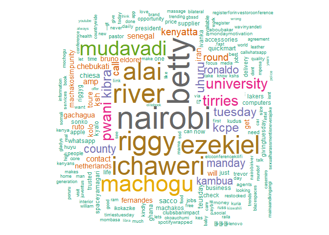

Sentiment Analysis
================
2022-11-30

``` r
# install.packages("tm")

pacman::p_load(tidyverse, tm)

machakos <- read_csv("datasets/machakos.csv")
```

    ## Rows: 500 Columns: 4
    ## ── Column specification ────────────────────────────────────────────────────────
    ## Delimiter: ","
    ## chr  (1): text
    ## dbl  (2): favorite_count, retweet_count
    ## dttm (1): created_at
    ## 
    ## ℹ Use `spec()` to retrieve the full column specification for this data.
    ## ℹ Specify the column types or set `show_col_types = FALSE` to quiet this message.

``` r
corpus <- Corpus(VectorSource(machakos$text))

inspect(corpus[1:2])
```

    ## <<SimpleCorpus>>
    ## Metadata:  corpus specific: 1, document level (indexed): 0
    ## Content:  documents: 2
    ## 
    ## [1] #MachakosCountyExposed                                                             
    ## [2] Inspiration tupuu. Photo of the day. #MachakosCountyExposed https://t.co/wUl71HXdEk

``` r
# text cleaning

# change text to lower case
corpus <- tm_map(corpus, tolower)

# remove panctuation
corpus <- tm_map(corpus, removePunctuation)

# remove numbers
corpus <- tm_map(corpus, removeNumbers)

# remove stop words
cleanset <- tm_map(corpus, removeWords, stopwords("english"))

inspect(cleanset[1:4])
```

    ## <<SimpleCorpus>>
    ## Metadata:  corpus specific: 1, document level (indexed): 0
    ## Content:  documents: 4
    ## 
    ## [1] machakoscountyexposed                                                                                                                                                        
    ## [2] inspiration tupuu photo   day machakoscountyexposed httpstcowulhxdek                                                                                                         
    ## [3] cameroon  smashed ecuador   qualifies   next round   \nbetty kyallo tirries tuesday kambua machakoscountyexposed httpstcoepikrw                                              
    ## [4]    king     treated  one 🕠🕠\nbook  session     low    experience greatness🕠🕠\n\nmachakoscountyexposed \ngachagua\nkambua\nuhuru kenyatta\nnairobi river httpstcoznobczqxp

``` r
# remove url using a function
removeURL <- function(x){
  gsub('http[[:alnum:]]*', "", x)
}
cleanset <-  tm_map(cleanset, content_transformer(removeURL))

# remove white spaces
cleanset <- tm_map(cleanset, stripWhitespace)

# create term documen matrix (structured form)
tdm <- TermDocumentMatrix(cleanset)
tdm 
```

    ## <<TermDocumentMatrix (terms: 3071, documents: 500)>>
    ## Non-/sparse entries: 8936/1526564
    ## Sparsity           : 99%
    ## Maximal term length: 37
    ## Weighting          : term frequency (tf)

``` r
# sparsity is 99% mean, 99% of the times, we will see zeros in the matrix

# convert tdm to matrix
tdm <- as.matrix(tdm)

tdm[1:10, 1:10]
```

    ##                        Docs
    ## Terms                   1 2 3 4 5 6 7 8 9 10
    ##   machakoscountyexposed 1 1 1 1 1 1 1 1 1  1
    ##   day                   0 1 0 0 0 0 0 0 0  0
    ##   inspiration           0 1 0 0 0 0 0 0 0  0
    ##   photo                 0 1 0 0 0 0 0 0 0  0
    ##   tupuu                 0 1 0 0 0 0 0 0 0  0
    ##   betty                 0 0 1 0 2 0 2 0 0  2
    ##   cameroon              0 0 1 0 0 0 0 0 0  0
    ##   ecuador               0 0 1 0 1 0 1 0 0  1
    ##   kambua                0 0 1 1 2 0 2 1 0  2
    ##   kyallo                0 0 1 0 1 0 1 0 0  1

``` r
# machakoscountyexposed appears almost in every word. its a key word
# the tweets were pulled using the key word.
# we should remove the key word because it will overshadow everything else

# remove the key word
cleanset <- tm_map(cleanset, removeWords, 'machakoscountyexposed')

# remove the white spaces created
cleanset <- tm_map(cleanset, content_transformer(removeURL))

# replace kyallo with betty
cleanset <- tm_map(cleanset, str_replace, pattern = "kyallo", replacement = "betty")
tdm <- TermDocumentMatrix(cleanset)

tdm <- as.matrix(tdm)

tdm[1:10, 1:10]
```

    ##              Docs
    ## Terms         1 2 3 4 5 6 7 8 9 10
    ##   day         0 1 0 0 0 0 0 0 0  0
    ##   inspiration 0 1 0 0 0 0 0 0 0  0
    ##   photo       0 1 0 0 0 0 0 0 0  0
    ##   tupuu       0 1 0 0 0 0 0 0 0  0
    ##   betty       0 0 2 0 3 0 3 0 0  3
    ##   cameroon    0 0 1 0 0 0 0 0 0  0
    ##   ecuador     0 0 1 0 1 0 1 0 0  1
    ##   kambua      0 0 1 1 2 0 2 1 0  2
    ##   next        0 0 1 0 0 0 0 0 0  0
    ##   qualifies   0 0 1 0 0 0 0 0 0  0

``` r
# create a bar plot
# first create frequencies of every word
w <- rowSums(tdm)

# take a subest
w <- subset(w, w>= 25)

# change w to data.frame
w_df <- as.data.frame(w)

w_df <- w_df %>% 
  mutate(word = row.names(w_df))

w_df %>% 
  ggplot(aes(x =fct_reorder(word, w), y = w))+
  geom_col()+
  coord_flip()
```

<!-- -->

``` r
#install.packages("wordcloud")
library(wordcloud)
```

    ## Loading required package: RColorBrewer

``` r
w <- sort(rowSums(tdm), decreasing = T)
set.seed(222)
wordcloud(words = names(w), freq = w, max.words = 150, random.order = F, min.freq = 5, 
          colors = brewer.pal(8, "Dark2"), scale = c(8, .4))
```

<!-- -->
