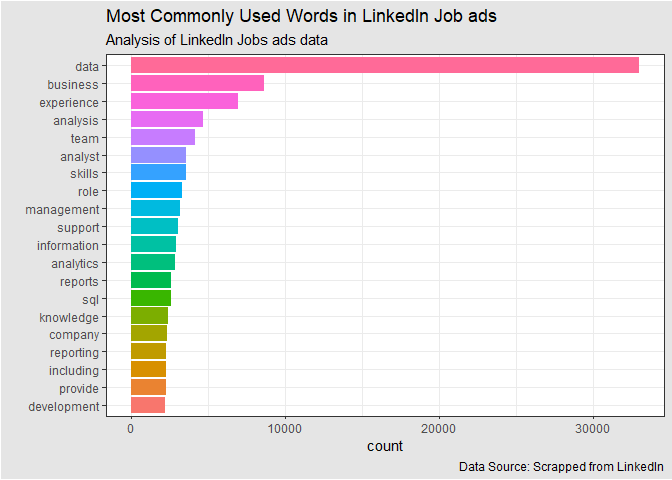
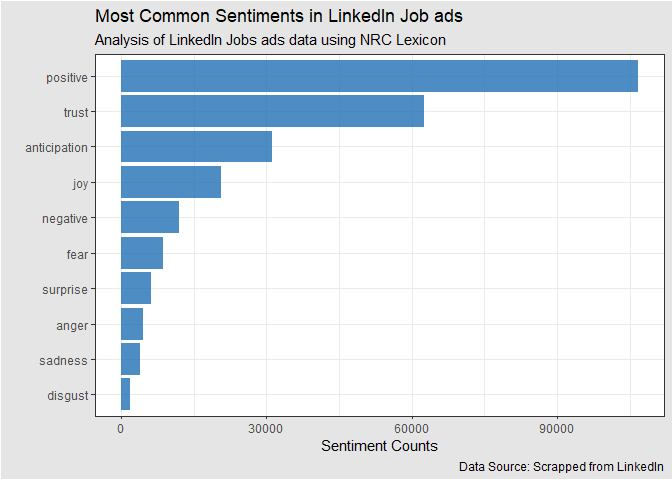
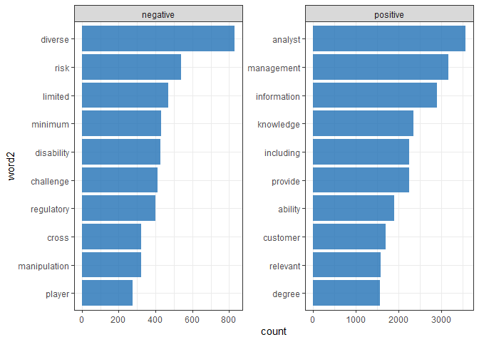
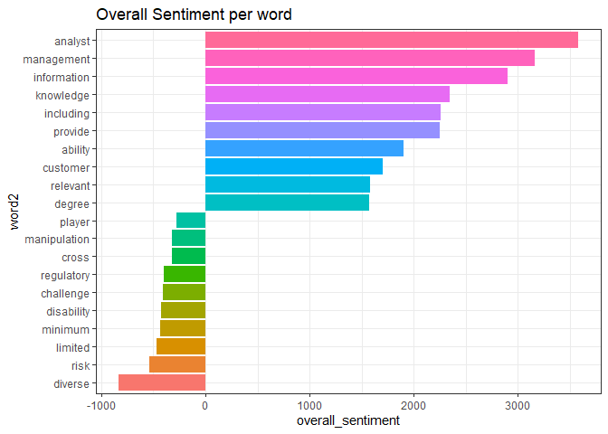
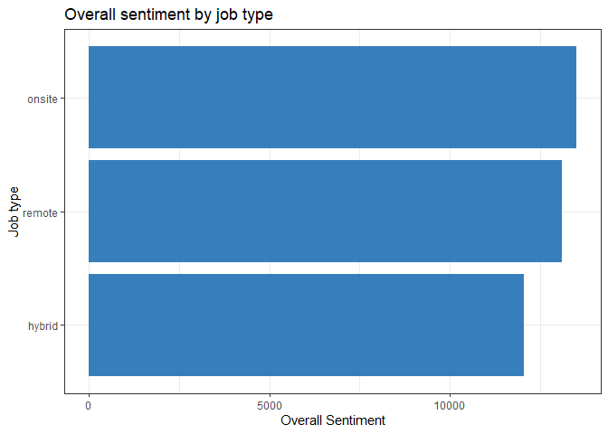
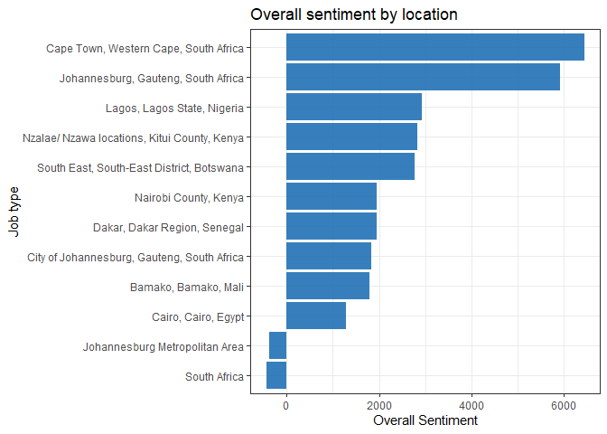

Sentiment Visuals
================
2023-02-16

``` r
# load packages
pacman::p_load(tidyverse, tidytext)

# read data
jobs <- read_csv("datasets/linkedin_jobs_africa.csv", show_col_types = F)

# some data cleaning
jobs %>% 
  # clean variable names
  janitor::clean_names() %>% 
  # select variables of interest
  select(-c(salary, criteria, link)) %>% 
  # unnest description
  unnest_tokens(word, description) %>% 
  # remove stop words
  anti_join(stop_words, by = "word") ->
  # assign output to jobs tidy
  jobs_tidy


# count the most common words in the descriptions and visualize
jobs_tidy %>% 
  count(word, sort = T, name = "count") %>% 
  # choose top 20 words
  slice_head(n = 20) %>% 
  # order word by counts
  mutate(word = fct_reorder(word, count)) %>% 
  # create bar plot
  ggplot(aes(word, count, fill = as.factor(word)))+
  geom_col(show.legend = F)+
  scale_color_viridis_d(option = "turbo")+
  coord_flip()+
  theme_bw()+
  labs(
    title = "Most Commonly Used Words in LinkedIn Job ads",
    subtitle = "Analysis of LinkedIn Jobs ads data",
    x = "",
    caption = "Data Source: Scrapped from LinkedIn"
  )+
  theme(
    plot.background = element_rect(fill = "gray90")
  )
```

<!-- -->

``` r
# append nrc sentiment dictionary, count and visualize
jobs_tidy %>% 
  inner_join(get_sentiments("nrc"), by = "word") %>% 
  count(sentiment, sort = T, name = "sentiment_counts") %>%
  ggplot(
    aes(
      x = fct_reorder(sentiment, sentiment_counts),
      y = sentiment_counts
      )
    )+
  geom_col(show.legend = F, fill = "#2171B5", alpha = .8)+
  coord_flip()+
  theme_bw()+
  labs(
    title = "Most Common Sentiments in LinkedIn Job ads",
    subtitle = "Analysis of LinkedIn Jobs ads data using NRC Lexicon",
    x = "",
    y = "Sentiment Counts",
    caption = "Data Source: Scrapped from LinkedIn"
  )+
  theme(
    plot.background = element_rect(fill = "gray90")
  )
```

<!-- -->

``` r
# count by word and sentiment
jobs_tidy %>% 
  inner_join(get_sentiments("nrc"), by = "word") %>% 
  count(word, sentiment, name = "count") %>% 
  # filter for positive and negative sentiments
  filter(sentiment %in% c("positive", "negative")) %>% 
  group_by(sentiment) %>% 
  top_n(10, count) %>% 
  ungroup() %>% 
  mutate(word2 = fct_reorder(word, count)) %>% 
  ggplot(
    aes(
      word2, count, fill = as.factor(word2)
    )
  )+
  geom_col(show.legend = F, fill = "#2171B5", alpha = .8)+
  coord_flip()+
  facet_wrap(~sentiment, scales = "free")+
  theme_bw()
```

<!-- -->

``` r
# overall sentiment
# count by word and sentiment
jobs_tidy %>% 
  inner_join(get_sentiments("nrc"), by = "word") %>% 
  count(word, sentiment, name = "count") %>% 
  filter(sentiment %in% c("positive", "negative")) %>% 
  group_by(sentiment) %>% 
  top_n(10, count) %>% 
  ungroup() %>% 
  pivot_wider(names_from = sentiment, values_from = count) %>% 
  replace_na(list(positive = 0, negative = 0)) %>% 
  mutate(
    overall_sentiment = positive - negative,
    word2 = fct_reorder(word, overall_sentiment)
  ) %>% 
  ggplot(
    aes(
      word2, overall_sentiment, fill = as.factor(word2)
    )
  )+
  geom_col(show.legend = F)+coord_flip() + theme_bw()+
  ggtitle("Overall Sentiment per word")
```

<!-- -->

``` r
# sentiment by job type(onsite_remote)
jobs_tidy %>% 
  inner_join(get_sentiments("bing"), by = "word") %>% 
  count(onsite_remote, sentiment, name = "count") %>% 
  pivot_wider(names_from = sentiment, values_from = count) %>% 
  mutate(
    overall_sentiment = positive - negative,
    onsite_remote = fct_reorder(onsite_remote, overall_sentiment)
    ) %>% 
  ggplot(
    aes(
      onsite_remote, overall_sentiment
    )
  )+
  geom_col(show.legend = F, fill = "#2171B5", alpha = .9)+
  coord_flip()+
  labs(
    x = "Job type",
    y = "Overall Sentiment",
    title = "Overall sentiment by job type"
  )+ theme_bw()
```

<!-- -->

``` r
# job location
jobs_tidy %>% 
  inner_join(get_sentiments("bing"), by = "word") %>% 
  count(location, sentiment, name = "count") %>% 
  group_by(sentiment) %>% 
  top_n(10, count) %>% 
  ungroup() %>% 
  pivot_wider(names_from = sentiment, values_from = count) %>% 
  replace_na(list(positive = 0, negative = 0)) %>% 
  mutate(
    overall_sentiment = positive - negative,
    location = fct_reorder(location, overall_sentiment)
    ) %>% 
  ggplot(
    aes(
      location, overall_sentiment
    )
  )+
  geom_col(show.legend = F, fill = "#2171B5", alpha = .9)+
  coord_flip()+
  labs(
    x = "Job type",
    y = "Overall Sentiment",
    title = "Overall sentiment by location"
  )+ theme_bw()
```

<!-- -->
