Time Series With tsibble
================
2022-12-20

``` r
# install.packages("fpp3")
pacman::p_load(
  fpp3,
  tidyverse,
  janitor,
  lubridate,
  readxl
)

# laod data
data("global_economy")

head(global_economy)
```

| Country     | Code | Year |        GDP | Growth | CPI |   Imports |   Exports | Population |
|:------------|:-----|-----:|-----------:|-------:|----:|----------:|----------:|-----------:|
| Afghanistan | AFG  | 1960 |  537777811 |     NA |  NA |  7.024793 |  4.132233 |    8996351 |
| Afghanistan | AFG  | 1961 |  548888896 |     NA |  NA |  8.097166 |  4.453443 |    9166764 |
| Afghanistan | AFG  | 1962 |  546666678 |     NA |  NA |  9.349593 |  4.878051 |    9345868 |
| Afghanistan | AFG  | 1963 |  751111191 |     NA |  NA | 16.863910 |  9.171601 |    9533954 |
| Afghanistan | AFG  | 1964 |  800000044 |     NA |  NA | 18.055555 |  8.888893 |    9731361 |
| Afghanistan | AFG  | 1965 | 1006666638 |     NA |  NA | 21.412803 | 11.258279 |    9938414 |

### Characteristics of tsibble objects

-   Essentially a tsibble is a time series table with time being the
    index i.e temporal structure. The year column is the index is this
    dataset.

-   Has a frequency, in this case, it is annual (IY).

-   Has key column(s). In this case, the country column is the key
    column and helps us identify the time series uniquely. Keys are
    unique identifiers.

-   Has measured variables. For each key, we have measured variable(s).

### The tourism dataset

A dataset containing the quarterly overnight trips from 1998 Q1 to 2016
Q4 across Australia.

``` r
data("tourism")

head(tourism)
```

| Quarter | Region   | State           | Purpose  |    Trips |
|:--------|:---------|:----------------|:---------|---------:|
| 1998 Q1 | Adelaide | South Australia | Business | 135.0777 |
| 1998 Q2 | Adelaide | South Australia | Business | 109.9873 |
| 1998 Q3 | Adelaide | South Australia | Business | 166.0347 |
| 1998 Q4 | Adelaide | South Australia | Business | 127.1605 |
| 1999 Q1 | Adelaide | South Australia | Business | 137.4485 |
| 1999 Q2 | Adelaide | South Australia | Business | 199.9126 |

Also a tsibble object with the Quarter column being the index, Region,
State, and Purpose being the keys, and Trips being the measured
variable. The data is in quarterly frequency.

### Constructing a tsibble

``` r
data <- tsibble(
  year = 2017:2022,
  cost = c(100, 393, 192, 394, 400, 500),
  index = year
)

data
```

| year | cost |
|-----:|-----:|
| 2017 |  100 |
| 2018 |  393 |
| 2019 |  192 |
| 2020 |  394 |
| 2021 |  400 |
| 2022 |  500 |

### Convert a tibble to a tsibble

``` r
data <- tibble(
  year = 2017:2022,
  cost = c(100, 393, 192, 394, 400, 500)
  ) %>% 
  as_tsibble(index = year)

data
```

| year | cost |
|-----:|-----:|
| 2017 |  100 |
| 2018 |  393 |
| 2019 |  192 |
| 2020 |  394 |
| 2021 |  400 |
| 2022 |  500 |

``` r
mobile <- read_csv("datasets/mobile_money_data.csv", show_col_types = F)

mobile %>% 
  select(start_time, 3:5) %>% 
  mutate(start_time = mdy_hms(start_time),
         year_quartet = wday(start_time)) %>% 
  head()
```

| start_time          | hhid | account_num | account_type  | year_quartet |
|:--------------------|-----:|------------:|:--------------|-------------:|
| 2019-10-28 09:05:08 | 1001 |           1 | Mobile Money  |            2 |
| 2019-10-28 10:42:17 | 1001 |           2 | Bank Account  |            2 |
| 2019-10-28 11:47:47 | 1001 |           3 | VSLA Account  |            2 |
| 2019-10-28 13:02:33 | 1002 |           1 | SACCO Account |            2 |
| 2019-10-28 14:01:04 | 1002 |           2 | VSLA Account  |            2 |
| 2019-10-28 15:03:31 | 1003 |           1 | Mobile Money  |            2 |

# Austrarian Pharmaceutical Benefits datasets

``` r
# call dataset
data("PBS")

# clean variable names
PBS <- clean_names(PBS)

# calculate total cost per month
PBS %>% 
  filter(atc2 == "A10") %>% 
  select(month, concession, type, cost) %>% 
  summarise(total_cost = sum(cost)) %>% 
  mutate(total_cost = round(total_cost/1e6, 2)) %>% 
  autoplot(total_cost)+
  labs(
    title = "Cost of Drugs over time",
    y = "Cost in Millions",
    x = ""
  )
```

<!-- -->

There is a very clear and increasing trend over time and very strong
seasonality.

We can see that seasonality goes up as the level of the series goes up.

There are some significant drops at the start of each, which could be
caused by the government subsidization scheme.

# Lab session 1

``` r
# # download dataset and convert to tsibble object
# my_tourism <- rio::import(file = "http://robjhyndman.com/data/tourism.xlsx")%>%
#   mutate(Quarter = yearquarter(Quarter)) %>%
#   as_tsibble(
#     index = Quarter,
#     key = c(Region, State, Purpose)
#   )
# 
# # Find what combination of Region and Purpose had the maximum number of
# # overnight trips on average.
# my_tourism %>%
#   group_by(Region, Purpose) %>%
#   summarise(Trips = mean(Trips)) %>%
#   ungroup() %>%
#   filter(Trips == max(Trips))
# 
# # Create a new tsibble which combines the
# # Purposes and Regions, and just has total
# # trips by State.
# my_tourism %>%
#   group_by(State) %>%
#   summarise(Trips = sum(Trips)) %>%
#   ungroup() -> tourism_by_state
# 
# head(tourism_by_state)
```

### Passengers dataset

Passenger numbers on Ansett airline flights

-   Description

The data features a major pilots’ industrial dispute which results in
some weeks having zero passengers. There were also at least two changes
in the definitions of passenger classes.

``` r
data("ansett")

head(ansett)
```

| Week     | Airports | Class    | Passengers |
|:---------|:---------|:---------|-----------:|
| 1989 W28 | ADL-PER  | Business |        193 |
| 1989 W29 | ADL-PER  | Business |        254 |
| 1989 W30 | ADL-PER  | Business |        185 |
| 1989 W31 | ADL-PER  | Business |        254 |
| 1989 W32 | ADL-PER  | Business |        191 |
| 1989 W33 | ADL-PER  | Business |        136 |

``` r
ansett %>% 
  autoplot(Passengers)+
  theme(legend.position = "bottom")
```

<!-- -->

``` r
ansett %>%
filter(Class == "Economy") %>%
autoplot(Passengers)
```

<!-- -->

``` r
ansett %>%
filter(Airports == "MEL-SYD") %>%
autoplot(Passengers)
```

<!-- -->

# Lab Session 2

Create time plots of the following four time series: Bricks from
aus_production, Lynx from pelt, Close from gafa_stock, Demand from
vic_elec.

``` r
# Demand from the vec_elec
vic_elec %>%
  autoplot(Demand) +
  labs(
    title = "Electricity Demand over Time",
    x = "Time",
    y = "Demand in MWh",
    caption = "Data Source: Australian Energy Market Operator via tsibbledata package",
    subtitle = "Half-hourly electricity demand for Victoria, Australia"
  ) +
  ggthemes::theme_few() +
  theme(
    plot.background = element_rect(fill = "gray90"),
    panel.background = element_rect(fill = "gray95"),
    plot.title = element_text(face = "bold", size = 16)
  )
```

<!-- -->

``` r
# Bricks from aus_production
tsibbledata::aus_production %>%
  autoplot(Bricks) +
  labs(
    title = "Bricks Production from 1956 to 2010",
    x = "Time",
    caption = "Data Source: Australian Bureau of Statistics via tsibbledata package",
    subtitle = "Quarterly production of bricks in Australia"
  ) +
  ggthemes::theme_few() +
  theme(
    plot.background = element_rect(fill = "gray90"),
    panel.background = element_rect(fill = "gray95"),
    plot.title = element_text(face = "bold", size = 16)
  )
```

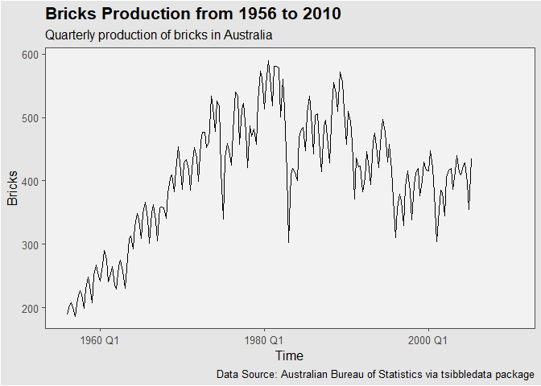<!-- -->

``` r
# Lynx from pelt
pelt %>%
  autoplot(Lynx) +
  labs(
    title = "Lynx pelts traded from 1845 to 1935",
    x = "Time",
    caption = "Data Source: Hudson Bay Company via tsibbledata package",
    subtitle = "The number of Canadian Lynx pelts traded"
  ) +
  ggthemes::theme_few() +
  theme(
    plot.background = element_rect(fill = "gray90"),
    panel.background = element_rect(fill = "gray95"),
    plot.title = element_text(face = "bold", size = 16)
  )
```

<!-- -->

``` r
# Close from gafa_stock
gafa_stock %>%
  autoplot(Close) +
  labs(
    title = "Historical closing stock prices ($USD) from 2014 to 2018",
    x = "Time",
    y = "Closing stock price",
    caption = "Data Source: Yahoo Finance historical data via tsibbledata package",
    subtitle = "Analysis of Google, Amazon, Facebook and Apple"
  ) +
  ggthemes::theme_few() +
  theme(
    plot.background = element_rect(fill = "gray90"),
    panel.background = element_rect(fill = "gray95"),
    plot.title = element_text(face = "bold", size = 16)
  )
```

<!-- -->

Electricity demand in Victoria, Australia

``` r
vic_elec %>% 
  index_by(day = date(Time)) %>% 
  summarise(Temperature = max(Temperature)) %>% 
  autoplot(Temperature)+
  labs(
    title = "Maximum Temperature from 2012 to 2015",
    x = "Time",
    y = "Max Temperature",
    caption = "Data Source: Australian Energy Market Operator via tsibbledata package",
    subtitle = "Daily max temperature in Victoria, Australia"
  ) +
  ggthemes::theme_few() +
  theme(
    plot.background = element_rect(fill = "gray90"),
    panel.background = element_rect(fill = "gray95"),
    plot.title = element_text(face = "bold", size = 16)
  )
```

<!-- -->

``` r
# point plot
vic_elec %>% 
  index_by(day = date(Time)) %>% 
  summarise(Temperature = max(Temperature)) %>% 
  ggplot(
    aes(
      day, Temperature
    )
  )+
  geom_point()+
  labs(
    title = "Maximum Temperature from 2012 to 2015",
    x = "Time",
    y = "Max Temperature",
    caption = "Data Source: Australian Energy Market Operator via tsibbledata package",
    subtitle = "Daily max temperature in Victoria, Australia"
  ) +
  ggthemes::theme_few() +
  theme(
    plot.background = element_rect(fill = "gray90"),
    panel.background = element_rect(fill = "gray95"),
    plot.title = element_text(face = "bold", size = 16)
  )
```

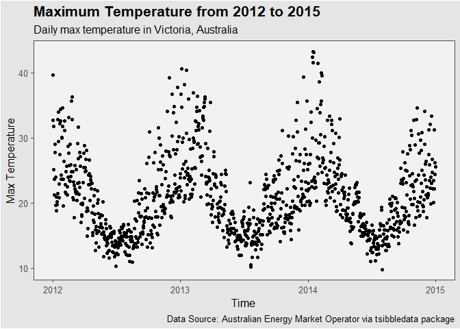<!-- -->

``` r
# Heat map
vic_elec %>%
  index_by(day = date(Time)) %>%
  summarise(Temperature = max(Temperature)) %>%
  ggplot(
    aes(
      day, 1
    )
  ) +
  geom_tile(
    aes(
      fill = Temperature
    )
  ) +
  scale_fill_gradient2(
    low = "navy",
    mid = "yellow",
    high = "red",
    midpoint = 28
  ) +
  scale_y_discrete(expand = c(0, 0)) +
  labs(
    title = "Maximum Temperature from 2012 to 2015",
    x = "Time",
    y = "",
    caption = "Data Source: Australian Energy Market Operator via tsibbledata package",
    subtitle = "Daily max temperature in Victoria, Australia"
  ) +
  ggthemes::theme_few() +
  theme(
    plot.background = element_rect(fill = "gray90"),
    panel.background = element_rect(fill = "gray95"),
    plot.title = element_text(face = "bold", size = 16)
  )
```

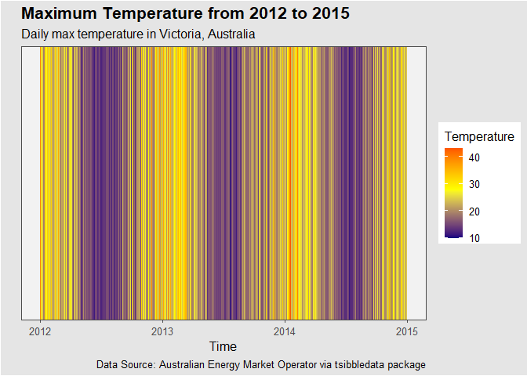<!-- -->

# Seasonal plots

Data plotted against the individual “seasons” in which the data were
observed. (In this case a “season” is a month.) Something like a time
plot except that the data from each season are overlapped. Enables the
underlying seasonal pattern to be seen more clearly, and also allows any
substantial departures from the seasonal pattern to be easily
identified. In R: gg_season()

``` r
# seasonal plot
vic_elec %>%
  index_by(day = date(Time)) %>%
  summarise(Temperature = max(Temperature)) %>%
  gg_season(Temperature, labels = "right")+
  labs(
    title = "Maximum Temperature from 2012 to 2015",
    x = "Time",
    y = "",
    caption = "Data Source: Australian Energy Market Operator via tsibbledata package",
    subtitle = "Seasonal plot of daily max temperature in Victoria, Australia"
  ) +
  ggthemes::theme_few() +
  theme(
    plot.background = element_rect(fill = "gray90"),
    panel.background = element_rect(fill = "gray95"),
    plot.title = element_text(face = "bold", size = 16)
  )
```

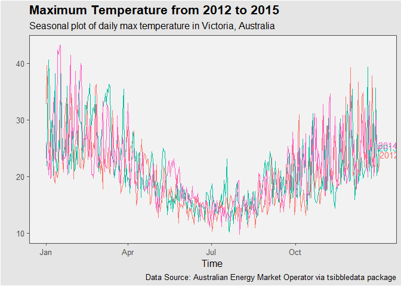<!-- -->

``` r
# Quarterly Australian Beer Production
aus_production %>%
  select(Quarter, Beer) %>%
  filter(year(Quarter) >= 1992) %>% 
  autoplot(Beer)+
  ggthemes::theme_few() +
  theme(
    plot.background = element_rect(fill = "gray90"),
    panel.background = element_rect(fill = "gray95"),
    plot.title = element_text(face = "bold", size = 16)
  )
```

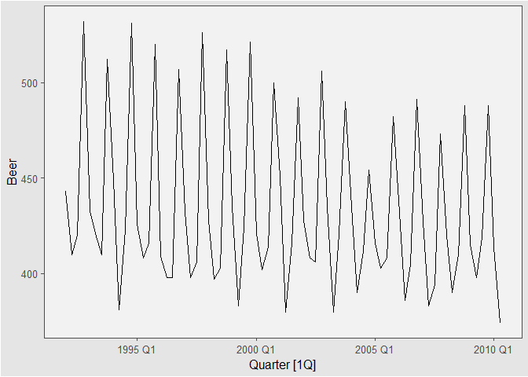<!-- -->

``` r
# 
aus_production %>%
  select(Quarter, Beer) %>%
  filter(year(Quarter) >= 1992) %>% 
  gg_season(Beer, labels = "right")+
  theme_classic() +
  theme(
    plot.background = element_rect(fill = "gray90"),
    panel.background = element_rect(fill = "gray95"),
    plot.title = element_text(face = "bold", size = 16)
  )
```

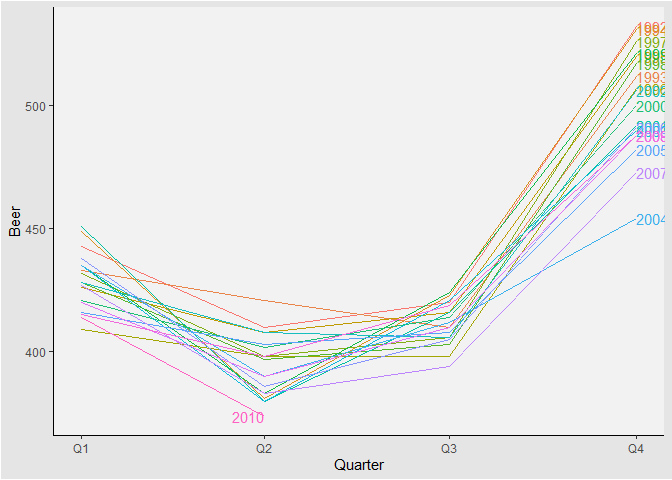<!-- -->

# Multi-Seasonal plots

``` r
head(vic_elec)
```

| Time                |   Demand | Temperature | Date       | Holiday |
|:--------------------|---------:|------------:|:-----------|:--------|
| 2012-01-01 00:00:00 | 4382.825 |       21.40 | 2012-01-01 | TRUE    |
| 2012-01-01 00:30:00 | 4263.366 |       21.05 | 2012-01-01 | TRUE    |
| 2012-01-01 01:00:00 | 4048.966 |       20.70 | 2012-01-01 | TRUE    |
| 2012-01-01 01:30:00 | 3877.563 |       20.55 | 2012-01-01 | TRUE    |
| 2012-01-01 02:00:00 | 4036.230 |       20.40 | 2012-01-01 | TRUE    |
| 2012-01-01 02:30:00 | 3865.597 |       20.25 | 2012-01-01 | TRUE    |

``` r
# Plot demand from vic_elec
vic_elec %>% gg_season(Demand)+
  theme_classic() +
  theme(
    plot.background = element_rect(fill = "gray90"),
    panel.background = element_rect(fill = "gray95"),
    plot.title = element_text(face = "bold", size = 16)
  )
```

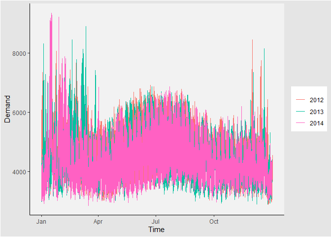<!-- -->

``` r
# change season to week
vic_elec %>% 
  gg_season(Demand, period = "week")+
  theme_classic() +
  theme(
    plot.background = element_rect(fill = "gray90"),
    panel.background = element_rect(fill = "gray95"),
    plot.title = element_text(face = "bold", size = 16)
  )
```

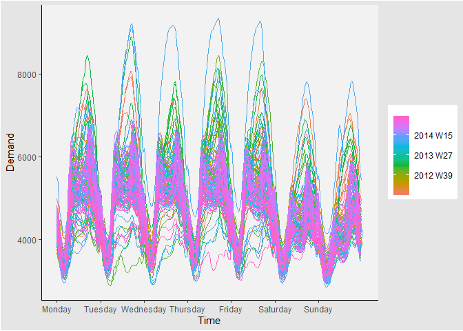<!-- -->

``` r
# change the period to day
vic_elec %>% 
  gg_season(Demand, period = "day")+
  theme_classic() +
  theme(
    plot.background = element_rect(fill = "gray90"),
    panel.background = element_rect(fill = "gray95"),
    plot.title = element_text(face = "bold", size = 16)
  )
```

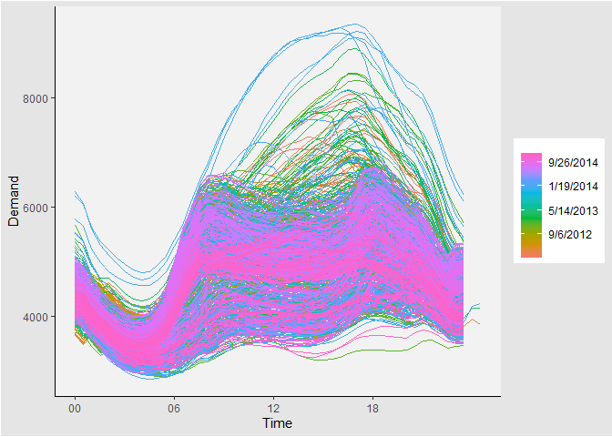<!-- -->

# Seasonal Subseeries plots

Data for each season collected together in time plot as separate time
series. Enables the underlying seasonal pattern to be seen clearly, and
changes in seasonality over time to be visualized. In R: gg_subseries()

``` r
# Quarterly Australian Beer Production
aus_production %>%
  select(Quarter, Beer) %>%
  filter(year(Quarter) >= 1992) %>% 
  gg_subseries(Beer)+
  theme_classic() +
  theme(
    plot.background = element_rect(fill = "gray90"),
    panel.background = element_rect(fill = "gray95"),
    plot.title = element_text(face = "bold", size = 16)
  )
```

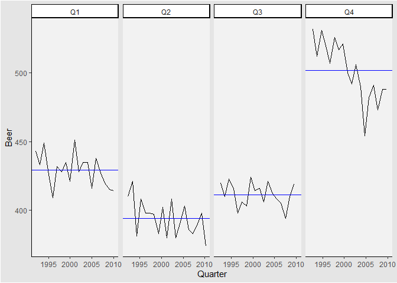<!-- -->

``` r
# Australian holidays
tourism %>%
  filter(Purpose == "Holiday") %>%
  group_by(State) %>%
  summarise(Trips = sum(Trips)) %>% 
  autoplot(Trips) +
  ylab("thousands of trips") + xlab("Year") +
  ggtitle("Australian domestic holiday nights")+
  theme_classic() +
  theme(
    plot.background = element_rect(fill = "gray90"),
    panel.background = element_rect(fill = "gray95"),
    plot.title = element_text(face = "bold", size = 16)
  )
```

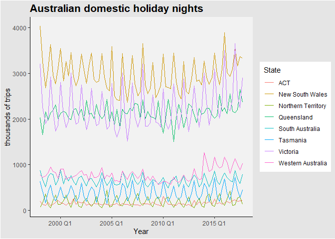<!-- -->

``` r
# make it a seasonal plot
tourism %>%
  filter(Purpose == "Holiday") %>%
  group_by(State) %>%
  summarise(Trips = sum(Trips)) %>% 
  gg_season(Trips) +
  ylab("thousands of trips") +
  ggtitle("Australian domestic holiday nights")+
  theme_classic() +
  theme(
    plot.background = element_rect(fill = "gray90"),
    panel.background = element_rect(fill = "gray95"),
    plot.title = element_text(face = "bold", size = 16)
  )
```

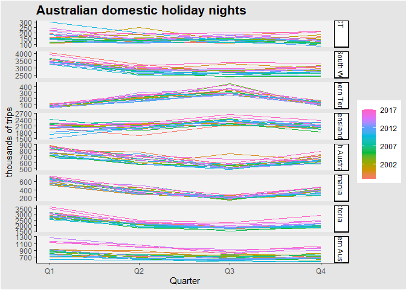<!-- -->
