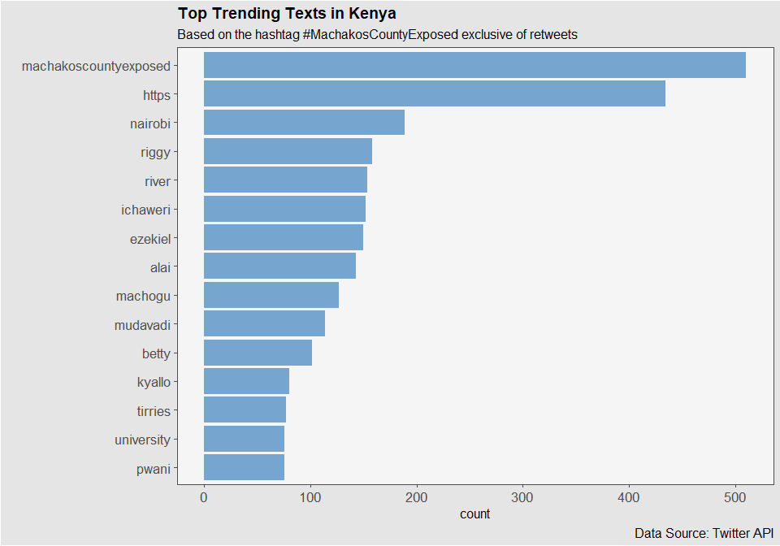

word cloud
================
Mwangi George
2022-11-29

``` r
options(scipen = 999)
#install.packages("ggwordcloud")

pacman::p_load(
  tidyverse,
  ggwordcloud,
  rtweet,
  data.table,
  tidytext
)

# tweets <- search_tweets(
#   q = "MachakosCountyExposed",
#   n = 500,
#   include_rts = F,
#   retryonratelimit = F
# )
# 
# #str(tweets)

machakos <- read_csv("datasets/machakos.csv")
```

    ## Rows: 500 Columns: 4
    ## ── Column specification ────────────────────────────────────────────────────────
    ## Delimiter: ","
    ## chr  (1): text
    ## dbl  (2): favorite_count, retweet_count
    ## dttm (1): created_at
    ## 
    ## ℹ Use `spec()` to retrieve the full column specification for this data.
    ## ℹ Specify the column types or set `show_col_types = FALSE` to quiet this message.

``` r
# unnest machakos
machakos_new <- unnest_tokens(
  tbl = machakos, 
  input = text,
  output = word
)

# get stop words
stp_words <- get_stopwords(
  source = "smart"
)

# remove stop words from machakos_new
machakos_new <- machakos_new %>% 
  anti_join(stp_words, by = "word")

# remove unnecessary numbers
machakos_new <- machakos_new %>% 
  filter(!str_detect(word, "[0-9]"))
```

``` r
machakos_new %>% 
  mutate(
    word = as.factor(word),
    word = fct_lump_n(word, n = 15)
  ) %>% 
  filter(!word %in% c("Other", "t.co")) %>% 
  add_count(word) %>% 
  ggplot(
    aes(
      x = fct_reorder(word, n)
    )
  )+
  geom_bar(fill = "#2171B5", alpha = .6)+
  coord_flip()+
  labs(
    title = "Top Trending Texts in Kenya",
    subtitle = "Based on the hashtag #MachakosCountyExposed exclusive of retweets",
    caption = "Data Source: Twitter API",
    x = ""
  )+
  ggthemes::theme_few()+
  theme(
    plot.background = element_rect(fill = "gray90"),
    panel.background = element_rect(fill = "gray96"),
    axis.text = element_text(size = 13),
    plot.title = element_text(face = "bold"),
    plot.caption = element_text(size = 10)
  )
```


